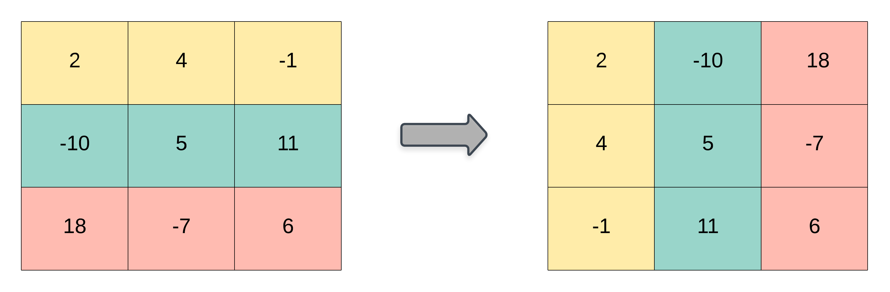

# Matrix Algebra {#chapter-4}

```{r, echo = F}
button <-  "position: relative; 
            top: -25px; 
            left: 85%;   
            color: white;
            font-weight: bold;
            background: #4B9CD3;
            border: 1px #3079ED solid;
            box-shadow: inset 0 1px 0 #80B0FB"
```

```{r, echo=FALSE, results='asis'}
codefolder::bookdown(init = "show", style = button)
```

In Chapter 4 we will briefly review some basic algebra results useful for this course. Those needing a reliable reference for basic results in matrix algebra should consult the *The Matrix Cookbook* at https://www.math.uwaterloo.ca/~hwolkowi/matrixcookbook.pdf.

## Types of matrices

Remember that matrices are defined by rows (the first dimension) and columns (the second dimension):

$$
\underset{m \times n}{\mathbf{A}} = \begin{bmatrix}
   a_{11} & a_{12} & a_{13} \\
   a_{21} & a_{22} & a_{23} \\
   a_{31} & a_{32} & a_{33} \\
   a_{41} & a_{42} & a_{43}
 \end{bmatrix}
$$

You can refer to a specific element in matrix using a subscript of the row and column index (e.g. $a_{31}$). For our purposes there are a few *special* matrices worth mentioning, 

### Square

A square matrix has the same number of rows and columns. Covariance and correlation matrices are square.

$$
\underset{n \times n}{\mathbf{A}} = \begin{bmatrix}
   a_{11} & a_{12} & a_{13} & a_{14} \\
   a_{21} & a_{22} & a_{23} & a_{24} \\
   a_{31} & a_{32} & a_{33} & a_{34} \\
   a_{41} & a_{42} & a_{43} & a_{44}
 \end{bmatrix}
$$


### Symmetric

A symmetric matrix is a square matrix that equals its transpose. This means that corresponding entries on either side of the main diagonal are equal. 


$$
\begin{align}
\underset{n \times n}{\mathbf{A}} &= \begin{bmatrix}
   a & ab & ac & ad \\
   ab & b & bc & bd \\
   ac & bc & c & cd \\
   ad & bd & cd & d
 \end{bmatrix} \\
 \cr
 \mathbf{A} &= \mathbf{A}'
\end{align}
$$

**Matrix Transpose**

The transpose of a matrix is an operator which flips a matrix over its diagonal. That is, it switches the row and column indices of the matrix $A$ by producing another matrix, often denoted by $A'$ (or $A^{T}$).

**Graphical Depiction of a Matrix Transpose**



### Diagonal

A diagonal matrix is a special case of a square symmetric matrix in which there are values along the diagonal, but zeros elsewhere:

$$
\begin{align}
\underset{n \times n}{\mathbf{A}} &= \begin{bmatrix}
   a & 0 & 0 & 0 \\
   0 & b & 0 & 0 \\
   0 & 0 & c & 0 \\
   0 & 0 & 0 & d
 \end{bmatrix} \\
 \cr
 \mathbf{A} &= \mathbf{A}'
\end{align}
$$


### Identity

An identity matrix is a special case of a diagonal matrix in which the elements of the diagonal are all 1:

$$
\underset{n \times n}{\mathbf{I}} = \begin{bmatrix}
   1 & 0 & 0 & 0 \\
   0 & 1 & 0 & 0 \\
   0 & 0 & 1 & 0 \\
   0 & 0 & 0 & 1
\end{bmatrix}
$$

Any matrix multiplied by an identity matrix is unchanged. 

## Operations on Matrices

### Matrix Transpose

As stated earlier the transpose of a matrix is an operator which flips a matrix over its diagonal. That is, it switches the row and column indices of the matrix $A$ by producing another matrix, often denoted by $A'$ (or $A^{T}$). Some useful properties of the matrix transpose include:

$$
(\mathbf{A + B})' = \mathbf{A' + B'}\\
(c\mathbf{A'}) = c(\mathbf{A'}) = (\mathbf{A'})c \\
(\mathbf{A'B}) = \mathbf{B'A}\\ 
(\mathbf{AB})' = \mathbf{B'A'}\\
(\mathbf{A'})' = \mathbf{A}
$$
**Graphical Depiction of a Matrix Transpose**


### Matrix Trace

The *trace* of a square matrix is the sum of elements along the diagonal. The trace is only defined for a square matrix. For an $n \times n$ matrix the trace is defined as follows:

$$ tr(\mathbf{A}) = \sum_{i=1}^{n}{a_{ii}} = a_{11} + a_{22} + ... + a_{nn} $$
**Graphical Depiction of a Matrix Trace**


Some useful properties of the matrix trace include:

$$
tr(\mathbf{A + B}) = tr(\mathbf{A}) + tr(\mathbf{B})\\
tr(c\mathbf{A}) = c(tr(\mathbf{A})) \\
tr(\mathbf{A}) = tr(\mathbf{A'})\\ 
tr(\mathbf{AB}) = tr(\mathbf{BA})\\
tr(\mathbf{ABC}) = tr(\mathbf{CAB})=tr(\mathbf{BCA})
$$

### Addition

For addition, matrices must be of the same order. Addition of two matrices is accomplished by adding corresponding elements, $c_{ij}=a_{ij}+b_{ij}$

$$
\mathbf{A} = \begin{bmatrix} 
10 & 5 \\
9 & 1
\end{bmatrix}
, \enspace
\mathbf{B} = \begin{bmatrix} 
2 & 1 \\
20 & 0
\end{bmatrix}, \enspace
\textrm{then }
\mathbf{A}+\mathbf{B}=
\begin{bmatrix} 
12 & 6 \\
29 & 1
\end{bmatrix}
$$
Matrix addition is *commutative* (gives the same result whatever the order of the quantities involved),

$$
\mathbf{A + B} = \mathbf{B + A}
$$
and *associative* (gives the same result whatever grouping their is, as long as order remains the same),

$$
\mathbf{A + (B + C)} = \mathbf{(A + B) + C} 
$$
and 

$$
\mathbf{A + (-B)} = \mathbf{(A - B)}.
$$

### Subtraction 

Like addition, subtraction requires matrices of the same order. Elements in the difference matrix are given by the algebraic difference between corresponding elements in matrices being subtracted:

$$
\mathbf{A} = \begin{bmatrix} 
10 & 5 \\
9 & 1
\end{bmatrix}
, \enspace
\mathbf{B} = \begin{bmatrix} 
2 & 1 \\
20 & 0
\end{bmatrix}, \enspace
\textrm{then }
\mathbf{A}-\mathbf{B}=
\begin{bmatrix} 
8 & 4 \\
-11 & 1
\end{bmatrix}
$$


### Matrix Multiplication

Three useful *rules* to keep in mind regarding matrix multiplication:

1. Only matrices of the form $(m \times n) * (n \times p)$ are conformable for multiplication. The number of columns in the premultiplier must equal the number of rows in the post multiplier.

2. The product matrix will have the following order: $\mathbf{A}_{m\times n} \mathbf{B}_{n\times p} = \mathbf{C}_{m \times p}$.

**Graphical Depiction of Rules 1 and 2**


3. The element $c_{ij}$ in the product matrix is the result of multiplying row $i$ of the premultiplier matrix, and row $j$ of the post multiplier matrix (e.g. ($c_{ij}=a_{i1}b_{1j} + a_{i2}b_{2j} + a_{i3}b_{3j}$)).

**Graphical Depiction of Rule 3**


Matrix multiplication is associative (i.e. rearranging the parentheses in an expression will not change the result). That is,

$$
\mathbf{(AB)C} = \mathbf{A(BC)}
$$
and is distributive with respect to addition,
$$
\mathbf{A(B+C)} = \mathbf{AB + AC} \\
\mathbf{(B+C)A} = \mathbf{BA + CA} \\
$$
If $c$ is a scalar, then

$$
c(\mathbf{AB})=c(\mathbf{A})\mathbf{B}=\mathbf{A}(c\mathbf{B})=(\mathbf{AB})c
$$
or equivalently,

$$
\mathbf{A} = \begin{bmatrix} 
10 & 5 \\
9 & 1
\end{bmatrix}, \enspace
k=2, \enspace
k\mathbf{A} = \begin{bmatrix} 
20 & 10 \\
18 & 2
\end{bmatrix}.
$$


In general, matrices that can be multiplied are called 'compatible' or 'comformable.' Matrices in which the *inner dimensions* (i.e., columns of $\mathbf{A}$, rows of $\mathbf{B}$) do not match are called 'incompatible' or 'non-conformable.' These cannot be multiplied.

### Matrix Division

Division is not defined for matrix operations, but may be accomplished by multiplication by the inverse matrix. In algebra, the reciprocal of a scalar is, by definition, the scalar raised to the minus one power (e.g. $5^{-1} = 1/5$), and equations may be solved by multiplication by reciprocals. 

For example:

$$
5^{-1} = 1/5\\
5x=35\\
5^{-1}(5x)=5^{-1}(35)\\
x = 7
$$
Now consider the following equation where the vector $\mathbf{x}$ is unknown,

$$
\mathbf{A}_{p \times p} \mathbf{x}_{p \times 1} = \mathbf{b}_{p \times 1}
$$
Each element in the column vector $\mathbf{x}$ is unknown and the solution involves solving a set of simultaneous equations for the unknown element of $\mathbf{x}$,

$$
a_{11}x_{1} + a_{12}x_{2} + \dots + a_{1p}x_{p} = b1 \\
a_{21}x_{1} + a_{22}x_{2} + \dots + a_{2p}x_{p} = b2 \\
\vdots \\
a_{p1}x_{1} + a_{p2}x_{2} + \dots + a_{pp}x_{p} = bp
$$

A solution analogous to the scalar equations above would give the following solution for the elements of the vector $\mathbf{x}$:

$$
\mathbf{A}_{p \times p} \mathbf{x}_{p \times 1} = \mathbf{b}_{p \times 1} \\
\mathbf{A}^{-1}_{p \times p}\mathbf{A}_{p \times p} \mathbf{x}_{p \times 1} = \mathbf{A}^{-1}_{p \times p}\mathbf{b}_{p \times 1} \\
\mathbf{I}_{p \times p}\mathbf{x}_{p \times 1} = \mathbf{A}^{-1}_{p \times p}\mathbf{b}_{p \times 1} \\
\mathbf{x}_{p \times 1} = \mathbf{A}^{-1}_{p \times p}\mathbf{b}_{p \times 1}
$$

The inverse of a matrix must satisfy the following properties:

$$
\mathbf{AA^{-1}} = \mathbf{A^{-1}A} = \mathbf{I}
$$
where $I$ is the identity matrix with 1's along the diagonal and 0's elsewhere.

So, why is division undefined for matrices. Here is a quick example. Suppose, $\mathbf{A}$ is a matrix and $\mathbf{B}$ is the inverse of $\mathbf{A}$, such that

$$
\mathbf{AB^{-1}} = \mathbf{B^{-1}A} = \mathbf{I}
$$

Now, let 

$$
\mathbf{A} = \begin{bmatrix} 
1 & 2 \\
1 & 2
\end{bmatrix}
, \enspace
\mathbf{B} = \begin{bmatrix} 
a & b \\
c & d
\end{bmatrix},
$$
Then,

$$
\begin{bmatrix} 
a & b \\
c & d
\end{bmatrix}
\begin{bmatrix} 
1 & 2 \\
1 & 2
\end{bmatrix} =
\begin{bmatrix} 
1 & 0\\
0 & 1
\end{bmatrix}.
$$

This means that $a+b=1$ and $2a+2b = 0$, which is a contradiction, suggesting A does not have an inverse. 