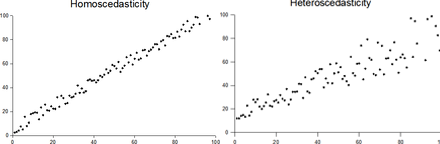
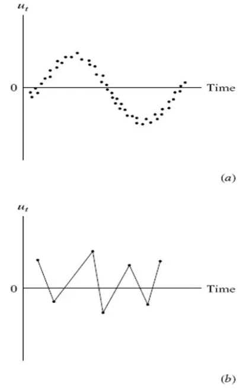
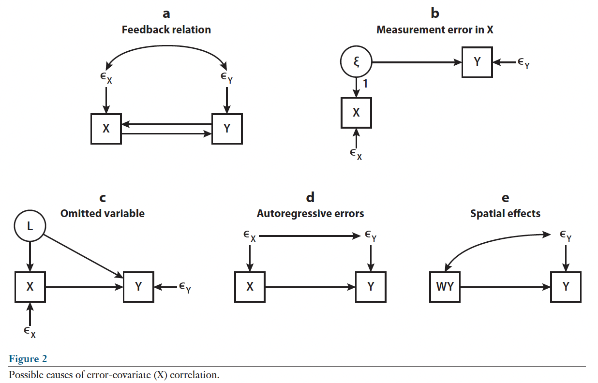
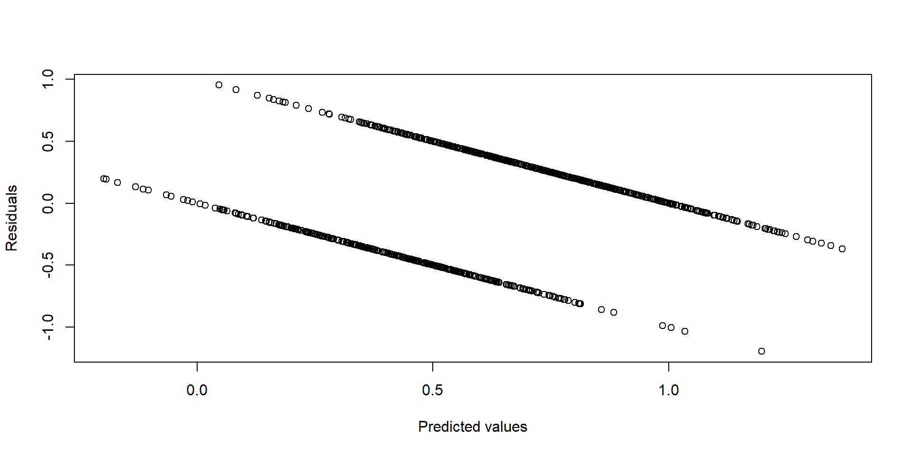
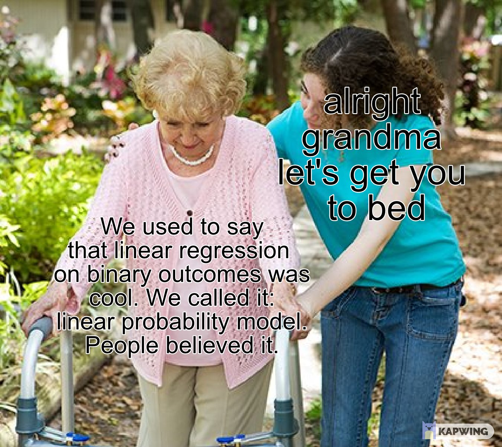

# Ordinary Least Squares {#chapter-5}

```{r, echo = F}
button <-  "position: relative; 
            top: -25px; 
            left: 85%;   
            color: white;
            font-weight: bold;
            background: #4B9CD3;
            border: 1px #3079ED solid;
            box-shadow: inset 0 1px 0 #80B0FB"
```

```{r, echo=FALSE, results='asis'}
codefolder::bookdown(init = "show", style = button)
```

In Chapter 5 we will briefly review the assumptions and properties of Ordinary Least Squares (OLS) regression, a cornerstone method that supports many of the other methods we will consider. We will present the regression model in both scalar and matrix forms to facilitate the material to follow.

## Linear Regression Model

Generally, the regression model is written as 

$$ y_{i} = \beta_0 + \beta_1x_{1i} + \beta_2x_{2i} + ... + \beta_qx_{qi} + \epsilon_{i} $$

where 

- $y_{i}$ is the value of the outcome variable for individual $i$
- $\beta_0$ is an *intercept parameter*, the expected value of $y_i$ when the predictor variables are all $0$
- $\beta_q$ is a regression parameter indicating the relation between $x_{qi}$ and the outcome variable, $y_i$ 
- $\epsilon_{i}$ are *errors or disturbances*

## Ordinary Least Squares (OLS)

The Ordinary Least Squares (OLS) is one of the most common estimators of the linear regression model. What assumptions do we make with OLS? Why should we care? 

How well me meet the assumptions of OLS determines (1) the accuracy of OLS coefficients, and (2) the accuracy of our inferences and substantive hypothesis tests.

## Assumptions of OLS

The assumptions of OLS are as follows: 

1. $\mathbb{E}(\epsilon_{i}) = 0$
2. $\mathbb{E}(\epsilon_{i}^2) = \sigma^2$ for all $i$ (homoscedasticity)
3. $\mathbb{E}(\epsilon_{i}\epsilon_{j}) = 0$ for all $i \neq j$
4. No perfect collinearity among $x$ variables
5. $\mathbb{C}(\epsilon_{i},x_{qi}) = 0$ for all $i$ and $k$

Let's discuss each assumption in more detail.

### Assumption 1. $\mathbb{E}(\epsilon_{i}) = 0$

Note that $\mathbb{E}()$ is the expectation operator. The expected value is an "average" of whatever is inside the parentheses. This assumption states that, on average, the error for the $ith$ observation is zero. Here "for all $i$" means the same is true for all cases. 

### Assumption 2. Homoscedasticity

In statistics, a vector of random variables is heteroscedastic if the variability of the random disturbance is different across elements of the vector, here our $\mathbf{X}$s. The errors or disturbances in our model are homoskedastic if the variance of $\epsilon _{i}$ is a constant (e.g. $\sigma ^{2}$), otherwise, they are heteroskedastic.

**Graphical Depiction of Homoskedasticity and Heteroskedasticity**



### 3. $\mathbb{E}(\epsilon_{i}\epsilon_{j}) = 0$

Assumption 3 is sometimes referred to as the *autocorrelation assumption*. This assumption states that the error terms of different observations should not be correlated with each other. For example, when we have time series data and use lagged variables we may want to examine residuals for the possibility of autocorrelation. 

**Graphical Depiction of Positive and Negative Autocorrelation**



### 4. No Perfect Collinearity 

Perfect collinearity occurs when one variable is a perfect linear function of any other explanatory variable. If perfect collinearity is found among the $\mathbf{X}$s then $\mathbf{(X'X)}$ has no inverse and OLS estimation fails. Perfect collinearity is unlikely except for programming mistakes such as dummy coding all the values in a nominal variable. 

### 5. $\mathbb{C}(\epsilon_{i},x_{ki}) = 0$

Note that $\mathbb{C}()$ is the covariance operator. Assumption five states that that the error of our equation is uncorrelated with all the $\mathbf{X}$s. This is often referred to as an *endogeneity assumption*. 

This can be a confusing assumption because by definition the residuals $\hat{e_i}$ are uncorrelated with the $\mathbf{X}$s. Here, however, we are concerned with the true errors $\epsilon_i$. Unfortunately, there are a variety of conditions that lead to $\mathbb{C}(\epsilon_{i},x_{qi}) \neq 0$ in applied contexts. 

**Graphical Depiction of Sources of Endogeneity**



If we meet these assumptions what large sample properties can we expect?

## Properties of the OLS Estimator

If assumptions (1) to (5) hold, then the OLS estimator $\boldsymbol{\hat{\beta}}$ is:

1. A consistent estimator of $\boldsymbol{{\beta}}$
2. Asymptotically normally distributed
3. Having a variance of $\mathbb{V}(\boldsymbol{\hat{\beta}}) = \sigma^2(\mathbf{X}'\mathbf{X})^{-1}$

*Notice that we did not assume normality of $\epsilon_{i,y_{i}$ or $x_{i}$.* 

Let's discuss each of these properties in a little bit more detail.

### 1. Consistentcy of $\boldsymbol{{\beta}}$

$\boldsymbol{\hat{\beta}}$ is the OLS estimator of $\boldsymbol{{\beta}}$. A consistent estimator is one for which, as the sample size ($n$) increases, the estimate converges in probability to the value that the estimator is designed to estimate. This is often stated as $plim(\boldsymbol{\hat{\beta}})=\boldsymbol{{\beta}}$. Stated differently, as the sample size grows, the OLS coefficients converge to the true coefficients.

### 2. Asymptotic Normality

Asymptotic normality is another property of the OLS estimator when all assumptions are met. “Asymptotic” refers to how an estimator behaves as the sample size tends to infinity. “Normality” refers to the normal distribution, so an estimator that is asymptotically normal will have an approximately normal distribution as the sample size gets larger.

### Variance of $\hat{\beta}$

Having a variance of $\mathbb{V}(\boldsymbol{\hat{\beta}}) = \sigma^2(\mathbf{X}'\mathbf{X})^{-1}$ is another property of the OLS estimator when the previously stated assumptions are met. This means, for example, we can estimate the standard errors from the main diagonal of $\sigma^2(\mathbf{X}'\mathbf{X})^{-1}$ and perform significance testing based on this variance.

## Failure to Meet Assumptions

It is worth thinking about the consequences of not meeting these assumptions.

### Failure of Assumption 1. 

Assumption 1 states $\mathbb{E}(\epsilon_{i}) = 0$. This assumption states that, on average, the error for the $ith$ observation is zero. If instead, $\mathbb{E}(\epsilon_{i}) = c$ and $c \neq 0$, and all other assumptions hold, then only the intercept term is biased. Other coefficients OK.

### Failure of Assumption 2 or 3. 

Assumptions 2 and 3 are the *homoskedasticity* and *no autocorrelation* assumption, respectively.  If we violate (2) or (3), but all other assumptions hold, (1) variance of $\hat{\beta}$ is no longer dependable, (2) SEs possibly inaccurate, and (3) significance tests are possibly inaccurate. However, importantly, $\hat{\beta}$ is still an unbiased and consistent estimator.

### Failure of Assumption 5. 

Assumption (5) states that that the error of our equation is uncorrelated with all the $\mathbf{X}$s. If this assumption fails, while others hold, OLS is no longer a consistent estimator. 

## Regression and Matrix Notation 

Now that we have reviewed the assumptions of OLS, let's return to the linear regression model and translate it into a matrix form. 

### An Intercept-Only Model

First, let's take a simpler form of the model, an intercept-only model where
$$ y_i =  \beta_0 1_{i} + \epsilon_i.$$ Note that we have made the "silent" 1 explicit. This will become important later (e.g., when fitting growth models). It is worthwhile to look at regression model without predictors to understand what it can tell us about the nature of the intercept (or constant).

So here we have no predictors, what is $\beta_0$? 

Here, $\beta_0$ is the mean of the response variable, and we can show this with some algebra,

$$\mathbb{E}(y_i)=\mathbb{E}(\beta_0 1_{i} + \epsilon_i)=\beta_0 1_{i} +\mathbb{E}( \epsilon_i)=\beta_0$$
where $\mathbb{E}( \epsilon_i)=0$ (Assumption 1).

### Intercept-Only Model in Matrix Form

Translating into matrix form, $y_i$ can be written as an $N$ x 1 matrix (a column vector). More specifically, for $i = 1$ to $N$ individuals, 
$$ y_i = \left[ \begin{array}{c}
y_1 \\
y_2 \\
\vdots \\
y_N \end{array} \right] = \boldsymbol{Y}$$.

(Remember, matrices are often designated as bold capital letters)

Doing the same for all the other parts of the model, we get  

$$ \left[ \begin{array}{c}
y_1 \\
y_2 \\
\vdots \\
y_N \end{array} \right]  = 
\left[ \begin{array}{c}
1 \\
1 \\
\vdots \\
1 \end{array} \right] [\beta_0] + 
\left[ \begin{array}{c}
\epsilon_1 \\
\epsilon_2 \\
\vdots \\
\epsilon_N \end{array} \right]$$

Note that we have taken care that each matrix is of an order that will allow for matrix multiplication.

### Simple Regression in Matrix Form

Now, let's expand our regression model by adding a predictor $x_{1i}$. Our model becomes  

$$ y_i = \beta_0 + \beta_1x_{1i}  + \epsilon_i $$ 

Written out explicitly in matrix form, the model is  
$$ \left[ \begin{array}{c}
y_1 \\
y_2 \\
\vdots \\
y_N \end{array} \right]  = 
\left[ \begin{array}{cc}
1, x_{11}\\
1, x_{12}\\
\vdots \\
1, x_{1N}\end{array} \right]
\left[ \begin{array}{c}\beta_0\\ \beta_1\end{array}\right] + 
\left[ \begin{array}{c}
\epsilon_1 \\
\epsilon_2 \\
\vdots \\
\epsilon_N \end{array} \right]$$

### Multiple Regression in Matrix Form

Finally, extending the model to the general case with $q$ predictor variables, we have 
$$ y_i = \beta_0 + \beta_1x_{1i} + \beta_2x_{2i} + ... + \beta_qx_{qi} + \epsilon_i $$

which is written out in matrix form as 


$$ \underbrace{\left[ \begin{array}{c}
y_1 \\
y_2 \\
\vdots \\
y_N \end{array} \right]}_{N \times 1}  = 
\underbrace{\left[ \begin{array}{cccc}
1, x_{11}, \ldots, x_{q1}\\
1, x_{12}, \ldots, x_{q2}\\
\vdots \\
1, x_{1N}, \ldots, x_{qN}\end{array} \right]}_{N \times (q + 1)}
\underbrace{\left[ \begin{array}{c}\beta_0\\ \beta_1\\ \vdots\\ \beta_q\end{array}\right]}_{(q+1) \times 1} + 
\underbrace{\left[ \begin{array}{c}
\epsilon_1 \\
\epsilon_2 \\
\vdots \\
\epsilon_N \end{array} \right]}_{N \times 1}$$

Where we have the following elements:

$$ \boldsymbol{Y} = \left[ \begin{array}{c}
y_1 \\
y_2 \\
\vdots \\
y_N \end{array} \right] ;\boldsymbol{X} = \left[ \begin{array}{cccc}
1, x_{11}, \ldots, x_{q1}\\
1, x_{12}, \ldots, x_{q2}\\
\vdots \\
1, x_{1N}, \ldots, x_{qN}\end{array} \right]; \boldsymbol{\beta} = \left[ \begin{array}{c}\beta_0\\ \beta_1\\ \vdots\\ \beta_q\end{array}\right]; \boldsymbol{\epsilon} = \left[ \begin{array}{c}
\epsilon_1 \\
\epsilon_2 \\
\vdots \\
\epsilon_N \end{array} \right] $$

Observe the order of the matrices/vectors. On the right hand side you are matrix multiplying a $N \times (q+1)$ matrix with a $(q+1) \times 1$ vector. This yields an $N \times 1$ vector, to which another $N \times 1$ vector $\boldsymbol{\epsilon}$ is added, and this is equal to our outcome vector  $\boldsymbol{Y}$ which is also $N \times 1$. 

When we implement this model in R, it will be important to know the portions of the model that are in our data frame, $y_i$ and ${x_{1}, ..., x_{q}}$, and to have them structured properly. This will become clear in the examples below. 

Now that we have the model written out explicitly as matrices, we can easily simplify the notation.

In compact matrix notation, the regression model then can be written as 

$$ \boldsymbol{Y} = \boldsymbol{X}\boldsymbol{\beta} + \boldsymbol{\epsilon} $$

## Solving the Regression Equation

In practice, we would like to know the contents of (i.e., solve for) $\boldsymbol{\beta}$. 

Assuming the model is correct, the expected value of $\boldsymbol{\epsilon}$ is 0, therefore, 
$$ \boldsymbol{Y} = \boldsymbol{X}\boldsymbol{\beta}$$
Then we just need to solve for $\boldsymbol{\beta}$. We can think back about some of the matrix operations we discussed earlier.


### Matrix Multiplication and Transpose

Our goal is to isolate $\boldsymbol{\beta}$. One initial idea might be to multiple each side of the equation by $\mathbf{X}^{-1}$ in an attempt to remove
$\mathbf{X}$ from the right hand side, and isolate $\boldsymbol{\beta}$. Why won't this work?

Instead, let's pre-multiply each side of the equation by $\boldsymbol{X'}$. This would give us

$$ \boldsymbol{X'}\boldsymbol{Y} = \boldsymbol{X'}\boldsymbol{X}\boldsymbol{\beta} $$

This gets us a quantity, $\left(\boldsymbol{X'}\boldsymbol{X}\right)$, a square matrix containing information about the relations among the $\mathbf{x}$s.

### Matrix Inverse

Now, since $\boldsymbol{X'}\boldsymbol{X}$ is a square matrix and presumabely has an inverse (e.g. no perfect collinearity), we can premultiply both sides by $\left(\boldsymbol{X'}\boldsymbol{X}\right)^{-1}$, to obtain

$$ \left(\boldsymbol{X'}\boldsymbol{X}\right)^{-1} \left( \boldsymbol{X'}\boldsymbol{Y}\right) = \left(\boldsymbol{X'}\boldsymbol{X}\right)^{-1} (\boldsymbol{X'}\boldsymbol{X}) \boldsymbol{\beta} $$
Remembering our assumptions that a matrix multiplied by its inverse equals the identity matrix, $(\boldsymbol{X'}\boldsymbol{X})^{-1} (\boldsymbol{X'}\boldsymbol{X})=\mathbf{I}$ the equation simplifies to 

$$ \left(\boldsymbol{X'}\boldsymbol{X}\right)^{-1}\left(\boldsymbol{X'}\boldsymbol{Y}\right) = \boldsymbol{I}\boldsymbol{\beta} $$

or more succinctly

$$ \left(\boldsymbol{X'}\boldsymbol{X}\right)^{-1}\left(\boldsymbol{X'}\boldsymbol{Y}\right) = \boldsymbol{\beta} $$
We've now isolated the unknowns, $\boldsymbol{\beta}$ onto one side of the equation and figured out how to use matrix algebra to obtain the regression coefficients. Quite literally, this algebra is what allows for estimation of the parameters when fitting a regression model to data.

We will now work through some practical examples - staying aware that this kind of matrix algebra is being done in the background. 


## The Linear Probability Model

While we are discussing the assumptions of OLS it is worth pausing to consider a model for dichotomous outcomes: the *linear probability model* (LPM).

In the LPM we don't do anything fancy with a binary outcome variable. Instead, we simply apply OLS as we would with a continuous out come variable. Since we aren't considering the normality of our outcome you might be curious how our assumptions would hold. 

Remembering the assumptions of OLS: 

1. $\mathbb{E}(\epsilon_{i}) = 0$
2. $\mathbb{E}(\epsilon_{i}^2) = \sigma^2$ for all $i$ (homoscedasticity)
3. $\mathbb{E}(\epsilon_{i}\epsilon_{j}) = 0$ for all $i \neq j$
4. No perfect collinearity among $x$ variables
5. $\mathbb{C}(\epsilon_{i},x_{qi}) = 0$ for all $i$ and $k$

**Which assumptions are needed for consistency and asymptotic unbiasedness?**

4. No perfect collinearity among $x$ variables
5. Errors uncorrelated with all $x$ variables.

In regard to (4) having a dependent variable valued at $0,1$ does not cause any problems. In regard to (5), again no, nothing about a dichotomous outcome violates this assumption.

Therefore, in this model $\mathbf{\hat\beta}$ is still consistent and asymptotically unbiased.

**What about the remaining assumptions?**

2. Homoscedasticity

Here, *a dichotomous outcome does inherently violate the assumption of homoskedasticity.*

Why is this case? It can be shown that $\mathbb{V}(\epsilon_{i})$ now directly depends on the value of $x$ that is taken. If the $ith$ person has one set of values for the $x$ variables, and another individual $j$ has another set, the estimates of $\mathbb{V}(\epsilon_{i})$ and $\mathbb{V}(\epsilon_{j})$ will differ. This can be seem by looking at the variacne of a Bernoulli random variable.

This means estimate of variance of $\mathbf{\hat\beta}$ is no longer reliable, SEs and significance tests possibly inaccurate. However, this could be addressed using robust standard errors.

It is common to look at plots of predicted values vs residuals to diagnose heteroskedasticity. Generally one would like to see a random blob of points without any discernible pattern. Here is an example of what that plot might look like for an LPM model. Each line represents a different outcome, $y=0$, or $y=1$.



### Advantages of the LPM

1. Simplicity.
2. Regression coefficients give impact of $x$ on $P(y_{i}=1|x)$.
3. Effect same regardless of value of $x$ or values of other $x$s.
4. Can extend with traditional methods easily (interactions, quadratic terms).

### Disadvantages of the LPM

1. Functional form unlikely accurate at extreme lows & highs
2. Binary dependent variable creates heteroscedasticity
3. Some regression diagnostics assume homoscedastic error
4. Predicted probabilities not restricted to 0 to 1 range



