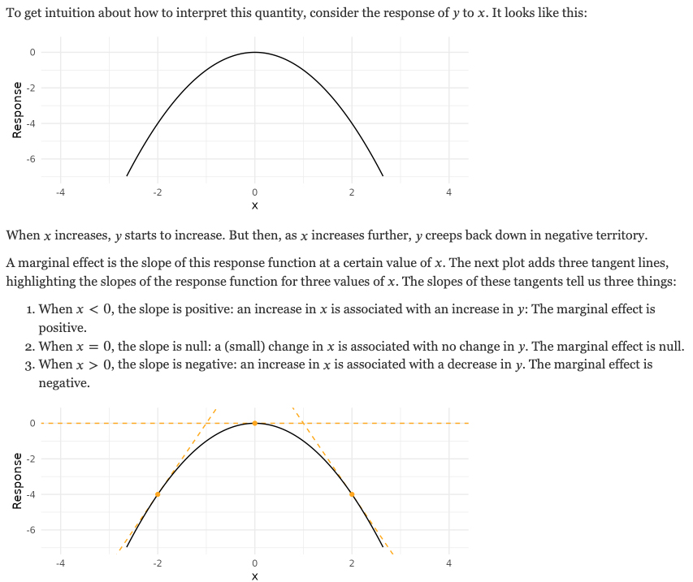

# Logistic Regression {#chapter-8}

```{r, echo = F}
button <-  "position: relative; 
            top: -25px; 
            left: 85%;   
            color: white;
            font-weight: bold;
            background: #4B9CD3;
            border: 1px #3079ED solid;
            box-shadow: inset 0 1px 0 #80B0FB"
```

```{r, echo=FALSE, results='asis'}
codefolder::bookdown(init = "show", style = button)
```

<!-- comment -->
  
In Chapter 8 we will introduce the logistic regression model through the lens of generalized linear models (GLMs). The GLM is an essential tool for modeling discretely distributed dependent variables. 

## Categorical Data in the Social Sciences

Linear regression is a workhorse procedure of modern statistics. Our introduction to regression in this class was framed around the idea of a continuous dependent (outcome) variable. However, categorical data is extremely common in many health, behavioral and social science applications.

### Examples of Categorical Data

- Binary Variables have two categories and are often used to indicate that an event has occurred or a characteristic is present. Are you sick? Did you vote in the last election? Are you married? 

- Ordinal variables have categories that can be ranked. Surveys often ask respondents to indicate their agreement to a statement, how frequently then engage in a behavior, or even educational attainment. 

- Nominal variables occur when there are multiple outcomes that cannot be ordered. For example, left or right handedness or occupation. 

- Censored variables occur when the value of a variable is unknown over some range of the variable. For example, measuring hourly wages might be restricted on the lower end by minimum wage laws. 

- Counts indicate the number of times that some event has occurred. How many drinks last week? How many people living in a house? How many years of education? *Censored and count variables are often lumped in with more traditional categorical variables under the umbrella of limited dependent variables.* 

## Introduction to GLMs

Earlier we noted linear regression is typically applied to continuous variables. The ubiquity of categorical data leads us to a modeling framework better suited to handling a wide range of categorical outcomes: the Generalized Linear Model (GLM). 

In the GLM, the response variable $y_{i}$ is assumed to follow an exponential distribution with mean $\mu_{i}$, which itself is a nonlinear function of $x^{'}_{i}\beta$. We can think about $\mu$ as the mean of a conditional response distribution at a given point in the covariate space.

There are three important components to the GLM:

1. *A random component*: The random component of the GLM contains the response variable $\mathbf{Y}$ and its probability distribution (e.g. the binomial distribution of $\mathbf{Y}$ in the binary regression model). 
2. *A Linear Predictor*: The linear predictor typically takes the form of $\mathbf{X}\boldsymbol{\beta}$ where $\mathbf{X}$ is an $n \times q$ matrix of observations and $\boldsymbol{\beta}$ is an $q \times 1$ column vector.
3. *Link Function*: The link function, typically specified as $g()$, is used to relate each component of $\mathbb{E}(\mathbf{Y})$ to the linear predictor, $g[\mathbb{E}(\mathbf{Y})]=\mathbf{X}\boldsymbol{\beta}$.


### Linear Regression as GLM

Linear regression can be formulated in the GLM framework as follows:

$$
\mu_{i} = \beta_{0} + \beta_{1}x_{1i}
$$

1. *A random component*: We can make specify $\mathbf{Y} \sim \mathcal{N}(\mu, \sigma^2)$.
2. *A Linear Predictor*: $\mathbf{X}$ are the continuous or discrete explanatory variables. The way we think about the structural component here doesn't really differ from how we think about it with standard linear models; in fact, that's one of the nice advantages of the GLM.
3. *Link Function*: For linear regression we use the *identity link* (e.g. $\eta=g[\mathbb{E}(\mathbf{Y})]=\mathbb{E}(\mathbf{Y})$).


### Logistic Regression as GLM

Let's also take a look at binary logistic regression formulated as GLM.

$$
\mathrm{logit}(\pi_i) = log(\frac{\pi_{i}}{1-\pi_i})=\beta_{0} + \beta_{1}x_{1i}
$$

1. *A random component*: The distribution of $\mathbf{Y}$ is assumed to be binomial with success probability $\mathbb{E}(\mathbf{Y})=\pi$. 
2. *A Linear Predictor*: $\mathbf{X}$ are the continuous or discrete explanatory variables.
3. *Link Function*: For logistic regression we use the *log-odds (or logit) link* (e.g. $\eta=g(\pi)=log(\frac{\pi_{i}}{1-\pi_i})$), where $\eta$ is the transformed outcome.

### Poisson Regression as GLM

Poisson regression can also be formulated as a GLM:

$$
\mathrm{log}(\lambda_i) = \beta_{0} + \beta_{1}x_{1i}
$$

1. *A random component*: The distribution of $\mathbf{Y}$ is assumed to be Poisson with mean $\lambda$ $\mathbb{E}(\mathbf{Y})=\pi$. 
2. *A Linear Predictor*: $\mathbf{X}$ are the continuous or discrete explanatory variables.
3. *Link Function*: For Poisson regression the *log link* is used.

### Additional Remarks


When the outcome data $\mathbf{Y}$ are not normally distributed, we can always do transformation to change its scale. These are typically done via *link functions* denoted as  $g(\cdot)$ - so we get  $g(\mathbf{Y})$. If we denote the transformed outcome as $\boldsymbol{\eta}$, then we can denote it as:

$$g(\mathbf{Y})=\boldsymbol{\eta}$$

From a conceptual point of view, the link function $g(\cdot)$ *transforms* $\mathbf{Y}$ into a normal outcome. Note that we are simplifying notation somewhat: while we are modeling some expectation of $\mathbf{Y}$, not exactly $\mathbf{Y}$, we will keep on using $\mathbf{Y}$. This is to say the link is applied to the parameter governing the response distribution, not the actual response data. We use *link functions* to formalize that the conditional expectation for $\mathbf{Y}$ (conditional because it is the expected value of $Y$ depending on the level of the predictors and the chosen link). 

Each link function also has an inverse, $h(\cdot)=g^{-1}(\cdot)$, which allows us to define 

$$\mathbf{y}=g^{-1}(\boldsymbol{\eta})=h(\boldsymbol{\eta})$$

The inverse of a link function back-converts the linear combination of predictors into the original outcome.


## Binary Logistic Regression

### Overcoming LPM

To avoid the problems of the LPM we’d like a model where

$$P(\text{Event Occurs}|x_{1},\dots,x_{q})$$

is forced to be within the range of $0$ to $1$. One way to do this is to transform the probability above into the odds metric,

$$
\mathrm{Odds}(\mathbf{Y})= 
\frac{P(\text{Outcome = 1}|x_{1},\dots,x_{q})}{P(\text{Outcome = 0}|x_{1},\dots,x_{q})} =
\frac{P(\text{Outcome = 1}|x_{1},\dots,x_{q})}{P(1- \text{Outcome = 1}|x_{1},\dots,x_{q})} 
$$


which has a range of $0$ to $\infty$. So, we are halfway there. Indeed, by taking the log of the odds (or logit) we extend the support of $\mathbf{Y}$ to have a range of  $-\infty$ to $\infty$. This maps probability ranging between $0$ and $1$ to log odds ranging from negative infinity to positive infinity.

This is one example of why the logit link is used for logistic regression. Nowe we can seamlessly model the probability of an event occurring, giving the explanatory variables, $x_{1},\dots,x_{q}$.

We denote this probability as $\pi(x_{1},\dots,x_{q})$ , or equivalently, $P(\text{Event Occurs}|x_{1},\dots,x_{q})$.

Often times you will simply see $\pi$ for convenience, but it is important to remember this probability is conditional on the explanatory variables in the model.

### Model

The binary logistic regression model is expressed as 

$$
log(\frac{\pi_{i}}{1-\pi_i})=\beta_{0} + \beta_{1}x_{1i}.
$$

Where $\left(\frac{(\pi_{i})}{1-(\pi_{i})}\right)$ is the odds of an event occurring and $log$ is the natural logarithm. Therefore, the parameter estimates from a generalized linear regression using the logistic link function are scaled in *log-odds* or *logit* units.  

We can also rewrite the model above, solving for $\pi_{i}$, as

$$
\pi_{i}=\frac{\mathrm{exp}(\beta_{1}x_{1i})}{1+\mathrm{exp}(\beta_{1}x_{1i})}
$$

This is also called the inverse function for the logit link function, or the *logistic* link,
$h(\cdot) = \frac{e^{(\cdot)}}{1+e^{(\cdot)}}$. In practice, this transformation is what is used for solving the regression equation, and it is called logistic regression:  

## Example Data

Chapter 7 

In Chapter 7 we use data from Dunn, Aknin, and Norton (2007), who examined the relationship between spending habits and happiness using OLS regression.  To capture spending habits self-reported monthly spending was categorized as being either personal or prosocial, and then summed to create a category-specific total. Measures of happiness were obtained using a 5-item ordinal scale. 

The dependent variable in this analysis (GeneralHappiness) was self-reported general happiness. Participants rated their general happiness by answering the question "Do you feel happy, in general?” by selecting from five possible response options (no, rarely, sometimes, most of the time, and yes), which were then scored from 1-5. Here, higher numbers were indicative of greater happiness. For the purpose of our analysis we will dichotomize GeneralHappiness depending on whether a person was not happy vs happy.

The sample was selected to be a nationally representative sample of 632 Americans (287 males and 345 females). Participants responded as part of a larger, online survey, in return for points that could be redeemed for prizes (Dunn, 2008). No further details on sampling were available. 

### Variables
- **Happy**: Dichotomous variable indicating whether the subject responded "yes" when asked if they felt happy, in general.
- **PersonalSpending**: Self-reported dollars spent per month on (a) bills and expenses, and (b) gifts for themselves.
- **ProsocialSpending**: Self-reported dollars spent per month on (a) gifts for others, and (b) donations to charity.
- **PersonalIncome**: Participants selected their personal income category from 6 options: less than $20,000, $20,000-$35,000, $35001-$50,000, $50,001-$65000, $65,001-$80,000, $80,001+. 

```{r}
library("ggplot2")
dunn2008 <- read.csv("data/DUNN2008.csv")
dunn2008$Happy <- ifelse(dunn2008$GeneralHappiness == "yes", 1, 0)
dunn2008$PersonalSpending  <- dunn2008$PersonalSpending/100
dunn2008$ProsocialSpending <- dunn2008$ProsocialSpending/100
dunn2008$PersonalSpending_star <- as.numeric(scale(dunn2008$PersonalSpending, scale = FALSE))
dunn2008$ProsocialSpending_star <- as.numeric(scale(dunn2008$ProsocialSpending, scale = FALSE))
dunn2008$Income <- dplyr::recode(dunn2008$PersonalIncome, 
                            "20001-35000" = "20-35K", 
                            "35001-50000" = "35-50K", 
                            "50001-65000" = "50-65K", 
                            "65001-80000" = "65-80K", 
                            "80001andup" = "> 80K", 
                            "less20000" = "< 20K")
inc_lev_order <- c("< 20K","20-35K", "35-50K","50-65K","65-80K","> 80K")
dunn2008$Income <- factor(dunn2008$Income, levels=inc_lev_order)
```

## Intercept-Only Model

In logistic regression, we are interested in how various predictors are related to the probability of a specific outcome $P(Y_i = 1) = \pi_i$. In this example we are interested in the probability an individual reports being happy, in a general sense. 

Making use of the logit link function, the general equation for logistic regression is  
$$\mathrm{logit}(\pi_i) = \beta_{0} + \beta_{1}x_1 + ... + \beta_{q}x_q$$

Which after back transformation gives us ...
$$ P(Y_i = 1) = \pi_i = \frac{e^{\beta_{0} + \beta_{1}x_1 + ... + \beta_{q}x_q}}{1+e^{\beta_{0} + \beta_{1}x_1 + ... + \beta_{q}x_q}} =
\frac{\mathrm{exp}(\beta_{0} + \beta_{1}x_1 + ... + \beta_{q}x_q)}{1+\mathrm{exp}(\beta_{0} + \beta_{1}x_1 + ... + \beta_{q}x_q)}
$$

### Intercept-Only Model in R

In our example the variable `Happy` indicates whether a subject reporting being happy. Let's start with the simplest model for predicting `Happy`, the intercept-only model. More specifically, we have $ logit(\pi_i) = b_0(1_i)$where $\pi_i = P(grad_i = 1)$. 


We can use the `glm()` function to fit the model to the data

```{r}
model9 <- glm(Happy ~ 1, 
              family = "binomial", 
              data = dunn2008, 
              na.action = na.exclude)
summary(model9)
```

Without wanting to get to detailed we don't need to specify the `logit` link here because it is the canonical link function for the binomial distribution. This essentially means there is a direct correspondence between the predicted mean and the distribution's canonical location parameter. 

### Interpretation

#### Intercept Parameter

In the intercept-only model, the intercept, $b_0$, reflects 

1. The expected log-odds ($-0.69077$) of an individual reporting they were happy. 

2. The odds of someone reporting being happy $\mathrm{exp}(b_0)=0.5$.

```{r}
exp(-0.69077)
```

3. The expected probability ($0.33$) of the a subject reported being happy in general.

$$ P(Happy_i = 1) = \pi_i = \frac{e^{b_0}}{1+e^{b_0}} $$
or, equivalently, in R

```{r}
exp(-0.69077)/(1 + exp(-0.69077))
```
We can also confirm that the backward transformed parameter from this intercept-only logistic regression matches the expectation we get from the descriptives of the raw data.

```{r}
mean(dunn2008$Happy)
```

*Note*: If $\beta_j > 0$ then $\mathrm{exp}(b_j) > 1$, indicating a positive relationship between $X_{j}$ and the probability of the event occurring. If $\beta_j < 0$, the opposite relationship holds.


## Single Predictor Model

OK, let's include a predictor in our logistic regression model. Let's start with `PersonalSpending` such that 

$$ logit(\pi_i) = b_0 + b_1PersonalSpending^{*}_{1i} + \epsilon_i $$ 
where $\pi_i = P(Happy_i = 1)$. Here, $PersonalSpending^{*}$ is the mean-centered amount of money one spends on themselves in a month (in units of $100$ dollars).

Let's fit the model in R.

```{r}
model10 <- glm(Happy ~ 1 + PersonalSpending_star, 
              family = "binomial", 
              data = dunn2008, 
              na.action = na.exclude)
summary(model10)
```


### Overdispersion

A quick digression. In the binary logistic regression model *overdispersion* occurs when the observed variance is larger than what the binomial distribution would predict. For example, if $Y \sim \mathrm{Binomial}(n_{i},\pi_{i})$, the mean is $u_{i}=n_{i}\pi_{i}$ and the variance is $n_{i}\pi_{i}(1-\pi_{i})$. Since both of these moments rely on $\pi_{i}$, it can be overly restrictive, and if overdispersion is present inferences can become distorted. We will talk about this more later. 

### Coefficients

Again, There are essentially three ways to interpret coefficients from a logistic regression model:

1. The log-odds (or logit)
2. The Odds
3. Probabilities

#### Log-Odds

The parameter estimate $b_0$ reflects the expected log-odds ($-0.69$) of being happy for an individual with an average amount of personal spending. 

The estimate for $b_1$ indicates the expected difference of the log-odds of being happy for a $100$ dollar difference in personal spending. Therefore, we expect a $-0.001$ difference in the log-odds of being happy for a $100$ dollar difference in personal spending.

#### Odds 

Parameter estimates from a logistic regression are often reported in terms of *odds* rather than *log-odds*. To obtain parameters in odds units, we simply exponentiate the coefficients. Note that this is just one of the steps of the inverse link function (which would take us all the way to probability units). 

```{r}
exp(cbind(OR = coef(model10), confint(model10)))
```

In other words, the odds of being happy when personal spending is at average levels is  $exp(-0.690890) = 0.5$.

In regard to the slope coefficient, for a $100$ dollar difference in monthly personal spending, we expect to see about $.1\%$ decrease in the odds of being happy.  This decrease does not depend on the value that personal spending is held at. Note this is not significant and we would not report this interpretation in practice. Essentially, if the odds ratio is equal to one, the predictor did not have an impact on the outcome.


#### Probability

Remember, probabilities range from $[0,1]$, whereas log-odds (the output from the raw logistic regression equation) can range from $(-\infty,\infty)$, and odds and odds ratios can range from $(0,\infty)$. Due to the bounded range of probabilities, probabilities are non-linear, but log-odds can be linear. 

For example, as personal spending goes up by constant increments, the probability of happiness will increase (decrease) by varying amounts, but the log-odds will increase (decrease) by a constant amount, and the odds will increase (decrease) by a constant multiplicative factor. 


For this reason it is not so simple to interpret probabilities in logistic regression from the coefficient directly. Often it is much simpler to plot the probabilities across a range of the predictor variables.
```{r}
ggplot(data=dunn2008,
       aes(x=PersonalSpending_star,y=Happy)) +
 geom_point(alpha = .08, size = 10) +
 xlab("Personal Spending") +
 ylab("Happy") +
 theme_bw() +
 stat_smooth(method = 'glm', method.args = list(family = "binomial"), se = TRUE)
```

Notice how the density of the observations is visualized by manipulating the transparency (alpha) level of the data points. The predicted curve based on our model has of course a non-linear shape (however, if we were to plot the relationship between the variables with using the logit link, it would be a straight line). 

## Marginal Effects

So far we have considered two possibilities for interpreting logistic regression results:

- Interpreting the log-odds directly
- Transforming the log-odds into odds
- A probability metric (for a single explanatory variable)

However, as we include more covariates in our model, interpretation becomes more difficult. We can only think about "holding other variable constant" in the log-odds and odds scale. For nonlinear model **marginal effects** provide us with an intuitive and easy to interpret method for understanding and communicating results.

### A Definition of Marginal Effects 

**Marginal effects are partial derivatives of the regression equation with respect to each variable in the model for each unit in the data.**

Put differently, the marginal effect measures the association between a change in an explanatory variable and a change in the response. The marginal effect is the slope of the prediction function, measured at a specific value of the explanatory variable.

In linear models the effect of a given change in an independent variable is the same regardless of (1) the value of that variable at the start of its change, and (2) the level of the other variables in the model.


In nonlinear models the effect of a given change in an independent variable (1) depends on the values of other variables in the model, and (2) is no longer equal to the parameter itself.

Consider a linear and nonlinear model for happiness as a function of personal spending and a dummy variable indicating whether someone is rich.


### A Few Observations

**For the linear model**:
- Whether one is rich or poor does no impact the relationship between happiness and personal spending.
- Differences in happiness levels between rich and poor are not dependent on the amount of money one spends.

**From the nonlinear model**:
- Whether one is rich or poor does impact the relationship between happiness and personal spending.
- Differences in happiness levels between rich and poor are dependent on the amount of money one spends.

#### Another Nonlinear Example

A helpful example is provided in the [marginaleffects vignette](https://vincentarelbundock.github.io/marginaleffects/articles/mfx.html). 

Consider a simple quadratic 

$$
y = -x^2 \\
$$

with partial derivative of $y$ with respect to $x$

$$
\frac{\partial y}{\partial x} = -2x.
$$





### Types of Marginal Effects

There are generally three types of *marginal effects* people consider:

- Marginal Effects at the Means (MEM)
- Average Marginal Effects (AME)
- Marginal Effects at Representative Values (MEM)

We will focus on marginal effects at representative values as this is the most powerful option.

### Example Model

Let's fit a more complicated model. To look at marginal effects we will use the `marginaleffects` package.

```{r}
library("marginaleffects")
model11 <- glm(Happy ~ 1 + PersonalSpending + ProsocialSpending + Income, 
              family = "binomial", 
              data = dunn2008, 
              na.action = na.exclude)
summary(model11)
```

### Marginal Effects at Representative Values (MER)

For example, let's look at the impact of `Income` on the probability of being happy.

```{r}
marginaleffects::plot_predictions(model11, condition = c("Income"), conf.int = TRUE)
```

What if we were interested in the relationship between `Income` and `PersonalSpending` on the probability of being happy.

```{r}
marginaleffects::plot_predictions(model11, condition = c("PersonalSpending","Income"))
```

What if we were interested in the relationship between `Income` and `ProsocialSpending` on the probability of being happy.

```{r}
marginaleffects::plot_predictions(model11, condition = c("ProsocialSpending","Income"))
```

In nonlinear, the marginal effect of one variable is conditional on the value of the other variable. This function draws a plot of the marginal effect of the effect variable for different values of the condition variable.

Let's look at the effect of `PersonalSpending` on the relationship between `ProsocialSpending` and `Happy`.

```{r}
marginaleffects::plot_slopes(model11, variables = "ProsocialSpending", condition = "PersonalSpending")
```

In addition, we can look at the effect of `PersonalSpending` on the relationship between `PersonalSpending` and `Happy`.

```{r}
marginaleffects::plot_slopes(model11, variables = "PersonalSpending", condition = "ProsocialSpending")
```
