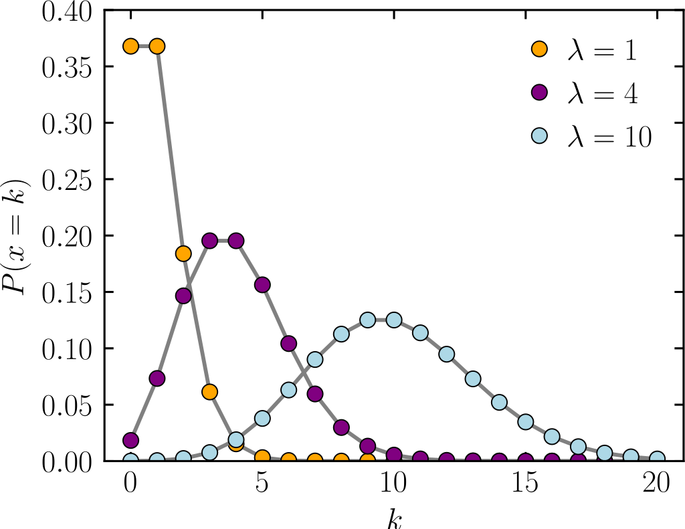

# Poisson Regression {#chapter-8}

```{r, echo = F}
button <-  "position: relative; 
            top: -25px; 
            left: 85%;   
            color: white;
            font-weight: bold;
            background: #4B9CD3;
            border: 1px #3079ED solid;
            box-shadow: inset 0 1px 0 #80B0FB"
```

```{r, echo=FALSE, results='asis'}
codefolder::bookdown(init = "show", style = button)
```
<!-- comment -->
  
In Chapter 8 we will round out our discussion of the GLM with Poisson regression. Poisson regression is a useful modeling approach for handling count dependent variables. One important consideration when fitting Poisson regression models is*overdispersion*. We will look at how one might assess overdispersion in Poisson rregression and suggest some alternative procedures. As wuth logistic regression we will look to marginal effects and visualization as an aid to help us interpret results from these nonlinear models.


## Poisson Regression 

To review, there are three important components to the GLM:

1. *A random component*: The random component of the GLM contains the response variable $\mathbf{Y}$ and its probability distribution (e.g. the binomial distribution of $\mathbf{Y}$ in the binary regression model). 
2. *A Linear Predictor*: The linear predictor typically takes the form of $\mathbf{X}\boldsymbol{\beta}$ where $\mathbf{X}$ is an $n \times q$ matrix of observations and $\boldsymbol{\beta}$ is an $q \ times 1$ column vector.
3. *Link Function*: The link function, typically specified as $g()$, is used to relate each component of $\mathbb{E}(\mathbf{Y})$ to the linear predictor, $g[\mathbb{E}(\mathbf{Y})]=\mathbf{X}\boldsymbol{\beta}$.

### Poisson Regression as GLM

Poisson regression can also be formulated as a GLM:

$$
\mathrm{log}(\mu) = \beta_{0} + \beta_{1}x_{1}
$$
or equivalently,

$$
\mu = \mathrm{exp}(\beta_{0} + \beta_{1}x_{1}) = \mathrm{exp}(\beta_{0})\mathrm{exp}(\beta_{1}x_{1}).
$$

1. *A random component*: The distribution of $\mathbf{Y}$ is assumed to be Poisson, $Y_{i} \sim \mathrm{Poisson}(\mu_{i})$. 
2. *A Linear Predictor*: The systematic component takes the form of $\mathbf{X}\boldsymbol{\beta}$.
3. *Link Function*: For Poisson regression the *log link* is used.


## Poisson Distribution

To gain some intuition about the Poisson regression model consider the Poisson distribution


$$
P(\mathrm{y}|\mu) = \frac{e^{-\mu}\mu^{\mathrm{y}}}{\mathrm{y}!}
$$
where 

- $y$ is a random count variable
- $\mu$ is the expected number of times an event ocurrs
- $y! = y \times (y-1) \times ... \times 1$ is the factorical operator

The Poisson distribution relies on a single parameter, $\mu$. Importantly, $\mu$ represents both the mean and the variance of the Poisson distribution (e.g. when $\mu$ is large both the mean and variance are large).




**What Does This Mean In Practice**:

- As $\mu$ grows the center of the distribution shifts to right
- Departure of real count data from predictions from Poisson distribution
    - Variance frequently greater than mean (overdisperion)
    - Frequency of 0 counts exceed number predicted by Poisson
  

## Notes on Interpretation

Consider a one-predictor Poisson regression,

$$
\mathrm{log}(\mu_{i}) = \beta_{0} + \beta_{1}x_{1i}\\
$$
where
$$
\mu = \mathrm{exp}(\beta_{0} + \beta_{1}x_{1}) 
$$

Interpretation of the Poisson regression coefficients is similar to logistic regression. For example,

- $\mathrm{exp}(\beta_{0})$ is the effect on the mean of $Y$ when $\mathbf{x}=0$
- $\mathrm{exp}(\beta_{1})$ is the multiplicative effect on the mean of $Y$ for each 1-unit difference in $\mathbf{x_{1}}$

We can also talk about these regression coefficients in terms of percent change as follow,

- If $\beta_{1}$ is negative:
    - All else being equal, we might expect to see a $(1-\mathrm{exp}(\beta_{1})) \times 100$ percent decrease in the expected count of $Y$, with each additional unit increase in $x_{1}$, holding constant all other variables in the model.
- If $\beta_{1}$ is positive:
    - All else being equal, we might expect to see a $(\mathrm{exp}(\beta_{1})-1) \times 100$ percent increase in the expected count of $Y$, with each additional unit increase in $x_{1}$, holding constant all other variables in the model.


The following relationships are helpful to keep in mind,

- If $\beta_{1}=0$ then $\mathrm{exp}(\beta_{1}) = 1$ and the expected count, $\mu=\mathbb{E}(Y)=\mathrm{exp}(\beta_{1})$, and $Y$ and $x_{1}$ are unrelated. 
- If $\beta_{1}>0$ then $\mathrm{exp}(\beta_{1}) > 1$ and the expected count, $\mu=\mathbb{E}(Y)$ is $\mathrm{exp}(\beta_{1})$ times larger then when $x_{1}=0$. 
- If $\beta_{1}<0$ then $\mathrm{exp}(\beta_{1}) < 1$ and the expected count, $\mu=\mathbb{E}(Y)$ is $\mathrm{exp}(\beta_{1})$ times smaller then when $x_{1}=0$. 

**Note** that the parameter estimates will then describe the outcome variable in terms of *log* units. If we prefer to describe the phenomena in terms of the original *count* units we will need to use the inverse link function. 

## Example Data

Increasingly researchers are taking a life-course perspective to understanding how different life stages shape a variety of later in life outcomes.  In this case study, @ferraro2016 examine the relationship between physical health in adulthood and multiple domains of childhood disadvantage using a count regression model.  Data are drawn from the National Survey of Midlife Development in the United States (MIDUS). MIDUS contains a battery of retrospective questions concerning childhood disadvantage, as well as extensive measures of adult risks and resources. Although the authors use data from both waves of MIDUS in the paper, here we focus only on their first model of adult health outcomes, which takes into account both childhood disadvantage and the mediating effects of later life resources and risk behaviors. 

### Dependent variable

The dependent variable for this analysis is health problems at Wave 1 (`morbidityw1`).  Here, adult health problems are measured by the self-reported occurrence of 31 diseases or health conditions. For 29 of these items respondents were asked “In the past 12 month have you experienced or been treated for any of the following?” For the remaining 2, cancer and heart disease, respondents were asked if they had ever been diagnosed with the disease.  Finally, `morbidityw1` is the sum of these 31 items, where each is coded 1 for yes, and 0 for no. 

### Explanatory Variables

#### Early Life Disadvantage

*ses*: Childhood SES is a sum score based on standardized measures of (1) the education for the head of household, (2) financial strain and (3) receipt of welfare. 
*family*:	Family composition is a sum score based on (1) the presence of a male in the household, (2) parental divorce, and (3) death of parent prior to age 16,
*abuse_rare*:	Physical or Emotional Child abuse by parents is categorized by frequency of abuse.  abuse_rare indicates respondent rarely experience one or both types of abuse. The reference category is never having experienced emotional or physical abuse. 
*abuse_frequency1*:	abuse_frequency1 indicates respondents  frequently (sometimes or often) experienced one type of abuse during childhood. The reference category is never having experienced emotional or physical abuse.
*abuse_frequency2*:	abuse_frequency2 indicates respondents frequently experienced both types of abuse during childhood. The reference category is never having experienced emotional or physical abuse.
*health*:	Adolescent health problems are measured by self-rated physical and mental health at age 16. 

#### Adult Characteristics

*age*:	Age at time of Wave 1 interview.
*nonwhite*:	Race (white or nonwhite).
*female*:	Gender (female or male).
*educate*:	Number of years of completed education.
*catincome*:	Household income adjusted by household size and recoded into five percentile categories (< 21st *percentile, 21st to 40th percentile41st to 60th percentile, 61st to 80th percentile, and > 80th percentile.).
*a1sj6*: 	Financial strain during adulthood; responses range from 1 (no difficulty paying monthly bills) to 3 (very difficult to pay monthly bills). 
*smoke_dose*: 	Lifetime smoking is calculated from information reported by respondents: age when started smoking, year stopped (for former smokers), and average number of cigarettes smoked daily. Using a yearly metric, lifetime smoking is the product of years smoked and annual number of cigarettes, divided by 10,000 (see Footnote 11, p. 130). 
*heavydr2*: 	The measurement of heavy drinking is sex differentiated and tapped respondents’ period of greatest lifetime consumption: five or more drinks per day for men and four or more drinks for women.
*obese*: 	Obesity, dummy variable coded 1 if body mass index [kg/m2] > 30.
*fampos*: 	Family support as measured by four items reflecting the presence of positive relationship characteristics.
*friendpos*: 	Friend support as measured by four items reflecting the presence of positive relationship characteristics.
*famneg*:	Family strain as measured by four items reflecting the presence of difficult relationship characteristics.
*friendneg*: 	Friend strain as measured by four items reflecting the presence of difficult relationship characteristics.
*integration*: 	Social integration as measured by three 7-item Likert–type questions. 
*ever_divor*: 	Ever divorced, a dummy variable coded 1 if the respondent reported having been divorced.
*controlw1*:	Average score for a 12-item index of the respondent’s feelings of personal control.


```{r}
ferraro2016 <- read.csv("data/ferraro2016.csv")
ferraro2016$income_star <- as.numeric(scale(ferraro2016$catincome, scale = FALSE))
```

## Single Predictor Model

Let's fit a single predictor Poisson regression model for morbidity at Wave 1 using income bracket as our predictor. For now let's treat income bracket as a continuous predictor. 

```{r}
model1 <- glm(
  formula = morbidityw1 ~ 1 + income_star, 
  family = poisson(link=log), 
  data = ferraro2016,
  na.action = na.exclude
)
summary(model1)
```

### Overdispersion

We can think about the deviance as a measure of how well the model fits the data. If the model fits well, the observed values $Y_{i}$ will be close to their predicted means $\mu_{i}$, causing the deviance to be small. If this value greatly exceeds one it may be indicative of overdispersion. 

The rationale for this heuristic is based on the fact that the residual deviance is $\chi^2_k$ distributed with mean equal to the degrees of freedom. Instead of using this rule of thumb it is just as simple to formulate a goodness-of-fit test for our model as follows

```{r}
1 - pchisq(summary(model1)$deviance, summary(model1)$df.residual )
```

The GOF test indicates that the Poisson model fits does not fit the data $(p > 0.05)$. This suggests there may be a problem with overdispersion. *Overdispersion indicates there is greater variability in the data than would be expected based on the model.* Overdispersion is often encountered when fitting simple Poisson regression models. The Poisson distribution has one free parameter and does not allow for the variance to be adjusted independently of the mean. If overdispersion is present the resultant model may yield biased parameter estimates and underestimated standard errors, possibly leading to invalid conclusions. 

### Interpretation

#### Intercept 

This is the Poisson regression estimate when all variables in the model are evaluated at zero. For our model, we have centered the income variable. This means for an individual with an average income level the log of the expected count for health problems is $1.007$ units. 

We can also exponentiate the intercept, $exp(1.007) = 2.7$ indicating that at Wave 1 follow-up, an individual with an average income level is expected to have approximately $2.7$ health problems 

#### Slope 

Within our single predictor model, $b_1$ is the difference in *log* number of health problems for a 1-level difference in income bracket. Therefore, we expect a $-0.03$ difference in the log-count of health problems for a 1-level difference in income brackets. Or, all else being equal, we might expect to see a $3\%$ percent decrease in the number of health problems with each additional unit-change in income level.

This relation may be difficult to conceptualize because the outcome variable is in terms of logarithm units, so a plot may be a more intuitive display of the results.

Let's turn to the `marginaleffects` [@bundock] package to look at the marginal effects of income on health. 

```{r}
marginaleffects::plot_cap(model1, condition = c("income_star"), conf.int = TRUE)
```

## Multiple Predictor Model

Let’s add another variable into the model. Specifically, the variable `abuse_rare`, which equals $1$ if the child was rarely abused during early development, and $0$ if the child experienced abuse. 

```{r}
ferraro2016$abuse_rare <- factor(ferraro2016$abuse_rare)
model2 <- glm(
  formula = morbidityw1 ~ 1 + abuse_rare + income_star + abuse_rare:income_star, 
  family = poisson(link=log), 
  data = ferraro2016,
  na.action = na.exclude
)
summary(model2)
```

As the model becomes more complicated it can be helpful to write out the equation,

$$ 
\mathrm{log}(morbidity_i) = b_0 + b_1(abuse\_rare_{i})+ b_2(income^{*}_{1i})+ b_3(income^{*}_{1i})(abuse\_rare_{i}) $$


Coefficients $b_0$ and $b_2$ describe the relation between $income^{*}_{1i}$ and $morbidity_i$ for those who experienced childhood abuse $(abuse\_rare_{i}=0)$.


While coefficients $b_0 + b_1$ and $b_2 + b_3$ describe the relation for those who rarely experienced childhood abuse $(abuse\_rare_{i}=1)$. Note that neither $b_3$ is not significantly different from zero, so we would not interpret the interaction between income and abuse directly.  

Let's again turn to the `marginaleffects` [@bundock] package to look at the marginal effects of income and childhood abuse on health. 

```{r}
marginaleffects::plot_cap(model2, condition = c("income_star","abuse_rare"), conf.int = TRUE)
```


## Revisisting Overdispersion

Let's run our model fit test based on the deviance for `model2`.

```{r}
1 - pchisq(summary(model2)$deviance, summary(model2)$df.residual )
```

Again, we reject the hypothesis of a close fit between model and data. To gain a little more insight we can plot estimates of the variance against the expected value, alongside a line with an intercept of zero and a slope of 1. 

We expect the data points to fall somewhat evenly along that line. Here, it appears our variance is consistently larger than our mean, indicating the possibility of overdispersion.

```{r}
plot(
  log(fitted(model2)),
  log((ferraro2016$morbidityw1-fitted(model2))^2),
  xlab=expression(hat(mu)),
  ylab=expression((y-hat(mu))^2),
  pch=20,col="blue"
)
abline(0,1) ## 'varianc = mean' line
```

Two ways we might handle this overdispersion are **(1)** estimate the overdispersion parameter directly within the model, or **(2)** use a negative binomial model.


### Quassi-Poisson Family

If we want to test and adjust for overdispersion we can add a scale parameter with the `family=quasipoisson` option. The estimated scale parameter will be labeled as `Overdispersion parameter` in the output.

```{r}
model3 <- glm(
  formula = morbidityw1 ~ 1 + abuse_rare + income_star + abuse_rare:income_star, 
  family = quasipoisson(link=log), 
  data = ferraro2016,
  na.action = na.exclude
)
summary(model3)
```

The new standard errors (in comparison to the model without the overdispersion parameter), are larger, Thus, the Wald statistics will be smaller and less likely to be significant.

### Negative Binomial Regression

We can also fit a negative binomial model, in which allows dispersion or variance in the outcome. The negative binomial distribution has one parameter more than the Poisson regression. This parameters adjusts the variance independently from the mean. In fact, the Poisson distribution is a special case of the negative binomial distribution.

Importantly, the Poisson and Negative Binomial have the same mean structure, so we can interpret coefficients in the same way. However, we will need to use the `MASS` package [@venables] to fit the Negative Binomial regression.

```{r}
model4 <- MASS::glm.nb(
  formula = morbidityw1 ~ 1 + abuse_rare + income_star + abuse_rare:income_star, 
  data = ferraro2016,
  na.action = na.exclude
)
summary(model4)
```

We notice the smaller dispersion parameter, approximately $1.53$, providing some support the negative binomial is a better fit for our data. 

We can also test the hypothesis of overdispersion formally using a likelihood ratio test. The difference between the two models is captured by estimating a dispersion parameter that is held constant in a Poisson model. Thus, the Poisson model is actually nested in the negative binomial model. We can then use a likelihood ratio test to compare the two and test this model assumption. 


```{r}
pchisq(2 * (logLik(model4) - logLik(model2)), df = 1, lower.tail = FALSE)
```

In this example the associated chi-squared value estimated from $2*(logLik(\mathrm{negative \:binomial}) – logLik(\mathrm{poisson}))$ is $1968.679$ with one degree of freedom. This strongly suggests the negative binomial model, estimating the dispersion parameter, is more appropriate than the Poisson model.