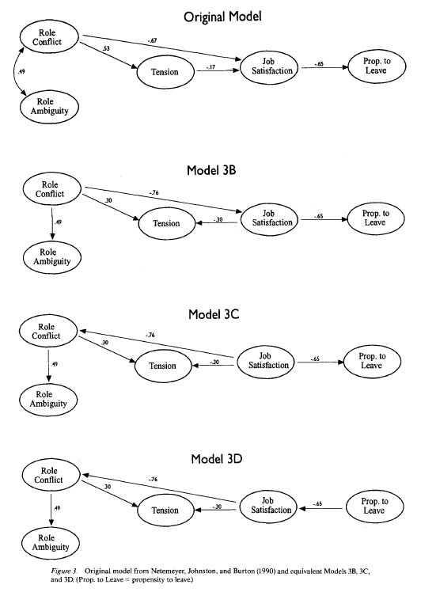
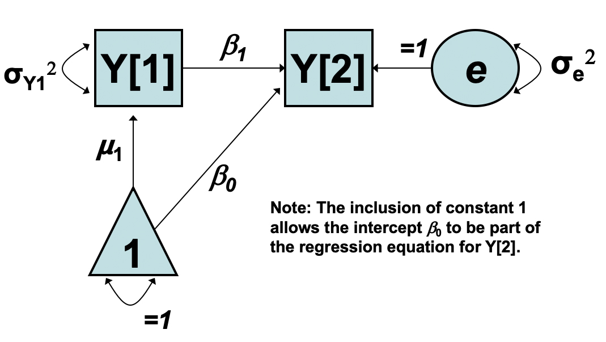

# Two-Occassion change {#chapter-9}

```{r, echo = F}
button <-  "position: relative; 
            top: -25px; 
            left: 85%;   
            color: white;
            font-weight: bold;
            background: #4B9CD3;
            border: 1px #3079ED solid;
            box-shadow: inset 0 1px 0 #80B0FB"
```

```{r, echo=FALSE, results='asis'}
codefolder::bookdown(init = "show", style = button)
```

In Chapter 9 we will introduce longitudinal models in their most basic form: repeated measures collected at two occasions. Two-occasions data are a natural starting point for studying change: all longitudinal data collection begins with two occasions. Given any two-occasion repeated measures data, popular analytic approaches include autoregressive and difference score models. 

This script works through some basic representations of change, more specifically (1) autoregressive models of change (residualized change), and  (2) difference-score models (raw change) of change. These two models consider and answer different kinds of research questions: questions about change in interindividual differences and questions about intraindividual change.

**Importantly, we do not yet consider predictors in our model, which is arguably the most common scenario when these two models are compared: looking at pre- and post-test differences among two groups. However, this will serve as an introduction to the concepts of raw and residualized change.** 

## Example Data

Chapter 6 make use of the same WISC data used in Chapter 3. Here we again read in, subset, and provide descriptives for the WISC data. 

```{r}
filepath <- "https://quantdev.ssri.psu.edu/sites/qdev/files/wisc3raw.csv"

wisc3raw <- read.csv(file=url(filepath),header=TRUE)

var_names_sub <- c(
  "id", "verb1", "verb2", "verb4", "verb6",
  "perfo1", "perfo2", "perfo4", "perfo6",
  "momed", "grad"
)

wiscsub <- wisc3raw[,var_names_sub]

psych::describe(wiscsub)
```


And some bivariate plots of the two-occasion relations.

```{r}
psych::pairs.panels(wiscsub[,c("verb1","verb6")])
```


## Inroduction

### A Thought Experiment 

Now that we are considering repeated measures data it is helpful to thinking about what repeated measures buy us. Here are a few thoughts:

With cross-sectional data:

- No sense of passage of time 
- Cannot control for what happened at earlier timepoints
- Must rely more heavily on theory (e.g. equivalent models [@maccallum1993])
- Causality (e.g. cause precedes the effect, cause related to effect, plausible alternatives)
- Depending on true change process, cross-sectional slice may mislead

### Examples of Equivalent Models



## Residualized Change

Before introducing the model behind each approach is is helpful to consider the data characteristics underlying each notion of change. 

The first approach uses the measure at the second time point as a dependent variable regressed on the the measure at the first time point. 

**Importantly, when we look at residualized change, it is not what is the difference between scores at time 1 and time 2, it is where are you at time 2 relative to time 1, based on what we would expect from your time 2 scores.**

In this way it is helpful to view the data as a scatter plot, like we would in a regression model.

```{r}
library("ggplot2")
ggplot(data = wiscsub, aes(x = verb1, y = verb6)) +
  geom_point() + 
  xlab("Verbal Scores at Grade 1") + 
  ylab("Verbal Scores at Grade 6") + 
  theme_bw()
```

## Raw Change

The second approach involves computing a change score by subtracting the measure at time 1 from the measure at time 2 (e.g. $y_{t}-y_{t-1}$)

This raw change score is then typically used as the dependent variable in a regression equation. 

Here we are speaking in terms of difference scores and raw change. We can plot intraindividual change, by putting time along the x-axis. This requires reshaping the data from wide format to long format.

To recap, our wide data looks like this:

```{r}
head(round(wiscsub,2))
```

We can reshape our data to a long format using the `reshape()` function as follows

```{r}
wiscsublong <- reshape(
  data = wiscsub[c("id","verb1","verb6")], 
  varying = c("verb1","verb6"), 
  timevar = "grade", 
  idvar = "id", 
  direction = "long", 
  sep = ""
)

wiscsublong <- wiscsublong[order(wiscsublong$id,wiscsublong$grade),]

head(round(wiscsublong,2))
```

Now, the long data is structured in a manner amenable to plotting. 

**Notice here that each line indicates how an individual's Grade 6 score differs from their Grade 1 score: intraindividual change.** 

```{r}
library("ggplot2")
ggplot(data = wiscsublong, aes(x = grade, y = verb, group = id)) +
  geom_point() + 
  geom_line() +
  xlab("Grade") + 
  ylab("WISC Verbal Score") + ylim(0,100) +
  scale_x_continuous(breaks=seq(1,6,by=1)) + 
  theme_bw()
```


## Autoregressive Models

When researchers refer to the **autoregressive or residualized change** model for two occasion data they are referring to the following multiple regression model:

$$ y_{2i} = \beta_0 + \beta_1y_{1i} + e_{i} $$

where 

- $y_{1i}$ is the value of the outcome variable for individual $i$ at time $1$
- $y_{2i}$ is the value of the outcome variable for individual $i$ at time $2$
- $\beta_0$ is an intercept parameter, the expected value of $y_{2i}$ when $y_{1i}=0$
- $\beta_1$ is a regression parameter indicating the difference in the predicted score of $y_{2i}$ based on a 1-unit difference in $y_{1i}$
- $e_{i}$ is the residual score for individual $i$

Note, the term *residualized change* comes from the fact that the autoregressive effect *residualizes* the outcome. **This leaves only the variability that is unexplained by the previous timepoint, or the variability due to change.**

### Autoregressive Residuals

With the autoregressive model it is helpful to think more about the residual term. Let's ignore the scaling constant for now, 

If we subtract $y_{2i} -\beta_1y_{1i}$ from both sides of the AR equation we isolate the residuals:


$$ 
e_{i} = y_{2i} -\beta_1y_{1i} 
$$

**Here, the residualized change is the function of a weighted combination of your time 1 scores. Instead of talking about raw change we are asking "Where would we predict you to be at time 2 given your standing relative to the mean at time 1?"**

Consider the following scenarios:

- $e_{i}$ is positive: you changed more in a positive direction than would have been expected.
- $e_{i}$ is negative: you changed more in a negative direction than would have been expected.

<!-- ### Path Diagram of Autoregressive Model -->

<!--  -->


### Autoregressive Model in R

As we said previously, the autoregressive (AR) model is useful for examining questions about change in interindividual differences. The model for verbal scores at grade 6 can be written as   

$$ verb6_{i} = \beta_{0} + \beta_{1}verb1_{i} + e_{i}$$

We note that this is a model of relations among between-person differences. This model is similar to, but is not a single-subject time-series model (which are also called autoregressive models, but are fit to a different kind of data). 

Translating the between-person autoregressive model into code and fitting it to the two-occasion WISC data we have

```{r}
ARfit <- lm(formula= verb6 ~ 1 + verb1,
            data=wiscsub,
            na.action=na.exclude)
summary(ARfit)
```

The *intercept* term, $\beta_{0}$ = 20.22 is the expected value of Verbal Ability at the 2nd occasion, for an individual with a Verbal Ability score = 0 at the 1st occasion. 

The *slope* term, $\beta_{1}$ = 1.20 indicates that for every 1-point difference in Verbal Ability at the 1st occasion, we expect a 1.2 point difference at the 2nd occasion. 

We can plot the autoregressive model prediction with confidence intervals (CI).

The function `termplot` takes the fitted `lm` object.  The CI bounds are plotted with the `se` option and residuals with `partial.resid` option.

```{r}
termplot(ARfit,se=TRUE,partial.resid=TRUE,
         main="Autoregressive Model",
         xlab="Verbal Score at Grade 1",
         ylab="Verbal Score at Grade 6")
```

Note that this code makes use of the `lm()` model object. 

We can also do something similar with the raw data using `ggplot.`

```{r}
ggplot(data = wiscsub, aes(x = verb1, y = verb6)) +
  geom_point() + 
  geom_smooth(method="lm", formula= y ~ 1 + x, 
              se=TRUE, fullrange=TRUE, color="red", size=2) +
  xlab("Verbal Score at Grade 1") + 
  ylab("Verbal Score at Grade 6") +
  ggtitle("Autoregressive Model") +
  theme_classic()
```

Note that this code embeds an `lm()` model within the `ggplot` function. 

## Difference Score Model

### Calculating Difference Scores

Using the same repeated measures notation as above we can think about difference scores in the following way

$$ y_{2i} = y_{1i} + \Delta_{i} $$

where 

- $y_{1i}$ is the value of the outcome variable for individual $i$ at time $1$
- $y_{2i}$ is the value of the outcome variable for individual $i$ at time $2$
- $\Delta_i$ is the difference score for individual $i$

We can calculate the difference score as 

$$ \Delta_{i} = y_{2i} - y_{1i}$$
where $\Delta_{i}$ is a score just like other scores (we can calculate its mean and covariance with other variables, etc.).

### Comparison to Residualized Change

Remember when we talked about the residualize change model we showed the residual was equal to 

$$ 
e_{i} = y_{2i} -\beta_1y_{1i} 
$$

**For the autoregressive model, change is the function of a weighted combination of the scores.**

In the difference score approach, we defined the difference scores as

$$ \Delta_{i} = y_{2i} - y_{1i}$$

What we see from this relationship is that **raw change is residualized change when $\beta_1 = 1$.** We can see these concepts are intimately linked.

#### Difference Scores in WISC Data

For our empirical example we can write the difference score, or raw change in verbal ability, between Grades 1 and 6, as  

$$ 
verbD_{i} = verb2_{i} - verb1_{i}
$$

Furthermore, we can calculate the difference score in R as follows

```{r}
#calculating difference score
wiscsub$verbD <- wiscsub$verb6-wiscsub$verb1

head(round(wiscsub,2))
```

#### Difference Score Descriptives

Look at the descriptives with the difference score. 

```{r}
psych::describe(wiscsub[,c("verb1","verb6","verbD")])

psych::corr.test(wiscsub[,c("verb1","verb6","verbD")])
```


Of particular interest in questions about intraindividual change is the relation between the *pre-test score* and the *amount of intraindividual change*. We can look at the bivariate association.

```{r}
psych::pairs.panels(wiscsub[,c("verb1","verbD")])
```

**A note on computing difference scores**: always use raw scores when computing difference scores, Pre-standardizing variables discards important variance information.

### A Difference Score Regression Model

For the purpose of comparison consider a linear model is expressed for $i = 1$ to $N$ as

$$ \Delta y_{i} = \beta_{0} + \beta_{1}y_{1i} + e_{i} $$

where we are looking at change in verbal test scores while controlling for grade 1 scores,

- $\beta_0$ is an intercept parameter, the predicted score of $\Delta y$ when $y_{1i}=0$
- $\beta_1$ is a slope parameter indicating the difference in the predicted score of $\Delta y$ based on a 1-unit difference in $y_{1i}$
- $e_{i}$ is the residual score for individual $i$


```{r}
#Difference score model
DIFfit <- lm(formula = verbD ~ 1 + verb1,
             data=wiscsub,
             na.action=na.exclude)
summary(DIFfit)
```

The *intercept* term, $\beta_{0} = 20.22$ is the expected value of the difference score (raw change in verbal ability), for an individual with a verbal ability score = 0 at the first occasion. 

The *slope* term, $\beta_{1} = 0.20$ indicates that for every 1-point difference in verbal ability at the first occasion, we expect a $1.2$ point difference in the amount of intraindividual change. 

The same methods as above can be used to plot the results of the difference score model.
```{r}
termplot(DIFfit,se=TRUE,partial.resid=TRUE,
         main="Difference-score Model",
         xlab="Verbal Score at Time 1",
         ylab="Difference in G1 and G6 Verbal Scores")
```

We can also do something similar using `ggplot`.
```{r}
#making interindividual regression plot
ggplot(data = wiscsub, aes(x = verb1, y = verbD)) +
  geom_point() + 
  geom_smooth(method="lm", formula= y ~ 1 + x, 
              se=TRUE, fullrange=TRUE, color="red", size=2) +
  xlab("Verbal Score at Grade 1") + 
  ylab("Difference Score") +
  ggtitle("Difference Score Model") +
  theme_classic()
```

Note that each of these model results plots are regression plots: outcome on the y-axis, predictor on the x-axis.

## Critique of Residualized Change

Some interpretational oddities arise from the autoregressive model that are worth considering.

**Consider the following situation**: We are studying a weight loss intervention where we measure weight prior to and after an intervention. The mean weight at time 1 is 250 pounds ($\mu_{t1}=150$) and the mean weight at time 2 is 230 pounds ($\mu_{t1}=130$). Now consider two people:

- *Individual 1*: Weight at time 1 was $240lbs$ and weight at time 2 is $240lbs$.
  - Relative standing has gone down so there is *positive residualized change*.
- *Individual 2*: Weight at time 1 was $250lbs$ and weight at time 2 is $230lbs$.
  - Relative standing is the same so there is *no residualized change*.


## Critique of Difference Scores

There have also been some major historical critiques of differences scores (e.g. @cronbach1970a).

Much of these critiques are based on reliability and the following rationale. Consider a typical model for a set of repeated measures,

$$
y_{1i} = y_{true,i} + e_{1i} \\
y_{2i} = y_{true,i} + e_{2i}
$$

where

- $y_{true,i}$ is the unobserved `true` score at both occasions
- $e_{i}$ is the unobserved random error that is independent over each occasion

Note, in this theoretical model the true score remains the same and all changes are based on random noise.

If this model holds then we could write a simple difference score as


$$
D_{i}  = y_{2i} - y_{1i} \\
 \quad\quad\: \quad\quad\:\quad\quad\:\quad\quad\quad= (y_{true,i} + e_{2i}) - (y_{true,i} + e_{1i})\\
\quad\quad\: \quad\quad\:\quad\quad\:\quad\quad\quad = (y_{true,i} - y_{true,i}) + (e_{2i} - e_{1i})\\
  \quad\quad = (e_{2i} - e_{1i})\\
$$

where

- Variance of the difference score is entirely based on the variance of the differences in random error scores
- the reliability of the difference scores is zero

### Alternative Interpretation

This has led many to many historical critiques of difference scores. However, other researchers have pointed out this conclusion is based on how one envisions change. If, for example, we have the following theoretical model for change,

$$
y_{1i} = y_{true,i} + e_{1i}\\
y_{2i} = (y_{1i} + \Delta y_{true,i}) + e_{2i}
$$
where

- $y_{true}$ is the unobserved `true` score at both occasions
- $\Delta y_{true}$ is the unobserved `true change` score between occasions
- $e_{i}$ is the unobserved random error that is independent over each occasion

If this model holds, as opposed to the alternative model, then the difference scores


$$
D_{i}  = y_{2i} - y_{1i} \\
 \quad\quad\: \quad\quad\:\quad\quad\:\quad\quad\quad= (y_{true,i} + e_{2i}) - (y_{true,i} + e_{1i})\\
\quad\quad\: \quad\quad\:\quad\quad\:\quad\quad\quad = (y_{true,i} - y_{true,i}) + (e_{2i} - e_{1i})\\
  \quad\quad \quad\quad\quad= \Delta y_{1} + (e_{2i} - e_{1i})\\
$$

where

- now the variance of the difference score is based on the variance of the differences in the random error scores **and** the gain in the true scores
- the relative size of the true score gain determines variance and reliability of the difference scores
- this implies difference scores may be an entirely appropriate means for measuring change


## Comparing Models

To compare the autoregressive (residualized change) and difference score models, it is useful to better understand their equivalence. Let's start with the autoregressive model and see if we can get to the change score model. 

$$
\begin{aligned}
y_{2i} &= \beta_{0} + \beta^{AR}_{1}y_{1i} + \epsilon_{i} & (\text{AR Model})  \\
y_{2i} - y_{1i} &= \beta_{0} + \beta^{AR}_{1}y_{1i} + \epsilon_{i} - y_{1i}  & (\text{Subtract} \: y_{1i}) \\
y_{2i} - y_{1i} &= \beta_{0} + \beta^{AR}_{1}y_{1i} - y_{1i} + \epsilon_{i}  & (\text{Rearrange}) \\
(y_{2i} - y_{1i}) &= \beta_{0} + (\beta^{AR}_{1}-1)y_{1i} + \epsilon_{i}  & (\text{Factor}) \\
\Delta y_{i} &= \beta_{0} + (\beta^{AR}_{1}-1)y_{1i} + \epsilon_{i}  & (\text{Def. of} \: \Delta) \\
\Delta y_{i} &= \beta_{0} + \beta^{DIFF}_{1}y_{1i} + \epsilon_{i}  &   (\text{Equivalence})
\end{aligned}
$$

Here we have shown analytically an equivalence relationship between the slope coefficients from the two models, namely,

$$
\beta^{DIFF}_{1} = (\beta^{AR}_{1} - 1)
$$

We can confirm this relationship look at our model output:

```{r}
coef(ARfit)
coef(DIFfit)
```

## Closing Thoughts

- Given any two-occasion repeated measures data, we can do analysis with autoregressive (residualized change) or difference score (raw change) models
- The two-occasion change models presented in this chapter can be transformed into each other, the goodness-of-fit statistics are not good way to distinguish between them
- The models discussed here can be distinguished when t > 2 repeated measures are available.
- Interpretations of change are fundamentally restricted by the choice of model 
- When choosing one model it is worth considering what change means in each context (e.g. in a weight loss study is $10$ lbs of weight loss the same for people with different baseline weights?)

If you found all of this to be inherently confusing it is worth thinking about the following quote: **“Two waves of data are better than one, but maybe not much better.”** [@rogosa1982].

In the next chapter we will extend the notion of raw and residualized change to comparing change among two groups. 
