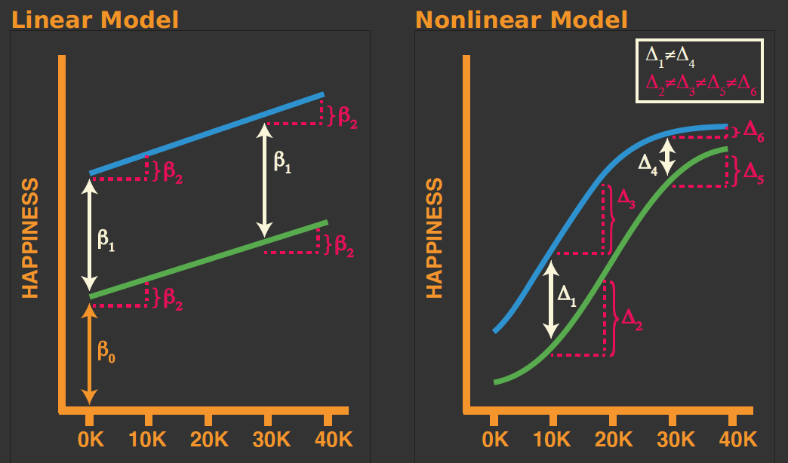

# Marginal Effects {#chapter-10}


```{r, echo = F}
button <-  "position: relative; 
            top: -25px; 
            left: 85%;   
            color: white;
            font-weight: bold;
            background: #4B9CD3;
            border: 1px #3079ED solid;
            box-shadow: inset 0 1px 0 #80B0FB"
```

```{r, echo=FALSE, results='asis'}
codefolder::bookdown(init = "show", style = button)
```

<!-- 
<h1> Hello </h1>
<h3> Hello </h3>
<h6> Hello </h6>
-->
  
In Chapter 10 we will dig a little deeper into the `marginaleffects` [@bundock] R package.


## Reintroducing Marginal Effects 

:::note
Marginal effects are partial derivatives of the regression equation with respect to each variable in the model for each unit in the data.
:::

****

**Said in a different way, a marginal effect captures the association between a change in an explanatory variable and a change in a response.** In fact, the marginal effect is the slope of this prediction function, measured at a specific value of the explanatory variable.

**Big picture**: Marginal effects use model predictions to aid us in our interpretation of a fitted model, while also providing a framework to visualize and test our results.


(and allow us to use hypothesis testing. We are using the estimated model to make predictions so we can better interpret the ...

<h3> Linear Models </h3>

In linear models (without interactions, quadratic terms, etc.) the effect of a given change in an independent variable is the same regardless of (1) the value of that variable at the start of its change, and (2) the level of the other variables in the model.

<h3> Nonlinear Models </h3>

In nonlinear models the effect of a given change in an independent variable (1) depends on the values of other variables in the model, and (2) is no longer equal to the parameter itself.


<h3> Contrast Linear and Nonlinear Models </h3>

Consider a linear and nonlinear model for happiness as a function of personal spending and a dummy variable indicating whether someone is rich.




<h3>  A Few Observations On the Image Above</h3>

**For the linear model**:
- Whether one is rich or poor does no impact the relationship between happiness and personal spending.
- Differences in happiness levels between rich and poor are not dependent on the amount of money one spends.

**From the nonlinear model**:
- Whether one is rich or poor does impact the relationship between happiness and personal spending.
- Differences in happiness levels between rich and poor are dependent on the amount of money one spends.


<h3> Continuous and Categorical Predictors </h3>


**Continuous Variable**: the statistical effect for continuous explanatory variables; the partial derivative of a variable in a regression model; the effect of a single slider

**Categorical Variable**: the statistical effect for categorical explanatory variables; the difference in means when a condition is on vs. when it is off; the effect of a single switch

<h3> Types of Marginal Effects </h3>

There are generally three types of *marginal effects* people consider:

- **Average Marginal Effects (AME)**
- Marginal Effects at the Means (MEM)
- Marginal Effects at Representative Values (MEM)

We won't dive into the nuances of these differences here, but interested parties should take a look at the amazing [Marginalia Website](https://www.andrewheiss.com/blog/2022/05/20/marginalia/)  from Andrew Heiss.

**The three features of marginal effects we will explore in class**:

- Slopes
- Predictions
- Hypothesis Tests

## Data from Ferraro et al. (2016)

Let's take another look at the data from @ferraro2016 examining physical health in adulthood using a count regression model.  

Data are drawn from the National Survey of Midlife Development in the United States (MIDUS). MIDUS contains a battery of retrospective questions concerning childhood disadvantage, as well as extensive measures of adult risks and resources. Although the authors use data from both waves of MIDUS in the paper, here we focus only on their first model of adult health outcomes, which takes into account both childhood disadvantage and the mediating effects of later life resources and risk behaviors. 

<h4> Outcome Variable </h4>

- **morbidityw1**: Self-reported occurrence of 31 diseases or health conditions

<h4> Explanatory Variables </h4>

- **health**:	Adolescent health problems are measured by self-rated physical and mental health at age 16. 
- **age**:	Age at time of Wave 1 interview.
- **female**:	Logical indicating if the subject identified as female.
- **smoke_dose**: 	Lifetime smoking is calculated from information reported by respondents: age when started smoking, year stopped (for former smokers), and average number of cigarettes smoked daily. Using a yearly metric, lifetime smoking is the product of years smoked and annual number of cigarettes, divided by 10,000 (see Footnote 11, p. 130). 
- **heavydr2**: 	The measurement of heavy drinking is sex differentiated and tapped respondents’ period of greatest lifetime consumption: five or more drinks per day for men and four or more drinks for women.
- **obese**: 	Obesity, dummy variable coded 1 if body mass index [kg/m2] > 30.
- **fampos**: 	Family support as measured by four items reflecting the presence of positive relationship characteristics.
- **friendpos**: 	Friend support as measured by four items reflecting the presence of positive relationship characteristics.
- **abuse_rare**:	Physical or Emotional Child abuse by parents is categorized by frequency of abuse.  abuse_rare indicates respondent rarely experience one or both types of abuse. The reference category is never having experienced emotional or physical abuse. 
- **abuse_freq1**:	abuse_frequency1 indicates respondents  frequently (sometimes or often) experienced one type of abuse during childhood. The reference category is never having experienced emotional or physical abuse.
- **abuse_freq2**:	abuse_frequency2 indicates respondents frequently experienced both types of abuse during childhood. The reference category is never having experienced emotional or physical abuse.

## Fitting a Quasi-Poisson Model

We will now fit a Quasi-Poisson regression model to the Ferraro et al. (2016) data. As described previously the Quasi-Poisson model is a generalization of the Poisson regression and is used when modeling an overdispersed count variable. 

```{r}
ferraro2016 <- read.csv("data/ferraro2016.csv")

ferraro2016$female <- as.factor(ferraro2016$female)
ferraro2016$obese  <- as.factor(ferraro2016$obese)
ferraro2016$abuse_rare <- as.factor(ferraro2016$abuse_rare)
ferraro2016$abuse_freq1 <- as.factor(ferraro2016$abuse_freq1)
ferraro2016$abuse_freq2 <- as.factor(ferraro2016$abuse_freq2)

model4 <- glm(
  formula = morbidityw1 ~ 1 + female + health + age + smoke_dose + heavydr2 + obese + fampos + friendpos + abuse_rare + abuse_freq1 + abuse_freq2, 
  family = quasipoisson(link=log), 
  data = ferraro2016,
  na.action = na.exclude
)

summary(model4)
```

Remember, we can interpret these coefficients just as we would regression coefficients, however, we would be speaking in terms of the log of the mean count.

## `marginaleffects: Slopes`

Slopes are defined as the partial derivatives of the regression equation with respect to an explanatory variable of interest (i.e. a marginal effect or trend). In the remainder of this section we use the terms slope and marginal effect interchangeably. 


The marginal effect is a unit- (or person-level) measure of association between changes in a regressor and changes in the response. In a simple linear model the marginal effects will be the same from individual to individual. In anything more complex the marginal effect will vary by individual, because it depends on the values of the other covariates for each individual.

The `slopes()` function produces unique estimates of the marginal effect for each row of the data used to fit the model. The output of `slopes()` is a simple data.frame.

```{r}
library(marginaleffects)
head(slopes(model4))
```

<H3> Average marginal effects (AME) </H3>

To obtain the AMEs we generate predictions for each row of the original data, then collapse to averages.

```{r}
avg_slopes(model4)
```

Note that since marginal effects are derivatives, they are only properly defined for continuous numeric variables. When the model also includes categorical regressors, the summary function will try to display relevant (regression-adjusted) contrasts between different categories, as shown above.

<H3> Group-Average Marginal Effect (G-AME) </H3>

We can also use the `by` argument the average marginal effects within different subgroups of the observed data, based on values of the regressors. 

For example, to compute the average marginal effects of age on the number of health problems for those who experienced no childhood maltreatment and those who experienced both physical and emotional abuse:

```{r}
avg_slopes(
  model4,
  by = "abuse_freq2",
  variables = "age"
)
```
We can also plot these slopes:

```{r}
plot_slopes(
  model4,
  condition = "abuse_freq2",
  variables = "age"
)
```

<H3> Marginal Effect at User-Specified Values </H3>

Sometimes, we are only interested in looking at the estimated marginal effects for certain types of individuals, or for user-specified values of the regressors. The `datagrid` function from `marginaleffects` allows us to build a data grid containing values that are of interest to us.

For example, let's look at the effect of experiencing both childhood emotional and physical abuse on the number of adult health problems for a 30-year old male who is obese.

```{r}
avg_slopes(
  model4,
  variables = "abuse_freq2",
  newdata = datagrid(
    age = 30,
    obse = 1,
    female = 0
  )
)
```

<H3> Hypothesis Tests </H3>

We also might be interested in hypothesis tests based on our model. For example, compared to those who did not experience childhood trauma is the effect of experiencing emotional and physical abuse during childhood on adult health problems different depending on whether an individual experienced both, or just one of these type of abuse.

```{r}
hypotheses(model4, 
  hypothesis = "abuse_freq11 = abuse_freq21"
)
```

## `marginaleffects: Predictions`

Broadly, we may be interested in **(1)** *predictions*, **(2)** *slopes* and **(3)** *hypothesis tests*. Let's briefly review functionality for each of these areas.


<h3> Predictions </h3>

In the context of these examples we will consider predictions to be the predicted value of an outcome of interest produced from a fitted model for a given scale and combination of values of the predictor variables.

For example, let's take a look at the predicted number of health problems for the first six individuals in the sample. 

First, let's get the predicted number of health problems on the `type = "link"` scale:

```{r}
library(marginaleffects)

pred <- predictions(model4, type = "link")

head(pred)
```

Or we can look at the `type = "response"` scale (e.g. raw count):

```{r}
pred <- predictions(model4, type = "response")

head(pred)
```

We may also be interested in looking at what is often called the *Adjusted Prediction at the Mean (APM)*. 

The APM is calculated with all continuous regressors held at their mean, and all categorical variables held at their mode. To do this we can use the `datagrid` function in `marginaleffects` as in

```{r}
predictions(model4, newdata = "mean", type = "response")
```

<h5> Beyond Individual and Aggregate Predictions </h5>

It can often be more interested to look Average Adjusted Predictions (AAP) for different subgroupings of our data. The `marginaleffects` package calculates AAPs in the following manner:

1. Create a new dataset with each of the original regressor values, but fixing some regressors to values of interest.
2. Take the average of the predicted values in this new dataset.


We can obtain AAPs by applying the `avg_predictions()` functions or by argument:

```{r}
avg_predictions(model4, , type = "response")
```
We can compute average adjusted predictions for different subsets of the data with the `by` argument.

```{r}
avg_predictions(model4,
  by = c("abuse_freq2", "obese", "female"),
  type = "response"
)
```

<h5> Counterfactuals </h5>

In the next example, we create a `counterfactual` data grid where each observation of the dataset is repeated twice, with different values of the `abuse_freq2` variable, and all other variables held at the observed values. 

```{r}
predictions(
    model4,
    type = "response",
    by = "abuse_freq2",
    newdata = datagrid(abuse_freq2 = 0:1, grid_type = "counterfactual")
)
```


<h5> Hypothesis Tests </h5>


Importantly, we can also conduct hypothesis tests using these same ideas. 

For example, are the mean number of adult health problems equal for those who experienced no childhood abuse, compared to those who experienced both emotional and physical abuse? 

```{r}
avg_predictions(model4,
  by = "abuse_freq2",
  hypothesis = "b1 = b2",
  type = "response"
)
```

Thinking back on our previous grid of predicted values:

```{r}
avg_predictions(model4,
  by = c("abuse_freq2", "obese", "female"),
  type = "response"
)
```

We can test for the equivalence of any two rows of this grid using the `"b1=b2"` notation where the numbers match the rows used for our desired comparison. 

For example, let's say we want to test whether there is a difference in average number of health problems between obese and non-obese females who experienced child maltreatment (e.g.`"b6=b8"`)

```{r}
avg_predictions(model4,
  by = c("abuse_freq2", "obese", "female"),
  type = "response",
  hypothesis = "b6 = b8"
)
```

<h5> Plotting Predictions </h5>

It is often easier to visualize quantities of interest. To visualize predicted values we can use the `plot_predictions()` function from `marginaleffects`.

For example, lets visualize some of the predictions we analyzed previously.

```{r}
plot_predictions(
  model4, 
  condition = c("age", "obese","female","abuse_freq2"),
  type = "response"
)
```

We can also use some built-in arguments to look at the predicted number of health problems by respondent age and whether they were at mean, 1 SD below, or 1 SD above in terms of cigarette exposure.

Notice, the `plot_predictions()` function is a `ggplot2` object. This means we can modify the plot as needed using ggplot2 syntax.

```{r}
library(ggplot2)
plot_predictions(
  model4, 
  condition = list("age","smoke_dose"="threenum"),
  type = "response"
) + theme_classic() + 
  ggtitle("Adult Health Problems by Age and Smoking Status") +
  xlab("Age") + ylab("Number of Health Problems")
```


## References