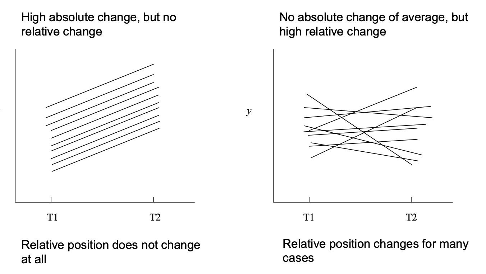
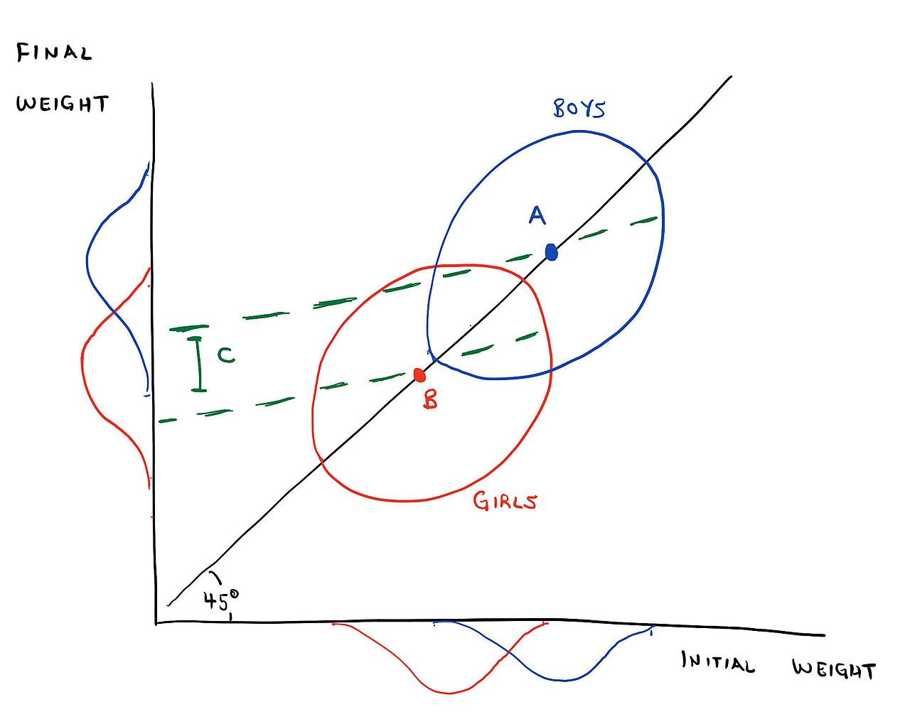

# Two-Occassion Change {#chapter-11}

```{r, echo = F}
button <-  "position: relative; 
            top: -25px; 
            left: 85%;   
            color: white;
            font-weight: bold;
            background: #4B9CD3;
            border: 1px #3079ED solid;
            box-shadow: inset 0 1px 0 #80B0FB"
```

```{r, echo=FALSE, results='asis'}
codefolder::bookdown(init = "show", style = button)
```

In this section we will introduce longitudinal models in their most basic form: repeated measures collected at two occasions. 

Two-occasions data are a natural starting point for studying change: all longitudinal data collection begins with two occasions. Given any two-occasion repeated measures data, popular analytic approaches include the ANCOVA (autoregressive) and difference score models. 

This script works through some basic representations of change, more specifically (1) autoregressive models of change, and  (2) difference-score models of change. These two models consider and answer different kinds of research questions: questions about change in interindividual differences and questions about intraindividual change.


## Introduction

### A Thought Experiment 

Now that we are considering repeated measures data it is helpful to thinking about what repeated measures buy us. Here are a few thoughts:

With cross-sectional data:

- No sense of passage of time 
- Cannot control for what happened at earlier timepoints
- Causality (e.g. cause precedes the effect, cause related to effect, plausible alternatives)
- Depending on true change process, cross-sectional slice may mislead
- Must rely more heavily on theory (e.g. equivalent models [@maccallum1993])

<h3> Equivalent Models and Time Dependence </h3> 

In addition to allowing us to model processes unfolding across time, repeated measures also allow us to address an important problem in applied modeling: the existence of equivalent models. 


<h3> Equivalent Models: An Example </h3> 

{width=500px}

<h4> Examples of Equivalent Models </h4>


Now image these variables were collected at four different waves. This would eliminate the possibility of equivalent models under this scenario.

## Example Data I

For our first set of examples we will use the WISC data. Here we again read in, subset, and provide basic descriptives. 

```{r}
filepath <- "https://quantdev.ssri.psu.edu/sites/qdev/files/wisc3raw.csv"

wisc3raw <- read.csv(file=url(filepath),header=TRUE)

var_names_sub <- c(
  "id", "verb1", "verb2", "verb4", "verb6",
  "perfo1", "perfo2", "perfo4", "perfo6",
  "momed", "grad"
)

wiscsub <- wisc3raw[,var_names_sub]

psych::describe(wiscsub)
```


And some bivariate plots of the two-occasion relations.

```{r}
psych::pairs.panels(wiscsub[,c("verb1","verb6")])
```

## Two-Occassions of Change

Although we may prefer to have more timepoints, two waves of data is

-  often what is available or affordable,
-  often directly related to a change of interest, e.g., pretest-posttest
-  an improvement over cross-sectional data for many questions of interest


<h3>  Notions of Stability </h3>

<h5>  Stability in the Absolute or Exact Sense </h5>

A variable may be considered stable to the extent that 

- mean values for $y_{1}$ and $y_{2}$ are equal over time ($\bar{y}_{2}-\bar{y}_{1}=0$, $y_{2i}-y_{1i}=0$)
- individual values of  $y_{1i}$ and $y_{2i}$ are equal over time ($y_{2i}-y_{1i}=0$)

<h5>  Stability in the Relative Sense </h5>

A variable may be considered stable to the extent that 

- $y_{1i}$ and $y_{2i}$ are correlated ($r_{12}=1$)

Note that mean or individual values may increase or decrease over time, but correlation will be largely unchanged unless relative position changes.

<h3>  Notions of Change </h3>

<h5>  Raw Change </h5>

In thinking about difference scores (change scores, gain scores) we are often interested in the absolute change in the value of $y_{t}$.

Difference scores captures increase or decrease in the mean values or
individual values. 

Correlation between $y_{1}$ and $y_{2}$ can be anywhere between $0$ or $1$ and difference scores may be small or large.

For example. if $r_{12} = 1.0$ and we add $5$ points to $y_2$, $r_{12}$ will still be equl to $1.0$ but the mean difference will have changed.

```{r, eval = FALSE}
y1 <- c(1,1,1,2,2,2)
y2 <- c(3,3,3,4,4,4)
# cor(y1,y2) = 1
# mean(y2-y1) = 2

y2 <- y2 + 5
# cor(y1,y2) = 1
# mean(y2-y1) = 7
```

<h5>  Relative Change </h5>

When we think about relative change, a lower correlation indicates greater change, but change is relative to other cases in the data and not absolute.

For example, if $r_{12}=0.45$, and we all $5$ points to all scores, $r_{12}$ will still be $0.45$. Even though the scores themselves will all change, the relative degree of change is unaffected.

<h5>  Compare Absolute and Relative Change </h5>




## Autoregressive Model

Before introducing the model behind each approach is is helpful to consider the data characteristics underlying each notion of change. 

<h3> Residualized Change </h3>

The first approach uses the measure at the second time point as a dependent variable regressed on the the measure at the first time point. 

The term residualized change comes from the fact that an outcome, such as verbal scores at grade 6, is regressed on itself at a prior occasion, verbal scores at grade 1. Any variability in the outcome that is explained by the lagged regressor will be set aside and is threfore not explainable by a key predictor. 

**Thus, the autoregressive effect residualizes the outcome leaving only variability that is unexplained by the lagged variable, which can be construed as the variability due to change.**

In this way it is helpful to view the data as a scatter plot, like we would in a regression model.

```{r}
library("ggplot2")
ggplot(data = wiscsub, aes(x = verb1, y = verb6)) +
  geom_point() + 
  xlab("Verbal Scores at Grade 1") + 
  ylab("Verbal Scores at Grade 6") + 
  theme_bw()
```

<h3> Autoregressive Model </h3>

When researchers refer to the autoregressive (residualized change) model for two occasion data they are referring to the following multiple regression model:

$$ y_{2i} = \beta_0 + \beta_1y_{1i} + e_{i} $$

where 

- $y_{1i}$ is the value of the outcome variable for individual $i$ at time $1$
- $y_{2i}$ is the value of the outcome variable for individual $i$ at time $2$
- $\beta_0$ is an intercept parameter, the expected value of $y_{2i}$ when $y_{1i}=0$
- $\beta_1$ is a regression parameter indicating the difference in the predicted score of $y_{2i}$ based on a 1-unit difference in $y_{1i}$
- $e_{i}$ is the model error for individual $i$

Note, the term *residualized change* comes from the fact that the autoregressive effect *residualizes* the outcome. 

**This leaves only the variability that is unexplained by the previous timepoint, or the variability due to change.**

<h5>  Autoregressive Residuals </h5>

With the autoregressive model it is helpful to think more about the residual term. Let's ignore the scaling constant for now, 

If we subtract $y_{2i} -\beta_1y_{1i}$ from both sides of the AR equation we isolate the residuals:


$$ 
e_{i} = y_{2i} -\beta_1y_{1i} 
$$

**Here, the residualized change is the function of a weighted combination of our time 1 scores.**

Instead of talking about raw change we are instead asking 

> "Where would we predict you to be at time 2 given your standing relative to the mean at time 1?"**

Consider the following scenarios:

- $e_{i}$ is positive: you changed more in a positive direction than would have been expected.
- $e_{i}$ is negative: you changed more in a negative direction than would have been expected.


<h3>  Autoregressive Model in R </h3>

As we said previously, the autoregrssive model is useful for examining questions about change in interindividual differences. The model for verbal scores at grade 6 can be written as   

$$ verb6_{i} = \beta_{0} + \beta_{1}verb1_{i} + e_{i}$$

We note that this is a model of relations among between-person differences. This model is similar to, but is not a single-subject time-series model (which are also called autoregressive models, but are fit to a different kind of data). 

Translating the between-person autoregressive model into code and fitting it to the two-occasion WISC data we have

```{r}
ARfit <- lm(
  formula = verb6 ~ 1 + verb1,
  data=wiscsub,
  na.action=na.exclude
)
summary(ARfit)
```

The *intercept* term, $\beta_{0}$ = 20.22 is the expected value of Verbal Ability at the 2nd occasion, for an individual with a Verbal Ability score = 0 at the 1st occasion. 

The *slope* term, $\beta_{1}$ = 1.20 indicates that for every 1-point difference in Verbal Ability at the 1st occasion, we expect a 1.2 point difference at the 2nd occasion. 

We can plot the autoregressive model prediction with confidence intervals (CI).

The function `termplot` takes the fitted `lm` object.  The CI bounds are plotted with the `se` option and residuals with `partial.resid` option.

```{r}
termplot(ARfit,se=TRUE,partial.resid=TRUE,
         main="Autoregressive Model",
         xlab="Verbal Score at Grade 1",
         ylab="Verbal Score at Grade 6")
```

Note that this code makes use of the `lm()` model object. 

We can also do something similar with the raw data using `ggplot.`

```{r, warning = FALSE}
ggplot(data = wiscsub, aes(x = verb1, y = verb6)) +
  geom_point() + 
  geom_smooth(method="lm", formula= y ~ 1 + x, 
              se=TRUE, fullrange=TRUE, color="red", size=2) +
  xlab("Verbal Score at Grade 1") + 
  ylab("Verbal Score at Grade 6") +
  ggtitle("Autoregressive Model") +
  theme_classic()
```

Note that this code embeds an `lm()` model within the `ggplot` function. 

## Difference Score Model

Again, let's first take a look at the data characteristics.

<h3>  Raw Change </h3>

The second approach involves computing a change score by subtracting the measure at time 1 from the measure at time 2 (e.g. $y_{t}-y_{t-1}$)

This raw change score is then typically used as the dependent variable in a regression equation. 

Here we are speaking in terms of difference scores and raw change. We can plot intraindividual change, by putting time along the x-axis. This requires reshaping the data from wide format to long format.

To recap, our wide data looks like this:

```{r}
head(round(wiscsub,2))
```

We can reshape our data to a long format using the `reshape()` function as follows

```{r}
wiscsublong <- reshape(
  data = wiscsub[c("id","verb1","verb6")], 
  varying = c("verb1","verb6"), 
  timevar = "grade", 
  idvar = "id", 
  direction = "long", 
  sep = ""
)

wiscsublong <- wiscsublong[order(wiscsublong$id,wiscsublong$grade),]

head(round(wiscsublong,2))
```

Now, the long data is structured in a manner amenable to plotting. 

**Notice here that each line indicates how an individual's Grade 6 score differs from their Grade 1 score: intraindividual change.** 

```{r}
library("ggplot2")
ggplot(data = wiscsublong, aes(x = grade, y = verb, group = id)) +
  geom_point() + 
  geom_line() +
  xlab("Grade") + 
  ylab("WISC Verbal Score") + ylim(0,100) +
  scale_x_continuous(breaks=seq(1,6,by=1)) + 
  theme_bw()
```

<h3>  Calculating Difference Scores </h3>

Using the same repeated measures notation as above we can think about difference scores in the following way

$$ y_{2i} = y_{1i} + \Delta_{i} $$

where 

- $y_{1i}$ is the value of the outcome variable for individual $i$ at time $1$
- $y_{2i}$ is the value of the outcome variable for individual $i$ at time $2$
- $\Delta_i$ is the difference score for individual $i$

We can calculate the difference score as 

$$ \Delta_{i} = y_{2i} - y_{1i}$$
where $\Delta_{i}$ is a score just like other scores (we can calculate its mean and covariance with other variables, etc.).

<h3>  Comparison to Residualized Change </h3>

Remember when we talked about the autoregressive change model we showed the residual was equal to 

$$ 
e_{i} = y_{2i} -\beta_1y_{1i} 
$$

**For the autoregressive model, change is the function of a weighted combination of the scores.**

In the difference score approach, we defined the difference scores as

$$ \Delta_{i} = y_{2i} - y_{1i}$$

What we see from this relationship is that **raw change is residualized change when $\beta_1 = 1$.** We can see these concepts are intimately linked.


<h3>  Difference Scores in WISC Data </h3>

For our empirical example we can write the difference score, or raw change in verbal ability, between Grades 1 and 6, as  

$$ 
verbD_{i} = verb2_{i} - verb1_{i}
$$

Furthermore, we can calculate the difference score in R as follows

```{r}
#calculating difference score
wiscsub$verbD <- wiscsub$verb6-wiscsub$verb1

head(round(wiscsub,2))
```


<h3>  Difference Score Descriptives </h3>

Look at the descriptives with the difference score. 

```{r}
psych::describe(wiscsub[,c("verb1","verb6","verbD")])

psych::corr.test(wiscsub[,c("verb1","verb6","verbD")])
```


Of particular interest in questions about intraindividual change is the relation between the *pre-test score* and the *amount of intraindividual change*. We can look at the bivariate association.

```{r}
psych::pairs.panels(wiscsub[,c("verb1","verbD")])
```

**A note on computing difference scores**: always use raw scores when computing difference scores, Pre-standardizing variables discards important variance information.

<h3>  A Difference Score Regression Model </h3>

For the purpose of comparison consider a linear model is expressed for $i = 1$ to $N$ as

$$ \Delta y_{i} = \beta_{0} + \beta_{1}y_{1i} + e_{i} $$

where we are looking at change in verbal test scores while controlling for grade 1 scores,

- $\beta_0$ is an intercept parameter, the predicted score of $\Delta y$ when $y_{1i}=0$
- $\beta_1$ is a slope parameter indicating the difference in the predicted score of $\Delta y$ based on a 1-unit difference in $y_{1i}$
- $e_{i}$ is the residual score for individual $i$


```{r}
#Difference score model
DIFfit <- lm(formula = verbD ~ 1 + verb1,
             data=wiscsub,
             na.action=na.exclude)
summary(DIFfit)
```

The *intercept* term, $\beta_{0} = 20.22$ is the expected value of the difference score (raw change in verbal ability), for an individual with a verbal ability score = 0 at the first occasion. 

The *slope* term, $\beta_{1} = 0.20$ indicates that for every 1-point difference in verbal ability at the first occasion, we expect a $1.2$ point difference in the amount of intraindividual change. 

The same methods as above can be used to plot the results of the difference score model.
```{r}
termplot(DIFfit,se=TRUE,partial.resid=TRUE,
         main="Difference-score Model",
         xlab="Verbal Score at Time 1",
         ylab="Difference in G1 and G6 Verbal Scores")
```

We can also do something similar using `ggplot`.
```{r}
#making interindividual regression plot
ggplot(data = wiscsub, aes(x = verb1, y = verbD)) +
  geom_point() + 
  geom_smooth(method="lm", formula= y ~ 1 + x, 
              se=TRUE, fullrange=TRUE, color="red", size=2) +
  xlab("Verbal Score at Grade 1") + 
  ylab("Difference Score") +
  ggtitle("Difference Score Model") +
  theme_classic()
```

Note that each of these model results plots are regression plots: outcome on the y-axis, predictor on the x-axis.

## Critiques and Comparisons

<h3> Critiques of the Autoregressive Model </h3>

Some interpretational oddities arise from the autoregressive model that are worth considering.

**Consider the following situation**: We are studying a weight loss intervention where we measure weight prior to and after an intervention. The mean weight at time 1 is 250 pounds ($\mu_{t1}=150$) and the mean weight at time 2 is 230 pounds ($\mu_{t1}=130$). Now consider two people:

- *Individual 1*: Weight at time 1 was $240lbs$ and weight at time 2 is $240lbs$.
  - Relative standing has gone down so there is *positive residualized change*.
- *Individual 2*: Weight at time 1 was $250lbs$ and weight at time 2 is $230lbs$.
  - Relative standing is the same so there is *no residualized change*.

<h3> Critique of Difference Score Model </h3>

There have also been some major historical critiques of differences scores (e.g. @cronbach1970a).

Much of these critiques are based on reliability and the following rationale. Consider a typical model for a set of repeated measures,

$$
y_{1i} = y_{true,i} + e_{1i} \\
y_{2i} = y_{true,i} + e_{2i}
$$

where

- $y_{true,i}$ is the unobserved `true` score at both occasions
- $e_{i}$ is the unobserved random error that is independent over each occasion

Note, in this theoretical model the true score remains the same and all changes are based on random noise.

If this model holds then we could write a simple difference score as


$$
D_{i}  = y_{2i} - y_{1i} \\
 \quad\quad\: \quad\quad\:\quad\quad\:\quad\quad\quad= (y_{true,i} + e_{2i}) - (y_{true,i} + e_{1i})\\
\quad\quad\: \quad\quad\:\quad\quad\:\quad\quad\quad = (y_{true,i} - y_{true,i}) + (e_{2i} - e_{1i})\\
  \quad\quad = (e_{2i} - e_{1i})\\
$$

where

- Variance of the difference score is entirely based on the variance of the differences in random error scores
- the reliability of the difference scores is zero

<h5> Alternative Interpretation </h5>

This has led many to many historical critiques of difference scores. However, other researchers have pointed out this conclusion is based on how one envisions change. If, for example, we have the following theoretical model for change,

$$
y_{1i} = y_{true,i} + e_{1i}\\
y_{2i} = (y_{1i} + \Delta y_{true,i}) + e_{2i}
$$
where

- $y_{true}$ is the unobserved `true` score at both occasions
- $\Delta y_{true}$ is the unobserved `true change` score between occasions
- $e_{i}$ is the unobserved random error that is independent over each occasion

If this model holds, as opposed to the alternative model, then the difference scores


$$
D_{i}  = y_{2i} - y_{1i} \\
 \quad\quad\: \quad\quad\:\quad\quad\:\quad\quad\quad= (y_{true,i} + e_{2i}) - (y_{true,i} + e_{1i})\\
\quad\quad\: \quad\quad\:\quad\quad\:\quad\quad\quad = (y_{true,i} - y_{true,i}) + (e_{2i} - e_{1i})\\
  \quad\quad \quad\quad\quad= \Delta y_{1} + (e_{2i} - e_{1i})\\
$$

where

- now the variance of the difference score is based on the variance of the differences in the random error scores **and** the gain in the true scores
- the relative size of the true score gain determines variance and reliability of the difference scores
- this implies difference scores may be an entirely appropriate means for measuring change


<h3> Comparing Models </h3>

To compare the autoregressive (residualized change) and difference score models, it is useful to better understand their equivalence. Let's start with the autoregressive model and see if we can get to the change score model. 

$$
\begin{aligned}
y_{2i} &= \beta_{0} + \beta^{AR}_{1}y_{1i} + \epsilon_{i} & (\text{AR Model})  \\
y_{2i} - y_{1i} &= \beta_{0} + \beta^{AR}_{1}y_{1i} + \epsilon_{i} - y_{1i}  & (\text{Subtract} \: y_{1i}) \\
y_{2i} - y_{1i} &= \beta_{0} + \beta^{AR}_{1}y_{1i} - y_{1i} + \epsilon_{i}  & (\text{Rearrange}) \\
(y_{2i} - y_{1i}) &= \beta_{0} + (\beta^{AR}_{1}-1)y_{1i} + \epsilon_{i}  & (\text{Factor}) \\
\Delta y_{i} &= \beta_{0} + (\beta^{AR}_{1}-1)y_{1i} + \epsilon_{i}  & (\text{Def. of} \: \Delta) \\
\Delta y_{i} &= \beta_{0} + \beta^{DIFF}_{1}y_{1i} + \epsilon_{i}  &   (\text{Equivalence})
\end{aligned}
$$

Here we have shown analytically an equivalence relationship between the slope coefficients from the two models, namely,

$$
\beta^{DIFF}_{1} = (\beta^{AR}_{1} - 1)
$$

We can confirm this relationship look at our model output:

```{r}
coef(ARfit)
coef(DIFfit)
```

## Adding Explanatory Variables


Assessing the effects of an intervention, grouping variable or construct on change in another construct is a central goal in virtually all areas of the social, health and behavioral sciences. 

- developmental researchers interested in how the occurrence of particular life events (e.g., job loss, marriage) affects changes in well-being or personality. 
- educational psychology researchers investigate how teacher characteristics (e.g.,competence, motivation) predict changes in students’ achievement. 


Most researchers rely on one of two basic strategies when analyzing the prospective effects of one construct on another construct in the context of two-wave data: (1) the ANCOVA model or (2) the difference score model. 

For example, in this situation the autoregressive model becomes the traditional ANCOVA model

$$
y_{2i} = \beta_{0} + \beta_{1} x_{i} + \beta_{2} y_{1i} + \epsilon_{i}
$$
and we have the following difference score model

$$
\Delta_{i} = \beta_{0} + \beta_{1}x_{i} + \epsilon_{i}
$$
where $x_{i}$ is either zero or one for the $i^th$ individual in the sample. Although not immediately obvious, the difference between these two approaches is that $\beta{2}$ is estimated in the ANCOVA model, and fixed to $1$ in the difference score approach.


As pointed out by many different researchers over the year, it can be
challenging to decide which of the two approaches is more appropriate. However, the decision is often critical as the two approaches can yield results that substantially differ concerning the magnitude, sign, and statistical significance of the estimated treatment effect.


## Lord's Paradox

Consider the summary of [Lord's Paradox](https://en.wikipedia.org/wiki/Lord%27s_paradox) from Wikipedia

The most famous formulation of Lord's paradox comes from his 1967 paper:

> “A large university is interested in investigating the effects on the students of the diet provided in the university dining halls and any sex differences in these effects. > Various types of data are gathered. In particular, the weight of each student at the time of his arrival in September and his weight the following June are recorded.” (Lord > 1967, p. 304)

In both September and June, the overall distribution of male weights is the same, although individuals' weights have changed, and likewise for the distribution of female weights.

Lord imagines two statisticians who use different common statistical methods but reach opposite conclusions.

One statistician uses difference scores and finds no significant difference between genders: 

> "[A]s far as these data are concerned, there is no evidence of any interesting effect of diet (or of anything else) on student weights. In particular, there is no evidence of any differential effect on the two sexes, since neither group shows any systematic change." (pg. 305) Visually, the first statistician sees that neither group mean ('A' and 'B') has changed, and concludes that the new diet had no causal impact.

The second statistician uses the ANCOVA (residualized change) model. They find a significant difference between the two sexes. Visually, the second statistician fits a regression model (green dotted lines), finds that the intercept differs for boys vs girls, and concludes that the new diet had a larger impact for males.

> Lord concluded: "there simply is no logical or statistical procedure that can be counted on to make proper allowance for uncontrolled preexisting differences between groups."





## Example Data II

Now, let us compare the common situation where we have a predictor of interest. @castro2018 consider a situation common to behavioral science researchers. 

> Sofia, a close relationships’ researcher, is interested in examining change in relationship
> satisfaction before and after marriage. Specifically, she wants to know whether cohabiting
> prior to marriage has an effect on changes in relationship satisfaction. As she plans her data
> analysis strategy, Sofia realizes she has two options: (1) use the postmarriage relationship
> satisfaction score as her outcome and include the premarriage score in her analysis as a
> predictor, in addition to whether or not couples cohabited prior to marriage to account for
> individual differences in baseline relationship satisfaction (known as residualized change
> approach) or (2) compute the difference between the postmarriage relationship satisfaction
> score and the premarriage relationship satisfaction score and use it as her outcome to test
> the effect of cohabiting prior to marriage (known as difference score approach). Which of
> these two strategies is most appropriate? Should both strategies provide the same results?
> Sofia has heard difference scores have a bad reputation, why is that? Are there additional
> strategies Sofia is not aware of that might be preferred over her current options?


### Generate Some Data According to [@castro2018]

Let's generate some data according to the example from @castro2018. Below is one possible data generating model. 

We will consider two scenarios. In both scenarios the following facts will be true:

* Both data sets have an equal number of dyads that did and did not cohabit
* Cohabitation had a null effect on changes in relationship satisfaction.
* Dyads did not exhibit any changes in relationship satisfaction over time.

In this first example dataset, however, there are preexisting groups at the premarriage assessment. That is, because in a real investigation of cohabitation a controlled experiment would not be feasible, we generated one data set with lower relationship satisfaction at baseline for dyads who reported cohabiting. 

Note that our description of the first dataset corresponds to the assumption made by the difference score model (i.e., no change between groups across time under the assumption of the null hypothesis for the key predictor; there are two populations at baseline).

```{r}
# set a seed so we all have the same data
set.seed (1234)

# create an id variable (N = 100 in each group)
id <- c(1:100, 1:100)

# create a time variable (0 = time 1, 1 = time 2)
time <- c(rep(0, 100), rep(1, 100))

# create grouping variable with equal number cohabiting (1) and not (0)
cohabit <- rep(c(0,1), 100)

# put all variables in a dataframe
data <- data.frame(id, cohabit, time)

# generate dataset A
data_A <- data
data_A$score <- 
  4.5 +                          # intercept
  -2*data_A$cohabit +            # difference in cohabitation
  0*data_A$time +                # effect of time
  0*data_A$cohabit*data_A$time + # interaction
  rnorm(200, 0, 0.3)             # error


# Make into wide format for computing difference score
data_A <- reshape(
  data_A, 
  v.names = 'score', 
  timevar = "time",
  idvar = "id", 
  direction= "wide"
)

# assign appropriate variable names
names(data_A) <- c('id', 'cohabit', 'score1', 'score2')

# compute difference variable
data_A$diff <- data_A$score2 - data_A$score1

# declare cohabiting variable as a factor (categorical variable)
data_A$cohabit <- factor(data_A$cohabit)
```

### Plot Data

```{r}
# visualize the data
library(ggplot2)
ggplot(data_A, aes(x = score1, y = score2, shape= cohabit)) + 
  geom_point(size = 3) +
  geom_smooth(method = lm, se = F) +
  xlab("Relationship Satisfaction Time 1") +
  ylab("Relationship Satisfaction Time 2")
```

### Fit Residualized Change Model

Recall that the main interest in these analyses is to assess the potential effect of cohabitation on changes in relationship satisfaction.

According to the residualized change model we fit to data set A (which is an ANCOVA model in this application because of the categorical predictor), the factors explain 92\% of the variance in the outcome and results suggest there is a statistically and practically significant effect of cohabitation in dyad’s relationship satisfaction at Time 2, controlling for baseline relationship satisfaction.

```{r}
# ancova model
mylml <- lm(score2 ~ score1 + cohabit, data = data_A)
summary (mylml)
```

### Fit Difference Score Model

```{r}
# difference model
mylm2 = lm(diff ~ cohabit, data = data_A)
summary(mylm2)
```

In contrast, when we fit the difference score model to the same data, less than 1% of the variance in the outcome is explained by the model, and results suggested that cohabitation did not have an effect on relationship satisfaction change. As expected, the inferences from these models are strikingly different, which is an example of Lord’s paradox and can be attributed to the differences in baseline scores across couples who cohabit and those who do not.

## Example Data III

Consider a second example dataset, where, again

* We have an equal number of dyads that did and did not cohabit
* Cohabitation had a null effect on changes in relationship satisfaction.
* Dyads did not exhibit any changes in relationship satisfaction over time.

Unlike the first dataset, however, this second dataset would have been obtained if Sofia could have randomly assigned dyads to cohabit or live apart. 

This second data set is in line with the assumption of the residualized change model, where the Time 1 score is uncorrelated with the key predictor, which is equivalent to affirming there are no preexisting group differences at baseline; there is one population of dyads at baseline with respect to relationship satisfaction.

### Generate Some Data According to [@castro2018] Example B

```{r}
# set a seed so we all have the same data
set.seed (1234)

# create an id variable (N = 100 in each group)
id <- c(1:100, 1:100)

# create a time variable (0 = time 1, 1 = time 2)
time <- c(rep(0, 100), rep(1, 100))

# create grouping variable with equal number cohabiting (1) and not (0)
cohabit <- rep(c(0,1), 100)

# put all variables in a dataframe
data <- data.frame(id, cohabit, time)

# generate dataset A
data_B <- data
data_B$score <- 
  4.5 +                          # intercept
  0*data_B$cohabit +            # difference in cohabitation
  0*data_B$time +                # effect of time
  0*data_B$cohabit*data_B$time + # interaction
  rnorm(200, 0, 0.3)             # error


# Make into wide format for computing difference score
data_B <- reshape(
  data_B, 
  v.names = 'score', 
  timevar = "time",
  idvar = "id", 
  direction= "wide"
)

# assign appropriate variable names
names(data_B) <- c('id', 'cohabit', 'score1', 'score2')

# compute difference variable
data_B$diff <- data_B$score2 - data_B$score1

# declare cohabiting variable as a factor (categorical variable)
data_B$cohabit <- factor(data_B$cohabit)
```

### Plot Data

```{r}
# visualize the data
library(ggplot2)
ggplot(data_B, aes(x = score1, y = score2, shape= cohabit)) + 
  geom_point(size = 3) +
  geom_smooth(method = lm, se = F) +
  xlab("Relationship Satisfaction Time 1") +
  ylab("Relationship Satisfaction Time 2")
```

### Fit Residualized Change Model


```{r}
# ancova model
mylml <- lm(score2 ~ score1 + cohabit, data = data_B)
summary (mylml)
```


### Fit Difference Score Model

```{r}
# difference model
mylm2 = lm(diff ~ cohabit, data = data_B)
summary(mylm2)
```


## Closing Thoughts

- Interpretations of change are fundamentally restricted by the choice of model 
- The residualized change and difference score models will often lead to different inferences about the effect of the predictor of interest. 
- The assumptions each of these models make are untestable, and this makes it challenging to argue that either model is more appropriate than the other. 
    - Dyads who report cohabiting prior to marriage will never be able to report what their
relationship satisfaction after marriage would have been if they had not cohabited. 
    - We will never know what level of relationship satisfaction would have been reported by dyads who did not cohabit before marriage if they had in fact chosen to live with their partners prior to getting married. 
    
#### Random Assignment

- When experimentatal procedures are followed, dyads would be randomly assigned to a grouping variable, and this would bring independence of the grouping variable with the pre-test scores. 
- Thus, proper experimentation prohibits preexisting groups to be formed at baseline.
- **Under such circumstances, the residualized change model and difference score models
will arrive at the same inference, but the former has the advantage of having more power
because it makes the correct assumption about the distribution of baseline scores.**

#### Observational Studies

Which should be our choice when experimentation is not possible? 

- If we have different populations with different levels of the outcome at baseline, the residualized change model may not be appropriate.
- For researchers going this route, a latent change score model may alleviate some concerns about reliability and measurement error. 


#### Two-Occassion Change

If you found all of this to be inherently confusing it is worth thinking about the following quote: **“Two waves of data are better than one, but maybe not much better.”** [@rogosa1982].


## References

<div id="refs"></div>

