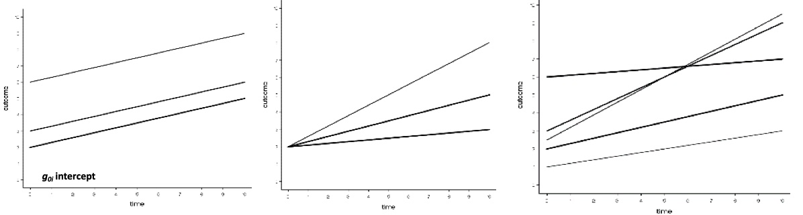
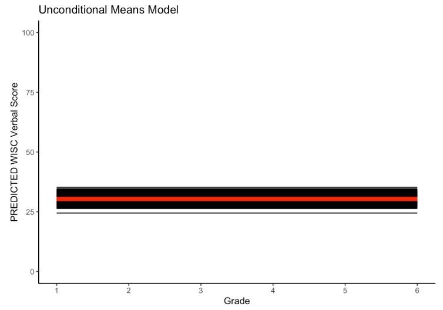
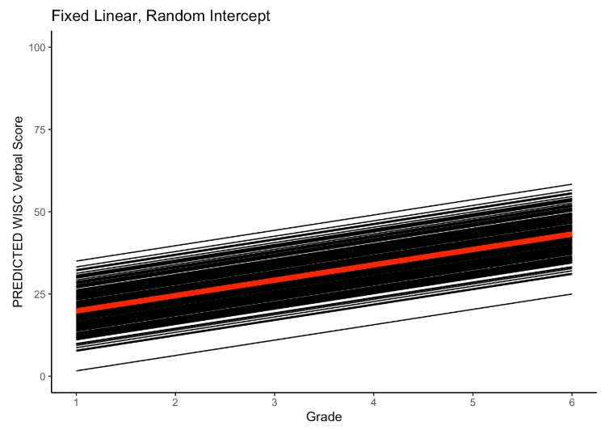
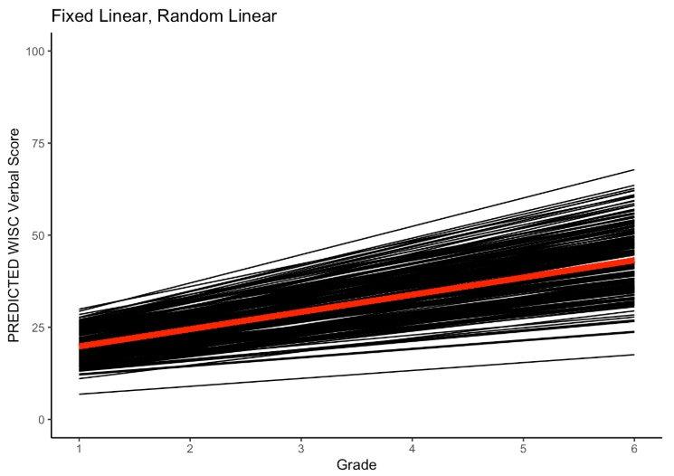
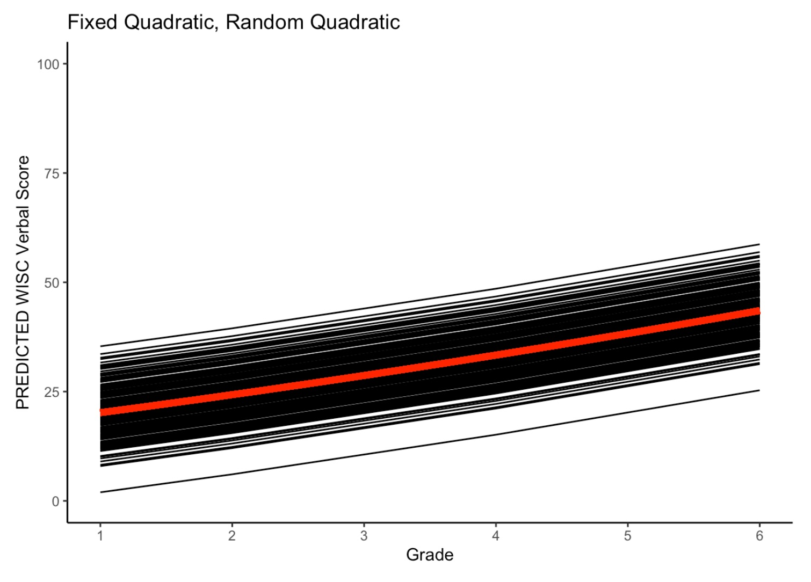
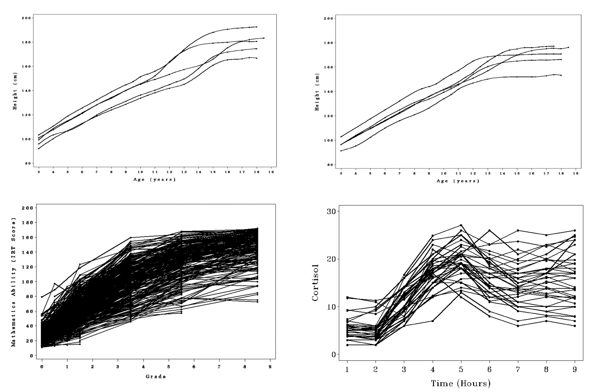
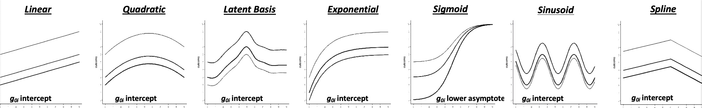

# Nonlinear Growth Curves {#chapter-12}

```{r, echo = F}
button <-  "position: relative; 
            top: -25px; 
            left: 85%;   
            color: white;
            font-weight: bold;
            background: #4B9CD3;
            border: 1px #3079ED solid;
            box-shadow: inset 0 1px 0 #80B0FB"
```

```{r, echo=FALSE, results='asis'}
codefolder::bookdown(init = "show", style = button)
```

This chapter introduces the concept of nonlinear change. In this chapter we will cover the following topics:

1. **Review of Linear Growth**
    - Theory of Linear Growth
    - Characteristics of Linear Growth
    - No Growth Model
        - Equations
        - Code (NLME/LME)
    - Random Intercept Model
        - Equations
        - Code (NLME/LME)
    - Linear Growth Model
        - Equations
        - Code (NLME/LME)
    - Quadratic Growth Model
        - Equations
        - Code (NLME/LME)
2. **Introducing Nonlinear Growth**
    - Types of Nonlinear Models
        - Type I: Nonlinear in Time
        - Type II: Nonlinear in Parameters
        - Type III: Nonlinear in Random Coefficients
    - Flexibility of Nonlinear Growth
    - Utility of Nonlinear Growth
    - Some Nonlinear Growth Models
    - Need for Nonlinear Models
3. **Example Data (Ram and Grimm, 2007)**    
    - Read in Cortisol Data
    - Reshaping Data
    - Descriptives
    - Density Plots
    - Individual-level Trajectories
4. **Linear Growth (Cortisol)**
    - Equation
    - Fit Model
    _ Plots
    - Interpretation
5. **Quadratic Growth (Cortisol)**
    - Equation
    - Fit Model
    _ Plots
    - Interpretation
6. **Latent Basis (Cortisol)**
    - Equation
    - Fit Model
    _ Plots
    - Interpretation
7. **Exponential Growth (Cortisol)**
    - Equation
    - Fit Model
    _ Plots
    - Interpretation
8. **Multiphase Growth (Cortisol)**
    - Equation
    - Fit Model
    _ Plots
    - Interpretation
        
        
## Review of Linear Growth



### Theory of Linear Growth

Before diving into nonlinear model let's briefly review linear growth.

**Theory of Intraindividual Change**

Individuals’ behavior changes over time at a pre-determined, unchanging (stable) rate. For a linear growth model to hold we need an explanation regarding what is driving the pre-determined rate of change

- A *one-time* event with a forever lasting effect?, or
- A continuous event with a stable effect?

**Theory of Interindividual Differences**

We suppose individuals can differ in their “initial” level of behavior

- Need an explanation of why individuals have different “initial” levels

We suppose individuals differ in their rate of change

- Need an explanation of why individuals have different rates of change


### Characteristics of Linear Growth

**Benefits of Linear Growth Models**

- Simple developmental pattern
- Easily interpretable parameters
    - **Level**: predicted score when $t = 0$
    - **Slope**: rate of change in $y$ for a $1-unit$ change in $t$


**Limitations of Linear Growth Models**

- Often does not truly match the developmental process theories 
- Difficult to generalize outside of observation period

### No Growth Model

First, let's consider the no growth model. Remember, the no growth model suggests individuals differ only in terms of their overall level of a given construct, and this level does not change across time. It is often useful as an initial model to determine whether future analyses are warranted.

#### No Growth Plot



#### No Growth Equations

\begin{align}
y_{ti}  = & \beta_{0i} + e_{ti}, & e_{ti} \sim \mathcal{N}(0,\sigma^{2}_{e}) && \: [\text{Level 1 Equation}] \\
\beta_{0i}  = & \gamma_{00} + u_{0i}, & u_{0i} \sim \mathcal{N}(0,\sigma^{2}_{u0}) && \: [\text{Level 2 Equation}] \\
y_{ti}  = & \underbrace{\gamma_{00}}_{fixed} + \underbrace{u_{0i}}_{random} + e_{ti}, &  && \: [\text{Combined Equation}]
\end{align}

where 

- $y_{ti}$ is the repeated measures score for individual $i$ at time $t$
- $\beta_{0i}$ is the random intercept for individual $i$ (person-specific mean)
- $e_{ti}$ is the time-specific residual score (within-person deviation)
- $\gamma_{00}$ is the sample mean for the intercept (grand mean)
- $u_{0i}$ is individual $i$'s deviation from the sample mean (between person deviation)

```{r, echo = FALSE, message=FALSE,warning=FALSE}
filepath <- "https://quantdev.ssri.psu.edu/sites/qdev/files/wisc3raw.csv"
wisc3raw <- read.csv(file=url(filepath),header=TRUE)
varnames <- c("id","verb2","verb4","verb6","grad")
wiscsub <- wisc3raw[ ,varnames]
verblong <- reshape(
  data = wiscsub, 
  varying = c("verb2","verb4","verb6"), 
  timevar = "grade", 
  idvar = "id", 
  direction = "long", 
  sep = ""
)
verblong <- verblong[order(verblong$id,verblong$grade), c("id","grade","verb","grad")]
```

#### No Growth Code

Here, we present code for fitting the no growth model in the `nlme` package using both *compact* and *detailed* model syntax. 

```{r, eval = F}
um_nlme <- nlme::nlme(
  verb ~ gamma_00 + u_0i,
  data = verblong,
  fixed = gamma_00~1,
  random = u_0i~1,
  group = ~id,
  na.action="na.omit",
  start = c(gamma_00 = mean(verblong$verb))
)
summary(um_nlme)

um_lme <- nlme::lme(
  fixed= verb ~ 1, 
  random = ~ 1|id, 
  data = verblong,
  na.action = na.exclude
)
summary(um_lme)
```

### Random Intercept Model

#### Random Intercept Plot



#### Random Intercept Equations


\begin{align}
y_{ti}  = & \beta_{0i} + \beta_{1i}\frac{\text{time}_{}-c_{1}}{c_{2}} + e_{ti}, & e_{ti} \sim \mathcal{N}(0,\sigma^{2}_{e}) && \: [\text{Level 1}] \\
\beta_{0i}  = & \gamma_{00} + u_{0i}, & u_{0i} \sim \mathcal{N}(0,\sigma^{2}_{u0}) && \: [\text{Level 2}] \\
\beta_{1i}  = & \gamma_{10}, &  && \:  \\
y_{ti}  = & \underbrace{\gamma_{00} + \gamma_{10}\frac{\text{time}-c_{1}}{c_{2}}}_{fixed} + \underbrace{u_{0i}}_{random} + e_{ti}, &  && \: [\text{Combined}]
\end{align}

where

\begin{align}
u_{0i}  \sim 
\left(
\begin{array}{r}
0 
\end{array},
\begin{array}{c}
\sigma^{2}_{u0} 
\end{array}\right),
\end{align}

and

- $y_{ti}$ is the repeated measures score for individual $i$ at time $t$
- $\beta_{0i}$ is the random intercept for individual $i$
  - predicted score for individual $i$ when $\text{time}=0$
- $\beta_{1i}$ is the sample-level mean for the slope ($\beta_{1i}=\gamma_{10}$)
  - predicted rate of change for individual $i$ with a 1-unit change in $\text{time}$
- $\text{time}$ represents time and could be grade, age, year, etc.
  - predicted rate of change for individual $i$ with a 1-unit change in $\text{time}$
- $c_{1}$ constant used to center the intercept
  - $c_1$ is often set to $1$ to center the intercept at the first occasion
- $c_{2}$ constant chosen to scale the slope 
  - $c_2$ is often set to $1$ to scale the slope in terms of the units of $\text{time}$
- $e_{it}$ is the time-specific residual score (within-person deviation)
- $\gamma_{00}$ is the sample-level mean for the intercept 
- $\gamma_{10}$ is the sample-level mean for the slope
- $u_{0i}$ is individual $i$'s deviation from the sample-level mean of the intercept


#### Random Intercept Code

Here, we present code for fitting the random intercept model in the `nlme` package using both *compact* and *detailed* model syntax. 

```{r, eval = F}
ri_nlme <- nlme::nlme(
  verb ~ (gamma_00 + u_0i) + (gamma_10)*grade,
  data = verblong,
  fixed = gamma_00 + gamma_10~1,
  random = u_0i~1,
  group = ~id,
  na.action="na.omit",
  start = c(gamma_00 = 30, gamma_10=10)
)
summary(ri_nlme)

ri_lme <- nlme::lme(
  fixed = verb ~ 1 + grade, 
  random = ~ 1|id, 
  data=verblong,
  na.action = na.exclude,
  method = "ML"
)
summary(ri_lme)
```


### Linear Growth Model

Now let's consider the linear growth model

#### Linear Growth Plot



#### Linear Growth Equations

\begin{align}
y_{ti}  = & \beta_{0i} + \beta_{1i}\text{time} + e_{ti}, & e_{ti} \sim \mathcal{N}(0,\sigma^{2}_{e}) && \: [\text{Level 1}] \\
\beta_{0i}  = & \gamma_{00} + u_{0i}, & u_{0i} \sim \mathcal{N}(0,\sigma^{2}_{u0}) && \: [\text{Level 2}] \\
\beta_{1i}  = & \gamma_{10} + u_{1i}, & u_{1i} \sim \mathcal{N}(0,\sigma^{2}_{u1}) && \:  \\
y_{ti}  = & \underbrace{\gamma_{00} + \gamma_{10}\text{time}}_{fixed} + \underbrace{u_{0i} + u_{1i}\text{time}}_{random} + e_{ti}, &  && \: [\text{Combined}]
\end{align}

where

\begin{align}
u_{0i}, u_{1i} \sim 
\left(
\left[\begin{array}{r}
0 \\
0
\end{array}\right],
\left[\begin{array}{c}
\sigma^{2}_{u0} & \\
\sigma^{2}_{u1u0} & \sigma^{2}_{u1}
\end{array}\right]\right),
\end{align}

and

- $y_{ti}$ is the repeated measures score for individual $i$ at time $t$
- $\beta_{0i}$ is the random intercept for individual $i$
  - predicted score for individual $i$ when $\text{time}=0$
- $\beta_{1i}$ is the random slope for individual $i$
  - predicted rate of change for individual $i$ with a 1-unit change in $\text{time}$
- $\text{time}$ represents time and could be grade, age, year, etc.
  - predicted rate of change for individual $i$ with a 1-unit change in $\text{time}$
- $c_{1}, c_{2}$ have been dropped (set to $1$) to simplify notation
- $e_{it}$ is the time-specific residual score (within-person deviation)
- $\gamma_{00}$ is the sample-level mean for the intercept 
- $\gamma_{10}$ is the sample-level mean for the slope
- $u_{0i}$ is individual $i$'s deviation from the sample-level mean of the intercept
- $u_{1i}$ is individual $i$'s deviation from the sample-level mean of the slope


#### Linear Growth Code

Here, we present code for fitting the linear growth model in the `nlme` package using both *compact* and *detailed* model syntax. 

```{r, eval = F}
lin_nlme <- nlme::nlme(
  verb ~ (gamma_00 + u_0i) + (gamma_10 + u_1i)*grade,
  data = verblong,
  fixed = gamma_00 + gamma_10~1,
  random = u_0i + u_1i~1,
  group = ~id,
  na.action="na.omit",
  start = c(gamma_00 = 30, gamma_10=10)
)
summary(lin_nlme)

lin_lme <- nlme::lme(
  fixed = verb ~ 1 + grade, 
  random = ~ 1 + grade|id, 
  data=verblong,
  na.action = na.exclude,
  method = "ML"
)
summary(lin_lme)
```

### Quadratic Growth Model

Now, let's review the quadratic growth model. The quadratic growth model accounts for nonlinearity by adding a second-order power of time to the linear growth model. 

#### Quadratic Growth Plot



### Quadratic Growth Equations

The quadratic growth model can be written as

\begin{align}
y_{ti}  = & \beta_{0i} + \beta_{1i}\text{time}+ \beta_{2i}\text{time}^{2} + e_{ti}, & e_{ti} \sim \mathcal{N}(0,\sigma^{2}_{e}) && \: [\text{Level 1}] \\
\beta_{0i}  = & \gamma_{00} + u_{0i}, & u_{0i} \sim \mathcal{N}(0,\sigma^{2}_{u0}) && \: [\text{Level 2}] \\
\beta_{1i}  = & \gamma_{10} + u_{1i}, & u_{1i} \sim \mathcal{N}(0,\sigma^{2}_{u1}) && \:  \\
\beta_{2i}  = & \gamma_{20} + u_{2i}, & u_{2i} \sim \mathcal{N}(0,\sigma^{2}_{u2}) && \:  \\
y_{ti}  = & \underbrace{\gamma_{00} + \gamma_{10}\text{time} + \gamma_{20}\text{time}^2}_{fixed} + \underbrace{u_{0i} + u_{1i}\text{time} + u_{2i}\text{time}^{2}}_{random} + e_{ti}, &  && \: [\text{Combined}]
\end{align}

where

\begin{align}
u_{0i}, u_{1i} \sim 
\left(
\left[\begin{array}{r}
0 \\
0 \\ 
0
\end{array}\right],
\left[\begin{array}{c}
\sigma^{2}_{u0} & \\
\sigma^{2}_{u1u0} & \sigma^{2}_{u1} \\
\sigma^{2}_{u2u0} & \sigma^{2}_{u2u1} &  \sigma^{2}_{u2}\\
\end{array}\right]\right),
\end{align}

and

- $y_{ti}$ is the repeated measures score for individual $i$ at time $t$
- $\beta_{0i}$ is the random intercept for individual $i$
  - predicted score for individual $i$ when $\text{time}=0$
- $\beta_{1i}$ is the random linear component for individual $i$
  - the linear component of change or the rate of change when $\text{time}=0$
- $\beta_{2i}$ is the random quadratic component for individual $i$
  - the quadratic component of change or acceleration (how quickly the rate of change is changing)
- $\text{time}$ represents time and could be grade, age, year, etc.
  - predicted rate of change for individual $i$ with a 1-unit change in $\text{time}$
- $c_{1}, c_{2}$ have been dropped (set to $1$) to simplify notation
- $e_{it}$ is the time-specific residual score (within-person deviation)
- $\gamma_{00}$ is the fixed effect for the intercept component
- $\gamma_{10}$ is the fixed effect for the linear component
- $\gamma_{20}$ is the fixed effect for the quadratic component
- $u_{0i}$ is individual $i$'s deviation from the intercept component
- $u_{1i}$ is individual $i$'s deviation from the linear component
- $u_{2i}$ is individual $i$'s deviation from the quadratic component


#### Quadratic Growth Code

Here, we present code for fitting the quadratic growth model in the `nlme` package using both *compact* and *detailed* model syntax. 

```{r, eval = F}
verblong$gradeSquared <- (verblong$grade)^2

quad_nlme <- nlme::nlme(
  verb ~ (gamma_00 + u_0i) + (gamma_10 + u_1i)*grade + (gamma_20 + u_2i)*gradeSquared,
  data = verblong,
  fixed = gamma_00 + gamma_10 + gamma_20~1,
  random = u_0i + u_1i + u_2i~1,
  group = ~id,
  na.action="na.omit",
  start = c(gamma_00 = 30, gamma_10=10, gamma_20=1)
)
summary(quad_nlme)


quad_lme <- nlme::lme(
  fixed = verb ~ 1 + grade + gradeSquared, 
  random = ~ 1 + grade|id + gradeSquared|id, 
  data=verblong,
  na.action = na.exclude,
  method = "ML"
)
summary(quad_lme)
```


## Introducing Nonlinear Growth

### Types of Nonlinearity

Here, we consider three different types of nonlinearity. These types represent increasing in difficulty so you have to choose a software accordingly.

**Type I**: Non-linear with respect to time

- examples include $t^2$, $log(t)$ included as predictors
- the quadratic growth model is a Type I model
- none of the partial derivatives are dependent on an unknown
parameter or random coefficient

**Type II**: Non-linear with respect to parameters (non-random coefficients)

- random coefficients are additive
- the exponential growth model is a Type II model
- one or more partial derivatives is a function of an estimated parameter

**Type III**: Non-linear with respect to random coefficients or latent variables

- random coefficients in non-linear functions
- often more difficult to fit in SEM software
- one or more partial derivatives is a function of a random coefficient


### Flexibility of Nonlinear Growth

Our goals in growth modeling is often to Understand, estimate, and capture the defining characteristics of “growth” (i.e., change) for a process of interest.

This endeavor is complicated by the multiple potential characteristics of growth, including:

- initial levels
- rates of change 
- periods of acceleration and deceleration
- when the process enters and leaves different developmental phases
- the final or asymptotic levels


### Utility of Nonlinear Growth

Many applications consider and model linear change patterns because of their simplicity and interpretability. 

However, many developmental  processes are more complex, several core theoretical notions of development do not posit simple linear change (e.g., Bronfenbrenner, 1979), and many empirical data are not best characterized by linear change patterns.

Researchers must consider models capable of representing nonlinear developmental patterns and be specific about where between-person differences appear in those patterns.



### Some Nonlinear Growth Models

Acknowledging the nonlinearity present in many growth processes, consider models that allow for nonlinear change patterns (trajectories), including:

- Polynomial (e.g., quadratic, cubic)
- Latent basis model 
- Specific nonlinear functions (e.g., exponential, logistic)
  - with and without variation in nonlinear terms
- Multiphase or Spline Models




### Need for Nonlinear Models

- Most theoretical or verbals models of change specify relations that do not fall along a straight line 
    - exponential decay/growth, logistic growth
- Developmental theory often dictates that a relation shifts and/or stops at some point
    - changes in context, goals, constraints
- Empirical inquiry (scientific method) suggests useful to reject some forms of nonlinearity
    - often a tension between theoretical and empirical fit


## Example Data (Ram & Grimm, 2007)

This chapter's exercises are based on a script from Drs. Nilam Ram and Kevin Grimm, which was made for the purpose of illustrating the analyses that were done in their paper [@ram2007].

This script includes the cortisol data for $34$ subjects across $9$ timepoints ($N = 34, T = 9$) collected over the course of a few hours. The experimental design consisted of three phases used to inestigate the time-course of cortisol production and dispersion in response to a controlled intervention:

1. **Baseline**: $t=0,1$
1. **Intervention** (driving simulator): $t=2,3,4$
1. **Post-Intervention Follow-up**: $t=5,6,7,8$

This data set has been used to illustrate a variety of growth modeling and mixture modeling methods [@grimm2013; @ram2009a]. We describe the data and then walk through R-based implementations of the models covered in      

Ram, N., & Grimm, K. (2007). Using simple and complex growth models to articulate developmental change: Matching theory to method. *International Journal of Behavioral Development*, 31, 303-316.

The data are shared with intent that others may find them useful for learning about growth modeling or developing new methods for analysis of change. New publications based on these data require citation and acknowledgement of the full set of papers that have used the data, including the above papers.  

Thanks are also given to John Nesselroade, Teresa Seeman, and Marilyn Albert for data collection and inspiration. 


### Read in Cortisol Data

```{r, message=FALSE}
library(psych)
library(ggplot2)
library(nlme)
library(lme4)

filepath <- "https://quantdev.ssri.psu.edu/sites/qdev/files/TheCortisolData.csv"
cortisol_wide <- read.csv(file=url(filepath),header=TRUE)
head(cortisol_wide,6)
```


### Reshaping Data

We already have the wide format data. We make a set of long format data.

```{r}
cortisol_long <- reshape(
  data = cortisol_wide, 
  timevar = c("time"), 
  idvar = "id",
  varying = c("cort_0","cort_1","cort_2",
              "cort_3","cort_4","cort_5",
              "cort_6","cort_7","cort_8"),
  direction="long", 
  sep="_"
)
# sorting for easy viewing  order by id and time
cortisol_long <- cortisol_long[order(cortisol_long$id,cortisol_long$time), ]
```

To match the scaling of time used in some of the papers we add an additional time variable that runs from 0 to 1.

```{r}
cortisol_long$timescaled <- (cortisol_long$time - 0)/8
```

Looking at the top few rows of the long data.

```{r}
head(cortisol_long,18)
```


### Descriptives  

Basic descriptives of the 9-occasion data.

```{r}
#means, sd, etc.
describe(cortisol_wide)

#boxplot by day
ggplot(data=cortisol_long, aes(x=factor(time), y=cort)) + 
  geom_boxplot(notch = TRUE) +
  stat_summary(fun.y="mean", geom="point", shape=23, size=3, fill="white") +
  labs(x = "Time", y = "Cortisol") +
  theme_classic()
  


#pairs plot from the psych library
psych::pairs.panels(
  cortisol_wide[,c(
    "cort_0","cort_1","cort_2",
    "cort_3","cort_4","cort_5",
    "cort_6","cort_7","cort_8"
),])
```

### Density Plots

```{r}
#Density distribution by day
ggplot(data=cortisol_long, aes(x=cort)) + 
  geom_density(aes(group=factor(time), colour=factor(time), fill=factor(time)), alpha=0.3) +
  theme_classic()
```

### Individual-level Trajectories

```{r}
#intraindividual change trajetories
ggplot(data = cortisol_long, aes(x = time, y = cort, group = id)) +
  geom_point(color="black") + 
  geom_line(color="black") +
  xlab("Time") + 
  ylab("Cortisol") + ylim(0,30) +
  scale_x_continuous(breaks=seq(0,8,by=1)) +
  theme_classic()
```

## Linear Growth (Cortisol)

Now lets fit the series of growth models to the Cortisol data starting with the linear growth model. 

### Equation

We can write the linear growth model equation as

\begin{align}
y_{ti}  = & \beta_{0i} + \beta_{1i}\text{time}_{1} + e_{ti}, & e_{ti} \sim \mathcal{N}(0,\sigma^{2}_{e}) && \: [\text{Level 1}] \\
\beta_{0i}  = & \gamma_{00} + u_{0i}, & u_{0i} \sim \mathcal{N}(0,\sigma^{2}_{u0}) && \: [\text{Level 2}] \\
\beta_{1i}  = & \gamma_{10} + u_{1i}, & u_{1i} \sim \mathcal{N}(0,\sigma^{2}_{u1}) && \:  \\
y_{ti}  = & \underbrace{\gamma_{00} + \gamma_{10}\text{time}_{1}}_{fixed} + \underbrace{u_{0i} + u_{1i}\text{time}_{1}}_{random} + e_{ti}, &  && \: [\text{Combined}]
\end{align}

where

\begin{align}
\text{time}_{1} = & \{0/8, 1/8, 2/8, 3/8, 4/8, 5/8, 6/8, 7/8, 8/8\}\\
 = & \{0.000, 0.125, 0.250, 0.375, 0.500, 0.625, 0.750, 0.875, 1.000\}
\end{align}


and

- $y_{ti}$ is the cortisol level for individual $i$ at time $t$
- $\beta_{0i}$ is the expected baseline level of cortisol for individual $i$
- $\beta_{1i}$ is the expected total change in cortisol for individual $i$
  - look at coding of time here
- $\text{time}$ represents the measurement occasion
- $c_{1}$ has been set to 0
- $c_{2}$ has been set to 8
- $e_{it}$ is the time-specific residual score 
- $\gamma_{00}$ is the sample-level mean for the intercept 
- $\gamma_{10}$ is the sample-level mean for the slope
- $u_{0i}$ is individual $i$'s deviation from the sample-level mean of the intercept
- $u_{1i}$ is individual $i$'s deviation from the sample-level mean of the slope

### Fit Model

```{r}
# #linear model
# cort_linear <- lme(cort ~ 1 + timescaled,
#                    random = ~ 1 + timescaled | id,
#                     data = cortisol_long,
#                     na.action = "na.exclude")
# #convergence issues
# 
# cort_linear2 <- lmer(cort ~ 1 + timescaled + (1 + timescaled | id),
#                     data = cortisol_long,
#                     na.action = "na.exclude")
# #convergence issues

# cort_linear <- nlme(
#   cort ~ (gamma_00 + u_0i) + (gamma_10 + u_1i)*timescaled,
#   fixed = gamma_00 + gamma_10~1,
#   random = u_0i + u_1i~1,
#   group = ~id,
#   start = c(gamma_00 = 5, gamma_10=1),
#   data = cortisol_long,
#   na.action = "na.exclude",
#   control = lmeControl(maxIter = 1e8, msMaxIter = 1e8)
# )
# 
# summary(cort_linear)
# VarCorr(cort_linear)

cort_linear <- nlme(
  cort ~ (gamma_00) + (gamma_10)*timescaled,
  fixed = gamma_00 + gamma_10~1,
  random = gamma_00 + gamma_10~1,
  group = ~id,
  start = c(gamma_00 = 5, gamma_10=1), 
  data = cortisol_long,
  na.action = "na.exclude",
  control = lmeControl(maxIter = 1e8, msMaxIter = 1e8)
)

summary(cort_linear)  
VarCorr(cort_linear)
```

### Predicted Trajectories

```{r}
#obtaining predicted scores for individuals
cortisol_long$pred_linear <- predict(cort_linear)
#obtaining predicted scores for prototype
cortisol_long$proto_linear <- predict(cort_linear, level=0)

# plotting predicted trajectories
# intraindividual change trajetories
ggplot(data = cortisol_long, aes(x = time, y = pred_linear, group = id)) +
  #geom_point(color="black") + 
  geom_line(color="black") +
  geom_line(aes(x = time, y = proto_linear), color="red",size=2) + 
  xlab("Time") + 
  ylab("Cortisol") + ylim(0,30) +
  scale_x_continuous(breaks=seq(0,8,by=1)) +
  theme_classic()
```

Note that the model has some convergence issues, and the solution has hit a parameter boundary. In this model, and some of the models that follow, the correlation between the random effects in intercept and slope is questionable. 

### Interpretation

Although we would be reluctant to interpret this model based on the convergence issues. We might say the parameters from the linear model indicate the average person's baseline level of cortisol is approximately $8$ mcg/dl and their level of cortisol increases incrementally at each occasion, in total increasing by $10.9$ units over the course of the remaining eight occasions.  

From the plot it appears the linear model fails to capture the intraindividual changes or the interindividual differences in intraindividual change noted in the raw data. It also fails to capture the complexity of the process.


## Quadratic Growth (Cortisol)

The quadratic growth model is a nice first pass at nonlinear modeling. It is a Type I nonlinear method: a linear model that produces nonlinear trajectories.

### Equation

The quadratic growth model can be written as

\begin{align}
y_{ti}  = & \beta_{0i} + \beta_{1i}\text{time}_{1}+ \beta_{2i}\text{time}_{2} + e_{ti}, & e_{ti} \sim \mathcal{N}(0,\sigma^{2}_{e}) && \: [\text{Level 1}] \\
\beta_{0i}  = & \gamma_{00} + u_{0i}, & u_{0i} \sim \mathcal{N}(0,\sigma^{2}_{u0}) && \: [\text{Level 2}] \\
\beta_{1i}  = & \gamma_{10} + u_{1i}, & u_{1i} \sim \mathcal{N}(0,\sigma^{2}_{u1}) && \:  \\
\beta_{2i}  = & \gamma_{20} + u_{2i}, & u_{2i} \sim \mathcal{N}(0,\sigma^{2}_{u2}) && \:  \\
y_{ti}  = & \underbrace{\gamma_{00} + \gamma_{10}\text{time}_{1} + \gamma_{20}\text{time}_{2}}_{fixed} + \underbrace{u_{0i} + u_{1i}\text{time}_{1} + u_{2i}\text{time}_{2}}_{random} + e_{ti}, &  && \: [\text{Combined}]
\end{align}

where

\begin{align}
\text{time}_{1} = \{0.000, 0.125, 0.250, 0.375, 0.500, 0.625, 0.750, 0.875, 1.000\}
\text{time}_{2} = \text{time}_{1}^{2} = \{0.000, 0.0157, 0.063, 0.140, 0.250, 0.391, 0.563, 0.766, 1.000\}
\end{align}

and

- $y_{ti}$ is the cortisol level for individual $i$ at time $t$
- $\beta_{0i}$ is the cortisol level at baseline individual $i$
- $\beta_{1i}$ is the expected linear change in cortisol for individual $i$ at each occasion
- $\beta_{2i}$ is the expected quadratic change in cortisol for individual $i$ at each occasion
- $\text{time}_{1}$ represents the linear change in time
- $\text{time}_{2}$ represents the quadratic change in time
- $e_{it}$ is the time-specific residual score (within-person deviation)
- $\gamma_{00}$ is the fixed effect for the intercept component
- $\gamma_{10}$ is the fixed effect for the linear component
- $\gamma_{20}$ is the fixed effect for the quadratic component
- $u_{0i}$ is individual $i$'s deviation from the intercept component
- $u_{1i}$ is individual $i$'s deviation from the linear component
- $u_{2i}$ is individual $i$'s deviation from the quadratic component

### Fit Model

```{r}
#creating the quadratic time variable
cortisol_long$timesq <- cortisol_long$timescaled^2

#quadratic model
# cort_quad <- lme(cort ~ 1 + timescaled + timesq,
#                    random = ~ 1 + timescaled + timesq| id,
#                     data = cortisol_long,
#                     na.action = "na.exclude")
# #convergence issues
# 
# cort_quad <- lmer(cort ~ 1 + timescaled + timesq + (1 + timescaled + timesq | id),
#                     data = cortisol_long,
#                     na.action = "na.exclude")
# #convergence issues
# summary(cort_quad)

# cort_quad <- nlme(
#   cort ~ (gamma_00 + u_0i) + (gamma_10 + u_1i)*timescaled + (gamma_20 + u_2i)*timesq,
#   fixed = gamma_00 + gamma_10 + gamma_20 ~1,
#   random = u_0i + u_1i + u_2i ~1,
#   group = ~id,
#   start = c(gamma_00 = 5, gamma_10=1, gamma_20=-1), 
#   data = cortisol_long,
#   na.action = "na.exclude",
#   control = lmeControl(maxIter = 1e8, msMaxIter = 1e8)
# )
# 
# summary(cort_quad)  
# VarCorr(cort_quad)

cort_quad <- nlme(
  cort ~ (gamma_00) + (gamma_10)*timescaled + (gamma_20)*timesq,
  fixed = gamma_00 + gamma_10 + gamma_20 ~1,
  random = gamma_00 + gamma_10 + gamma_20 ~1,
  group = ~id,
  start = c(gamma_00 = 5, gamma_10=1, gamma_20=-1), 
  data = cortisol_long,
  na.action = "na.exclude",
  control = lmeControl(maxIter = 1e8, msMaxIter = 1e8)
)

summary(cort_quad)  
VarCorr(cort_quad)
```

### Predicted Trajectories

```{r}
#obtaining predicted scores for individuals
cortisol_long$pred_quad <- predict(cort_quad)

#obtaining predicted scores for prototype
cortisol_long$proto_quad <- predict(cort_quad, level=0)

#plotting predicted trajectories
#intraindividual change trajetories
ggplot(data = cortisol_long, aes(x = time, y = pred_quad, group = id)) +
  #geom_point(color="black") + 
  geom_line(color="black") +
  geom_line(aes(x = time, y = proto_quad), color="red",size=2) + 
  xlab("Time") + 
  ylab("Cortisol") + ylim(0,30) +
  scale_x_continuous(breaks=seq(0,8,by=1)) 
```

### Interpretation

In isolation, the meaning of each parameter in the quadratic growth model is difficult to interpret.  The slope parameters must be examined in relation to one another, as it is only their combination that produces a specific trajectory.

For example, consider the mean values of $\beta_{0}$,$\beta_{1}$, and $\beta_{2}$ obtained from the fitted model. The mean of $\beta_{0} = 3.6$ is interpreted as the average level of cortisol at the  baseline assessment ($t=0$). 

The mean of $\beta_{1} = 41.1$ could be interpreted as a “gas pedal” of sorts, representing some underlying process that propels cortisol levels higher by the same amount on each successive occasion. 

At the same time, the mean of $\beta_{2} = -30.2$ could be interpreted as representing another underlying process, that of a “brake pedal” that brings cortisol levels lower and that is pressed harder and harder as time moves forward (because $\beta_{2}$ operates on $\text{time}_{2}=\text{time}_{1}^{2}$, which consists of squared terms, its influence gains strength on each successive occasion).

From the plot we can see the co-existing “gas pedal” linear process and “brake pedal” quadratic process acting in concert on the individual trajectories. During the first few measurement occasions, when the brake pedal is less influential, cortisol increases, however, during the later occasions, when the brake pedal is stronger, cortisol levels decrease.

Furthermore, $\beta_{1}$ and $\beta_{2}$ correlate negatively ($-.43$) indicating that when the linear process is strong, the quadratic process is relatively weak.

### Interpretational Caution

In closing, quadratic (and most polynomial models) can be difficult to interpret (see @cudeck2002a for more details) in terms of the coefficients alone because

- multiple combination of gas and brake pedals produce similar trajectories
- difficult to understand big versus small gas pedal is without knowing brake pedal
- interindividual differences in these parameters are difficult to
map on to particular aspects of an underlying developmental theory of change
- theories are often not so explicit regarding the expected interindividual differences
in intraindividual accelerations and deceleration.

### Nonlinear or Linear Model?

As we previously mentioned a model is properly termed as nonlinear if the derivatives of the model with respect to the model parameters depend on one or more parameters.

Here is why a polynomial model is not formally a *nonlinear model*

\begin{align}
y_{ti}  = & \beta_{0i} + \beta_{1i}\text{time}+ \beta_{2i}\text{time}^{2} + e_{ti}
\end{align}

If we take derivatives of $y$ with respect to parameters $\beta_{0i}, \beta_{1i}, \beta_{2i}$ we get

\begin{align}
\frac{\partial y}{\partial \beta_{0}} = & 1 \\
\frac{\partial y}{\partial \beta_{1}} = & t \\
\frac{\partial y}{\partial \beta_{2}} = & t^2 \\
\end{align}

The derivatives do not depend on a model parameter; thus, the polynomial model is linear in its parameters (a linear model that produces a nonlinear trajectory).

## Latent Basis (Cortisol)

Another model we can consider is the latent basis growth model. The latent basis growth model is a flexible model that can approximate a variety of nonlinear trajectories.

### Equation

We can write the latent basis model as

\begin{align}
y_{ti}  = & \beta_{0i} + \beta_{1i}\text{time}_{LB} + e_{ti}, & e_{ti} \sim \mathcal{N}(0,\sigma^{2}_{e}) && \: [\text{Level 1}] \\
\beta_{0i}  = & \gamma_{00} + u_{0i}, & u_{0i} \sim \mathcal{N}(0,\sigma^{2}_{u0}) && \: [\text{Level 2}] \\
\beta_{1i}  = & \gamma_{10} + u_{1i}, & u_{1i} \sim \mathcal{N}(0,\sigma^{2}_{u1}) && \:  \\
y_{ti}  = & \gamma_{00} + \gamma_{10}\text{time}_{LB} + u_{0i} + u_{1i}\text{time} + e_{ti}, &  && \: [\text{Combined}]
\end{align}

where

\begin{align}
\text{time}_{LB} = \{0, a_{1},a_{2},a_{3},a_{4},a_{5},a_{6}, a_{7},1\}
\end{align}

and

- $y_{ti}$ is the repeated measures score for individual $i$ at time $t$
- $\beta_{0i}$ is the random intercept for individual $i$
- $\beta_{1i}$ is the shape factor for individual $i$
- $\text{time}_{LB}$ is the basis coefficient at time $t$
  - basis coefficients describe the pattern of change w.r.t time.
- $e_{it}$ is the time-specific residual score 
- $\gamma_{00}$ is the fixed-effect for the intercept
- $\gamma_{10}$ is the fixed-effect for the shape factor
- $u_{0i}$ is individual $i$'s deviation from the intercept fixed effect
- $u_{1i}$ is individual $i$'s deviation from the shape fixed effect

### Fit Model

```{r}
#creating time-dummy variables
cortisol_long$time0 <- ifelse(cortisol_long$time ==0, 1, 0)
cortisol_long$time1 <- ifelse(cortisol_long$time ==1, 1, 0)
cortisol_long$time2 <- ifelse(cortisol_long$time ==2, 1, 0)
cortisol_long$time3 <- ifelse(cortisol_long$time ==3, 1, 0)
cortisol_long$time4 <- ifelse(cortisol_long$time ==4, 1, 0)
cortisol_long$time5 <- ifelse(cortisol_long$time ==5, 1, 0)
cortisol_long$time6 <- ifelse(cortisol_long$time ==6, 1, 0)
cortisol_long$time7 <- ifelse(cortisol_long$time ==7, 1, 0)
cortisol_long$time8 <- ifelse(cortisol_long$time ==8, 1, 0)

#latent basis model
cort_latentb <- nlme(
  cort ~ gamma_00 + time0*(gamma_10*0) +
         time1*(gamma_10*a1) +
         time2*(gamma_10*a2) +
         time3*(gamma_10*a3) +
         time4*(gamma_10*a4) +
         time5*(gamma_10*a5) +
         time6*(gamma_10*a6) +
         time7*(gamma_10*a7) +
         time8*(gamma_10*1),
   fixed = gamma_00 + gamma_10 + a1 + a2 + a3 + a4 + a5 + a6 + a7 ~ 1,
   random = gamma_00 + gamma_10 ~ 1,
   groups =~ id,
   start = c(gamma_00=5.5,gamma_10=11.5,a1=.3, 
             a2=.4, a3=.5, a4=.6, 
             a5=.7, a6=.8, a7=.9),
   data = cortisol_long,
   na.action = na.exclude,
  control = lmeControl(maxIter = 1e8, msMaxIter = 1e8)
) 

summary(cort_latentb)
VarCorr(cort_latentb)
```

### Predicted Trajectories

```{r}
#obtaining predicted scores for individuals
cortisol_long$pred_latentb <- predict(cort_latentb)

#obtaining predicted scores for prototype
cortisol_long$proto_latentb <- predict(cort_latentb, level=0)


#plotting predicted trajectories
#intraindividual change trajetories
ggplot(data = cortisol_long, aes(x = time, y = pred_latentb, group = id)) +
  #geom_point(color="black") + 
  geom_line(color="black") +
  geom_line(aes(x = time, y = proto_latentb), color="red",size=2) + 
  xlab("Time") + 
  ylab("Cortisol") + ylim(0,30) +
  scale_x_continuous(breaks=seq(0,8,by=1)) +
  theme_classic()
```

### Interpretation

In the latent basis model, rather than fixing the shape coefficients like in the linear model (e.g. $t=\{1,2,3,4,\dots,T\}$), we estimate the shape directly from the data. 

The mean intercept level of cortisol was $5.3$, meaning that on average individual “development” of cortisol proceeded from this initial baseline level, taken at the outset of the experiment. 

The average total amount of growth is given by the mean value of $10.4$.

From the predicted trajectories we can see that all individuals' cortisol levels rise and fall over time in the same way, only the extent of the rise and fall (and the starting point) differs between persons. 

In other words, the underlying theory suggests that, from their individual baseline levels, the process of cortisol response proceeds via the same nonlinear process for all individuals, with individuals only differing in the amplitude of this response.

## Exponential Growth (Cortisol)

Now let's consider a model that is nonlinear in the parameters (Type II), the exponential growth model. This is a nonlinear model that also produces a nonlinear trajectory.

\begin{align}
y_{ti}  = & \beta_{0i} + \beta_{1i}(1-e^{-\alpha\text{time}}) + e_{ti}, & e_{ti} \sim \mathcal{N}(0,\sigma^{2}_{e}) && \: [\text{Level 1}] \\
\beta_{0i}  = & \gamma_{00} + u_{0i}, & u_{0i} \sim \mathcal{N}(0,\sigma^{2}_{u0}) && \: [\text{Level 2}] \\
\beta_{1i}  = & \gamma_{10} + u_{1i}, & u_{1i} \sim \mathcal{N}(0,\sigma^{2}_{u1}) && \:  \\
y_{ti}  = & \gamma_{00} + \gamma_{10}\text{time} + u_{0i} + u_{1i}\text{time} + e_{ti}, &  && \: [\text{Combined}]
\end{align}

where

\begin{align}
\text{time} = & \{0/8, 1/8, 2/8, 3/8, 4/8, 5/8, 6/8, 7/8, 8/8\}\\
 = & \{0.000, 0.125, 0.250, 0.375, 0.500, 0.625, 0.750, 0.875, 1.000\}
\end{align}

and

- $y_{ti}$ is the repeated measures score for individual $i$ at time $t$
- $\beta_{0i}$ is the random intercept for individual $i$ 
  - individual $i$'s asymptotic level or the limit of individual capacity for cortisol
  - note in this model, the intercept represents individual performance toward the end of observation period
- $\beta_{1i}$ is the amount of change from the intercept to the asymptotic level for individual $i$
  - $\beta_{1i}$ represents an individual’s potential for change from his or her initial level
- $\beta_{0i}+\beta_{1i}$ represents the baseline level for individual $i$
- $\alpha$ is an estimated parameter that represents the rate of approach to the asymptotic level
- $\text{time}$ represents the measurement occasion
- $e_{it}$ is the time-specific residual score 
- $\gamma_{00}$ is the fixed-effect for the intercept
- $\gamma_{10}$ is the fixed-effect for the rate of change
- $u_{0i}$ is individual $i$'s deviation from the intercept fixed effect
- $u_{1i}$ is individual $i$'s deviation from the shape fixed effect

### Fit Model

```{r}
# cort_expo <- nlme(
#   cort ~ (gamma_00 + u_0i) + (gamma_10 + u_1i)*(exp(-1*alpha*timescaled)),
#   fixed = gamma_00 + gamma_10 + alpha ~1,
#   random = u_0i + u_1i~1,
#   group = ~id,
#   start = c(gamma_00=17, gamma_10=-14, alpha=0.5), 
#   data = cortisol_long,
#   na.action = "na.exclude",
#   control = lmeControl(maxIter = 1e8, msMaxIter = 1e8)
# )
# 
# summary(cort_expo)  
# VarCorr(cort_expo)

cort_expo <- nlme(
  cort ~ (gamma_00) + (gamma_10)*(exp(-1*alpha*timescaled)),
  fixed = gamma_00 + gamma_10 + alpha ~1,
  random = gamma_00 + gamma_10~1,
  group = ~id,
  start = c(gamma_00=17, gamma_10=-14, alpha=0.5), 
  data = cortisol_long,
  na.action = "na.exclude",
  control = lmeControl(maxIter = 1e8, msMaxIter = 1e8)
)

summary(cort_expo)  
VarCorr(cort_expo)
```

### Predicted Trajectories

```{r}
#obtaining predicted scores for individuals
cortisol_long$pred_expo <- predict(cort_expo)

#obtaining predicted scores for prototype
cortisol_long$proto_expo <- predict(cort_expo, level=0)


#plotting predicted trajectories
#intraindividual change trajetories
ggplot(data = cortisol_long, aes(x = time, y = pred_expo, group = id)) +
  #geom_point(color="black") + 
  geom_line(color="black") +
  geom_line(aes(x = time, y = proto_expo), color="red",size=2) + 
  xlab("Time") + 
  ylab("Cortisol") + ylim(0,30) +
  scale_x_continuous(breaks=seq(0,8,by=1)) +
  theme_classic()
```


### Interpretation

Fitted to our example data, we articulate a theory wherein individuals enter the testing situation at some baseline level of cortisol (which on average is given by mean of $beta_{0}$, $17.2$, plus the mean of $\beta_{1}$, $-13.7$, which equals $3.5$). 

After beginning the simulator cortisol levels are driven at the exponential rate of $\alpha=4.1$ to some personal limit or asymptote (with the average limit being $17.2$).

### Nonlinear or Linear Model?

What about the exponential model. Here is is why a exponential model is formally a *nonlinear model*

\begin{align}
y_{ti}  = & \beta_{0i} + \beta_{1i}(1-e^{-\alpha\text{time}}) + e_{ti}
\end{align}

If we take derivatives of $y$ with respect to parameters $\beta_{0i}, \beta_{1i}, \alpha$ we get

\begin{align}
\frac{\partial y}{\partial \beta_{0}} = & 1 \\
\frac{\partial y}{\partial \beta_{1}} = & (1-e^{-\alpha\text{time}}) \\
\frac{\partial y}{\partial \alpha} = & \beta_{1} \text{time}(1-e^{-\alpha\text{time}}) 
\end{align}

The derivatives depend on non-constant (or estimated coefficients). This model is multiplicative nonlinear it its parameters. A nonlinear model that produces a nonlinear trajectory.

## Multiphase Growth (Cortisol)

Now let's consider a multiphase growth model. Multiphase models are based on spline regression models in which two or more regression lines are connected, allowing for the modeling of multiple processes that together may influence intraindividual change over time. For example, consider our data as being potentially characterized by a baseline phase, an intervention phase and a recovery phase.

The multiphase model allows us to articulate how and when each of these intraindividual change processes engages and contributes to the observed scores.

The change points, when one process is “turned off” and another “turned on” are $t = 2$ and $t = 5$. Thus, baseline level process, articulated by the intercept, drive observed levels of cortisol when $t < 2$; the production process, $\text{time}_{1}$, is engaged when $2 ≤ t < 5$, and the dissipation process, $\text{time}_{1}$, is engaged when $t ≥ 5$.

To allow for nonlinearity in the production and dissipation processes we adapt the latent basis GCM presented above to estimate the relevant basis coefficients within each of the multiple intraindividual change process vectors used here.

### Equation

The equation for the multiphase model can be written as

\begin{align}
y_{ti}  = & \beta_{0i} + \beta_{1i}\text{time}_{1} + \beta_{2i}\text{time}_{2}+ e_{ti}, & e_{ti} \sim \mathcal{N}(0,\sigma^{2}_{e}) && \: [\text{Level 1}] \\
\beta_{0i}  = & \gamma_{00} + u_{0i}, & u_{0i} \sim \mathcal{N}(0,\sigma^{2}_{u0}) && \: [\text{Level 2}] \\
\beta_{1i}  = & \gamma_{10} + u_{1i}, & u_{1i} \sim \mathcal{N}(0,\sigma^{2}_{u1}) && \:  \\
\beta_{2i}  = & \gamma_{20} + u_{2i}, & u_{2i} \sim \mathcal{N}(0,\sigma^{2}_{u2}) && \:  \\
y_{ti}  = & \gamma_{00} + \gamma_{10}\text{time}_{1} + \gamma_{20}\text{time}_{2}+ u_{0i} + u_{1i}\text{time}_{2} + u_{2i}\text{time}_{2} + e_{ti}, &  && \: [\text{Combined}]
\end{align}

where

\begin{align}
\text{time}_{1} = & \{0, 0, $alpha_2$, $alpha_3$, 1, 1, 1, 1, 1\}\\
\text{time}_{2} = & \{0, 0, 0, 0, 0, $\alpha_{5}$, $\alpha_{6}$, $\alpha_{7}$, 1}\\
\end{align}

and

- $y_{ti}$ is the repeated measures score for individual $i$ at time $t$
- $\beta_{0i}$ is the random intercept for individual $i$ at $t=0$
  - the cortisol level for individual $i$ during baseline
- $\beta_{1i}$ is the random slope for individual $i$ during production
- $\beta_{2i}$ is the random slope for individual $i$ during recovery
- $\text{time}_{1}$ represents the shape factor for the production phase
- $\text{time}_{2}$ represents the shape factor for the recovery phase
- $e_{it}$ is the time-specific residual score 
- $\gamma_{00}$ is the fixed-effect for the baseline phase
- $\gamma_{10}$ is the fixed-effect for the production phase
- $\gamma_{10}$ is the fixed-effect for the recovery phase
- $u_{0i}$ is individual $i$'s deviation from the baseline fixed effect
- $u_{1i}$ is individual $i$'s deviation from the production fixed effect
- $u_{1i}$ is individual $i$'s deviation from the recovery fixed effect

### Fit Model

```{r}

cort_multi <- nlme(cort ~ gamma_00 +
  (0*gamma_10 + 0*gamma_20)*time0 +
  (0*gamma_10 + 0*gamma_20)*time1 +
  (a2*gamma_10 + 0*gamma_20)*time2 +
  (a3*gamma_10 + 0*gamma_20)*time3 +
  (1*gamma_10 + 0*gamma_20)*time4 +
  (1*gamma_10 + a5*gamma_20)*time5 +
  (1*gamma_10 + a6*gamma_20)*time6 +
  (1*gamma_10 + a7*gamma_20)*time7 +
  (1*gamma_10 + 1*gamma_20)*time8,
   fixed = gamma_00 + gamma_10 + gamma_20 + a2 + a3 + a5 + a6 + a7 ~ 1,
   random = gamma_00 + gamma_10 + gamma_20 ~ 1,
   groups =~ id,
   start = c(gamma_00=15,gamma_10=10,gamma_20=-4,
             a2=.4, a3=.5, 
             a5=.7, a6=.8, a7=.9),
   data = cortisol_long,
   na.action = na.exclude,
  control = lmeControl(maxIter = 1e8, msMaxIter = 1e8)
) 
summary(cort_multi)  
VarCorr(cort_multi)
```

### Predicted Trajectories

```{r}
#obtaining predicted scores for individuals
cortisol_long$pred_multi <- predict(cort_multi)

#obtaining predicted scores for prototype
cortisol_long$proto_multi <- predict(cort_multi, level=0)


#plotting predicted trajectories
#intraindividual change trajetories
ggplot(data = cortisol_long, aes(x = time, y = pred_multi, group = id)) +
  #geom_point(color="black") + 
  geom_line(color="black") +
  geom_line(aes(x = time, y = proto_multi), color="red",size=2) + 
  xlab("Time") + 
  ylab("Cortisol") + ylim(0,30) +
  scale_x_continuous(breaks=seq(0,8,by=1)) +
  theme_classic()
```


### Interpretation

The average baseline cortisol level ($+5.1$); the average amount of cortisol production ($+14.3$); and the average amount by which cortisol declines in the dissipation phase ($–3.8$) can all be read from the fixed effects table.

Looking at the predicted trajectories it is clear the multiphase growth curve model represents the complexity of intraindividual change and interindividual differences in intraindividual change we observed in the raw data. 

Furthermore, the model parameters can be understood in a straightforward manner – one in which intraindividual changes in cortisol are characterized by multiple processes, each of which is engaged at know predetermined time in this experimental context. 


## In Closing


## References