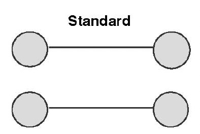
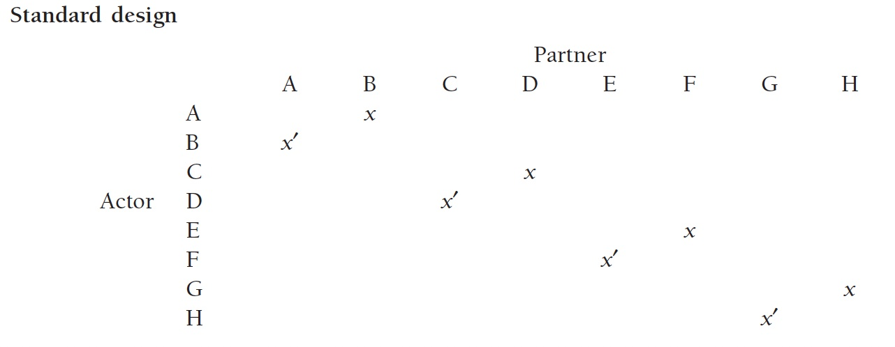
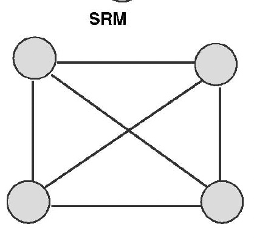
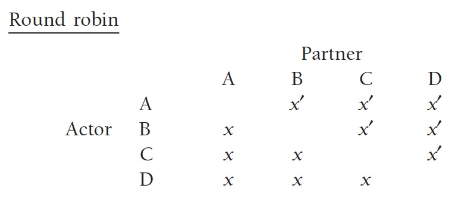
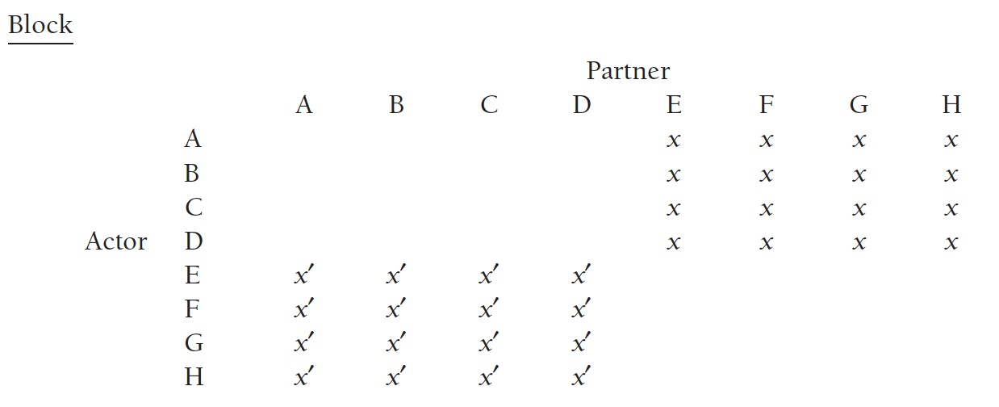
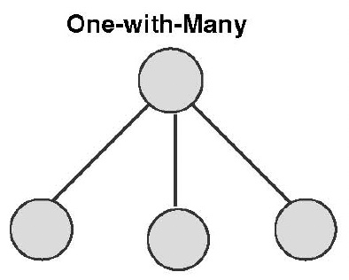
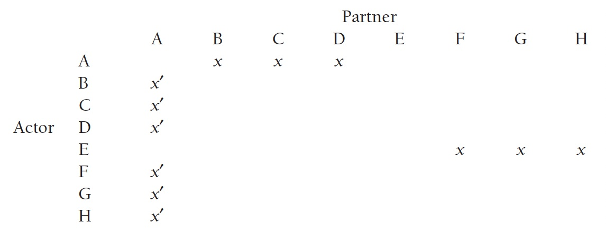
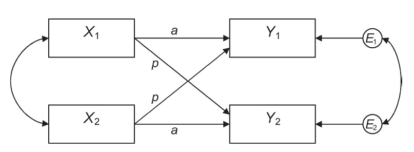
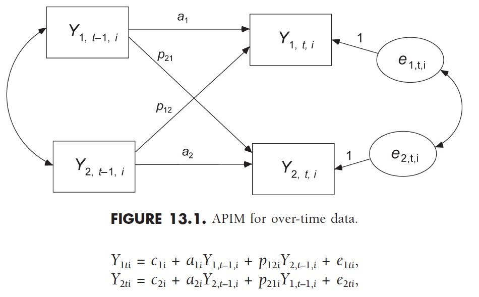

# Dyadic Data Analysis {#chapter-13}

```{r, echo = F}
button <-  "position: relative; 
            top: -25px; 
            left: 85%;   
            color: white;
            font-weight: bold;
            background: #4B9CD3;
            border: 1px #3079ED solid;
            box-shadow: inset 0 1px 0 #80B0FB"
```

```{r, echo=FALSE, results='asis'}
codefolder::bookdown(init = "show", style = button)
```

This chapter introduces the concept of nonlinear change. Notes from this chapter borrows heavily from Kashy and Cook (2006), a comprehensive book on dyadic data analysis.

In this chapter we will cover the following topics:

1. **Introduction**
    - Interpersonal Phenomena
    - Dyadic Measurement
    - Discussion Question
2. **Interdependence**
    - Definition of Interdependence
    - Ignoring Interdependence
    - Linkage Types
    - Sources of Interdependence
    - Discussion Question
3. **Basic Definitions**
    - Distinguishability
    - Variable Types
4. **Dyadic Designs**
    - Standard Dyadic Design
    - Social Relations Model
    - One-with-many Model
    - Discussion Question
5. **Actor Partner Interdependence Model (APIM)**
    - Model
    - Conceptual Interpretations
    - Partner-Oriented Interactions
    - Actor-Partner Interactions
    - Discussion Question
6. **Longitudinal APIM**
    - Model
    - Estimated Parameters
    - Parameter Covariation
    
## Introduction 

### Interpersonal Phenomena

Many of the phenomena studied by health, behavioral and social science researchers are implicitly *interpersonal*. 

However, we rarely evaluate or investigate these phenomena outside of the individual that reported it. 

For example, how an individual *feels* about another individual is a function of **(a)** the characteristics of the reporting individual, and **(b)** characteristics of the relationship between the two individuals. In this case, such a measurement would be inherently *dyadic*. 

### Dyadic Measurement

A **dyadic measurement** is a measurement arising from the potentially differential contributions of two individuals. 

Typically, a dyad refers to people, but may describe anything that consists of two elements or parts.

Below are a few examples of dyadic research paradigms provided by Kenny, Kashy and Cook (2006):

-  Members of a romantic relationship evaluating their relationship 
- Self-disclosures made by two people interacting as a measure of social reciprocity. 
- Two persons are asked to describe a common target to gauge agreement in their perceptions
- Family members describe some aspect of their relationships with eachother

### Discussion question

**1.** Given its clear importance, why has academic social science research tended to focus on the individuals while ignoring many of the interpersonal features common to these phenomena? 

**2.** What is an example from your own research where interpersonal features are commonly ignored.

## Interdependence

One of the core concepts in dyadic data analysis is *interdependence*.

### Definition

In the context of dyads, we consider two members of a dyad to be interdependent (or linked) if the data points collected from the dyad are

- more similar than one might expect from two individuals not in that dyad, or
- more dissimilar than one might expect from two individuals not in that dyad.

### Ignoring Interdependence

Ignoring the interdependence in dyad members’ scores distorts standard significance tests. 

This distortion arises primarily through biases in variances. Their is also a loss in the degrees of freedom due to the potential redundancy of information among dependent pairs. Consider the extreme case of two identical dyad members.

For example, if the correlation between dyad members’ scores is positive, the estimated variance of the observations would be smaller than it should be if all individuals were independent. 

If the correlation were negative, the variances would be larger than they should be.


### Linkage Types

Interdependence, or linked scores, can occur in several ways, including the a few common, potentially overlapping, scenarios:

- **Voluntary linkage**: the dependence that arises through a relationship over time. Typical examples are linkages between friends, between members of dating couples. 
- **Kinship linkage**: the dependence that arises through family relations. Typical examples include family members, siblings, cousins, parents and children. 
- **Experimental linkage**: the dependence that arises from an artificially contrived relationship for the purpose of study. Typically examples include the prompt for two subjects to get to know eachother.
- **Yoked linkgage**: the dependence that arises not from interpersonal interactions, but from two subjects being exposed to the same environmental stimuli. 

### Sources of Interdependence

Furthermore, Kenny (1996) and Kenny, Kashy and Cook (2006) elaborate on four sources that may generate interdependence in dyads.

**1. Compositional Effects**

Compositional effects will often occur in naturally occurring dyads, or anytime dyad members are paired together in a nonrandom way. **These are typically factors that induce similarities among dyad members prior to the forming of the dyad.**

For example, compositional effects are to be expected with friends, even before they meet, as friends are typically similar on a wide range of variables, including
education, age, socioeconomic status, religion, and many other characteristics. *Random pairing of a dyad may alleviate certain types of compositional effects.*

**2. A Partner Effect**

**A partner effect occurs when the behavior (or certain characteristics) of one dyad member affects the behavior (or outcomes) of the partner dyad member.** Typically partner effects occur after the instantiation of the dyad.

For example, the amount of housework that one roommate does may affect the other roommate’s satisfaction level in regard to their living arrangements. This could be considered a partner effect. 

**3. Mutual Influece**

**Mutual influence occurs when both persons’ outcomes directly affect one another.** Typically, mutual influence stipulates a feedback process of some kind. 


For example, suppose a research is interested in measuring how much two experimentally linked dyad members like eachoter. How much one person likes their interaction partner can directly impact how much the other partner likes them in return.  

**4. Common Fate**

**Common fate effects occur when both dyad members are exposed to the same causal factors.** 

For example, if two children are exposed to the same neglect growing up, their parental relationships may be similar due to common experiences during childhood.

### Discussion Question

**1.** In light of potential sources of interdependence in your own research identify examples for two of the four sources of interdependence listed above. Discuss and refine these as a group.

## Basic Definitions

### Distinguishability

An important feature of dyadic data is whether or not the dyad members are distinguishable. Note, this is both a theoretical and empirical question to consider.

Importantly, dyad members are indistinguishable if there is no systematic or meaningful way to order the two scores.

*Distinguishability is a critical distinction in dyadic data analysis because it dictates the analytic techniques one can use.* Perhaps unintuitively, it is considerabely easier to analyze dyadic data when the members are distinguishable. 

Note: It is generally not advised to pick some arbitrary feature to make dyad member distinguishable (e.g. randomly selecting the first individual listed in a data file). This decision introduces a component to the data which is not found in reality and may lead to innacurate conclusions. A variable or feature that distinguishes dyad members should be meaningful to the analyses.

**Distinguishable Dyas**

- parent and child
- patients and careegivers
- pet owner and pet
- older and younger siblings

**Indistinguishable Dyas**

- coworkers
- twins
- friends
- archenemies

#### Discussion Question

**1.** Why is the question of distinguishability both an empirical and theoretical question?

### Variable Types

The nature of the predictor variables included in an analysis plays a critical role in choosing the appropriate modeling approach. Here we outline three important classes of predictor variables on might wish to include in an analysis. 

#### Between-Dyads Variables

**Data from a between-dyads variable differs from dyad to dyad, but does not differ within a dyad.** This means each member of the dyad has the same value for a *between-dyads variable*.

For example, in a study on couple's relationship satisfaction the variable *relationship length* would be a between-dyads variable. 

#### Within-Dyads Variables

In contrast to between-dyads variables, within-dyads variables can differ between two members of a dyad. Importantly, when averaged across the two dyad members, all dyads should have the same average score.

Examples of within-dyad variables are family role in a study on different family members (e.g. father and son). Or the experimental role when one person is asked to persuade another person.

Dyad members are *distinguished* by a within-dyads variable, however, whether or not this is a meaningful distinction is a theoretical question.

#### Mixed Variables

The last type of predictor variables are referred to as *mixed* independent variable. Here, variation exists both within and between dyads. 

Age is an example of mixed predictor variable. In a given study, dyad members may have different ages, and certain dyads may be older than other dyads. 

Most predictors and outcomes in dyadic research are mixed. 


## Dyadic Designs

Before reviewing some common dyadic designs it is important to provide some  definitions for interpreting the diagrams:

- Persons are designated by uppercase letters such as A, B and C.
  - Actor refers to the person who generated the data.
  - Partner refers to the other member of the dyad.
- An *X* in the A-B position refers to a rating from Person A about Person B.
- An *X'* in the B-A position refers to a rating from B about A.
- In a *one-sided* only design, one member of the dyad is measured.
  - Only *X* or *X'* are collected.
- In a *two-sided* or *reciprocal* design both members are measured.
  - Both *X* or *X'* are collected.
  
Here we consider three different dyadic designs: **(1)** the standard dyadic design, **(2)** the social relations model (SRM), and **(3)** the one-with-many design.

### Standard Dyadic Design



In the standard design each individual is a member of only one dyad. Generally the standard design will be reciprocal (i.e. both dyad members are measured).

In the table for the standard design:

- A and B are members of one dyad
- C and D are members of a second dyad, 
- E and F are members of a third dyad, and 
- G and H are the final dyad,

for a total of $n$ dyads over the $2n$ individuals.





### Social Relations Model



In the social relations model (SRM) each individual is paired with multiple individuals, and each of these individuals is also paired with multiple individuals. 

#### Round Robin

The prototypical SRM is a *round robin* design in which a group of persons rate or interact with each other. The round-robin design is inherently a *reciprocal* design, 

In the table for the round robin design:

- A and B are members of one dyad
- A and c are also a dyad, 
- A and D are also a dyad, and 
- similarly for B-A, B-C, and B-D.



#### Block Design

The other major SRM design is called the *block design*. In the block design, individuals are divided into groups and individuals interact with other members of their group. In the table below,

- persons A through D form one subgroup, and
- persons E through H form the other subgroup. 

The block design is reciprocal if both blocks (the $X$ and the $X'$ scores) are gathered. 




### One-with-many Design



In the one-with-many design each individual is paired with multiple individuals, however, unlike the SRM, these individuals are not paired with any other people. 

One-with many designs can be reciprocal or not, but typically these designs are not reciprocal.

In the table for the round robin design:

- B, C, D, F, G and H gave judgments on A, and
- A gave judgments on B, C and D, while
- E gave judgments on G, G, and H.



### Discussion Question:

1. Choose a research design and explain how it might be used to answer a theoretical question in your own research. Discuss and refine. 

## Actor Partner Interdependence Model (APIM)

While some models are appropriate for independent or predictor variables that vary either only between dyads or only within dyads, here we focus on the case of mixed predictor variables. 

Mixed predictor variables can vary both between and within dyads. This means mixed variables can

- vary on average from dyad to dyad, and 
- vary from person to person within a dyad.


The between-dyad variation is characterized by variation in the dyad means, $M_j$, and the within-dyads variation is characterized by variation in the deviations of each individual’s score from their dyad mean, $X_{ij}-M_{j}$.

### Model

As an example, consider the effects of depression on father-son relationships. It may be that a father's depression influences their own relationship satisfaction, while also influencing the relationship satisfaction of their son. These two types of effects can be disentangled as:

- **actor effect**: the effect of a fathers’s depression on their own relationship satisfaction
- **partner effect**: the effect of a fathers’s depression on their son's relationship satisfaction

So, an **actor effect** occurs when one dyad member's score on a *predictor variable* affects that same member's score on thr outcome variable.

A **partner effect** occurs when a dyad member’s score on a predictor variable affects their partner’s score on an outcome variable.

Below is a graphical depiction of the APIM model. 

- Two dyad members measured on two variables, $X$ and $Y$
- $X_{1}$ is the $X$ (predictor) score for dyad member 1
- $X_{2}$ is the $X$ (predictor) score for dyad member 2
- $Y_{1}$ is the $Y$ (outcome) score for dyad member 1
- $Y_{2}$ is the $Y$ (outcome) score for dyad member 2
- $a$ denotes the actor effects
- $p$ denotes the partner effects



Note, there are two correlations visible in this path diagram.

1. the two $X$ variables are allowed to correlate
  - this may be due to compositional effects
2. the equation errors are correlated
  - this represents the covariation in $Y$ not explained by the APIM
  - are there systematic ways $X$ does not account for $Y$ within-dyad?

### Conceptual Interpretations

Following Kenny and Cook (1999), four models are highlighted here as having important implications for relationships research:

- *Actor-oriented*: $a ≠ 0, p = 0$
- *Partner-oriented*: $a = 0, p ≠ 0$
- *Couple-oriented*: $a = p$
- *Social comparison*: $a + p = 0$

#### Actor-Oriented

In the **actor-oriented model**, a person’s outcomes are a function of their own characteristics, and they are unaffected by their partner's characteristics.

If the estimated partner effects are shown to be equal to zero, $p=0$, we might conclude that a process is individualistic.


#### Partner-Oriented

In the **partner-oriented model** we have a situation where a person's outcome is solely affected by their partner's characteristics. If the estimated actor effects are shown to be equal to zero, $a=0$, we might conclude that a process follows a partner-oriented model.

One example discussed by Kenny, Kashy & Cook (2006), for which there could be partner effects, but not actor effects, is the effect of physical attractiveness on relationship satisfaction.


#### Couple-Oriented

In the **couple-oriented model** the actor and partner effects are equal,$a = p$. This means that a given dyad member is affected as much by their own score on $X$ as they are by their partner's score on $X$.

This pattern may occur if the dyad members are as concerned with their own outcomes as they are with their partner's outcome. 

For example, playing one’s best in couple's trivia could lead one to be satisfied with the outcome of the contest. At the same time, knowing one's partner played their best could also lead to satisfaction. On the other hand, if one's partner has a bad game, one’s own satisfaction may be less, independent of how one played. Such dynamics might give rise to a couple-oriented model.


#### Social-Comparison

In the **social comparison model** the actor and partner effects are relatively
equal in their absolute magnitude but have opposite signs. Typically the actor effect is positive, and the partner effect is negative. 

In contrast to the *couple-oriented case*, in which the partner’s success is valued as
much as one’s own outcome, the *social comparison* orientation typically involves dissatisfaction with the partner’s success. 

For example, consider a parent child trivia team. The parent might be couple oriented, feeling satisfaction with both the child and parent playing well. On the other hand, the child may not be couple oriented, feeling less satisfied the better the parent plays.

For the child the actor effect (playing well) would be a positive predictor of game satisfaction while the partner effect (parent playing well) would be a negative predictor. This is one example of how a social-comparison model may arise, $a + p = 0$.


### Partner-Oriented Interactions

Nonzero partner effects $p \neq 0$ indicate an interdependent system. In some cases it can be useful to include interaction terms with the partner effect. 

One common example of a partner-oriented interaction effect arises when researchers want to include a scale, such as a relationship closeness scale, in their model.

By including an interaction term between the scale score and the partner score, it becomes possible to assess whether a given individual 

- *scores near the neutral point of the scale*, and is actor-oriented
- *scores above the neutral scale point*, and is couple-oriented
- *scores below the neutral scale point*, and is guided by social comparison

Details on this procedure can be found in Kenny, Kashy and Cook (1960, p. 50).

### Actor-Partner Interactions

Many of the major research question in dyadic analyses involve actor–partner interactions.

Thus, for dyads, the actor-by-partner interaction term would be the product of $X_{1}$ and $X_2$. 

For example, consider two individuals in a relationship. Suppose being an introvert makes you a better listener, but this effect is stronger the more introverted your partner is. This would be an example of an actor-by-partner interaction.

However, it should be noted there are many ways to conceptualize an interaction. Dyadic researchers often conceive of interactions in novel and interesting ways. For example,

- absolute difference between $X_{1}$ and $X_{2}$
  - an example might include personality differences
- the max or min of the dyad member's scores
  - an example might be compensation effects

Although interaction effects can be specified in many different ways it is often difficult to distinguish between them statistically. Many of these interaction terms are highly correlated with one another. This makes it very important to have a strong theoretical argument for one approach over another.


## Longitudinal APIM

Longitudinal variants of the APIM are some of the most interesting dyadic models. Here we will consider some aspects of the longitudinal APIM.

### Model



In the longitudinal APIM,
- actor effects are the effects from $Y_{1,t–1}$ to $Y_{1,t}$ ($a_{1i}$) and from $Y_{2,t–1}$ to $Y_{2,t}$ ($a_{2i}$),
  - actor effects are interpreted as stability effects
- partner effects are from $Y_{1,t–1}$ to $Y_{2,t}$ ($p_{21i}$) and from $Y_{2,t–1}$ to $Y_{1,t}$ ($p_{12i}$),
  - partner effects represent cross-partner influence, or reciprocity
  
### Estimated Parameters


  Typically in the longitudinal APIM we are interested in estimating the following parameters for each of the $i$ dayds:

- Actor effect for person 1, or $a_{1i}$.
- Actor effect for person 2, or $a_{2i}$.
- Partner effect from person 1 to person 2, or $p_{12i}$.
- Partner effect from person 2 to person 1, or $p_{21i}$.
- Intercept for person 1, or $c_{1i}$.
- Intercept for person 2, or $c_{2i}$.

Each of these parameters may also vary across dyads. 

For example, if $a_{1}$ (the average value of dyad member 1's stability value) varies, then for some 1’s, there is more stability than there is for other 1’s. 

Similarly, there might be variance in the partner effects such that individuals in some dyads may be more responsive or reactive to their partners than are individuals in other dyads. 

### Parameter Covariation

These six terms (two actor, two partner, and two intercepts) may also covary with each other. It is helpful to consider some of these correlations and how we might interpret them.

**Correlation between intercepts**

Suppose we measure stress each day for a parent-child dyad. The correlation between the intercepts would measure the extent to which parents who experience more stress overall have children who also experience more stress overall. Thus the unit for the correlation of intercepts is the person.

**Correlation between errors**

Let' say a parent experiences more stress on a particular day. More stress than one would expect given their prior value and their child’s prior value, A positive correlation between the errors would indicate that is likely the child would also experience heightened stress on that day.


## References