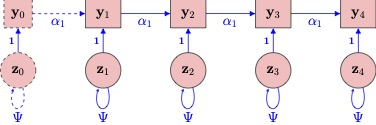
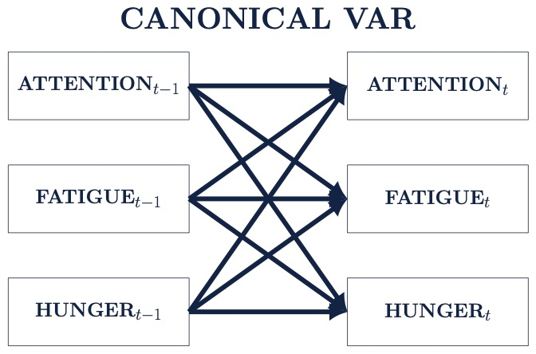

# Vector Autoregressive Models {#chapter-15}

```{r, echo = F}
button <-  "position: relative; 
            top: -25px; 
            left: 85%;   
            color: white;
            font-weight: bold;
            background: #4B9CD3;
            border: 1px #3079ED solid;
            box-shadow: inset 0 1px 0 #80B0FB"
```

```{r, echo=FALSE, results='asis'}
codefolder::bookdown(init = "show", style = button)
```

This chapter covers the basics of vector autoregressive models. We start with a univariate autoregressive model and proceed to a discussion of vector autoregressive processes. 

## Introduction

Due in part to *technological development* the last few decades have witnessed an explosion in the availability of *time-series data*.

**Common Sources of Time Series**: 

- ecological and immunological phenomena
- sensor-based physiological measurements (e.g. heart rate and skin conductance)
- health and movement data (calorie tracking, fitbit, GPS, etc.)
- daily diary and ecological momentary assessment data
- measures of emotional states
- measures of social interdependence (social network data)

#### Theories of Processes

Theories in the social, health and behavioral sciences often describe mechanisms or systems occurring *within* individuals.

A large portion of applied psychological work is focused on the analysis of variation  within individuals, across time.

**Discussion Question**

In relation to your own work, can you come up with a theory that operates entirely at the between-person level? If so what is theory? If not, why is this difficult? 

#### Interesting Directions for Time Series Analysis

**Questions and Opportunities**: 

- Integration of multiple time-scales and individuals
- Complex interactions across levels of analysis
- *Characterizing heterogeneity between and within individuals*

#### Between-Person Heterogeneity

A number of promising methods exist for addressing between-person heterogeneity in time series.  

**Grouping Individuals with Similar Dynamics**

- Mixture modeling of dynamic processes 
- Clustering individuals by common dynamics 

**Multilevel Approaches**

- Multilevel VAR modeling 

**Common and Unique Variation**

- Joint and Individual Variance Explained 
- Group Iterative Multiple Method Estimation 
- multi-VAR and extensions

## The N=1 AR Model

First, let's consider the most simple time-series model. Here we only show 4 timepoints, typically the time series will be considerably longer.





### Random Shocks

First, let's consider the random shock $z_t, t=1,\dots,T$.

These random shocks have a number of interesting properties.

- Random shocks are latent variables.
- Random shocks are identically distributed with variance $\psi$, e.g., $z_t \sim \mathcal{N}(0,\psi)$.
- A shock at any time point influences the process variable at two or more time points.
- Intuitively, shocks represent all the unmodeled influences that effect the process variable. 
- Shock are the dynamic part of the time series model. 
- Random shocks perturb the system and change its course over time. 
- Although errors, random shocks differ from measurement  errors in meaningful ways.
  - Random shocks differ from other errors in that they influence the process variable at more than 1 time point. 

### Autoregressive Parameter

Next, let's consider the autorgressive coefficient $\alpha_1$. In an AR(1) model, where only one lag is considered, the AR coefficients are generally the parameter of interest.

**The interest in an individual’s autoregressive parameter stems from the fact that this parameter indexes the time it takes an individual to recover from a random shock and
return to equilibrium.**

- An AR close to zero implies that there is little carryover from one measurement occasion to the next and recovery is thus instant.
- An AR parameter close to one implies that there is considerable carryover
between consecutive measurement occasions, such that perturbations continue to have an effect on subsequent occasions.
- AR parameters can be interpreted as a measure of inertia, stability or regulatory weakness.

**Positive and Negative AR Parameters**

- A positive AR parameter could be expected for many psychological processes, such as that of mood, attitudes symptoms. 
- A negative alpha indicates that if an individual has a high score at one occasion, the score at the next occasion  is likely to be low, and vice versa. 

### AR(1) Model Example

Consider a simple AR(1) model,


$$
y_{t} = \alpha_{1}y_{t-1} + z_{t}\nonumber 
$$
which matches the path diagram:


Looking at the path diagram above, suppose

- $y_{t}$ are hourly measurements of concentration.
- $z_t$ Unobserved events impacting concentration.

Here we might imagine that during one of these intervals the subject gets some bad news. This might result in a decreased concentration levels at that measurement occasion, and this effect effect may then linger for the next few measurement occasions (as a result of an AR effect). The larger the AR coefficient, the longer it will take for the student to return to their baseline concentration level. 


**Discussion Question:**

Choose a single variable (or construct) from your own research. 

1) How would you measure this variable across time (e.g. self-report via mobile phone)?
2) How often would you measure the variable to capture important fluctuations?
3) If you fit a simple AR(1) model to the repeated measures how might you interpret the autoregressive effect? 


### Fitting an AR(1) Model in R

Consider some example data from the Many Analysts project: https://osf.io/h3djy/

The experience sampling methodology (ESM) has been positioned as a promising opportunity for personalized medicine in psychiatry. A requisite for moving ESM towards clinical practice is that outcomes of person-centered analyses are not contingent on the researcher. In this study, we crowdsourced the analysis of one individual patient’s ESM data to 12 prominent research teams to investigate how much researchers vary in their analytical approach towards individual time series data and to what degree outcomes vary based on analytical choices.


This is a description of the project taken from https://osf.io/wfzr7/:

**Research question**: 

What symptom(s) would you advise the treating clinician to target subsequent treatment on, based on a person-centered analysis of this particular patient’s EMA data? To answer this research question, please analyze the dataset in whatever manner your research team sees as best. 

**The Dataset**:

The data used in this project stem from the research lab of Aaron Fisher (UC Berkeley).

From this dataset one subject was chosen for the current project. The data were saved as a csv file (comma delimited). Selection of the dataset was based on the following criteria: the subject has a primary diagnosis of major depressive disorder (MDD), the dataset includes more than 100 time points, and the dataset has some missingness.

The subject (ID 3) was a white 25-year old male with a primary diagnosis of MDD and a comorbid generalized anxiety disorder (GAD). His Hamilton Rating Scale for Depression score was 16 and his Hamilton Rating Scale for Anxiety score was 15. 

In the experiment by Fisher, subjects were asked to fill out a survey on their mobile phones 4 times a day for 30 days. Surveys were conducted at a random time within each of four 3-hourblocks, with the additional constraint that surveys should be given at least 30 minutes apart. At each sampling occasion, subjects were prompted to think about the period of time since the last survey. Items were scored on a visual analogue slider ranging from 0 to 100 with the endpoints “not at all” and “as much as possible”. 

**Variables in Dataset**

- energetic (felt energetic)
- enthusiastic (felt enthusiastic)
- content (felt content)
- irritable (felt irritable)
- restless (felt restless)
- worried (felt worried)
- guilty (felt worthless or guilty)
- afraid (felt frightened or afraid)
- anhedonia (felt a loss of interest or pleasure)
- angry (felt angry)
- hopeless (felt hopeless)
- down (felt down or depressed)
- positive (felt positive)
- fatigue (felt fatigued)
- tension (experienced muscle tension)
- concentrate (experienced difficulty concentrating)
- accepted (felt accepted or supported)
- threatened (felt threatened, judged, or intimidated)
- ruminate (dwelled on the past)
- avoid_act (avoided activities)
- reassure (sought reassurance)
- procrast (procrastinated)
- hours (how many hours did you sleep last night?)
- difficult (experienced difficulty falling or staying asleep)
- unsatisfy (experienced restless or unsatisfying sleep)
- avoid_people (avoided people)

Let's read in the data:

```{r}
require("httr")
url <- 'https://osf.io/tcnpd//?action=download'
filename <- 'osf_dataframe.csv'
GET(url, write_disk(filename, overwrite = TRUE))
data <- read.csv(filename, header=TRUE, na.strings="NA")
head(data)
```

Now, let's use the `concentrate` variable.

```{r}
df <- data[,"concentrate", drop = FALSE]
```

The first step in an autoregressive analysis typically involves lagging the data. We can do this for a single-la as follows:

```{r}
first           <- df[1:(nrow(df)-1), ]
second          <- df[2:(nrow(df)  ), ]
lagged_df       <- data.frame(first, second)
colnames(lagged_df) <- c(paste0(colnames(df), "lag"), colnames(df))
head(lagged_df)
```

Now, with our data lagged we can fit an AR model using OLS as follows:

```{r}
summary(lm(concentrate~concentratelag,data=lagged_df))
```


## The N=1 VAR Model

Consider extending our AR(1) model to include hours measurements of concentration ($y_{1}$) and fatigue ($y_{1}$). We now have a VAR(1) model where we are interested in two constructs, and their relation to eachother, across time.


Our interpretation of the AR parameter remains the same except now we also have cross-regressive parameters to consider (e.g. $\alpha_{12}$ and $\alpha_{21}$).

**Interpretation of Directed Paths**

- Auto-regressive paths (e.g. $Attention_{t-1}$ -> $Attention_{t}$ or $\alpha_{11}$)
  -  AR parameters can be interpreted as a measure of inertia, stability or regulatory weakness.
- Cross-regressive paths (e.g. $Attention_{t-1}$ -> $Fatigue_{t}$or $\alpha_{21}$)
  -  cross-regressive paths indicate cross-construct influence, or buffering
  
  
**The Vector Autoregressive (VAR) Model**

In Economics widespread adoption of VAR models in the mid-1980s marked the beginning of a sea change in modeling and forecasting practice (Allen et al., 2006).

**Advantages of the Unrestricted VAR Model**

- Offers a concise interpretation of inter-variable relations
- Visualized easily using path or network connection diagrams
- Allow for the inclusion of many potentially relevant variables


Finally, we can extend the VAR model to handle additional variables we might think are related to our process of interest.




### Fitting an VAR(1) Model in R

Now, let's use the `concentrate` and `fatigue` variables.

```{r}
df <- data[,c("concentrate","fatigue"), drop = FALSE]
```


Many software routines won't require us to lag our data before prior to the analysis because this is done within the program itself. However, the process to lag our data for a multiple variable VAR model follows directly from the AR code. 

```{r}
first           <- df[1:(nrow(df)-1), ]
second          <- df[2:(nrow(df)  ), ]
lagged_df       <- data.frame(first, second)
colnames(lagged_df) <- c(paste0(colnames(df), "lag"), colnames(df))
head(lagged_df)
```

Now, we can use the `vars` package to fit a VAR(1) model for this single individual.

```{r}
fit <- vars::VAR(df[complete.cases(df),], p = 1, type = "const") # p is the lag
coef(fit)

transition_mat <- as.matrix(do.call("rbind",lapply(seq_along(colnames(df)), function(x) {
  fit$varresult[[x]]$coefficients
})))
rownames(transition_mat) <- colnames(df)
transition_mat
```

### A Note on path Diagrams

Both examples below represent bivariate VAR(1) models. It is important to be comfortable with both representations as they are each commonly presented in the literature.


## Introducing the Multi-level VAR

We are often in the situation where we collect intensive longitudinal data on multiple individuals. 

Fitting VAR(1) models for every individual in the sample is certainly an option. 

However, this can create a large amount of information to summarize and may lead to the recovery of spurious relations depending on how many observations are available for each subject.

One option to consider in this scenario is the **multi-level VAR model**.

In the multi-level VAR we have the option for each parameter to follow a distribution across individuals. Typically, parameters are expected to follow normal distribution.


**Distribution of Parameters**


**Example Individuals**


## Reference