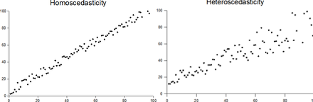
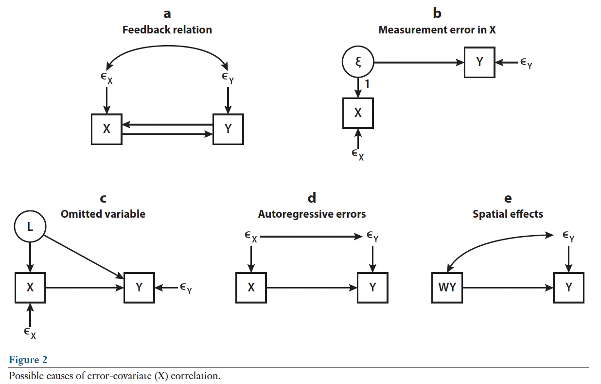
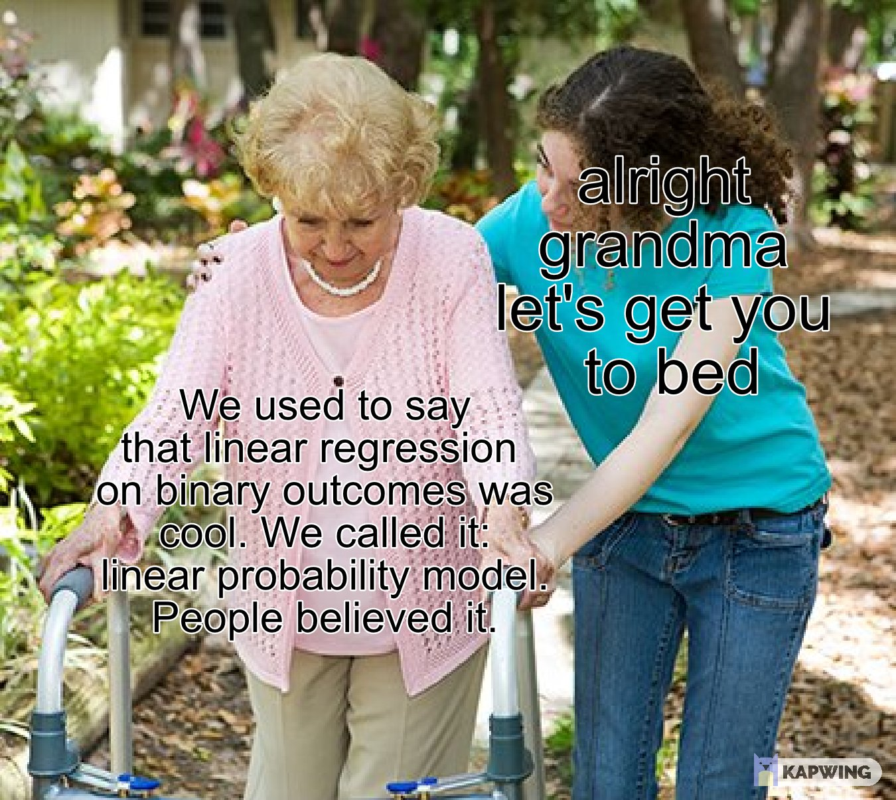
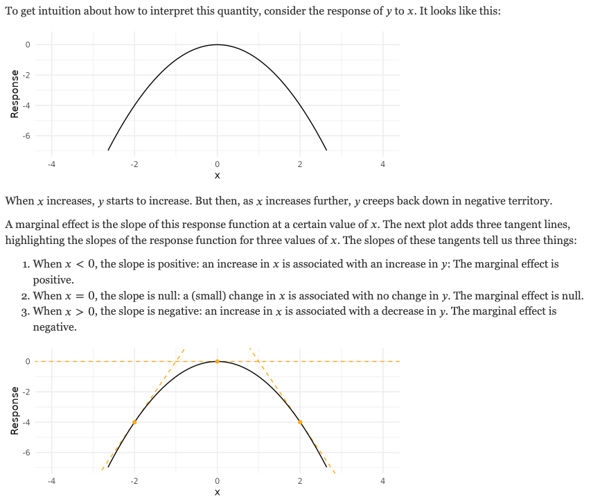
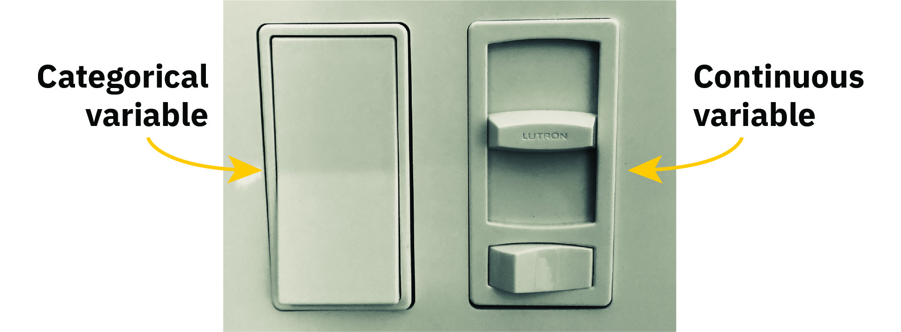

--- 
title: "HDFS 523: Strategies for Data Analysis in Developmental Research"
author: "Zachary F. Fisher"
date: "`r Sys.Date()`"
site: bookdown::bookdown_site
documentclass: book
bibliography: [book.bib, packages.bib]
description: |
  Course notes for HDFS 523
link-citations: yes
github-repo: zackfisher/HDFS523
cover-image: images/image1.png
favicon: null
always_allow_html: true
---

# About This Book

```{r, echo = F}
button_css <-  "position: relative; 
                top: -25px; 
                left: 85%;   
                color: white;
                font-weight: bold;
                background: #4B9CD3;
                border: 1px #3079ED solid;
                box-shadow: inset 0 1px 0 #80B0FB"
```


This book provides the course notes for HDFS 523. It is currently under development, so any feedback is appreciated (e.g., during class,  via email, or the edit link in the header). This first chapter is just about how to use the book -- the course content starts in Chapter \@ref(chapter-2).   

## Why this book? 

There are a few goals of moving from "textbook + slides + exercises" to an ebook. For now, the main goal is to update and integrate code contents from the course into one consistent format, rather than having multiple files to sort through on Canvas.


## Code Folding

```{r codefolder, echo=FALSE, results='asis'}
codefolder::bookdown(init = "hide", 
                     style = button_css)
```


The book combines lecture slides and R coding examples. It is often convenient to hide code when introducing new material. This is accomplished using code folding. An example of code folding is given on this page. Below, a histogram integrated into the text. By clicking on the button called "Show Code" on the top of the page, the R code that produced the histogram will also be visible. Notice that you may need to scroll horizontally to see all of the text in the code window. Also notice that when you hover your mouse over the code window, an icon appears in the top right corner -- this lets you copy the block of code with one click. 


```{r}
# Here is some R code. You don't have to look at it when reading the book, but it is here when you need it
x <- rnorm(200)
hist(x, col = "#4B9CD3")
```


## Acknowledgements

Many people have contributed to the course materials for HDFS 523. Most importantly, many of the original R markdown files for the course were developed by Nilam Ram and Zita Oravecz.

<!--chapter:end:index.Rmd-->

# Data Cleaning {#chapter-2}

```{r, echo = F}
button <-  "position: relative; 
            top: -25px; 
            left: 85%;   
            color: white;
            font-weight: bold;
            background: #4B9CD3;
            border: 1px #3079ED solid;
            box-shadow: inset 0 1px 0 #80B0FB"
```

```{r, echo=FALSE, results='asis'}
codefolder::bookdown(init = "show", style = button)
```

In Chapter 2 we will work through some basic data cleaning operations useful in longitudinal data analysis. The basic idea is provide a set of scripts to use for exploring new repeated measures data sets.

## Example Data 

For Chapter 2 we will make use of the longitudinal Wechsler Intelligence Scale for Children [WISC; Wechsler, -@wechsler1949] dataset described by @osborne1972. These data have been detailed extensively in a number of papers [@mcardle1987; @mcardle1988; @mcardle1990; @mcardle1994] and are used here with with permission. 

The WISC data contains repeated measures data from 204 children between the ages of 6 and 11 years old (during grades 6, 7, 9 and 11). Thee repeated measures include component scores for the verbal tests and performance subtests at all four occasions, along with verbal subtest scores for the information, comprehension, similarities, and vocabulary domains at the first and last measurement occasion. The demographics variables mother’s education (continuous in years) and mother graduated high school (dichotomous) are also included.

## Reading in Repeated Measures Data

We can read in the WISC data directly from the [QuantDev](https://quantdev.ssri.psu.edu/) website.

```{r}
filepath <- "https://quantdev.ssri.psu.edu/sites/qdev/files/wisc3raw.csv"
wisc3raw <- read.csv(file=url(filepath), header=TRUE)
```

Additional details on importing different data types into R can be found here: http://www.statmethods.net/input/importingdata.html.

## Familiarize Yourself with the Data

Let's take an initial look at the structure of our data object using `str()`

```{r}
str(wisc3raw)
```

From the output, we can also see that the data frame consists of 204 observations (rows) and 20 variables (columns). Each variable’s name and data type is also listed. Methods like the ones above can be an effective way to initially familiarize yourself with the main features of a dataset. 


## Look for Duplicated IDs

It is always worth looking for non-unique ID numbers when  ID labels are included in a dataset. Here we have an `id` variable indicating the subject number. Since our data is in a long format (more on that later) duplicate IDs may indicate a potential problem with the data source or clues on how the data is structured. 

```{r}
any(duplicated(wisc3raw$id))
```

## Using `table()` to Spot Irregularities

When a variable takes on a limited range of values it is often useful to screen for irregularities or invalid values. This is common across all variable types and can occur for character strings, numeric, integer and factor types. For example, we would expect the `grad` variable to only take the values of zero or one. We can use the `table()` function to quickly confirm this. 

By default `table()` simply omits any values coded as `NA`. To include a count of the `NA` values use the `useNA` argument of `table()` as follows:

```{r}
table(wisc3raw$grad, useNA = "always")
```

## Missing Data 

Dealing with missing data in a consistent manner is one of the most important aspects of data cleaning. When data are imported into R it is common to discover missing values are coded according to a variety of conventions. 

Often a first step in handling missing data involves recoding missing values as `NA`. Writing bespoke code to handle the different types of missing data one might encounter is tedious and unnecessary. 

`naniar` [@naniar] is a useful package with many convenience functions for managing missing data in R. Here we demonstrate some of this functionality.

### Generating Example Data

Since the WISC data does not contain missing values it is helpful to generate a synthetic dataset containing some commonly encountered missing data codes. 

```{r}
set.seed(123)
wisc_miss <- wisc3raw
wisc_miss$verb1[sample(nrow(wisc_miss),100)] <- -99
wisc_miss$comp1[sample(nrow(wisc_miss),75)] <- "N/A"
wisc_miss$info1[sample(nrow(wisc_miss),50)] <- "NA"
```


### Recoding Values with `NA`

Now that we have a dataset with missing values we can use `naniar` to recode these values to `NA`.


```{r}
na_strings <- c("NA", "N/A", -99)
  
wisc_miss <- naniar::replace_with_na_all(
  wisc_miss, condition = ~.x %in% na_strings
)
```

See the [`naniar` vignette on recoding NA values](https://cran.r-project.org/web/packages/naniar/vignettes/replace-with-na.html) for more detailed information on the package functionality.

### Missing Data Visualization

Once we have recoded our data in a consistent manner we can use visualizations to explore the missing data. The `vis_miss()` function from `naniar` is a good starting point for visualizing the amount of missing data in our dataset. The plots shows the missing values in black and non-missing values in gray. In addition, percentages of missing data in both the dataset and individual variables are provided.

```{r}
naniar::vis_miss(wisc_miss)
```

It is often useful to look at combinations of missingness among different variables.

```{r}
naniar::gg_miss_upset(wisc_miss)
```

We can also look at the percentage of missing data across a factor variable. 

```{r}
naniar::gg_miss_fct(x = wisc_miss, fct = grad)
```

Many missing data visualizations are described in the [`naniar` vignette on missing data visualization](https://cran.r-project.org/web/packages/naniar/vignettes/naniar-visualisation.html) including plots for exploring missing data mechanisms. 

## Exporting Data

Depending on work-flow, you may need to export your dataset for use in another statistical software program. The `write.csv()` function is a convenient method for outputting comma delimited files.

```{r}
write.csv(wisc3raw, file = "wisc3raw.csv", row.names = FALSE, na = "-99")
```

Note that by default the `write.csv()` function will include an extra column of row numbers and will notate missing data with an `NA`.  More information on exporting data is available at http://www.statmethods.net/input/exportingdata.html.


## Reshaping Repeated Measures Data 

Behavioral science tends to use relational data structures - in basic form, spreadsheets. Typically, the data are stored  in a data frame (a "fancy" matrix) with multiple rows and columns. Two common schemata used to accommodate repeated measures data are *wide format* and *long format*. Different analysis and plotting functions require different kinds of data input. Thus, it is imperative that one can convert the data back and forth between wide and long formats. 

There are lots of ways to do this. We illustrate one way.

*Sidebar*: The `dput()` function provides a convenient method to get the variable names (or any R object) into a format that can be read back into R. For example, this can be helpful when working with a long vector of strings.

```{r}
dput(colnames(wisc3raw))
```

First, let's subset our data to only include the variables we need for this analysis.

```{r}
var_names_sub <- c(
  "id", "verb1", "verb2", "verb4", "verb6",
  "perfo1", "perfo2", "perfo4", "perfo6",
  "momed", "grad"
)

wiscraw <- wisc3raw[,var_names_sub]
head(wiscraw)
```


### Reshape Wide to Long

One way to go *from wide to long* is using the `reshape()` function from base R. 

Notice, the `varying` argument contains the repeated measures columns we want to stack and the `timevar` is a new variable containing the grade level information previosuly appended at the end of the colnames listed in `varying`.

```{r}
# reshape data from wide to long
wisclong <- reshape(
  data = wiscraw,
  varying = c("verb1", "verb2", "verb4","verb6", "perfo1","perfo2","perfo4","perfo6"),
  timevar = c("grade"), 
  idvar = c("id"),
  direction = "long", 
  sep = ""
)

# reorder by id and day 
wisclong <- wisclong[ order(wisclong$id, wisclong$grade), ]

head(wisclong, 8)
```  

Again, notice how `reshape` automatically split verb1, verb2, etc. into a string name and a grade variable. 

### Reshape Long to Wide

Now we go *from long to wide*, again using the `reshape()` function. The `v.names` argument specifies the variables to be expanded column wise based on the repeated measure specified in `timevar`.

```{r}
#reshaping long to wide
wiscwide <- reshape(
  data = wisclong, 
  timevar = c("grade"), 
  idvar = c("id"),
  v.names = c("verb","perfo"),
  direction = "wide", 
  sep = ""
)

# reordering columns 
wiscwide <- wiscwide[, c(
  "id", "verb1", "verb2", "verb4", "verb6",
  "perfo1", "perfo2", "perfo4", "perfo6",
  "momed","grad" 
)]

head(wiscwide)
```                    

Using functions included in base R can be useful in a number of situations. One example is package development where one may wants to limit dependencies. 

That said, many people find `reshape` to be unnecessarily complicated. A similar, and potentially more convenient, set of functions have been developed for reshaping data in the `tidyr` [@tidyr] package. For those interested take a look at the `pivot_longer()` and `pivot_wider()` functions. 

For examples using `tidyr` to reshape data see the [tidyr vignette on pivoting](https://cran.r-project.org/web/packages/tidyr/vignettes/pivot.html).

<!--chapter:end:02_basic_data_cleaning.Rmd-->

# Describing Longitudinal Data {#chapter-3}

```{r, echo = F}
button <-  "position: relative; 
            top: -25px; 
            left: 85%;   
            color: white;
            font-weight: bold;
            background: #4B9CD3;
            border: 1px #3079ED solid;
            box-shadow: inset 0 1px 0 #80B0FB"
```

```{r, echo=FALSE, results='asis'}
codefolder::bookdown(init = "show", style = button)
```

In Chapter 3 we will look at some option for describing and visualizing longitudinal data. 

## Example Data

Again we will make use of the WISC data described in Chapter 2. The following commands recreate the wide and long data we will use throughout this chapter.

```{r}
filepath <- "https://quantdev.ssri.psu.edu/sites/qdev/files/wisc3raw.csv"

wisc3raw <- read.csv(file=url(filepath),header=TRUE)

var_names_sub <- c(
  "id", "verb1", "verb2", "verb4", "verb6",
  "perfo1", "perfo2", "perfo4", "perfo6",
  "momed", "grad"
)

wiscraw <- wisc3raw[,var_names_sub]

# reshaping wide to long
wisclong <- reshape(
  data = wiscraw,
  varying = c("verb1", "verb2", "verb4","verb6", "perfo1","perfo2","perfo4","perfo6"),
  timevar = c("grade"), 
  idvar = c("id"),
  direction = "long", 
  sep = ""
)

# reorder by id and day 
wisclong <- wisclong[ order(wisclong$id, wisclong$grade), ]

#reshaping long to wide
wiscwide <- reshape(
  data = wisclong, 
  timevar = c("grade"), 
  idvar = c("id"),
  v.names = c("verb","perfo"),
  direction = "wide", 
  sep = ""
)

# reordering columns 
wiscwide <- wiscwide[, c(
  "id", "verb1", "verb2", "verb4", "verb6",
  "perfo1", "perfo2", "perfo4", "perfo6",
  "momed","grad" 
)]
```

## Describing Means and Variances

Once the wide and long data sets are in place, we can begin describing and plotting the data. Descriptive statistics and visualization are one of the most important aspects of data analysis. 

Descriptives and plots will be produced from wide data and long data to show the information that can be gleaned from each construction. Having both in place facilitates learning about the data. Continually keep in mind what portions of the data-box are being described (e.g., persons, variables, occasions). 

We can do a quick look at descriptives using the `describe()` function from the `psych` [@psych] package. Note the `n` in both outputs.

```{r}
psych::describe(wiscwide)
```

```{r}
psych::describe(wisclong)
```

### Verbal Ability (All Persons and Occasions)

Let's focus on the repeated measures of verbal ability. This step is useful to get a general view of what verbal ability scores look like across persons and occasions, but note that we are *ignoring Time*. In doing so we are not considering how the repeated measures are nested within individuals.

```{r}
psych::describe(wisclong$verb)
```


In addition to the descriptive statistics we can look at a boxplot of verbal ability scores across persons and occasions. Here we will start to use the `ggplot2` [@ggplot2] package.

```{r}
library("ggplot2")
ggplot(data = wisclong, aes(x=verb, y=..density..)) +
  geom_histogram(binwidth=2.5, fill = "white", color = "black") + 
  geom_density(color = "red") +
  ggtitle("Verbal Ability Score (across persons and occasions)") +
  xlab("Verbal Ability (Grade 1 to 6)") +
  ylab("Density") +
  theme_bw() +
  theme(
    panel.grid.major = element_blank(),
    panel.grid.minor = element_blank()
  )
```

### Verbal Ability (Across Time)

Note that our variable is actually "multivariate" because we have repeated measures. We should really consider the time-dependence when we are looking at descriptive statistics and plots. 

Let's now look at **verbal ability scores across time collapsed across individuals**. This can be done using either the `describe()` function and the wide data or the `describeBy()` function and the long data. 

Let's look at descriptives using the wide data.

```{r}
psych::describe(wiscwide[,c("verb1","verb2","verb4","verb6")])
```

Identical results can be obtained using the long data.

```{r}
psych::describeBy(wisclong[,c("verb")], group = wisclong$grade)
```

We can visualize the distribution of verbal scores across grades in a number of different ways. Here we have a histogram.

```{r}
ggplot(data=wisclong, aes(x=verb)) +
  geom_histogram(binwidth=5, pad = TRUE, fill="white", color="black") + 
  facet_grid(grade ~ .) + 
  ggtitle("Verbal Ability Score (across grades 1, 2, 4, 6)") +
  xlab("Verbal Ability Score") +
  ylab("Density") +
  theme_bw() +
  theme(
    panel.grid.major = element_blank(),
    panel.grid.minor = element_blank(),
    strip.background = element_blank()
  )
```

We can also create notched boxplots of the within-grade distributions (across individuals). 

From [Wikipedia](https://en.wikipedia.org/wiki/Box_plot): *Notched box plots apply a notch or narrowing of the box around the median. Notches are useful in offering a rough guide of the significance of the difference of medians; if the notches of two boxes do not overlap, this can provide evidence of a statistically significant difference between the medians.*

Adding the mean value to the plot gives us additonal information about central tendency and skew of the distribution.

```{r}
#boxplot by grade
ggplot(data=wisclong, aes(x=factor(grade), y=verb)) + 
  geom_boxplot(notch = TRUE) +
  stat_summary(fun="mean", geom="point", shape=23, size=3, fill="white") +
  ggtitle("Verbal Ability Score (across grades 1, 2, 4, 6)") +
  ylab("Verbal Ability Score") +
  xlab("Grade") +
  theme_bw() +
  theme(
    panel.grid.major = element_blank(),
    panel.grid.minor = element_blank(),
    strip.background = element_blank()
  )
```

Finally, we can view overlapping densities of the within-grade distributions of verbal ability scores.

```{r}
ggplot(data=wisclong, aes(x=verb)) + 
  geom_density(aes(group=factor(grade), colour=factor(grade), fill=factor(grade)), alpha=0.3) +
  guides(colour="none",  fill=guide_legend(title="Grade")) +
  ggtitle("Verbal Ability Score (across grades 1, 2, 4, 6)") +
  ylab("Density") +
  xlab("Verbal Ability Score") +
  theme_bw() +
  theme(
    panel.grid.major = element_blank(),
    panel.grid.minor = element_blank(),
    strip.background = element_blank()
  )
```

Notice in these plots how much "change" there is at the sample level across grades. Is that expected? 

## Describing Covariances

In the previous section we looked at the means and variances. Because these are repeated measures, we can also look at covariances and correlations over time. A simple covariance and correlation matrix of the verbal scores across grades can be produced using the `cov()` and `cor()` function.

```{r}
cov(wiscwide[,c("verb1","verb2","verb4","verb6")], use="complete.obs")
cor(wiscwide[,c("verb1","verb2","verb4","verb6")], use="complete.obs")
```

A plot corresponding to the correlation matrix can be obtained in a number of different ways. First, using the `pairs()` function from base R.

```{r}
pairs(wiscwide[,c("verb1","verb2","verb4","verb6")])
```

There is also a `pairs.panel()` function in the `psych` package. Here we see a LOESS smoothed fit line in red.

```{r}
psych::pairs.panels(wiscwide[,c("verb1","verb2","verb4","verb6")])
```

Finally, the`scatterplotMatrix()` from the `car` [@car] package can be used to create scatterplot matrices with confidence bands around the line of best fit.

```{r}
car::scatterplotMatrix(~ verb1 + verb2 + verb4 + verb6, data=wiscwide)
```

Each of these functions can be customized with additional features. Those interested in specifics should consult the help documentation for each function (e.g. `?car::scatterplotMatrix`). It is also worth noting the default behavior of these functions is to provide automatic, data-based ranges for each pair of variables separately.

## Individual-Level Descriptives

Note that our interest is often in *individual* development, rather than sample development. We need to consider how each individual is changing over time. Thus, we are interested in verbal ability across Time for each individual person. Visualization is typically our best tool for synthesizing the large amounts of information in individual-level data.

```{r}
ggplot(data = wisclong, aes(x = grade, y = verb, group = id)) +
  geom_point() + 
  geom_line() +
  scale_x_continuous(breaks=seq(1,6,by=1)) +
  ylim(0,80) +
  ggtitle("Verbal Ability Score (across grades 1, 2, 4, 6)") +
  xlab("Grade") +
  ylab("Verbal Ability Score") +
  theme_bw() +
  theme(
    panel.grid.major = element_blank(),
    panel.grid.minor = element_blank(),
    strip.background = element_blank()
  )
```

Sometimes the "blob" gets too dense. This can be fixed by selecting a subset of persons to visualize.

```{r}
ggplot(subset(wisclong, id < 30), aes(x = grade, y = verb, group = id)) +
  geom_point() + 
  geom_line() +
  scale_x_continuous(breaks=seq(1,6,by=1)) +
  ylim(0,80) +
  ggtitle("Verbal Ability Score (across grades 1, 2, 4, 6)") +
  xlab("Grade") +
  ylab("Verbal Ability Score") +
  theme_bw() +
  theme(
    panel.grid.major = element_blank(),
    panel.grid.minor = element_blank(),
    strip.background = element_blank()
  )
```
       
We can add some color to our plot using the `color` argument and treating `id` as a factor.

```{r}
ggplot(subset(wisclong, id < 30), aes(x = grade, y = verb, group = id, color = factor(id))) +
  geom_point() + 
  geom_line() +
  scale_x_continuous(breaks=seq(1,6,by=1)) +
  ylim(0,80) +
  ggtitle("Verbal Ability Score (across grades 1, 2, 4, 6)") +
  xlab("Grade") +
  ylab("Verbal Ability Score") +
  theme_bw() +
  theme(
    panel.grid.major = element_blank(),
    panel.grid.minor = element_blank(),
    strip.background = element_blank(),
    legend.position = "none"
  )
```

We can also get a gradient of colors by treating`id` as continuous.

```{r}
ggplot(subset(wisclong, id < 30), aes(x = grade, y = verb, group = id, color = id)) +
  geom_point() + 
  geom_line() +
  scale_x_continuous(breaks=seq(1,6,by=1)) +
  ylim(0,80) +
  ggtitle("Verbal Ability Score (across grades 1, 2, 4, 6)") +
  xlab("Grade") +
  ylab("Verbal Ability Score") +
  theme_bw() +
  theme(
    panel.grid.major = element_blank(),
    panel.grid.minor = element_blank(),
    strip.background = element_blank(),
    legend.position = "none"
  )
```

It is also sometimes useful to look at the collection of individual-level plots. 

```{r}
ggplot(subset(wisclong, id <= 20), aes(x = grade, y = verb)) +
  geom_point() + 
  geom_line() +
  scale_x_continuous(breaks=seq(1,6,by=1)) +
  ylim(0,80) +
  ggtitle("Verbal Ability Score (across grades 1, 2, 4, 6)") +
  xlab("Grade") +
  ylab("Verbal Ability Score") +
  theme_bw() +
  facet_wrap( ~ id) +
  theme(
    panel.grid.major = element_blank(),
    panel.grid.minor = element_blank(),
    strip.background = element_blank(),
    legend.position = "none"
  )
```

Some other aesthetics to get to the formal APA style.

```{r}
#ggplot version .. see also http://ggplot.yhathq.com/docs/index.html
ggplot(subset(wisclong, id <= 20), aes(x = grade, y = verb, group = id)) +
  geom_point() + 
  geom_line() +
  xlab("Grade") + 
  ylab("WISC Verbal Score") + 
  ylim(0,100) +
  scale_x_continuous(breaks=seq(1,6,by=1)) +
  ggtitle("Intraindividual Change in Verbal Ability") +
  theme_classic() + 
  #increase font size of axis and point labels
  theme(axis.title = element_text(size = rel(1.5)),
        axis.text = element_text(size = rel(1.2)),
        legend.position = "none")
```

Saving the plot file. See also [outputting plots to a file](http://www.cookbook-r.com/Graphs/Output_to_a_file/).

```{r, evaluate=FALSE}
ggsave(filename = "wiscverbal.png", width = 5, height = 5, dpi=300)
```

Now we have a good set of strategies to apply when looking at new longitudinal data.  

## References

<!--chapter:end:03_describing_longitudinal_data.Rmd-->

# Matrix Algebra {#chapter-4}

```{r, echo = F}
button <-  "position: relative; 
            top: -25px; 
            left: 85%;   
            color: white;
            font-weight: bold;
            background: #4B9CD3;
            border: 1px #3079ED solid;
            box-shadow: inset 0 1px 0 #80B0FB"
```

```{r, echo=FALSE, results='asis'}
codefolder::bookdown(init = "show", style = button)
```

In Chapter 4 we will briefly review some basic algebra results useful for this course. Those needing a reliable reference for basic results in matrix algebra should consult the *The Matrix Cookbook* at https://www.math.uwaterloo.ca/~hwolkowi/matrixcookbook.pdf.

## Types of matrices

Remember that matrices are defined by rows (the first dimension) and columns (the second dimension):

$$
\underset{m \times n}{\mathbf{A}} = \begin{bmatrix}
   a_{11} & a_{12} & a_{13} \\
   a_{21} & a_{22} & a_{23} \\
   a_{31} & a_{32} & a_{33} \\
   a_{41} & a_{42} & a_{43}
 \end{bmatrix}
$$

You can refer to a specific element in matrix using a subscript of the row and column index (e.g. $a_{31}$). For our purposes there are a few *special* matrices worth mentioning, 

### Square

A square matrix has the same number of rows and columns. Covariance and correlation matrices are square.

$$
\underset{n \times n}{\mathbf{A}} = \begin{bmatrix}
   a_{11} & a_{12} & a_{13} & a_{14} \\
   a_{21} & a_{22} & a_{23} & a_{24} \\
   a_{31} & a_{32} & a_{33} & a_{34} \\
   a_{41} & a_{42} & a_{43} & a_{44}
 \end{bmatrix}
$$


### Symmetric

A symmetric matrix is a square matrix that equals its transpose. This means that corresponding entries on either side of the main diagonal are equal. 


$$
\begin{align}
\underset{n \times n}{\mathbf{A}} &= \begin{bmatrix}
   a & ab & ac & ad \\
   ab & b & bc & bd \\
   ac & bc & c & cd \\
   ad & bd & cd & d
 \end{bmatrix} \\
 \cr
 \mathbf{A} &= \mathbf{A}'
\end{align}
$$

**Matrix Transpose**

The transpose of a matrix is an operator which flips a matrix over its diagonal. That is, it switches the row and column indices of the matrix $A$ by producing another matrix, often denoted by $A'$ (or $A^{T}$).

**Graphical Depiction of a Matrix Transpose**


### Diagonal

A diagonal matrix is a special case of a square symmetric matrix in which there are values along the diagonal, but zeros elsewhere:

$$
\begin{align}
\underset{n \times n}{\mathbf{A}} &= \begin{bmatrix}
   a & 0 & 0 & 0 \\
   0 & b & 0 & 0 \\
   0 & 0 & c & 0 \\
   0 & 0 & 0 & d
 \end{bmatrix} \\
 \cr
 \mathbf{A} &= \mathbf{A}'
\end{align}
$$


### Identity

An identity matrix is a special case of a diagonal matrix in which the elements of the diagonal are all 1:

$$
\underset{n \times n}{\mathbf{I}} = \begin{bmatrix}
   1 & 0 & 0 & 0 \\
   0 & 1 & 0 & 0 \\
   0 & 0 & 1 & 0 \\
   0 & 0 & 0 & 1
\end{bmatrix}
$$

Any matrix multiplied by an identity matrix is unchanged. 

## Operations on Matrices

### Matrix Transpose

As stated earlier the transpose of a matrix is an operator which flips a matrix over its diagonal. That is, it switches the row and column indices of the matrix $A$ by producing another matrix, often denoted by $A'$ (or $A^{T}$). Some useful properties of the matrix transpose include:

$$
(\mathbf{A + B})' = \mathbf{A' + B'}\\
(c\mathbf{A'}) = c(\mathbf{A'}) = (\mathbf{A'})c \\
(\mathbf{A'B}) = \mathbf{B'A}\\ 
(\mathbf{AB})' = \mathbf{B'A'}\\
(\mathbf{A'})' = \mathbf{A}
$$
**Graphical Depiction of a Matrix Transpose**


### Matrix Trace

The *trace* of a square matrix is the sum of elements along the diagonal. The trace is only defined for a square matrix. For an $n \times n$ matrix the trace is defined as follows:

$$ tr(\mathbf{A}) = \sum_{i=1}^{n}{a_{ii}} = a_{11} + a_{22} + ... + a_{nn} $$
**Graphical Depiction of a Matrix Trace**


Some useful properties of the matrix trace include:

$$
tr(\mathbf{A + B}) = tr(\mathbf{A}) + tr(\mathbf{B})\\
tr(c\mathbf{A}) = c(tr(\mathbf{A})) \\
tr(\mathbf{A}) = tr(\mathbf{A'})\\ 
tr(\mathbf{AB}) = tr(\mathbf{BA})\\
tr(\mathbf{ABC}) = tr(\mathbf{CAB})=tr(\mathbf{BCA})
$$

### Addition

For addition, matrices must be of the same order. Addition of two matrices is accomplished by adding corresponding elements, $c_{ij}=a_{ij}+b_{ij}$

$$
\mathbf{A} = \begin{bmatrix} 
10 & 5 \\
9 & 1
\end{bmatrix}
, \enspace
\mathbf{B} = \begin{bmatrix} 
2 & 1 \\
20 & 0
\end{bmatrix}, \enspace
\textrm{then }
\mathbf{A}+\mathbf{B}=
\begin{bmatrix} 
12 & 6 \\
29 & 1
\end{bmatrix}
$$
Matrix addition is *commutative* (gives the same result whatever the order of the quantities involved),

$$
\mathbf{A + B} = \mathbf{B + A}
$$
and *associative* (gives the same result whatever grouping their is, as long as order remains the same),

$$
\mathbf{A + (B + C)} = \mathbf{(A + B) + C} 
$$
and 

$$
\mathbf{A + (-B)} = \mathbf{(A - B)}.
$$

### Subtraction 

Like addition, subtraction requires matrices of the same order. Elements in the difference matrix are given by the algebraic difference between corresponding elements in matrices being subtracted:

$$
\mathbf{A} = \begin{bmatrix} 
10 & 5 \\
9 & 1
\end{bmatrix}
, \enspace
\mathbf{B} = \begin{bmatrix} 
2 & 1 \\
20 & 0
\end{bmatrix}, \enspace
\textrm{then }
\mathbf{A}-\mathbf{B}=
\begin{bmatrix} 
8 & 4 \\
-11 & 1
\end{bmatrix}
$$


### Matrix Multiplication

Three useful *rules* to keep in mind regarding matrix multiplication:

1. Only matrices of the form $(m \times n) * (n \times p)$ are conformable for multiplication. The number of columns in the premultiplier must equal the number of rows in the post multiplier.

2. The product matrix will have the following order: $\mathbf{A}_{m\times n} \mathbf{B}_{n\times p} = \mathbf{C}_{m \times p}$.

**Graphical Depiction of Rules 1 and 2**


3. The element $c_{ij}$ in the product matrix is the result of multiplying row $i$ of the premultiplier matrix, and row $j$ of the post multiplier matrix (e.g. ($c_{ij}=a_{i1}b_{1j} + a_{i2}b_{2j} + a_{i3}b_{3j}$)).

**Graphical Depiction of Rule 3**


Matrix multiplication is associative (i.e. rearranging the parentheses in an expression will not change the result). That is,

$$
\mathbf{(AB)C} = \mathbf{A(BC)}
$$
and is distributive with respect to addition,
$$
\mathbf{A(B+C)} = \mathbf{AB + AC} \\
\mathbf{(B+C)A} = \mathbf{BA + CA} \\
$$
If $c$ is a scalar, then

$$
c(\mathbf{AB})=c(\mathbf{A})\mathbf{B}=\mathbf{A}(c\mathbf{B})=(\mathbf{AB})c
$$
or equivalently,

$$
\mathbf{A} = \begin{bmatrix} 
10 & 5 \\
9 & 1
\end{bmatrix}, \enspace
k=2, \enspace
k\mathbf{A} = \begin{bmatrix} 
20 & 10 \\
18 & 2
\end{bmatrix}.
$$


In general, matrices that can be multiplied are called 'compatible' or 'comformable.' Matrices in which the *inner dimensions* (i.e., columns of $\mathbf{A}$, rows of $\mathbf{B}$) do not match are called 'incompatible' or 'non-conformable.' These cannot be multiplied.

### Matrix Division

Division is not defined for matrix operations, but may be accomplished by multiplication by the inverse matrix. In algebra, the reciprocal of a scalar is, by definition, the scalar raised to the minus one power (e.g. $5^{-1} = 1/5$), and equations may be solved by multiplication by reciprocals. 

For example:

$$
5^{-1} = 1/5\\
5x=35\\
5^{-1}(5x)=5^{-1}(35)\\
x = 7
$$
Now consider the following equation where the vector $\mathbf{x}$ is unknown,

$$
\mathbf{A}_{p \times p} \mathbf{x}_{p \times 1} = \mathbf{b}_{p \times 1}
$$
Each element in the column vector $\mathbf{x}$ is unknown and the solution involves solving a set of simultaneous equations for the unknown element of $\mathbf{x}$,

$$
a_{11}x_{1} + a_{12}x_{2} + \dots + a_{1p}x_{p} = b1 \\
a_{21}x_{1} + a_{22}x_{2} + \dots + a_{2p}x_{p} = b2 \\
\vdots \\
a_{p1}x_{1} + a_{p2}x_{2} + \dots + a_{pp}x_{p} = bp
$$

A solution analogous to the scalar equations above would give the following solution for the elements of the vector $\mathbf{x}$:

$$
\mathbf{A}_{p \times p} \mathbf{x}_{p \times 1} = \mathbf{b}_{p \times 1} \\
\mathbf{A}^{-1}_{p \times p}\mathbf{A}_{p \times p} \mathbf{x}_{p \times 1} = \mathbf{A}^{-1}_{p \times p}\mathbf{b}_{p \times 1} \\
\mathbf{I}_{p \times p}\mathbf{x}_{p \times 1} = \mathbf{A}^{-1}_{p \times p}\mathbf{b}_{p \times 1} \\
\mathbf{x}_{p \times 1} = \mathbf{A}^{-1}_{p \times p}\mathbf{b}_{p \times 1}
$$

The inverse of a matrix must satisfy the following properties:

$$
\mathbf{AA^{-1}} = \mathbf{A^{-1}A} = \mathbf{I}
$$
where $I$ is the identity matrix with 1's along the diagonal and 0's elsewhere.

So, why is division undefined for matrices. Here is a quick example. Suppose, $\mathbf{A}$ is a matrix and $\mathbf{B}$ is the inverse of $\mathbf{A}$, such that

$$
\mathbf{AB} = \mathbf{BA} = \mathbf{I}
$$

Now, let 

$$
\mathbf{A} = \begin{bmatrix} 
1 & 2 \\
1 & 2
\end{bmatrix}
, \enspace
\mathbf{B} = \begin{bmatrix} 
a & b \\
c & d
\end{bmatrix},
$$
Then,

$$
\begin{bmatrix} 
a & b \\
c & d
\end{bmatrix}
\begin{bmatrix} 
1 & 2 \\
1 & 2
\end{bmatrix} =
\begin{bmatrix} 
1 & 0\\
0 & 1
\end{bmatrix}.
$$

This means that $a+b=1$ and $2a+2b = 0$, which is a contradiction, suggesting A does not have an inverse. 

## References

<!--chapter:end:04_matrix_algebra.Rmd-->

# Ordinary Least Squares {#chapter-5}

```{r, echo = F}
button <-  "position: relative; 
            top: -25px; 
            left: 85%;   
            color: white;
            font-weight: bold;
            background: #4B9CD3;
            border: 1px #3079ED solid;
            box-shadow: inset 0 1px 0 #80B0FB"
```

```{r, echo=FALSE, results='asis'}
codefolder::bookdown(init = "show", style = button)
```

In Chapter 5 we will briefly review the assumptions and properties of Ordinary Least Squares (OLS) regression, a cornerstone method that supports many of the other methods we will consider. We will present the regression model in both scalar and matrix forms to facilitate the material to follow.

## Linear Regression Model

Generally, the regression model is written as 

$$ y_{i} = \beta_0 + \beta_1x_{1i} + \beta_2x_{2i} + ... + \beta_qx_{qi} + \epsilon_{i} $$

where 

- $y_{i}$ is the value of the outcome variable for individual $i$
- $\beta_0$ is an *intercept parameter*, the expected value of $y_i$ when the predictor variables are all $0$
- $\beta_q$ is a regression parameter indicating the relation between $x_{qi}$ and the outcome variable, $y_i$ 
- $\epsilon_{i}$ are *errors or disturbances*

## Ordinary Least Squares (OLS)

The Ordinary Least Squares (OLS) is one of the most common estimators of the linear regression model. What assumptions do we make with OLS? Why should we care? 

How well me meet the assumptions of OLS determines (1) the accuracy of OLS coefficients, and (2) the accuracy of our inferences and substantive hypothesis tests.

## Assumptions of OLS

The assumptions of OLS are as follows: 

1. $\mathbb{E}(\epsilon_{i}) = 0$
2. $\mathbb{E}(\epsilon_{i}^2) = \sigma^2$ for all $i$ (homoscedasticity)
3. $\mathbb{E}(\epsilon_{i}\epsilon_{j}) = 0$ for all $i \neq j$
4. No perfect collinearity among $x$ variables
5. $\mathbb{C}(\epsilon_{i},x_{qi}) = 0$ for all $i$ and $k$

Let's discuss each assumption in more detail.

### Assumption 1. $\mathbb{E}(\epsilon_{i}) = 0$

Note that $\mathbb{E}()$ is the expectation operator. The expected value is an "average" of whatever is inside the parentheses. This assumption states that, on average, the error for the $ith$ observation is zero. Here "for all $i$" means the same is true for all cases. 

### Assumption 2. Homoscedasticity

In statistics, a vector of random variables is heteroscedastic if the variability of the random disturbance is different across elements of the vector, here our $\mathbf{X}$s. The errors or disturbances in our model are homoskedastic if the variance of $\epsilon _{i}$ is a constant (e.g. $\sigma ^{2}$), otherwise, they are heteroskedastic.

**Graphical Depiction of Homoskedasticity and Heteroskedasticity**



### 3. $\mathbb{E}(\epsilon_{i}\epsilon_{j}) = 0$

Assumption 3 is sometimes referred to as the *autocorrelation assumption*. This assumption states that the error terms of different observations should not be correlated with each other. For example, when we have time series data and use lagged variables we may want to examine residuals for the possibility of autocorrelation. 

**Graphical Depiction of Positive and Negative Autocorrelation**


### 4. No Perfect Collinearity 

Perfect collinearity occurs when one variable is a perfect linear function of any other explanatory variable. If perfect collinearity is found among the $\mathbf{X}$s then $\mathbf{(X'X)}$ has no inverse and OLS estimation fails. Perfect collinearity is unlikely except for programming mistakes such as dummy coding all the values in a nominal variable. 

### 5. $\mathbb{C}(\epsilon_{i},x_{ki}) = 0$

Note that $\mathbb{C}()$ is the covariance operator. Assumption five states that that the error of our equation is uncorrelated with all the $\mathbf{X}$s. This is often referred to as an *endogeneity assumption*. 

This can be a confusing assumption because by definition the residuals $\hat{e_i}$ are uncorrelated with the $\mathbf{X}$s. Here, however, we are concerned with the true errors $\epsilon_i$. Unfortunately, there are a variety of conditions that lead to $\mathbb{C}(\epsilon_{i},x_{qi}) \neq 0$ in applied contexts. 

**Graphical Depiction of Sources of Endogeneity**



If we meet these assumptions what large sample properties can we expect?

## Properties of the OLS Estimator

If assumptions (1) to (5) hold, then the OLS estimator $\boldsymbol{\hat{\beta}}$ is:

1. A consistent estimator of $\boldsymbol{{\beta}}$
2. Asymptotically normally distributed
3. Having a variance of $\mathbb{V}(\boldsymbol{\hat{\beta}}) = \sigma^2(\mathbf{X}'\mathbf{X})^{-1}$

*Notice that we did not assume normality of $\epsilon_{i},y_{i}$ or $x_{i}$.* 

Let's discuss each of these properties in a little bit more detail.

### 1. Consistentcy of $\boldsymbol{{\beta}}$

$\boldsymbol{\hat{\beta}}$ is the OLS estimator of $\boldsymbol{{\beta}}$. A consistent estimator is one for which, as the sample size ($n$) increases, the estimate converges in probability to the value that the estimator is designed to estimate. This is often stated as $plim(\boldsymbol{\hat{\beta}})=\boldsymbol{{\beta}}$. Stated differently, as the sample size grows, the OLS coefficients converge to the true coefficients.

### 2. Asymptotic Normality

Asymptotic normality is another property of the OLS estimator when all assumptions are met. “Asymptotic” refers to how an estimator behaves as the sample size tends to infinity. “Normality” refers to the normal distribution, so an estimator that is asymptotically normal will have an approximately normal distribution as the sample size gets larger.

### Variance of $\hat{\beta}$

Having a variance of $\mathbb{V}(\boldsymbol{\hat{\beta}}) = \sigma^2(\mathbf{X}'\mathbf{X})^{-1}$ is another property of the OLS estimator when the previously stated assumptions are met. This means, for example, we can estimate the standard errors from the main diagonal of $\sigma^2(\mathbf{X}'\mathbf{X})^{-1}$ and perform significance testing based on this variance.

## Failure to Meet Assumptions

It is worth thinking about the consequences of not meeting these assumptions.

### Failure of Assumption 1. 

Assumption 1 states $\mathbb{E}(\epsilon_{i}) = 0$. This assumption states that, on average, the error for the $ith$ observation is zero. If instead, $\mathbb{E}(\epsilon_{i}) = c$ and $c \neq 0$, and all other assumptions hold, then only the intercept term is biased. Other coefficients OK.

### Failure of Assumption 2 or 3. 

Assumptions 2 and 3 are the *homoskedasticity* and *no autocorrelation* assumption, respectively.  If we violate (2) or (3), but all other assumptions hold, (1) variance of $\hat{\beta}$ is no longer dependable, (2) SEs possibly inaccurate, and (3) significance tests are possibly inaccurate. However, importantly, $\hat{\beta}$ is still an unbiased and consistent estimator.

### Failure of Assumption 5. 

Assumption (5) states that that the error of our equation is uncorrelated with all the $\mathbf{X}$s. If this assumption fails, while others hold, OLS is no longer a consistent estimator. 

## Regression and Matrix Notation 

Now that we have reviewed the assumptions of OLS, let's return to the linear regression model and translate it into a matrix form. 

### An Intercept-Only Model

First, let's take a simpler form of the model, an intercept-only model where
$$ y_i =  \beta_0 1_{i} + \epsilon_i.$$ Note that we have made the "silent" 1 explicit. This will become important later (e.g., when fitting growth models). It is worthwhile to look at regression model without predictors to understand what it can tell us about the nature of the intercept (or constant).

So here we have no predictors, what is $\beta_0$? 

Here, $\beta_0$ is the mean of the response variable, and we can show this with some algebra,

$$\mathbb{E}(y_i)=\mathbb{E}(\beta_0 1_{i} + \epsilon_i)=\beta_0 1_{i} +\mathbb{E}( \epsilon_i)=\beta_0$$
where $\mathbb{E}( \epsilon_i)=0$ (Assumption 1).

### Intercept-Only Model in Matrix Form

Translating into matrix form, $y_i$ can be written as an $N$ x 1 matrix (a column vector). More specifically, for $i = 1$ to $N$ individuals, 
$$ y_i = \left[ \begin{array}{c}
y_1 \\
y_2 \\
\vdots \\
y_N \end{array} \right] = \boldsymbol{Y}$$.

(Remember, matrices are often designated as bold capital letters)

Doing the same for all the other parts of the model, we get  

$$ \left[ \begin{array}{c}
y_1 \\
y_2 \\
\vdots \\
y_N \end{array} \right]  = 
\left[ \begin{array}{c}
1 \\
1 \\
\vdots \\
1 \end{array} \right] [\beta_0] + 
\left[ \begin{array}{c}
\epsilon_1 \\
\epsilon_2 \\
\vdots \\
\epsilon_N \end{array} \right]$$

Note that we have taken care that each matrix is of an order that will allow for matrix multiplication.

### Simple Regression in Matrix Form

Now, let's expand our regression model by adding a predictor $x_{1i}$. Our model becomes  

$$ y_i = \beta_0 + \beta_1x_{1i}  + \epsilon_i $$ 

Written out explicitly in matrix form, the model is  
$$ \left[ \begin{array}{c}
y_1 \\
y_2 \\
\vdots \\
y_N \end{array} \right]  = 
\left[ \begin{array}{cc}
1, x_{11}\\
1, x_{12}\\
\vdots \\
1, x_{1N}\end{array} \right]
\left[ \begin{array}{c}\beta_0\\ \beta_1\end{array}\right] + 
\left[ \begin{array}{c}
\epsilon_1 \\
\epsilon_2 \\
\vdots \\
\epsilon_N \end{array} \right]$$

### Multiple Regression in Matrix Form

Finally, extending the model to the general case with $q$ predictor variables, we have 
$$ y_i = \beta_0 + \beta_1x_{1i} + \beta_2x_{2i} + ... + \beta_qx_{qi} + \epsilon_i $$

which is written out in matrix form as 


$$ \underbrace{\left[ \begin{array}{c}
y_1 \\
y_2 \\
\vdots \\
y_N \end{array} \right]}_{N \times 1}  = 
\underbrace{\left[ \begin{array}{cccc}
1, x_{11}, \ldots, x_{q1}\\
1, x_{12}, \ldots, x_{q2}\\
\vdots \\
1, x_{1N}, \ldots, x_{qN}\end{array} \right]}_{N \times (q + 1)}
\underbrace{\left[ \begin{array}{c}\beta_0\\ \beta_1\\ \vdots\\ \beta_q\end{array}\right]}_{(q+1) \times 1} + 
\underbrace{\left[ \begin{array}{c}
\epsilon_1 \\
\epsilon_2 \\
\vdots \\
\epsilon_N \end{array} \right]}_{N \times 1}$$

Where we have the following elements:

$$ \boldsymbol{Y} = \left[ \begin{array}{c}
y_1 \\
y_2 \\
\vdots \\
y_N \end{array} \right] ;\boldsymbol{X} = \left[ \begin{array}{cccc}
1, x_{11}, \ldots, x_{q1}\\
1, x_{12}, \ldots, x_{q2}\\
\vdots \\
1, x_{1N}, \ldots, x_{qN}\end{array} \right]; \boldsymbol{\beta} = \left[ \begin{array}{c}\beta_0\\ \beta_1\\ \vdots\\ \beta_q\end{array}\right]; \boldsymbol{\epsilon} = \left[ \begin{array}{c}
\epsilon_1 \\
\epsilon_2 \\
\vdots \\
\epsilon_N \end{array} \right] $$

Observe the order of the matrices/vectors. On the right hand side you are matrix multiplying a $N \times (q+1)$ matrix with a $(q+1) \times 1$ vector. This yields an $N \times 1$ vector, to which another $N \times 1$ vector $\boldsymbol{\epsilon}$ is added, and this is equal to our outcome vector  $\boldsymbol{Y}$ which is also $N \times 1$. 

When we implement this model in R, it will be important to know the portions of the model that are in our data frame, $y_i$ and ${x_{1}, ..., x_{q}}$, and to have them structured properly. This will become clear in the examples below. 

Now that we have the model written out explicitly as matrices, we can easily simplify the notation.

In compact matrix notation, the regression model then can be written as 

$$ \boldsymbol{Y} = \boldsymbol{X}\boldsymbol{\beta} + \boldsymbol{\epsilon} $$

## Solving the Regression Equation

In practice, we would like to know the contents of (i.e., solve for) $\boldsymbol{\beta}$. 

Assuming the model is correct, the expected value of $\boldsymbol{\epsilon}$ is 0, therefore, 
$$ \boldsymbol{Y} = \boldsymbol{X}\boldsymbol{\beta}$$
Then we just need to solve for $\boldsymbol{\beta}$. We can think back about some of the matrix operations we discussed earlier.


### Matrix Multiplication and Transpose

Our goal is to isolate $\boldsymbol{\beta}$. One initial idea might be to multiple each side of the equation by $\mathbf{X}^{-1}$ in an attempt to remove
$\mathbf{X}$ from the right hand side, and isolate $\boldsymbol{\beta}$. Why won't this work?

Instead, let's pre-multiply each side of the equation by $\boldsymbol{X'}$. This would give us

$$ \boldsymbol{X'}\boldsymbol{Y} = \boldsymbol{X'}\boldsymbol{X}\boldsymbol{\beta} $$

This gets us a quantity, $\left(\boldsymbol{X'}\boldsymbol{X}\right)$, a square matrix containing information about the relations among the $\mathbf{x}$s.

### Matrix Inverse

Now, since $\boldsymbol{X'}\boldsymbol{X}$ is a square matrix and presumabely has an inverse (e.g. no perfect collinearity), we can premultiply both sides by $\left(\boldsymbol{X'}\boldsymbol{X}\right)^{-1}$, to obtain

$$ \left(\boldsymbol{X'}\boldsymbol{X}\right)^{-1} \left( \boldsymbol{X'}\boldsymbol{Y}\right) = \left(\boldsymbol{X'}\boldsymbol{X}\right)^{-1} (\boldsymbol{X'}\boldsymbol{X}) \boldsymbol{\beta} $$
Remembering our assumptions that a matrix multiplied by its inverse equals the identity matrix, $(\boldsymbol{X'}\boldsymbol{X})^{-1} (\boldsymbol{X'}\boldsymbol{X})=\mathbf{I}$ the equation simplifies to 

$$ \left(\boldsymbol{X'}\boldsymbol{X}\right)^{-1}\left(\boldsymbol{X'}\boldsymbol{Y}\right) = \boldsymbol{I}\boldsymbol{\beta} $$

or more succinctly

$$ \left(\boldsymbol{X'}\boldsymbol{X}\right)^{-1}\left(\boldsymbol{X'}\boldsymbol{Y}\right) = \boldsymbol{\beta} $$
We've now isolated the unknowns, $\boldsymbol{\beta}$ onto one side of the equation and figured out how to use matrix algebra to obtain the regression coefficients. Quite literally, this algebra is what allows for estimation of the parameters when fitting a regression model to data.

We will now work through some practical examples - staying aware that this kind of matrix algebra is being done in the background. 


## The Linear Probability Model

While we are discussing the assumptions of OLS it is worth pausing to consider a model for dichotomous outcomes: the *linear probability model* (LPM).

In the LPM we don't do anything fancy with a binary outcome variable. Instead, we simply apply OLS as we would with a continuous out come variable. Since we aren't considering the normality of our outcome you might be curious how our assumptions would hold. 

Remembering the assumptions of OLS: 

1. $\mathbb{E}(\epsilon_{i}) = 0$
2. $\mathbb{E}(\epsilon_{i}^2) = \sigma^2$ for all $i$ (homoscedasticity)
3. $\mathbb{E}(\epsilon_{i}\epsilon_{j}) = 0$ for all $i \neq j$
4. No perfect collinearity among $x$ variables
5. $\mathbb{C}(\epsilon_{i},x_{qi}) = 0$ for all $i$ and $k$

**Which assumptions are needed for consistency and asymptotic unbiasedness?**

4. No perfect collinearity among $x$ variables
5. Errors uncorrelated with all $x$ variables.

In regard to (4) having a dependent variable valued at $0,1$ does not cause any problems. In regard to (5), again no, nothing about a dichotomous outcome violates this assumption.

Therefore, in this model $\mathbf{\hat\beta}$ is still consistent and asymptotically unbiased.

**What about the remaining assumptions?**

2. Homoscedasticity

Here, *a dichotomous outcome does inherently violate the assumption of homoskedasticity.*

Why is this case? It can be shown that $\mathbb{V}(\epsilon_{i})$ now directly depends on the value of $x$ that is taken. If the $ith$ person has one set of values for the $x$ variables, and another individual $j$ has another set, the estimates of $\mathbb{V}(\epsilon_{i})$ and $\mathbb{V}(\epsilon_{j})$ will differ. This can be seem by looking at the variance of a Bernoulli random variable.

This means estimate of variance of $\mathbf{\hat\beta}$ is no longer reliable, SEs and significance tests possibly inaccurate. However, this could be addressed using robust standard errors.

It is common to look at plots of predicted values vs residuals to diagnose heteroskedasticity. Generally one would like to see a random blob of points without any discernible pattern. Here is an example of what that plot might look like for an LPM model. Each line represents a different outcome, $y=0$, or $y=1$.


### Advantages of the LPM

1. Simplicity.
2. Regression coefficients give impact of $x$ on $P(y_{i}=1|x)$.
3. Effect same regardless of value of $x$ or values of other $x$s.
4. Can extend with traditional methods easily (interactions, quadratic terms).

### Disadvantages of the LPM

1. Functional form unlikely accurate at extreme lows & highs
2. Binary dependent variable creates heteroscedasticity
3. Some regression diagnostics assume homoscedastic error
4. Predicted probabilities not restricted to 0 to 1 range




<!--chapter:end:05_ols.Rmd-->

# Statistical Control {#chapter-6}

```{r, echo = F}
button <-  "position: relative; 
            top: -25px; 
            left: 85%;   
            color: white;
            font-weight: bold;
            background: #4B9CD3;
            border: 1px #3079ED solid;
            box-shadow: inset 0 1px 0 #80B0FB"
```

```{r, echo=FALSE, results='asis'}
codefolder::bookdown(init = "show", style = button)
```

In Chapter 6 we will discuss statistical control. 

- Introduction to DAGs
- Statistical Control Done Right
- Statistical Control Gone Wrong

Much of this presentation was drawn directly from Rohrer (2018) (https://journals.sagepub.com/doi/full/10.1177/2515245917745629).

## Statistical Control


**Randomized experiments often considered the gold standard in scientific research.However, it is often infeasible, difficult or impossible to manipulate the putative effect of interest**:


* cannot randomly resettle individuals into different strata of society
* cannot assign couples to stay married or get a divorce
* cannot randomize children to different levels of adversity


**Researchers have employed a number of different strategies in response to the limitations of observational data**: 

* surrogate interventions
    + item the real-life cause of interest cannot be manipulated, often a proxy can be randomized in the lab.
* avoiding causal language
    + item write about associations and relationships despite substantive question about causal effects
* statistical control
    + include control variables in analysis but choice of variables often difficult and statistical control itself insufficient


## Directed Acyclic Graphs (DAGs)

**Directed acyclic graphs (DAGs) are another approach that can be used to examine causal inferences from observational data.**

* They were developed primarily by the computer scientist Judea Pearl 
* DAGs provide a visual representation of causal assumptions.
* Some overlap with structural equation models (SEMs).


**Importantly, DAGs can provide insights on**

* What variables should be controlled for?
* What variables should not be controlled for?
* In what situations might control worsen causal inference?


### Introduction to DAGs

**Below is a simple DAG depicting a model in which the relationship between maltreatment externalizing is confounded by a common cause, income.**


```{r,echo=FALSE,engine='tikz',fig.ext=if (knitr:::is_latex_output()) 'pdf' else 'png'}
\usetikzlibrary{shapes,decorations,arrows,calc,arrows.meta,fit,positioning}
\tikzset{
    -Latex,auto,node distance =1 cm and 1 cm,semithick,
    state/.style ={ellipse, draw, minimum width = 0.7 cm},
    point/.style = {circle, draw, inner sep=0.04cm,fill,node contents={}},
    bidirected/.style={Latex-Latex,dashed},
    el/.style = {inner sep=2pt, align=left, sloped}
}
\begin{tikzpicture}
    \node[draw, align=center] (1) at (0,0) {Child\\Maltreatment};
    \node[draw, align=center] (2) at (5,0) {Child's\\Externalizing};
    \node[draw, align=center] (3) at (2.5,-2) {Family\\Income};
    \path (1) edge  (2);
    \path (3) edge (1);
    \path (3) edge (2);
\end{tikzpicture}
```


DAGs consist of **nodes** (variables) and **arrows** (edges) between these nodes, which reflect causal relationships.


 It is assumed that manipulation of a variable at which an arrow begins (e.g., a manipulation of child maltreatment with income held constant) would change the variable at the end of the arrow (e.g., externalizing).
 
 
### Introduction to DAGs: Paths
 
 From these two simple building blocks—**nodes** and **arrows**—one can visualize more complex situations and trace paths from variable to variable:
 
 
```{r,echo=FALSE,engine='tikz',fig.ext=if (knitr:::is_latex_output()) 'pdf' else 'png'}
\usetikzlibrary{shapes,decorations,arrows,calc,arrows.meta,fit,positioning}
\tikzset{
    -Latex,auto,node distance =1 cm and 1 cm,semithick,
    state/.style ={ellipse, draw, minimum width = 0.7 cm},
    point/.style = {circle, draw, inner sep=0.04cm,fill,node contents={}},
    bidirected/.style={Latex-Latex,dashed},
    el/.style = {inner sep=2pt, align=left, sloped}
}
\begin{tikzpicture}
    \node[draw, align=center] (1) at (0,0) {Child\\Maltreatment};
    \node[draw, align=center] (2) at (5,0) {Child's\\Externalizing};
    \node[draw, align=center] (3) at (2.5,-2) {Family\\Income};
    \node[draw, align=center] (4) at (0,-1.5) {Family\\Support};
    \path (1) edge  (2);
    \path (3) edge (1);
    \path (3) edge (2);
    \path (4) edge (1);
    \path (3) edge (4);
\end{tikzpicture}
```

**Paths**

* A simple path leads just from one node to another (income → stress).
* Paths can also contain multiple nodes:
    + income → stress → child maltreatment
* Paths can also travel against the direction indicated by arrows
    + child maltreatment ← stress ← income → externalizing


### Introduction to DAGs: Chains

 
```{r,echo=FALSE,engine='tikz',fig.ext=if (knitr:::is_latex_output()) 'pdf' else 'png'}
\usetikzlibrary{shapes,decorations,arrows,calc,arrows.meta,fit,positioning}
\tikzset{
    -Latex,auto,node distance =1 cm and 1 cm,semithick,
    state/.style ={ellipse, draw, minimum width = 0.7 cm},
    point/.style = {circle, draw, inner sep=0.04cm,fill,node contents={}},
    bidirected/.style={Latex-Latex,dashed},
    el/.style = {inner sep=2pt, align=left, sloped}
}
\begin{tikzpicture}
    \node[draw, align=center] (1) at (0,0) {Child\\Maltreatment};
    \node[draw, align=center] (2) at (5,0) {Child's\\Externalizing};
    \node[draw, align=center] (3) at (2.5,-2) {Family\\Income};
    \node[draw, align=center] (4) at (0,-1.5) {Family\\Support};
    \path[dashed,red] (1) edge  (2);
    \path[dashed,red] (3) edge (1);
    \path (3) edge (2);
    \path (4) edge (1);
    \path (3) edge (4);
\end{tikzpicture}
```


**Chains**

* Chains have the structure A → B → C.
* Chains can transmit an association between the beginning and end nodes. 
    + If income causally affects child maltreatment, and child maltreatment causally affects externalizing, then income and externalizing can be correlated.
    
### Introduction to DAGs: Descendants and Ancestors

 
```{r,echo=FALSE,engine='tikz',fig.ext=if (knitr:::is_latex_output()) 'pdf' else 'png'}
\usetikzlibrary{shapes,decorations,arrows,calc,arrows.meta,fit,positioning}
\tikzset{
    -Latex,auto,node distance =1 cm and 1 cm,semithick,
    state/.style ={ellipse, draw, minimum width = 0.7 cm},
    point/.style = {circle, draw, inner sep=0.04cm,fill,node contents={}},
    bidirected/.style={Latex-Latex,dashed},
    el/.style = {inner sep=2pt, align=left, sloped}
}
\begin{tikzpicture}
    \node[draw, align=center] (1) at (0,0) {Child\\Maltreatment};
    \node[draw, align=center] (2) at (5,0) {Child's\\Externalizing};
    \node[draw, align=center] (3) at (2.5,-2) {Family\\Income};
    \node[draw, align=center] (4) at (0,-1.5) {Family\\Support};
    \path (1) edge  (2);
    \path (3) edge (1);
    \path (3) edge (2);
    \path (4) edge (1);
    \path (3) edge (4);
\end{tikzpicture}
```


**Chains: Descendants and Ancestors**

* Along a chain, variables that are directly or indirectly causally affected by a certain variable are called its descendants
    + externalizing is a descendant of child maltreatment
* Variables that directly or indirectly affect a certain variable are considered its ancestors.
    + income is an ancestor of support, child maltreatment and internalizing
    
    
### Introduction to DAGs: Forks

```{r,echo=FALSE,engine='tikz',fig.ext=if (knitr:::is_latex_output()) 'pdf' else 'png'}
\usetikzlibrary{shapes,decorations,arrows,calc,arrows.meta,fit,positioning}
\tikzset{
    -Latex,auto,node distance =1 cm and 1 cm,semithick,
    state/.style ={ellipse, draw, minimum width = 0.7 cm},
    point/.style = {circle, draw, inner sep=0.04cm,fill,node contents={}},
    bidirected/.style={Latex-Latex,dashed},
    el/.style = {inner sep=2pt, align=left, sloped}
}
\begin{tikzpicture}
    \node[draw, align=center] (1) at (0,0) {Child\\Maltreatment};
    \node[draw, align=center] (2) at (5,0) {Child's\\Externalizing};
    \node[draw, align=center] (3) at (2.5,-2) {Family\\Income};
    \node[draw, align=center] (4) at (0,-1.5) {Family\\Support};
    \path (1) edge  (2);
    \path[dashed,red] (3) edge (1);
    \path[dashed,red] (3) edge (2);
    \path (4) edge (1);
    \path (3) edge (4);
\end{tikzpicture}
```

**Forks**

* Forks have the structure A ← B → C.
* A fork can transmit an association, but it is not causal.
    + In isolation, this fork indicates that child maltreatment and externalizing may be correlated because they share a common cause, income.
* Forks are the causal structure most relevant for the phenomenon of confounding.


### Introduction to DAGs: Inverted Forks

```{r,echo=FALSE,engine='tikz',fig.ext=if (knitr:::is_latex_output()) 'pdf' else 'png'}
\usetikzlibrary{shapes,decorations,arrows,calc,arrows.meta,fit,positioning}
\tikzset{
    -Latex,auto,node distance =1 cm and 1 cm,semithick,
    state/.style ={ellipse, draw, minimum width = 0.7 cm},
    point/.style = {circle, draw, inner sep=0.04cm,fill,node contents={}},
    bidirected/.style={Latex-Latex,dashed},
    el/.style = {inner sep=2pt, align=left, sloped}
}
\begin{tikzpicture}
    \node[draw, align=center] (1) at (0,0) {Child\\Maltreatment};
    \node[draw, align=center] (2) at (5,0) {Child's\\Externalizing};
    \node[draw, align=center] (3) at (2.5,-2) {Family\\Income};
    \node[draw, align=center] (4) at (0,-1.5) {Family\\Support};
    \path[dashed,red] (1) edge  (2);
    \path (3) edge (1);
    \path[dashed,red] (3) edge (2);
    \path (4) edge (1);
    \path (3) edge (4);
\end{tikzpicture}
```


**Inverted Forks**

* Inverted forks have the structure A → B ← C.
* An inverted fork does not transmit an association.
    + In isolation, If child maltreatment and income both affect externalizing, this does not imply that they are in any way correlated.
* Inverted forks are relevant to the problem of collider bias.

### Introduction to DAGs: Acyclicity

```{r,echo=FALSE,engine='tikz',fig.ext=if (knitr:::is_latex_output()) 'pdf' else 'png'}
\usetikzlibrary{shapes,decorations,arrows,calc,arrows.meta,fit,positioning}
\tikzset{
    -Latex,auto,node distance =1 cm and 1 cm,semithick,
    state/.style ={ellipse, draw, minimum width = 0.7 cm},
    point/.style = {circle, draw, inner sep=0.04cm,fill,node contents={}},
    bidirected/.style={Latex-Latex,dashed},
    el/.style = {inner sep=2pt, align=left, sloped}
}
\begin{tikzpicture}
    \node[draw, align=center] (1) at (0,0) {Child\\Maltreatment};
    \node[draw, align=center] (2) at (5,0) {Child's\\Externalizing};
    \node[draw, align=center] (3) at (2.5,-2) {Family\\Income};
    \node[draw, align=center] (4) at (0,-1.5) {Family\\Support};
    \path[dashed,red] (1) edge  (2);
    \path (3) edge (1);
    \path[dashed,red] (3) edge (2);
    \path (4) edge (1);
    \path (3) edge (4);
\end{tikzpicture}
```


**Acyclicity**

* DAGs are acyclic because they do not allow for cyclic paths in which variables become their own ancestors.
    + a variable cannot causally affect itself
* Developmental systems often contain feedback loops and reciprocal relationships.
    + Often feedback loops can be modeled in a DAG by taking the temporal order into account and adding nodes for repeated measures.

## Statistical Control Done Right

**The central problem of observational data is confounding**:

* the presence of a common cause that lurks behind the potential cause of interest and the outcome of interest. 


**A confounding influence can introduce what is often called a spurious correlation, which ought not to be confused with a causal effect.**

* The extraordinarily influence of randomized experiments in testing causal inferences is based on the simple fact that if the independent variable is randomly assigned—for example, by the flip of a coin—by design it cannot share a common cause with the outcome.

**How can a DAG be used to figure out how to remove all such noncausal associations so that only the true causal effect remains?**

### Building a DAG

**To derive a valid causal conclusion, one must ensure the DAG includes everything that is relevant to the causal effect of interest. What is missing**


```{r,echo=FALSE,engine='tikz',fig.ext=if (knitr:::is_latex_output()) 'pdf' else 'png'}
\usetikzlibrary{shapes,decorations,arrows,calc,arrows.meta,fit,positioning}
\tikzset{
    -Latex,auto,node distance =1 cm and 1 cm,semithick,
    state/.style ={ellipse, draw, minimum width = 0.7 cm},
    point/.style = {circle, draw, inner sep=0.04cm,fill,node contents={}},
    bidirected/.style={Latex-Latex,dashed},
    el/.style = {inner sep=2pt, align=left, sloped}
}
\begin{tikzpicture}
    \node[draw, align=center] (1) at (0,0) {Child\\Maltreatment};
    \node[draw, align=center] (2) at (5,0) {Child's\\Externalizing};
    \node[draw, align=center] (3) at (2.5,-2) {Family\\Income};
    \node[draw, align=center] (4) at (0,-1.5) {Family\\Support};
    \path[dashed,red] (1) edge  (2);
    \path (3) edge (1);
    \path[dashed,red] (3) edge (2);
    \path (4) edge (1);
    \path (3) edge (4);
\end{tikzpicture}
```


If we want to derive a valid causal conclusion, we need to build a causal DAG that is complete because it includes all common causes of all pairs of variables that are already included in the DAG (Spirtes, Glymour, & Scheines, 2000). 

That is, any additional variable that either directly or indirectly causally affects at least two variables already included in the DAG should be included.


### Building a DAG: Back-Door Paths

**After a DAG is built, back-door paths can be discerned.**

Back-door paths are all paths that start with an arrow pointing to the independent variable and end with an arrow pointing to the dependent variable.


```{r,echo=FALSE,engine='tikz',fig.ext=if (knitr:::is_latex_output()) 'pdf' else 'png'}
\usetikzlibrary{shapes,decorations,arrows,calc,arrows.meta,fit,positioning}
\tikzset{
    -Latex,auto,node distance =1 cm and 1 cm,semithick,
    state/.style ={ellipse, draw, minimum width = 0.7 cm},
    point/.style = {circle, draw, inner sep=0.04cm,fill,node contents={}},
    bidirected/.style={Latex-Latex,dashed},
    el/.style = {inner sep=2pt, align=left, sloped}
}
\begin{tikzpicture}
    \node[draw, align=center] (1) at (0,0) {Child\\Maltreatment};
    \node[draw, align=center] (2) at (5,0) {Child's\\Externalizing};
    \node[draw, align=center] (3) at (2.5,-2) {Family\\Income};
    \node[draw, align=center] (4) at (0,-1.5) {Family\\Support};
    \path (1) edge  (2);
    \path (3) edge (1);
    \path (3) edge (2);
    \path (4) edge (1);
    \path (3) edge (4);
\end{tikzpicture}
```

If we plan to investigate the causal relationship between child maltreatment and internalizing what are the back-door paths in our example DAG?


**Back-Door Paths**

* child maltreatment ← support ← income → externalizing
* child maltreatment ← income → externalizing

**Back-Door Problems**

* Back-door paths are problematic whenever they transmit an association. 
* In this case, both backdoor paths consist of only chains and forks, thus, these two back-door paths are open, and they can transmit a spurious association.

**Back-Door Solutions**

* The zero-order correlation between child maltreatment and externalizing is a mix of the true causal effect (child maltreatment → externalizing) of interest plus any noncausal association transmitted by the two back-door paths.
* To remove the undesirable noncausal association, we must block the two back-door paths.

**Blocking Back-Door Paths**

**The purpose of third-variable control is to block open back-door paths.**

* If all back-door paths between the independent and dependent variables can be blocked, then the causal effect connecting the independent and dependent variables can be identified.

* Such a causal effect would be considered identifiable, always under the assumption that the DAG captures the true underlying causal web.

* A back-door path can be blocked by “cutting” the transmission of association at any point in the path by statistically controlling a node.


**What variables would we want to control for to identify the causal effect of child maltreatment on externalizing?**

```{r,echo=FALSE,engine='tikz',fig.ext=if (knitr:::is_latex_output()) 'pdf' else 'png'}
\usetikzlibrary{shapes,decorations,arrows,calc,arrows.meta,fit,positioning}
\tikzset{
    -Latex,auto,node distance =1 cm and 1 cm,semithick,
    state/.style ={ellipse, draw, minimum width = 0.7 cm},
    point/.style = {circle, draw, inner sep=0.04cm,fill,node contents={}},
    bidirected/.style={Latex-Latex,dashed},
    el/.style = {inner sep=2pt, align=left, sloped}
}
\begin{tikzpicture}
    \node[draw, align=center] (1) at (0,0) {Child\\Maltreatment};
    \node[draw, align=center] (2) at (5,0) {Child's\\Externalizing};
    \node[draw, align=center] (3) at (2.5,-2) {Family\\Income};
    \node[draw, align=center] (4) at (0,-1.5) {Family\\Support};
    \path (1) edge  (2);
    \path (3) edge (1);
    \path (3) edge (2);
    \path (4) edge (1);
    \path (3) edge (4);
\end{tikzpicture}
```

## Statistical Control Gone Wrong

In certain fields, it has become common practice to include as many covariates as possible.

Unfortunately, it is not true that simply adding more covariates will improve the estimate of a causal effect. 

**There are two types of variables that researchers should not control for without taking into account potential negative side effects: colliders and mediators.**

Whereas confounders causally affect the independent variable of interest, colliders and mediators are causally affected by the independent variable. 

### Collider Bias

A collider for a certain pair of variables is any variable that is causally influenced by both of them.

**Controlling for, or conditioning analysis on, such a variable (or any of its descendants) can introduce a spurious (i.e., noncausal) association between its causes.**

In DAG terminology, a collider is the variable in the middle of an inverted fork, for example, variable B in A → B ← C.

The collider variable normally blocks the path, but when one controls for it, a spurious association between A and C can arise. 

### Conditioning on a Collider

**Thought Experiment**

Imagine we are interested in the effect of child maltreatment on personality features, such as extroversion.

For this thought experiment, let us assume that there is actually no causal effect of child maltreatment on extroversion.

To investigate the association, we look at all individuals with substantiated claims of maltreatment via CPS.

**We find a sizable negative association: those who experienced more maltreatment show less extroversion and vice versa.**

Suppose we then realize bias might be an issue and conduct a follow-up study on individuals who self-report experiencing maltreatment but do not have CPS involvement.

**Again we find a sizable negative association.**

By assessing substantiated and unsubstantiated cases separately, we have stratified, or conditioned, our analyses by CPS involvement. 

However, let's assume that exposure to child maltreatment and extroversion are likely to be associated with CPS contact.

In the simplest case, both have a positive effect: 

* With increasing child maltreatment, the likelihood of CPS involvement increases.
* With increasing extroversion, the likelihood of CPS involvement increases. 


```{r,echo=FALSE,engine='tikz',fig.ext=if (knitr:::is_latex_output()) 'pdf' else 'png'}
\usetikzlibrary{shapes,decorations,arrows,calc,arrows.meta,fit,positioning}
\tikzset{
    -Latex,auto,node distance =1 cm and 1 cm,semithick,
    state/.style ={ellipse, draw, minimum width = 0.7 cm},
    point/.style = {circle, draw, inner sep=0.04cm,fill,node contents={}},
    bidirected/.style={Latex-Latex,dashed},
    el/.style = {inner sep=2pt, align=left, sloped}
}
    
\begin{tikzpicture}
    \node[draw, align=center] (1) at (0,0) {Child\\Maltreatment};
    \node[draw, align=center] (2) at (0,-2) {Extroversion};
    \node[draw, align=center] (3) at (3,-1) {CPS\\Involvement};
    \path (1) edge  (2);
    \path (1) edge (3);
    \path (2) edge (3);
\end{tikzpicture}
```

**In our thought experiment, there is no association between child maltreatment and extroversion if all individuals—with and without CPS involvement—are considered simultaneously without statistical control (of the collider or any descendants)**


The spurious negative correlation emerges only when the joint outcome of the two variables of interest is controlled for. 

This observation generalizes to similar situations in which selection into a group is based on multiple desirable features: 

* Group membership is a collider variable, and conditioning analysis on it will introduce or exaggerate trade-offs between desirable features.


### Avoiding Collider Bias

Avoiding collider bias requires two steps.

* One must be aware of the collider variable, and this may entail using a DAG to identify colliders that exist between and independent variable and outcome.

* One must be able to run analyses that are not conditional on the collider. This entails not controlling for the collider when examining the main effect of interest.

**Thought Experiment**

* In our thought experiment, we must include individuals involved and not involved with CPS

* Outside of thought experiments, one might often be unaware of collider variables or collect data in such a way that collider bias is built in.


### Variations on Collider Bias: Nonresponse Bias

Nonresponse bias occurs if, for example, a researcher analyzes only completed questionnaires, and the variables of interest are associated with questionnaire completion.

Assume that we are interested in the association between grit and intelligence, and our assessment ends up being very burdensome.

* Both grit and intelligence make it easier for respondents to push through and complete the assessment.
* Questionnaire completion is thus a collider between grit and intelligence.
* Although there might be no association between grit and intelligence in the population, we might find a spurious negative association if we analyze only completed questionnaires.
    + completers low on intelligence and high levels of grit
    + completers low on grit and high on intellgence
    + noncompleter low on both variables less likely to finish 

### Controlling for Mediators

Overcontrol bias is another example of statistical control hurting instead of helping: 


* If mediating variables are controlled for, the very processes of interest are controlled away.

Consider our previous example, now slightly modified:

```{r,echo=FALSE,engine='tikz',fig.ext=if (knitr:::is_latex_output()) 'pdf' else 'png'}
\usetikzlibrary{shapes,decorations,arrows,calc,arrows.meta,fit,positioning}
\tikzset{
    -Latex,auto,node distance =1 cm and 1 cm,semithick,
    state/.style ={ellipse, draw, minimum width = 0.7 cm},
    point/.style = {circle, draw, inner sep=0.04cm,fill,node contents={}},
    bidirected/.style={Latex-Latex,dashed},
    el/.style = {inner sep=2pt, align=left, sloped}
}
\begin{tikzpicture}
    \node[draw, align=center] (1) at (0,0) {Child\\Maltreatment};
    \node[draw, align=center] (2) at (5,0) {Externalizing};
    \node[draw, align=center] (3) at (2.5,-2) {Income\\(as Child)};
    \node[draw, align=center] (4) at (0,-1) {Stress};
    \node[draw, align=center] (5) at (2.5,2) {Income\\(as Adult)};
    \node (6) at (6,1) {U};
    \path (1) edge  (2);
    \path (3) edge (1);
    \path (3) edge (2);
    \path (4) edge (1);
    \path (3) edge (4);
     \path (1) edge (5);
     \path (5) edge (2);
     \path (6) edge (5);
     \path (6) edge (2);
\end{tikzpicture}
```


<!--chapter:end:06_control.Rmd-->

# Linear Regression {#chapter-7}

```{r, echo = F}
button <-  "position: relative; 
            top: -25px; 
            left: 85%;   
            color: white;
            font-weight: bold;
            background: #4B9CD3;
            border: 1px #3079ED solid;
            box-shadow: inset 0 1px 0 #80B0FB"
```

```{r, echo=FALSE, results='asis'}
codefolder::bookdown(init = "show", style = button)
```

In Chapter 7 we will demonstrate how to estimate the linear regression model in R with an eye towards the longitudinal modeling to follow.

## Example Data

Chapter 6 make use of the same WISC data used in Chapter 3. Here we again read in, subset, and provide descriptives for the WISC data. We will also add a simulated variable `childgrad` indicating whether the student graduated highschool.

```{r}
filepath <- "https://quantdev.ssri.psu.edu/sites/qdev/files/wisc3raw.csv"

wisc3raw <- read.csv(file=url(filepath),header=TRUE)

colnames(wisc3raw) <- c(
  "id", "verb1", "verb2", "verb4", "verb6", "perfo1", "perfo2", 
  "perfo4", "perfo6", "info1", "comp1", "simu1", "voca1", "info6", 
  "comp6", "simu6", "voca6", "daded", "grad", "constant"
)

var_names_sub <- c(
  "id", "verb1", "verb2", "verb4", "verb6",
  "perfo1", "perfo2", "perfo4", "perfo6",
  "daded", "grad"
)

wiscsub <- wisc3raw[,var_names_sub]

set.seed(1234)
wiscsub$childgrad <- sample(c(0,1), replace=TRUE, size=nrow(wiscsub))

psych::describe(wiscsub)
```

## Intercept-Only Model

For our first example, we focus on verbal ability at Grade 2 as an outcome (`verb2` in the data frame `wiscsub`). Examining the distribution for 'verb2'.

```{r}
library("ggplot2")

psych::describe(wiscsub$verb2)

ggplot(data=wiscsub, aes(x=verb2)) + 
  geom_histogram(binwidth=2.5, fill="white", color="black", boundary=0) +
  xlab("Verbal Ability Grade 2") + ylab("Count") +
  xlim(0,50) +
  theme_classic()
```

### Intercept-Only Equation

The simplest model is an intercept only model. In this case, we would fit the model

$$ verb_{2i} = b_0 + \epsilon_{i}$$
 
Written out explicitly with the "silent" 1 in it, we get 
$$ verb_{2i} = b_01_i + \epsilon_{i}$$
This is helpful for explicit translation into the R code, specifically the `formula` within the `lm()` function. 

### Intercept-Only Model in R

We fit the model using the following code. Note that the code has the '1' predictor variable stated explicitly.

```{r}
model1 <- lm(formula = verb2 ~ 1,
              data = wiscsub,
              na.action = na.exclude)
summary(model1)
```

Note that we used `na.exclude` instead of `na.omit` (default); practically speaking `na.omit` deletes missing data entries while `na.exclude` just excludes from the analysis.Therefore with `na.exclude`, in the residuals and fitted values, `NA` will show up where there were missing values.

The output indicates that $b_0$ = 25.4153, and its standard error = 0.4275. 

The intercept reflects the expected value of the outcome variable when all of the predictor variables (i.e. $\left\{ x_{1i}, ..., x_{qi}\right\}$) = 0. 

So, in the absence of any additional information other than the descriptive statistics of $verb_{2i}$, what is our best guess for a person's $verb_{2i}$ score? 

It is the mean of $verb_{2i}$. The regression above confirms this notion; regressing the outcome on a vector of 1s allows us to 'recover' the mean.


### Intercept as Mean of Outcome

Notice we can confirm this finding using matrix algebra, as well.

$$
\mathbb{E}(verb_{2i}) = \mathbb{E}(b_01_i + \epsilon_{i}) 
$$

From the properties of expectation, we have $\mathbb{E}(X+Y)=\mathbb{E}(X) + \mathbb{E}(Y)$.

$$
\mathbb{E}(verb_{2i}) = \mathbb{E}(b_01_i) + \mathbb{E}(\epsilon_{i}) 
$$

Another property of expectation relates to taking the expectation of a constant, $\mathbb{E}(c)=c$, thus $\mathbb{E}(b_01_i)=b_0$, implying

$$
\mathbb{E}(verb_{2i}) = b_01_i + \mathbb{E}(\epsilon_{i}). 
$$
Remembering Assumption 1, $\mathbb{E}(\epsilon_{i})=0$, we have

$$
\mathbb{E}(verb_{2i}) = b_0
$$
We can confirm this by looking at Verbal Scores at Wave 2.

```{r}
mean(wiscsub$verb2)
```


### Intercept-Only Model $R^2$

Yes - we recovered the *mean*, but we did not attempt to explain any of the *variance*. Let's take a look at the variance explained for Model 1. 

```{r}
summary(model1)$r.squared
```


It thus makes sense that we get 0 as the R-square. From the properties of variance, we know that $\mathbb{V}(c)=0$. There is no variability due to the regression model because there are no predictors, only a constant.

## Simple Linear Regression

Let's build up the model further. For example, we could attempt to explain some of the *between-person variance* in the Grade 2 verbal score from the Grade 1 verbal scores. But, before we do, let's examine the distribution of the *between-person differences* in the Grade 1 verbal scores.

```{r}
ggplot(wiscsub, aes(x=verb1)) + 
  geom_histogram(binwidth=2.5, fill="white", color="black", boundary=0) +
  xlab("Verbal Ability Grade 1") + 
  ylab("Count") +
  xlim(0,50) +
  theme_classic()
```
And the relation between the Grade 2 and Grade 1 verbal ability scores.
```{r}
ggplot(wiscsub, aes(x=verb1, y = verb2)) + 
  geom_point() +
  stat_ellipse(color="blue", alpha=.7) +
  xlab("Verbal Ability Grade 1") + 
  ylab("Verbal Ability Grade 2") +
  ylim(0,45) + 
  xlim(0,45) +
  theme_classic()
```

### Regression Equation and Model Fitting

Our regression model becomes 
$$ verb_{2i} = b_01_i + b_1verb_{1i} + \epsilon_{i}$$
```{r}
model2 <- lm(verb2 ~ 1 + verb1,
              data = wiscsub,
              na.action = na.exclude)
summary(model2)
```


### Path Diagram

We might also be interested in a graphical depiction of our model. This can be accomplished with the `semPaths` package.

```{r}
semPlot::semPaths(model2, what = "paths")
```

### Interpreting Model Parameters

How do we interpret the parameters here? 

*The intercept, $b_0$, is the expected value for the outcome variable when all of the predictor variables equal zero.* So, we would expect a child to have a Grade 2 verbal score of 10.62965 *if* they have a Grade 1 verbal score of 0.

*The slope, $b_1$ is the expected difference in the outcome variable for each 1-unit difference in the predictor variable*. So, *across children*, for each 1-point difference in a child's Grade 1 verbal score, we would expect a 0.75 point difference in the Grade 2 verbal score. 

### Plotting Regression Line

We can plot the relation between 'verb1' and 'verb2', and include the predicted line from the analysis.
```{r}
ggplot(data=wiscsub, aes(x=verb1,y=verb2)) +
  geom_point(size = 2, shape=19) +
  geom_smooth(method=lm,se=TRUE,fullrange=TRUE,colour="red", size=2) +
  labs(x= "Verbal Ability Grade 1", y= "Verbal Ability Grade 2") +
  xlim(0,50) +
  ylim(0,50) +
  theme_bw() +
  theme(
    plot.background = element_blank(),
    panel.grid.major = element_blank(),
    panel.grid.minor = element_blank(),
    panel.border = element_blank()
  ) +
  #draws x and y axis line
  theme(axis.line = element_line(color = 'black')) +
  #set size of axis labels and titles
  theme(axis.text = element_text(size=12),
        axis.title = element_text(size=14))
```


## Mean Centering Predictors

In this case, and in many other cases, the intercept does not have a 'useful' interpretation for the empirical example. This is because no students had a Grade 1 verbal score equal to 0. 

Therefore, if we want to make the intercept more meaningful, we need to make a Grade 1 verbal score with a more meaningful 0 point. Typically we center the *predictor* variables in regression analysis. 

For example, we create a centered variable, $x^{*}_{1i}$ by subtracting the sample mean, $\bar{x_1}$ from each observation,  
$$ x^{*}_{1i} = x_{1i} - \bar{x_1} $$
Our model becomes  
$$ y_i = b_0(1_i) + b_1(x^{*}_{1i}) + \epsilon_i $$
We can sample-mean center $verb_{1i}$ in R as follows
```{r}
#calculate the mean centered variable
wiscsub$verb1_star <- wiscsub$verb1 - mean(wiscsub$verb1, na.rm = TRUE)
```

Then we can fit a new model using $verb^{*}_{1i}$, such that 

$$ verb_{2i} = b_0(1_i) + b_1(verb^{*}_{1i}) + \epsilon_i $$

```{r}
model3 <- lm(verb2 ~ 1 + verb1_star,
              data = wiscsub,
              na.action = na.exclude)
summary(model3)
```

**Note**: Mean centering should be used to aid interpretation. Historically, it has been suggested that mean centering will reduce multicollinearity, however this is not the case. See  for more information.


### Interpreting Model Parameters

Note that the estimate for the slope $b_1$ stays the same, but the estimate for the intercept is different. This is because the variable 'verb1_star' equals 0 when a child has an average 1st grade verbal score. Therefore the expected value for the 2nd grade verbal score, for *a child with an average 1st grade verbal score*, is 25.41534. 

### Plotting Regression Line

```{r}
ggplot(data=wiscsub, aes(x=verb1_star,y=verb2)) +
  geom_point(size = 2, shape=19) +
  geom_smooth(method=lm,se=TRUE,fullrange=TRUE,colour="red", size=2) +
  labs(x= "Sample-Centered Verbal Ability Grade 1", y= "Verbal Ability Grade 2") +
  xlim(-20,20) +
  ylim(0,50) +
  #theme with white background
  theme_bw() +
  #eliminate background, gridlines, and chart border
  theme(
    plot.background = element_blank()
    ,panel.grid.major = element_blank()
    ,panel.grid.minor = element_blank()
    ,panel.border = element_blank()
  ) +
  #draws x and y axis line
  theme(axis.line = element_line(color = 'black')) +
  #set size of axis labels and titles
  theme(axis.text = element_text(size=12),
        axis.title = element_text(size=14))
```

Note the change of scale on the x-axis.

##  Multiple Linear Regression

Now, let's include a second predictor. We have information on the number of years of education for the children's fathers, variable `daded`. The values in `daded` indicate the number of years of education each father completed. First, let's take a look at the distribution of this new predictor variable.

```{r}
psych::describe(wiscsub$daded)

ggplot(data=wiscsub, aes(x=daded)) + 
  geom_histogram(binwidth=2.5, fill="white", color="black") +
  xlim(0,20) +
  xlab("Number of Years of Father's Education") + 
  ylab("Count") +
  theme_classic()
```
And the relation between Grade 2 verbal scores and daded.
```{r}
ggplot(data=wiscsub, aes(x=daded, y = verb2)) + 
  geom_point() +
  xlim(0,20) + 
  ylim(0,50) +
  xlab("Father's Education (Years)") + ylab("Verbal Ability Grade 2") +
  theme_classic()
```

### Regression Equation

Our model now becomes 

$$ verb_{2i} = b_01_{i} + b_1verb^{*}_{1i} + b_2daded^{*}_{i} + \epsilon_{i}$$

where $verb^{*}_{1i}$ is the sample-centered version of $verb_{1i}$, and $daded^{*}_{i}$ is the sample-centered version of $daded_{i}$. 

The slope, $b_2$ is the expected difference in grade 2 verbal score for each 1 year difference in father's education. 

We can also center the `daded` variable.

```{r}
# Calculate mean-centered version of father's education variable
wiscsub$daded_star <- wiscsub$daded - mean(wiscsub$daded)
```

### Fit Model in R

```{r}
model4 <- lm(verb2 ~ 1 + verb1_star + daded_star,
              data = wiscsub,
              na.action = na.exclude)
summary(model4)
```
Now we have an intercept and two slopes. 


### Path Diagram


```{r}
semPlot::semPaths(model4, what = "paths")
```


#### Interpreting Model Parameters

$b_0$ is the expected value of the outcome variable when all other variables are 0. Therefore, in this case, $b_0$ is the expected Grade 2 verbal score for a child with an average Grade 1 verbal score (i.e. $verb^{*}_{1i}$ = 0) *and* whose father had an average education (i.e. $daded^{*}_{i}$ = 0, $\bar{daded_{i}}$ = 10.81 years of education. 

$b_1$ is the expected difference in the outcome for a 1-unit difference in $x_{1i}$. In this example (i.e. 'model4'), $b_1$ is the expected difference in Grade 2 verbal score (outcome variable, $y_i$ = $verb_{2i}$) for a 1 point difference in the Grade 1 verbal score ($x_{1i}$ = $verb^{*}_{1i}$), holding constant the level of father's education.

$b_2$ is the expected difference in the outcome for a 1-unit difference in $x_{2i}$. For this example (i.e. 'model4'), $b_2$ is the expected difference in Grade 2 verbal score (outcome variable, $y_i$ = $verb_{2i}$) for each year difference in father's education ($x_{2i}$ = $daded^{*}_i$), holding constant in Grade 1 verbal score.

### A Note on Interpretation

The distinguishing feature for interpretation in linear models without interactions or higher-order terms is that **the effect of a given change in an independent variable is the same regardless of the value of that variable (at the start of its change) and regardless of the level of the other variables in the model.**

Interpretation only needs to specify which variable is changing, by how much, and that other variables are being held constant.

In regard to our last example, years of father's education does impact the relationship between Grade 1 and 2 verbal scores. Likewise, the effect of father's education on Grade 1 verbal scores does not depend on Grade 1 verbal scores. Said in a different way, no matter what a child's Grade 1 verbal score was, the effect of father's education on Grade 2 verbal scores is the same.

Consider another model with categorical and continuous predictors, `grad` and `verb1_star`, respectively. 


```{r}
library("ggiraphExtra")
model4b <- lm(verb2 ~ 1 + verb1_star + grad,
              data = wiscsub,
              na.action = na.exclude)
ggPredict(model4b,se=TRUE,interactive=FALSE)
```

Notice in the plot, whether a student's father graduated HS does not impact the relationship between Grade 1 and 2 verbal scores. Differences in Grade 1 and 2 verbal scores are not dependent on whether or not the father graduated HS. 

**Most importantly, using the coefficients themselves we can easily interpret the model parameters.** 

## Categorical Variable Interaction

Ok, let's move on to the topic of an *interaction* which uses the product of two predictor variables as a new predictor.

Working up a slightly different example with the 'grad' variable (whether dad graduated high school), 

$$ verb_{2i} = b_01_i + b_1verb^{*}_{1i} + b_2grad_{i} + b_3(verb^{*}_{1i}grad_{i}) + \epsilon_{i}$$

Where $verb^{*}_{1i}$ is the mean-centered version of $verb_{1i}$, and $grad_i$ is a dummy coded variable that equals 0 if the child's father *did not* graduate high school, and equals 1 if the child's father *did* graduate high school.

We did not sample-mean center $grad_i$ in this example because a value of 0 already has substantive meaning for the current example (i.e. when $grad_i$ equals 0, the father *did not* graduate high school).

### Interaction as Moderation

Often, we describe phenomena in terms of *moderation*; or that the relation between two variables (i.e. $y_i$ and $x_{1i}$) is *moderated* by a third variable (i.e. $x_{2i}$). For example, the relation between Grade 1 and Grade 2 verbal scores may be *moderated* by father's graduation status. More specifically, the relation between 1st and 2nd grade verbal score may be different for children whose fathers' did not or did graduate from high school.

The inclusion of product terms (i.e. interactions) allows for a direct investigation of a *moderation* hypothesis.

#### Choosing a Moderator

When we use a product term, we should define one of the variables as the moderator and one of the variables as the predictor of interest. Let's call $verb^{*}_{1i}$ the predictor of interest, and $grad_{i}$ the moderator. 

### Moderation by Categorical Variable

When the moderator is a dummy variable then the form of the moderation becomes fairly simple; we will have one equation for $grad_{i} = 0$, and a second equation for $grad_i = 1$. 

#### Rewriting Equation

To illustrate the notion of two equations, let's rewrite the regression equation  

$$ verb_{2i} = b_01_i + b_1verb^{*}_{1i} + b_2grad_{i} + b_3(verb^{*}_{1i}grad_{i}) + \epsilon_{i}$$

as two separate regression equations, one for fathers who graduated from highschool and one for fathers that did not. We can accomplish this by plugging in $0$ and $1$ into the regression equation and rearranging some of the terms. Doing so we get 

**Equation for Students whose father Graduated Highschool**

$$ verb_{2i} = (b_0 + b_2) + (b_1 +  b_3)verb^{*}_{1i} + \epsilon_{i}$$

**Equation for Students whose father Did Not Graduate from Highschool**

$$ verb_{2i} = b_0 + b_1verb^{*}_{1i} + \epsilon_{i}$$

### Interpretation

Without an interaction, our linear regression model assumes that the only difference between the regression line for each group (graduate HS vs not) is the intercept. That is, it assumes that the relationship between verbal scores at Grades 1 and 2 is the same for both groups. 

*Children Whose father's Did Not Graduate HS*

The expected Grade 2 verbal score for a child whose father did not graduate high school *and* who had an average Grade 1 verbal score is $b_0$. Also, for a child whose father did not graduate high school, $b_1$ is the expected difference in their Grade 2 verbal score for a one-point difference in their Grade 1 verbal score.

*Children Whose father's Did Not Graduate HS*

The parameter estimates $b_0$ and $b_1$ maintain their interpretation from before. But now each of them is *moderated* (i.e. shifted or altered) by $b_2$ or $b_3$. 


Specifically, the expected Grade 2 verbal score for a child whose father did graduate high school *and* who earned an average Grade 1 verbal score is $b_0 + b_2$. 

And, for a child whose father did graduate high school, $b_1 + b_3$ is the expected difference in their Grade 2 verbal score for a one-point change in their Grade 1 verbal score.

### Fit Regression Model in R

OK - let's fit the model! Note that within this model we use the code `I(verb1_star * grad)`. This produces the interaction term within the model. The wrapper function `I()` indicates to R to perform this data computation as-is, otherwise we would need to perform this computation (i.e. the multiplication of `verb1_star` by `grad`) outside of the function `lm()`. 

```{r}
model5 <- lm(verb2 ~ 1 + verb1_star + grad + I(verb1_star*grad),
              data = wiscsub,
              na.action = na.exclude)
summary(model5)
```


### Path Diagram

```{r}
semPlot::semPaths(model5, what = "paths")
```

The parameter estimates from this model indicate that, for children whose father did not graduate high school, the expected Grade 2 verbal score for a child that earned an average 1st grade verbal score equals 25.2663 ($b_0$). 

Also, for children whose father did not graduate high school, a 1-point difference in their Grade 1 verbal score is expected to correspond with a 0.7861 ($b_1$) point difference in the Grade 2 verbal score.

Moreover, the parameter estimates indicate that, for children whose father did graduate high school, the expected Grade 2 verbal score for a child that earned an average Grade 1 verbal score is 25.2663 + 1.4632 = 26.7295 ($b_0 + b_2$). 

Also, for children whose father graduated high school, a 1-point difference in their Grade 1 verbal score is expected to correspond with a ($b_1 + b_3$) = 0.7861 - 0.2430 = 0.5431 point difference in the Grade 2 verbal score.

Even though the interaction is not significant, we can plot it for illustrating the moderation effect: 

```{r}
#plot of moderation
ggplot(data=wiscsub, 
       aes(y=verb2,x=verb1_star, color = factor(grad))) +
  geom_jitter() +
  stat_smooth(method='lm', se=TRUE, fullrange=TRUE) +
  xlab("1st Grade Verbal Score") + 
  ylab("2nd Grade Verbal Score") + 
  guides(color=guide_legend(title="HS Grad")) +
  theme_bw() 
```


The example from 'model5' contained an interaction using a dummy variable (i.e., $grad_i$). Interactions may also occur between two continuous variables (i.e., $verb^{*}_{1i}$ and $daded^{*}_{i}$). We will not cover here, but note that it is still very useful to consider and communicate those interactions as *moderation*. There are many resources on interactions of two (or more) continuous variables.

\textbf{References}

<!--chapter:end:07_linear_regression_in_r.Rmd-->

# Logistic Regression {#chapter-8}

```{r, echo = F}
button <-  "position: relative; 
            top: -25px; 
            left: 85%;   
            color: white;
            font-weight: bold;
            background: #4B9CD3;
            border: 1px #3079ED solid;
            box-shadow: inset 0 1px 0 #80B0FB"
```

```{r, echo=FALSE, results='asis'}
codefolder::bookdown(init = "show", style = button)
```

<!-- comment -->
  
In Chapter 8 we will introduce the logistic regression model through the lens of generalized linear models (GLMs). The GLM is an essential tool for modeling discretely distributed dependent variables. 

## Categorical Data in the Social Sciences

Linear regression is a workhorse procedure of modern statistics. Our introduction to regression in this class was framed around the idea of a continuous dependent (outcome) variable. However, categorical data is extremely common in many health, behavioral and social science applications.

### Examples of Categorical Data

- Binary Variables have two categories and are often used to indicate that an event has occurred or a characteristic is present. Are you sick? Did you vote in the last election? Are you married? 

- Ordinal variables have categories that can be ranked. Surveys often ask respondents to indicate their agreement to a statement, how frequently then engage in a behavior, or even educational attainment. 

- Nominal variables occur when there are multiple outcomes that cannot be ordered. For example, left or right handedness or occupation. 

- Censored variables occur when the value of a variable is unknown over some range of the variable. For example, measuring hourly wages might be restricted on the lower end by minimum wage laws. 

- Counts indicate the number of times that some event has occurred. How many drinks last week? How many people living in a house? How many years of education? *Censored and count variables are often lumped in with more traditional categorical variables under the umbrella of limited dependent variables.* 

## Introduction to GLMs

Earlier we noted linear regression is typically applied to continuous variables. The ubiquity of categorical data leads us to a modeling framework better suited to handling a wide range of categorical outcomes: the Generalized Linear Model (GLM). 

In the GLM, the response variable $y_{i}$ is assumed to follow an exponential distribution with mean $\mu_{i}$, which itself is a nonlinear function of $x^{'}_{i}\beta$. We can think about $\mu$ as the mean of a conditional response distribution at a given point in the covariate space.

There are three important components to the GLM:

1. *A random component*: The random component of the GLM contains the response variable $\mathbf{Y}$ and its probability distribution (e.g. the binomial distribution of $\mathbf{Y}$ in the binary regression model). 
2. *A Linear Predictor*: The linear predictor typically takes the form of $\mathbf{X}\boldsymbol{\beta}$ where $\mathbf{X}$ is an $n \times q$ matrix of observations and $\boldsymbol{\beta}$ is an $q \times 1$ column vector.
3. *Link Function*: The link function, typically specified as $g()$, is used to relate each component of $\mathbb{E}(\mathbf{Y})$ to the linear predictor, $g[\mathbb{E}(\mathbf{Y})]=\mathbf{X}\boldsymbol{\beta}$.


### Linear Regression as GLM

Linear regression can be formulated in the GLM framework as follows:

$$
\mu_{i} = \beta_{0} + \beta_{1}x_{1i}
$$

1. *A random component*: We can make specify $\mathbf{Y} \sim \mathcal{N}(\mu, \sigma^2)$.
2. *A Linear Predictor*: $\mathbf{X}$ are the continuous or discrete explanatory variables. The way we think about the structural component here doesn't really differ from how we think about it with standard linear models; in fact, that's one of the nice advantages of the GLM.
3. *Link Function*: For linear regression we use the *identity link* (e.g. $\eta=g[\mathbb{E}(\mathbf{Y})]=\mathbb{E}(\mathbf{Y})$).


### Logistic Regression as GLM

Let's also take a look at binary logistic regression formulated as GLM.

$$
\mathrm{logit}(\pi_i) = log(\frac{\pi_{i}}{1-\pi_i})=\beta_{0} + \beta_{1}x_{1i}
$$

1. *A random component*: The distribution of $\mathbf{Y}$ is assumed to be binomial with success probability $\mathbb{E}(\mathbf{Y})=\pi$. 
2. *A Linear Predictor*: $\mathbf{X}$ are the continuous or discrete explanatory variables.
3. *Link Function*: For logistic regression we use the *log-odds (or logit) link* (e.g. $\eta=g(\pi)=log(\frac{\pi_{i}}{1-\pi_i})$), where $\eta$ is the transformed outcome.

### Poisson Regression as GLM

Poisson regression can also be formulated as a GLM:

$$
\mathrm{log}(\lambda_i) = \beta_{0} + \beta_{1}x_{1i}
$$

1. *A random component*: The distribution of $\mathbf{Y}$ is assumed to be Poisson with mean $\lambda$ $\mathbb{E}(\mathbf{Y})=\pi$. 
2. *A Linear Predictor*: $\mathbf{X}$ are the continuous or discrete explanatory variables.
3. *Link Function*: For Poisson regression the *log link* is used.

### Additional Remarks


When the outcome data $\mathbf{Y}$ are not normally distributed, we can always do transformation to change its scale. These are typically done via *link functions* denoted as  $g(\cdot)$ - so we get  $g(\mathbf{Y})$. If we denote the transformed outcome as $\boldsymbol{\eta}$, then we can denote it as:

$$g(\mathbf{Y})=\boldsymbol{\eta}$$

From a conceptual point of view, the link function $g(\cdot)$ *transforms* $\mathbf{Y}$ into a normal outcome. Note that we are simplifying notation somewhat: while we are modeling some expectation of $\mathbf{Y}$, not exactly $\mathbf{Y}$, we will keep on using $\mathbf{Y}$. This is to say the link is applied to the parameter governing the response distribution, not the actual response data. We use *link functions* to formalize that the conditional expectation for $\mathbf{Y}$ (conditional because it is the expected value of $Y$ depending on the level of the predictors and the chosen link). 

Each link function also has an inverse, $h(\cdot)=g^{-1}(\cdot)$, which allows us to define 

$$\mathbf{y}=g^{-1}(\boldsymbol{\eta})=h(\boldsymbol{\eta})$$

The inverse of a link function back-converts the linear combination of predictors into the original outcome.


## Binary Logistic Regression

### Overcoming LPM

To avoid the problems of the LPM we’d like a model where

$$P(\text{Event Occurs}|x_{1},\dots,x_{q})$$

is forced to be within the range of $0$ to $1$. One way to do this is to transform the probability above into the odds metric,

$$
\mathrm{Odds}(\mathbf{Y})= 
\frac{P(\text{Outcome = 1}|x_{1},\dots,x_{q})}{P(\text{Outcome = 0}|x_{1},\dots,x_{q})} =
\frac{P(\text{Outcome = 1}|x_{1},\dots,x_{q})}{P(1- \text{Outcome = 1}|x_{1},\dots,x_{q})} 
$$


which has a range of $0$ to $\infty$. So, we are halfway there. Indeed, by taking the log of the odds (or logit) we extend the support of $\mathbf{Y}$ to have a range of  $-\infty$ to $\infty$. This maps probability ranging between $0$ and $1$ to log odds ranging from negative infinity to positive infinity.

This is one example of why the logit link is used for logistic regression. Nowe we can seamlessly model the probability of an event occurring, giving the explanatory variables, $x_{1},\dots,x_{q}$.

We denote this probability as $\pi(x_{1},\dots,x_{q})$ , or equivalently, $P(\text{Event Occurs}|x_{1},\dots,x_{q})$.

Often times you will simply see $\pi$ for convenience, but it is important to remember this probability is conditional on the explanatory variables in the model.

### Model

The binary logistic regression model is expressed as 

$$
log(\frac{\pi_{i}}{1-\pi_i})=\beta_{0} + \beta_{1}x_{1i}.
$$

Where $\left(\frac{(\pi_{i})}{1-(\pi_{i})}\right)$ is the odds of an event occurring and $log$ is the natural logarithm. Therefore, the parameter estimates from a generalized linear regression using the logistic link function are scaled in *log-odds* or *logit* units.  

We can also rewrite the model above, solving for $\pi_{i}$, as

$$
\pi_{i}=\frac{\mathrm{exp}(\beta_{1}x_{1i})}{1+\mathrm{exp}(\beta_{1}x_{1i})}
$$

This is also called the inverse function for the logit link function, or the *logistic* link,
$h(\cdot) = \frac{e^{(\cdot)}}{1+e^{(\cdot)}}$. In practice, this transformation is what is used for solving the regression equation, and it is called logistic regression:  

## Example Data

Chapter 7 

In Chapter 7 we use data from Dunn, Aknin, and Norton (2007), who examined the relationship between spending habits and happiness using OLS regression.  To capture spending habits self-reported monthly spending was categorized as being either personal or prosocial, and then summed to create a category-specific total. Measures of happiness were obtained using a 5-item ordinal scale. 

The dependent variable in this analysis (GeneralHappiness) was self-reported general happiness. Participants rated their general happiness by answering the question "Do you feel happy, in general?” by selecting from five possible response options (no, rarely, sometimes, most of the time, and yes), which were then scored from 1-5. Here, higher numbers were indicative of greater happiness. For the purpose of our analysis we will dichotomize GeneralHappiness depending on whether a person was not happy vs happy.

The sample was selected to be a nationally representative sample of 632 Americans (287 males and 345 females). Participants responded as part of a larger, online survey, in return for points that could be redeemed for prizes (Dunn, 2008). No further details on sampling were available. 

### Variables
- **Happy**: Dichotomous variable indicating whether the subject responded "yes" when asked if they felt happy, in general.
- **PersonalSpending**: Self-reported dollars spent per month on (a) bills and expenses, and (b) gifts for themselves.
- **ProsocialSpending**: Self-reported dollars spent per month on (a) gifts for others, and (b) donations to charity.
- **PersonalIncome**: Participants selected their personal income category from 6 options: less than $20,000, $20,000-$35,000, $35001-$50,000, $50,001-$65000, $65,001-$80,000, $80,001+. 

```{r}
library("ggplot2")
dunn2008 <- read.csv("data/DUNN2008.csv")
dunn2008$Happy <- ifelse(dunn2008$GeneralHappiness == "yes", 1, 0)
dunn2008$PersonalSpending  <- dunn2008$PersonalSpending/100
dunn2008$ProsocialSpending <- dunn2008$ProsocialSpending/100
dunn2008$PersonalSpending_star <- as.numeric(scale(dunn2008$PersonalSpending, scale = FALSE))
dunn2008$ProsocialSpending_star <- as.numeric(scale(dunn2008$ProsocialSpending, scale = FALSE))
dunn2008$Income <- dplyr::recode(dunn2008$PersonalIncome, 
                            "20001-35000" = "20-35K", 
                            "35001-50000" = "35-50K", 
                            "50001-65000" = "50-65K", 
                            "65001-80000" = "65-80K", 
                            "80001andup" = "> 80K", 
                            "less20000" = "< 20K")
inc_lev_order <- c("< 20K","20-35K", "35-50K","50-65K","65-80K","> 80K")
dunn2008$Income <- factor(dunn2008$Income, levels=inc_lev_order)
```

## Intercept-Only Model

In logistic regression, we are interested in how various predictors are related to the probability of a specific outcome $P(Y_i = 1) = \pi_i$. In this example we are interested in the probability an individual reports being happy, in a general sense. 

Making use of the logit link function, the general equation for logistic regression is  
$$\mathrm{logit}(\pi_i) = \beta_{0} + \beta_{1}x_1 + ... + \beta_{q}x_q$$

Which after back transformation gives us ...
$$ P(Y_i = 1) = \pi_i = \frac{e^{\beta_{0} + \beta_{1}x_1 + ... + \beta_{q}x_q}}{1+e^{\beta_{0} + \beta_{1}x_1 + ... + \beta_{q}x_q}} =
\frac{\mathrm{exp}(\beta_{0} + \beta_{1}x_1 + ... + \beta_{q}x_q)}{1+\mathrm{exp}(\beta_{0} + \beta_{1}x_1 + ... + \beta_{q}x_q)}
$$

### Intercept-Only Model in R

In our example the variable `Happy` indicates whether a subject reporting being happy. Let's start with the simplest model for predicting `Happy`, the intercept-only model. More specifically, we have $ logit(\pi_i) = b_0(1_i)$where $\pi_i = P(grad_i = 1)$. 


We can use the `glm()` function to fit the model to the data

```{r}
model9 <- glm(Happy ~ 1, 
              family = "binomial", 
              data = dunn2008, 
              na.action = na.exclude)
summary(model9)
```

Without wanting to get to detailed we don't need to specify the `logit` link here because it is the canonical link function for the binomial distribution. This essentially means there is a direct correspondence between the predicted mean and the distribution's canonical location parameter. 

### Interpretation

#### Intercept Parameter

In the intercept-only model, the intercept, $b_0$, reflects 

1. The expected log-odds ($-0.69077$) of an individual reporting they were happy. 

2. The odds of someone reporting being happy $\mathrm{exp}(b_0)=0.5$.

```{r}
exp(-0.69077)
```

3. The expected probability ($0.33$) of the a subject reported being happy in general.

$$ P(Happy_i = 1) = \pi_i = \frac{e^{b_0}}{1+e^{b_0}} $$
or, equivalently, in R

```{r}
exp(-0.69077)/(1 + exp(-0.69077))
```
We can also confirm that the backward transformed parameter from this intercept-only logistic regression matches the expectation we get from the descriptives of the raw data.

```{r}
mean(dunn2008$Happy)
```

*Note*: If $\beta_j > 0$ then $\mathrm{exp}(b_j) > 1$, indicating a positive relationship between $X_{j}$ and the probability of the event occurring. If $\beta_j < 0$, the opposite relationship holds.


## Single Predictor Model

OK, let's include a predictor in our logistic regression model. Let's start with `PersonalSpending` such that 

$$ logit(\pi_i) = b_0 + b_1PersonalSpending^{*}_{1i} + \epsilon_i $$ 
where $\pi_i = P(Happy_i = 1)$. Here, $PersonalSpending^{*}$ is the mean-centered amount of money one spends on themselves in a month (in units of $100$ dollars).

Let's fit the model in R.

```{r}
model10 <- glm(Happy ~ 1 + PersonalSpending_star, 
              family = "binomial", 
              data = dunn2008, 
              na.action = na.exclude)
summary(model10)
```


### Overdispersion

A quick digression. In the binary logistic regression model *overdispersion* occurs when the observed variance is larger than what the binomial distribution would predict. For example, if $Y \sim \mathrm{Binomial}(n_{i},\pi_{i})$, the mean is $\u_{i}=n_{i}\pi_{i}$ and the variance is $n_{i}\pi_{i}(1-\pi_{i})$. Since both of these moments rely on $\pi_{i}$, it can be overly restrictive, and if overdispersion is present inferences can become distorted. We will talk about this more later. 

### Coefficients

Again, There are essentially three ways to interpret coefficients from a logistic regression model:

1. The log-odds (or logit)
2. The Odds
3. Probabilities

#### Log-Odds

The parameter estimate $b_0$ reflects the expected log-odds ($-0.69$) of being happy for an individual with an average amount of personal spending. 

The estimate for $b_1$ indicates the expected difference of the log-odds of being happy for a $100$ dollar difference in personal spending. Therefore, we expect a $-0.001$ difference in the log-odds of being happy for a $100$ dollar difference in personal spending.

#### Odds 

Parameter estimates from a logistic regression are often reported in terms of *odds* rather than *log-odds*. To obtain parameters in odds units, we simply exponentiate the coefficients. Note that this is just one of the steps of the inverse link function (which would take us all the way to probability units). 

```{r}
exp(cbind(OR = coef(model10), confint(model10)))
```

In other words, the odds of being happy when personal spending is at average levels is  $exp(-0.690890) = 0.5$.

In regard to the slope coefficient, for a $100$ dollar difference in monthly personal spending, we expect to see about $.1\%$ decrease in the odds of being happy.  This decrease does not depend on the value that personal spending is held at. Note this is not significant and we would not report this interpretation in practice. Essentially, if the odds ratio is equal to one, the predictor did not have an impact on the outcome.


#### Probability

Remember, probabilities range from $[0,1]$, whereas log-odds (the output from the raw logistic regression equation) can range from $(-\infty,\infty)$, and odds and odds ratios can range from $(0,\infty)$. Due to the bounded range of probabilities, probabilities are non-linear, but log-odds can be linear. 

For example, as personal spending goes up by constant increments, the probability of happiness will increase (decrease) by varying amounts, but the log-odds will increase (decrease) by a constant amount, and the odds will increase (decrease) by a constant multiplicative factor. 


For this reason it is not so simple to interpret probabilities in logistic regression from the coefficient directly. Often it is much simpler to plot the probabilities across a range of the predictor variables.
```{r}
ggplot(data=dunn2008,
       aes(x=PersonalSpending_star,y=Happy)) +
 geom_point(alpha = .08, size = 10) +
 xlab("Personal Spending") +
 ylab("Happy") +
 theme_bw() +
 stat_smooth(method = 'glm', method.args = list(family = "binomial"), se = TRUE)
```

Notice how the density of the observations is visualized by manipulating the transparency (alpha) level of the data points. The predicted curve based on our model has of course a non-linear shape (however, if we were to plot the relationship between the variables with using the logit link, it would be a straight line). 

## Marginal Effects

So far we have considered two possibilities for interpreting logistic regression results:

- Interpreting the log-odds directly
- Transforming the log-odds into odds
- A probability metric (for a single explanatory variable)

However, as we include more covariates in our model, interpretation becomes more difficult. We can only think about "holding other variable constant" in the log-odds and odds scale. For nonlinear model **marginal effects** provide us with an intuitive and easy to interpret method for understanding and communicating results.

### A Definition of Marginal Effects 

**Marginal effects are partial derivatives of the regression equation with respect to each variable in the model for each unit in the data.**

Put differently, the marginal effect measures the association between a change in an explanatory variable and a change in the response. The marginal effect is the slope of the prediction function, measured at a specific value of the explanatory variable.

In linear models the effect of a given change in an independent variable is the same regardless of (1) the value of that variable at the start of its change, and (2) the level of the other variables in the model.


In nonlinear models the effect of a given change in an independent variable (1) depends on the values of other variables in the model, and (2) is no longer equal to the parameter itself.

Consider a linear and nonlinear model for happiness as a function of personal spending and a dummy variable indicating whether someone is rich.


### A Few Observations

**For the linear model**:
- Whether one is rich or poor does no impact the relationship between happiness and personal spending.
- Differences in happiness levels between rich and poor are not dependent on the amount of money one spends.

**From the nonlinear model**:
- Whether one is rich or poor does impact the relationship between happiness and personal spending.
- Differences in happiness levels between rich and poor are dependent on the amount of money one spends.

#### Another Nonlinear Example

A helpful example is provided in the [marginaleffects vignette](https://vincentarelbundock.github.io/marginaleffects/articles/mfx.html). 

Consider a simple quadratic 

$$
y = -x^2 \\
$$

with partial derivative of $y$ with respect to $x$

$$
\frac{\partial y}{\partial x} = -2x.
$$





### Types of Marginal Effects

There are generally three types of *marginal effects* people consider:

- Marginal Effects at the Means (MEM)
- Average Marginal Effects (AME)
- Marginal Effects at Representative Values (MEM)

We will focus on marginal effects at representative values as this is the most powerful option.

### Example Model

Let's fit a more complicated model. To look at marginal effects we will use the `marginaleffects` package.

```{r}
library("marginaleffects")
model11 <- glm(Happy ~ 1 + PersonalSpending + ProsocialSpending + Income, 
              family = "binomial", 
              data = dunn2008, 
              na.action = na.exclude)
summary(model11)
```

### Marginal Effects at Representative Values (MER)

For example, let's look at the impact of `Income` on the probability of being happy.

```{r}
marginaleffects::plot_cap(model11, condition = c("Income"), conf.int = TRUE)
```

What if we were interested in the relationship between `Income` and `PersonalSpending` on the probability of being happy.

```{r}
marginaleffects::plot_cap(model11, condition = c("PersonalSpending","Income"))
```

What if we were interested in the relationship between `Income` and `ProsocialSpending` on the probability of being happy.

```{r}
marginaleffects::plot_cap(model11, condition = c("ProsocialSpending","Income"))
```

In nonlinear, the marginal effect of one variable is conditional on the value of the other variable. This function draws a plot of the marginal effect of the effect variable for different values of the condition variable.

Let's look at the effect of `PersonalSpending` on the relationship between `ProsocialSpending` and `Happy`.

```{r}
marginaleffects::plot_cme(model11, variables = "ProsocialSpending", condition = "PersonalSpending")
```

In addition, we can look at the effect of `PersonalSpending` on the relationship between `PersonalSpending` and `Happy`.

```{r}
marginaleffects::plot_cme(model11, variables = "PersonalSpending", condition = "ProsocialSpending")
```

<!--chapter:end:08_logistic.Rmd-->

# Poisson Regression {#chapter-9}

```{r, echo = F}
button <-  "position: relative; 
            top: -25px; 
            left: 85%;   
            color: white;
            font-weight: bold;
            background: #4B9CD3;
            border: 1px #3079ED solid;
            box-shadow: inset 0 1px 0 #80B0FB"
```

```{r, echo=FALSE, results='asis'}
codefolder::bookdown(init = "show", style = button)
```
<!-- comment -->
  
In Chapter 9 we will round out our discussion of the GLM with **Poisson regression**. 

- **Poisson regression can be a useful modeling approach for handling count dependent variables**
    - Counts typically describe nonnegative (or only positive) integer.
    - Examples of counts are number of drinks per day, children per household, etc.
- **In certain contexts, the Poisson distribution describes the number of events that occur in a given time period**
    - $\mu$ typically represents the mean number of events per period
    - In the Poisson distribution, the mean is also equal to the variance. 
- **One important consideration when fitting Poisson regression models is overdispersion** 
    - We will look at how one might assess overdispersion in Poisson regression and suggest some alternative procedures. A


## Poisson Regression 

### Review of GLM

To review, there are three important components to the GLM:

1. *A random component*: The random component of the GLM contains the response variable $\mathbf{Y}$ and its probability distribution (e.g. the binomial distribution of $\mathbf{Y}$ in the binary regression model). 
2. *A Linear Predictor*: The linear predictor typically takes the form of $\mathbf{X}\boldsymbol{\beta}$ where $\mathbf{X}$ is an $n \times q$ matrix of observations and $\boldsymbol{\beta}$ is an $q \times 1$ column vector.
3. *Link Function*: The link function, typically specified as $g()$, is used to relate each component of $\mathbb{E}(\mathbf{Y})$ to the linear predictor, $g[\mathbb{E}(\mathbf{Y})]=\mathbf{X}\boldsymbol{\beta}$.

### Poisson Regression as GLM

Poisson regression can also be formulated as a GLM:

$$
\mathrm{log}(\mu) = \beta_{0} + \beta_{1}x_{1}
$$
or equivalently,

$$
\mu = \mathrm{exp}(\beta_{0} + \beta_{1}x_{1}) = \mathrm{exp}(\beta_{0})\mathrm{exp}(\beta_{1}x_{1}).
$$

1. *A random component*: The distribution of $\mathbf{Y}$ is assumed to be Poisson, $Y_{i} \sim \mathrm{Poisson}(\mu_{i})$. 
2. *A Linear Predictor*: The systematic component takes the form of $\mathbf{X}\boldsymbol{\beta}$.
3. *Link Function*: For Poisson regression the *log link* is used.


## Poisson Distribution

To gain some intuition about the Poisson regression model consider the Poisson distribution


$$
P(\mathrm{y}|\mu) = \frac{e^{-\mu}\mu^{\mathrm{y}}}{\mathrm{y}!}
$$
where 

- $y$ is a random count variable
- $\mu$ is the expected number of times an event ocurrs
- $y! = y \times (y-1) \times ... \times 1$ is the factorical operator

The Poisson distribution relies on a single parameter, $\mu$. Importantly, $\mu$ represents both the mean and the variance of the Poisson distribution (e.g. when $\mu$ is large both the mean and variance are large).


**What Does This Mean In Practice**:

- As $\mu$ grows the center of the distribution shifts to right
- Departure of real count data from predictions from Poisson distribution
    - Variance frequently greater than mean (overdisperion)
    - Frequency of 0 counts exceed number predicted by Poisson
  

## Notes on Interpretation

### One Predictor Model

Consider a one-predictor Poisson regression,

$$
\mathrm{log}(\mu_{i}) = \beta_{0} + \beta_{1}x_{1i}\\
$$
where
$$
\mu = \mathrm{exp}(\beta_{0} + \beta_{1}x_{1}) 
$$

### Similarity to Logistic Regression


Interpretation of the Poisson regression coefficients is similar to logistic regression. For example,

- $\mathrm{exp}(\beta_{0})$ is the effect on the mean of $Y$ when $\mathbf{x}=0$
- $\mathrm{exp}(\beta_{1})$ is the multiplicative effect on the mean of $Y$ for each 1-unit difference in $\mathbf{x_{1}}$

### Percent Change {#percentchange}

We can also talk about these regression coefficients in terms of percent change as follows,

- **If $\beta_{1}$ is negative**:
    - All else being equal, we might expect to see a $(1-\mathrm{exp}(\beta_{1})) \times 100$ percent decrease in the expected count of $Y$, with each additional unit increase in $x_{1}$, holding constant all other variables in the model.
- **If $\beta_{1}$ is positive**:
    - All else being equal, we might expect to see a $(\mathrm{exp}(\beta_{1})-1) \times 100$ percent increase in the expected count of $Y$, with each additional unit increase in $x_{1}$, holding constant all other variables in the model.


The following relationships are helpful to keep in mind,

- If $\beta_{1}=0$ then $\mathrm{exp}(\beta_{1}) = 1$
    - the expected count, $\mu=\mathbb{E}(Y)=\mathrm{exp}(\beta_{1})$
    - $Y$ and $x_{1}$ are unrelated. 
- If $\beta_{1}>0$ then $\mathrm{exp}(\beta_{1}) > 1$ 
    - the expected count, $\mu=\mathbb{E}(Y)$, is $\mathrm{exp}(\beta_{1})$ times larger then when $x_{1}=0$. 
- If $\beta_{1}<0$ then $\mathrm{exp}(\beta_{1}) < 1$
    - the expected count, $\mu=\mathbb{E}(Y)$, is $\mathrm{exp}(\beta_{1})$ times smaller then when $x_{1}=0$. 

**Note** that the parameter estimates in their original metric will describe the outcome variable in terms of *log* units. If we prefer to describe the phenomena in terms of the original *count* units we will need to use the inverse link function. 

## Example Data

Increasingly researchers are taking a life-course perspective to understanding how different life stages shape a variety of later in life outcomes.  

In this case study, @ferraro2016 examine the relationship between physical health in adulthood and multiple domains of childhood disadvantage using a count regression model.  

Data are drawn from the National Survey of Midlife Development in the United States (MIDUS). MIDUS contains a battery of retrospective questions concerning childhood disadvantage, as well as extensive measures of adult risks and resources. Although the authors use data from both waves of MIDUS in the paper, here we focus only on their first model of adult health outcomes, which takes into account both childhood disadvantage and the mediating effects of later life resources and risk behaviors. 

### Dependent variable

The dependent variable for this analysis is health problems at Wave 1: `morbidityw1`.  

Here, adult health problems are measured by the self-reported occurrence of 31 diseases or health conditions. For 29 of these items respondents were asked 

> “In the past 12 month have you experienced or been treated for any of the following?” 

For the remaining 2, cancer and heart disease, respondents were asked if they had ever been diagnosed with the disease.  Finally, `morbidityw1` is the sum of these 31 items, where each is coded 1 for yes, and 0 for no. 

### Explanatory Variables

#### Early Life Disadvantage

- *ses*: Childhood SES is a sum score based on standardized measures of (1) the education for the head of household, (2) financial strain and (3) receipt of welfare. 
- *family*:	Family composition is a sum score based on (1) no presence of a male in the household, (2) parental divorce, and (3) death of parent prior to age 16,
- *abuse_rare*:	Physical or Emotional Child abuse by parents is categorized by frequency of abuse.  abuse_rare indicates respondent rarely experience one or both types of abuse. The reference category is never having experienced emotional or physical abuse. 
- *abuse_freq1*:	abuse_frequency1 indicates respondents  frequently (sometimes or often) experienced one type of abuse during childhood. The reference category is never having experienced emotional or physical abuse.
- *abuse_freq2*:	abuse_frequency2 indicates respondents frequently experienced both types of abuse during childhood. The reference category is never having experienced emotional or physical abuse.
- *health*:	Adolescent health problems are measured by self-rated physical and mental health at age 16. 

#### Adult Characteristics

- *age*:	Age at time of Wave 1 interview.
- *nonwhite*:	Race (white or nonwhite).
- *female*:	Gender (female or male).
- *educate*:	Number of years of completed education.
- *catincome*:	Household income adjusted by household size and recoded into five percentile categories (< 21st *percentile, 21st to 40th percentile41st to 60th percentile, 61st to 80th percentile, and > 80th percentile.).
- *a1sj6*: 	Financial strain during adulthood; responses range from 1 (no difficulty paying monthly bills) to 3 (very difficult to pay monthly bills). 
- *smoke_dose*: 	Lifetime smoking is calculated from information reported by respondents: age when started smoking, year stopped (for former smokers), and average number of cigarettes smoked daily. Using a yearly metric, lifetime smoking is the product of years smoked and annual number of cigarettes, divided by 10,000 (see Footnote 11, p. 130). 
- *heavydr2*: 	The measurement of heavy drinking is sex differentiated and tapped respondents’ period of greatest lifetime consumption: five or more drinks per day for men and four or more drinks for women.
- *obese*: 	Obesity, dummy variable coded 1 if body mass index [kg/m2] > 30.
- *fampos*: 	Family support as measured by four items reflecting the presence of positive relationship characteristics.
- *friendpos*: 	Friend support as measured by four items reflecting the presence of positive relationship characteristics.
- *famneg*:	Family strain as measured by four items reflecting the presence of difficult relationship characteristics.
- *friendneg*: 	Friend strain as measured by four items reflecting the presence of difficult relationship characteristics.
- *integration*: 	Social integration as measured by three 7-item Likert–type questions. 
- *ever_divor*: 	Ever divorced, a dummy variable coded 1 if the respondent reported having been divorced.
- *controlw1*:	Average score for a 12-item index of the respondent’s feelings of personal control.

## Single Predictor Model

### Read in Data

We can read in the data and create a mean-centered version of income.

```{r}
ferraro2016 <- read.csv("data/ferraro2016.csv")
ferraro2016$income_star <- as.numeric(scale(ferraro2016$catincome, scale = FALSE))
```

### Single Predictor Model in GLM

Let's fit a single predictor Poisson regression model for morbidity at Wave 1 using income bracket as our predictor. For now let's treat income bracket as a continuous predictor. 

Note for the Poisson regression we use `family = poisson(link=log)` argument.

```{r}
model1 <- glm(
  formula = morbidityw1 ~ 1 + income_star, 
  family = poisson(link=log),  
  data = ferraro2016,
  na.action = na.exclude
)
```

```{r}
summary(model1)
```


### Deviance and Goodness of Fit

```{r}
summary(model1)
```

We can think about the deviance as a measure of how well the model fits the data.

- If the model fits well, the observed values $Y_{i}$ will be close to their predicted means $\mu_{i}$, causing the deviance to be small. 
- If this value greatly exceeds one, it may be indicative of overdispersion. 

The rationale for this heuristic is based on the fact that the residual deviance is $\chi^2_k$ distributed with mean equal to the degrees of freedom (n-p). Instead of using this rule of thumb it is just as simple to formulate a goodness-of-fit test for our model as follows

```{r}
1 - pchisq(summary(model1)$deviance, summary(model1)$df.residual )
```


The test of the model's deviance is a test of the model against the null model. The null hypothesis is the fitted model fits the data as well as the saturated model. In this case, rejecting the null hypothesis (e.g. $p > 0.05$), indicates the Poisson model does not fit well. For more information see this wonderful post on stackexchange: https://stats.stackexchange.com/a/531484.

### Overdispersion?

The deviance statistic suggests there may be a problem with overdispersion?

*Overdispersion indicates there is greater variability in the data than would be expected based on the model.* 

Overdispersion is often encountered when fitting simple Poisson regression models. The Poisson distribution has one free parameter and does not allow for the variance to be adjusted independently of the mean. 

If overdispersion is present the resultant model may yield biased parameter estimates and underestimated standard errors, possibly leading to invalid conclusions. 

### Interpretation of Single Predictor Model

How do we interpret the coefficients from our single predictor poisson regression?

In the classic linear regression model we might interpret a slope coefficient as characterizing the change in mean number of health problems for a 1-unit increase in income. 

In our Poisson regression we are modeling the **log of the mean number** of health problems, so we must convert back to original units. 

**Intercept in Log Units**

This is the Poisson regression estimate when all variables in the model are evaluated at zero. For our model, we have centered the income variable. This means for an individual with an average income level the log of the expected count for health problems is $1.007$ units. 

**Intercept in Count Units**

We can also exponentiate the intercept, $exp(1.007) = 2.7$ indicating that at Wave 1 follow-up, an individual with an average income level is expected to have approximately $2.7$ health problems. 

#### Slope Coefficient

**Slope Coefficient in Log Units**

Within our single predictor model, $b_1$ is the difference in *log* number of health problems for a 1-level difference in income bracket. 

For example, consider a comparison of two models—one for a given income bracket $(x)$, and one income bracket higher $(x+1)$:

\begin{equation}
\begin{split}
log(\mu_X) &= \beta_0 + \beta_1X \\
log(\mu_{X+1}) &= \beta_0 + \beta_1(X+1) \\
log(\mu_{X+1})-log(\mu_X) &=  \beta_1 \\
log \left(\frac{\mu_{X+1}}{\mu_X}\right)   &= \beta_1\\
\frac{\mu_{X+1}}{\mu_X} &= e^{\beta_1}
\end{split}
\tag{4.1}
\end{equation}

These results suggest that by exponentiating the coefficient of income, we obtain the multiplicative factor by which the mean count of health problems change. In this case, the mean number of health problems changes by a factor of $e^{(-0.032445)}=0.968$.


We might also think about percent change as in Section \@ref(percentchange). Here we would $1-e^{(-0.032445)}*100=3.19$ percent decrease in the number of health problems for a 1-unit increase in income band. 

To calculate the percentage change you can use the formulas in Section \@ref(percentchange) or use the **catregs** package on github.

```{r}
# manual
#(1-exp(coef(model1)[2]))*100 # if slope is negative, % decrease
#(exp(coef(model1)[1])-1)*100 # if slope is positive, % increase

# using catregs
#devtools::install_github("dmmelamed/catregs")
catregs::list.coef(model1)
```

**Marginal Effects**

Let's turn to the `marginaleffects` [@bundock] package to look at the marginal effects of income on health. 

```{r}
marginaleffects::plot_cap(model1, condition = c("income_star"), conf.int = TRUE)
```

## Multiple Predictor Model

Let’s add another variable into the model. Specifically, the variable `abuse_rare`, which equals $1$ if the child was rarely abused during early development, and $0$ if the child experienced abuse. 

```{r}
ferraro2016$abuse_rare <- factor(ferraro2016$abuse_rare)
model2 <- glm(
  formula = morbidityw1 ~ 1 + abuse_rare + income_star + abuse_rare:income_star, 
  family = poisson(link=log), 
  data = ferraro2016,
  na.action = na.exclude
)
summary(model2)
```

As the model becomes more complicated it can be helpful to write out the equation,

$$ 
\mathrm{log}(morbidity_i) = b_0 + b_1(abuse\_rare_{i})+ b_2(income^{*}_{1i})+ b_3(income^{*}_{1i})(abuse\_rare_{i}) 
$$

Again, when we have a dummy variable interaction we have essentially set up two different equations:

**Equation for Children Experiencing Maltreatment**

Coefficients $b_0$ and $b_2$ describe the relation between $income^{*}_{1i}$ and $morbidity_i$ for those who experienced childhood abuse $(abuse\_rare_{i}=0)$.

$$ 
\mathrm{log}(morbidity_i) = b_0 + b_2(income^{*}_{1i})
$$

**Equation for Children Rarely Experiencing Maltreatment**

$$ 
\mathrm{log}(morbidity_i) = (b_0 + b_1) + (b_2 + b_3)income^{*}_{1i}
$$


While coefficients $b_0 + b_1$ and $b_2 + b_3$ describe the relation for those who rarely experienced childhood abuse $(abuse\_rare_{i}=1)$. Note that $b_3$ is not significantly different from zero, so we would not interpret the interaction between income and abuse directly.  

**Marginal Effects**

Let's again turn to the `marginaleffects` [@bundock] package to look at the marginal effects of income and childhood abuse on health. 

```{r}
marginaleffects::plot_predictions(model2, condition = c("income_star","abuse_rare"), conf.int = TRUE)
```


## Revisisting Overdispersion

Let's run our model fit test based on the deviance for `model2`.

```{r}
1 - pchisq(summary(model2)$deviance, summary(model2)$df.residual )
```

Again, we reject the hypothesis of a close fit between model and data. To gain a little more insight we can plot estimates of the variance against the expected value, alongside a line with an intercept of zero and a slope of 1. 

We expect the data points to fall somewhat evenly along that line. Here, it appears our variance is consistently larger than our mean, indicating the possibility of overdispersion.

```{r}
plot(
  log(fitted(model2)),
  log((ferraro2016$morbidityw1-fitted(model2))^2),
  xlab=expression(hat(mu)),
  ylab=expression((y-hat(mu))^2),
  pch=20,col="blue"
)
abline(0,1) ## 'varianc = mean' line
```

We can also run some formal tests for overdispersion. For example, using the **AER** package we can estimate an overdispersion parameter and test whether or not it equals zero.

```{r}
AER::dispersiontest(model2,trafo=1)
```
Here we clearly see that there is evidence of overdispersion ($\alpha$ is estimated to be 1.986) which speaks quite strongly against the assumption of equidispersion (i.e. $\alpha=0$).

One way to handle this is to fit a estimate with overdispersion parameter directly in the model using a quassipoison approach.


### Quassi-Poisson Family

If we want to test and adjust for overdispersion we can add a scale parameter with the `family=quasipoisson` option. The estimated scale parameter will be labeled as `Overdispersion parameter` in the output.

```{r}
model3 <- glm(
  formula = morbidityw1 ~ 1 + abuse_rare + income_star + abuse_rare:income_star, 
  family = quasipoisson(link=log), 
  data = ferraro2016,
  na.action = na.exclude
)
summary(model3)
```

The new standard errors (in comparison to the model without the overdispersion parameter), are larger, Thus, the Wald statistics will be smaller and less likely to be significant.

We could also use a likelihood-ratio test to test whether a quasipoisson GLM with overdispersion is significantly better than a regular poisson GLM without overdispersion :

```{r}
pchisq(summary(model3)$dispersion * model2$df.residual, 
               model2$df.residual, lower = FALSE) 
```
This results suggest we would reject the null hypothesis of the Poisson regression being a superior fit to the quasipoisson approach, providing evidence for the quasipoisson model.

### Marginal Effects Examples

Fit our main model.

```{r}
model4 <- glm(
  formula = morbidityw1 ~ 1 + health + abuse_rare + income_star + abuse_rare:income_star, 
  family = quasipoisson(link=log), 
  data = ferraro2016,
  na.action = na.exclude
)
summary(model4)
```
In GLM models, most quantities of interest are conditional, in the sense that they will typically depend on the values of all the predictors in the model. Therefore, we need to decide where in the predictor space we want to evaluate the quantity of interest described above.


### References

<!--chapter:end:09_poisson.Rmd-->

# Marginal Effects {#chapter-10}


```{r, echo = F}
button <-  "position: relative; 
            top: -25px; 
            left: 85%;   
            color: white;
            font-weight: bold;
            background: #4B9CD3;
            border: 1px #3079ED solid;
            box-shadow: inset 0 1px 0 #80B0FB"
```

```{r, echo=FALSE, results='asis'}
codefolder::bookdown(init = "show", style = button)
```

<!-- 
<h1> Hello </h1>
<h3> Hello </h3>
<h6> Hello </h6>
-->
  
In Chapter 10 we will dig a little deeper into the `marginaleffects` [@bundock] R package.


## Reintroducing Marginal Effects 

:::note
Marginal effects are partial derivatives of the regression equation with respect to each variable in the model for each unit in the data.
:::

****

**Said in a different way, a marginal effect captures the association between a change in an explanatory variable and a change in a response.** In fact, the marginal effect is the slope of this prediction function, measured at a specific value of the explanatory variable.

**Big picture**: Marginal effects use model predictions to aid us in our interpretation of a fitted model, while also providing a framework to visualize and test our results.


<h3> Linear Models </h3>

In linear models (without interactions, quadratic terms, etc.) the effect of a given change in an independent variable is the same regardless of (1) the value of that variable at the start of its change, and (2) the level of the other variables in the model.

<h3> Nonlinear Models </h3>

In nonlinear models the effect of a given change in an independent variable (1) depends on the values of other variables in the model, and (2) is no longer equal to the parameter itself.


<h3> Contrast Linear and Nonlinear Models </h3>

Consider a linear and nonlinear model for happiness as a function of personal spending and a dummy variable indicating whether someone is rich.


<h3>  A Few Observations On the Image Above</h3>

**For the linear model**:
- Whether one is rich or poor does no impact the relationship between happiness and personal spending.
- Differences in happiness levels between rich and poor are not dependent on the amount of money one spends.

**From the nonlinear model**:
- Whether one is rich or poor does impact the relationship between happiness and personal spending.
- Differences in happiness levels between rich and poor are dependent on the amount of money one spends.


<h3> Continuous and Categorical Predictors </h3>





**Continuous Variable**: the statistical effect for continuous explanatory variables; the partial derivative of a variable in a regression model; the effect of a single slider

**Categorical Variable**: the statistical effect for categorical explanatory variables; the difference in means when a condition is on vs. when it is off; the effect of a single switch

<h3> Types of Marginal Effects </h3>

There are generally three types of *marginal effects* people consider:

- **Average Marginal Effects (AME)**
- Marginal Effects at the Means (MEM)
- Marginal Effects at Representative Values (MEM)

We won't dive into the nuances of these differences here, but interested parties should take a look at the amazing [Marginalia Website](https://www.andrewheiss.com/blog/2022/05/20/marginalia/)  from Andrew Heiss.

**The three features of marginal effects we will explore in class**:

- Slopes
- Predictions
- Hypothesis Tests

## Data from Ferraro et al. (2016)

Let's take another look at the data from @ferraro2016 examining physical health in adulthood using a count regression model.  

Data are drawn from the National Survey of Midlife Development in the United States (MIDUS). MIDUS contains a battery of retrospective questions concerning childhood disadvantage, as well as extensive measures of adult risks and resources. Although the authors use data from both waves of MIDUS in the paper, here we focus only on their first model of adult health outcomes, which takes into account both childhood disadvantage and the mediating effects of later life resources and risk behaviors. 

<h4> Outcome Variable </h4>

- **morbidityw1**: Self-reported occurrence of 31 diseases or health conditions

<h4> Explanatory Variables </h4>

- **health**:	Adolescent health problems are measured by self-rated physical and mental health at age 16. 
- **age**:	Age at time of Wave 1 interview.
- **female**:	Logical indicating if the subject identified as female.
- **smoke_dose**: 	Lifetime smoking is calculated from information reported by respondents: age when started smoking, year stopped (for former smokers), and average number of cigarettes smoked daily. Using a yearly metric, lifetime smoking is the product of years smoked and annual number of cigarettes, divided by 10,000 (see Footnote 11, p. 130). 
- **heavydr2**: 	The measurement of heavy drinking is sex differentiated and tapped respondents’ period of greatest lifetime consumption: five or more drinks per day for men and four or more drinks for women.
- **obese**: 	Obesity, dummy variable coded 1 if body mass index [kg/m2] > 30.
- **fampos**: 	Family support as measured by four items reflecting the presence of positive relationship characteristics.
- **friendpos**: 	Friend support as measured by four items reflecting the presence of positive relationship characteristics.
- **abuse_rare**:	Physical or Emotional Child abuse by parents is categorized by frequency of abuse.  abuse_rare indicates respondent rarely experience one or both types of abuse. The reference category is never having experienced emotional or physical abuse. 
- **abuse_freq1**:	abuse_frequency1 indicates respondents  frequently (sometimes or often) experienced one type of abuse during childhood. The reference category is never having experienced emotional or physical abuse.
- **abuse_freq2**:	abuse_frequency2 indicates respondents frequently experienced both types of abuse during childhood. The reference category is never having experienced emotional or physical abuse.

## Fitting a Quasi-Poisson Model

We will now fit a Quasi-Poisson regression model to the Ferraro et al. (2016) data. As described previously the Quasi-Poisson model is a generalization of the Poisson regression and is used when modeling an overdispersed count variable. 

```{r}
ferraro2016 <- read.csv("data/ferraro2016.csv")

ferraro2016$female <- as.factor(ferraro2016$female)
ferraro2016$obese  <- as.factor(ferraro2016$obese)
ferraro2016$abuse_rare <- as.factor(ferraro2016$abuse_rare)
ferraro2016$abuse_freq1 <- as.factor(ferraro2016$abuse_freq1)
ferraro2016$abuse_freq2 <- as.factor(ferraro2016$abuse_freq2)

model4 <- glm(
  formula = morbidityw1 ~ 1 + female + health + age + smoke_dose + heavydr2 + obese + fampos + friendpos + abuse_rare + abuse_freq1 + abuse_freq2, 
  family = quasipoisson(link=log), 
  data = ferraro2016,
  na.action = na.exclude
)

summary(model4)
```

Remember, we can interpret these coefficients just as we would regression coefficients, however, we would be speaking in terms of the log of the mean count.

Broadly, we may be interested in **(1)** *predictions*, **(2)** *slopes* and **(3)** *hypothesis tests*. Let's briefly review functionality for each of these areas.


## `marginaleffects: Slopes`

Slopes are defined as the partial derivatives of the regression equation with respect to an explanatory variable of interest (i.e. a marginal effect or trend). In the remainder of this section we use the terms slope and marginal effect interchangeably. 


The marginal effect is a unit- (or person-level) measure of association between changes in a regressor and changes in the response. In a simple linear model the marginal effects will be the same from individual to individual. In anything more complex the marginal effect will vary by individual, because it depends on the values of the other covariates for each individual.

The `slopes()` function produces unique estimates of the marginal effect for each row of the data used to fit the model. The output of `slopes()` is a simple data.frame.

```{r}
library(marginaleffects)
head(slopes(model4))
```

<H3> Average marginal effects (AME) </H3>

To obtain the AMEs we generate predictions for each row of the original data, then collapse to averages.

```{r}
avg_slopes(model4)
```

Note that since marginal effects are derivatives, they are only properly defined for continuous numeric variables. When the model also includes categorical regressors, the summary function will try to display relevant (regression-adjusted) contrasts between different categories, as shown above.

<H3> Group-Average Marginal Effect (G-AME) </H3>

We can also use the `by` argument the average marginal effects within different subgroups of the observed data, based on values of the regressors. 

For example, to compute the average marginal effects of age on the number of health problems for those who experienced no childhood maltreatment and those who experienced both physical and emotional abuse:

```{r}
avg_slopes(
  model4,
  by = "abuse_freq2",
  variables = "age"
)
```
We can also plot these slopes:

```{r}
plot_slopes(
  model4,
  condition = "abuse_freq2",
  variables = "age"
)
```

<H3> Marginal Effect at User-Specified Values </H3>

Sometimes, we are only interested in looking at the estimated marginal effects for certain types of individuals, or for user-specified values of the regressors. The `datagrid` function from `marginaleffects` allows us to build a data grid containing values that are of interest to us.

For example, let's look at the effect of experiencing both childhood emotional and physical abuse on the number of adult health problems for a 30-year old male who is obese.

```{r}
avg_slopes(
  model4,
  variables = "abuse_freq2",
  newdata = datagrid(
    age = 30,
    obese = 1,
    female = 0
  )
)
```

<H3> Hypothesis Tests </H3>

We also might be interested in hypothesis tests based on our model. For example, compared to those who did not experience childhood trauma is the effect of experiencing emotional and physical abuse during childhood on adult health problems different depending on whether an individual experienced both, or just one of these type of abuse.

```{r}
hypotheses(model4, 
  hypothesis = "abuse_freq11 = abuse_freq21"
)
```

## `marginaleffects: Predictions`

<h3> Predictions </h3>

In the context of these examples we will consider predictions to be the predicted value of an outcome of interest produced from a fitted model for a given scale and combination of values of the predictor variables.

For example, let's take a look at the predicted number of health problems for the first six individuals in the sample. 

First, let's get the predicted number of health problems on the `type = "link"` scale:

```{r}
library(marginaleffects)

pred <- predictions(model4, type = "link")

head(pred)
```

Or we can look at the `type = "response"` scale (e.g. raw count):

```{r}
pred <- predictions(model4, type = "response")

head(pred)
```

We may also be interested in looking at what is often called the *Adjusted Prediction at the Mean (APM)*. 

The APM is calculated with all continuous regressors held at their mean, and all categorical variables held at their mode. To do this we can use the `datagrid` function in `marginaleffects` as in

```{r}
predictions(model4, newdata = "mean", type = "response")
```

<h5> Beyond Individual and Aggregate Predictions </h5>

It can often be more interested to look Average Adjusted Predictions (AAP) for different subgroupings of our data. The `marginaleffects` package calculates AAPs in the following manner:

1. Create a new dataset with each of the original regressor values, but fixing some regressors to values of interest.
2. Take the average of the predicted values in this new dataset.


We can obtain AAPs by applying the `avg_predictions()` functions or by argument:

```{r}
avg_predictions(model4, , type = "response")
```
We can compute average adjusted predictions for different subsets of the data with the `by` argument.

```{r}
avg_predictions(model4,
  by = c("abuse_freq2", "obese", "female"),
  type = "response"
)
```

<h5> Counterfactuals </h5>

In the next example, we create a `counterfactual` data grid where each observation of the dataset is repeated twice, with different values of the `abuse_freq2` variable, and all other variables held at the observed values. 

```{r}
predictions(
    model4,
    type = "response",
    by = "abuse_freq2",
    newdata = datagrid(abuse_freq2 = 0:1, grid_type = "counterfactual")
)
```


<h5> Hypothesis Tests </h5>


Importantly, we can also conduct hypothesis tests using these same ideas. 

For example, are the mean number of adult health problems equal for those who experienced no childhood abuse, compared to those who experienced both emotional and physical abuse? 

```{r}
avg_predictions(model4,
  by = "abuse_freq2",
  hypothesis = "b1 = b2",
  type = "response"
)
```

Thinking back on our previous grid of predicted values:

```{r}
avg_predictions(model4,
  by = c("abuse_freq2", "obese", "female"),
  type = "response"
)
```

We can test for the equivalence of any two rows of this grid using the `"b1=b2"` notation where the numbers match the rows used for our desired comparison. 

For example, let's say we want to test whether there is a difference in average number of health problems between obese and non-obese females who experienced child maltreatment (e.g.`"b6=b8"`)

```{r}
avg_predictions(model4,
  by = c("abuse_freq2", "obese", "female"),
  type = "response",
  hypothesis = "b6 = b8"
)
```

<h5> Plotting Predictions </h5>

It is often easier to visualize quantities of interest. To visualize predicted values we can use the `plot_predictions()` function from `marginaleffects`.

For example, lets visualize some of the predictions we analyzed previously.

```{r}
plot_predictions(
  model4, 
  condition = c("age", "obese","female","abuse_freq2"),
  type = "response"
)
```

We can also use some built-in arguments to look at the predicted number of health problems by respondent age and whether they were at mean, 1 SD below, or 1 SD above in terms of cigarette exposure.

Notice, the `plot_predictions()` function is a `ggplot2` object. This means we can modify the plot as needed using ggplot2 syntax.

```{r}
library(ggplot2)
plot_predictions(
  model4, 
  condition = list("age","smoke_dose"="threenum"),
  type = "response"
) + theme_classic() + 
  ggtitle("Adult Health Problems by Age and Smoking Status") +
  xlab("Age") + ylab("Number of Health Problems")
```


## References

<!--chapter:end:10_marginaleffects.Rmd-->

# Two-Occassion Change {#chapter-11}

```{r, echo = F}
button <-  "position: relative; 
            top: -25px; 
            left: 85%;   
            color: white;
            font-weight: bold;
            background: #4B9CD3;
            border: 1px #3079ED solid;
            box-shadow: inset 0 1px 0 #80B0FB"
```

```{r, echo=FALSE, results='asis'}
codefolder::bookdown(init = "show", style = button)
```

In this section we will introduce longitudinal models in their most basic form: repeated measures collected at two occasions. 

Two-occasions data are a natural starting point for studying change: all longitudinal data collection begins with two occasions. Given any two-occasion repeated measures data, popular analytic approaches include the ANCOVA (autoregressive) and difference score models. 

This script works through some basic representations of change, more specifically (1) autoregressive models of change, and  (2) difference-score models of change. These two models consider and answer different kinds of research questions: questions about change in interindividual differences and questions about intraindividual change.


## Introduction

### A Thought Experiment 

Now that we are considering repeated measures data it is helpful to thinking about what repeated measures buy us. Here are a few thoughts:

With cross-sectional data:

- No sense of passage of time 
- Cannot control for what happened at earlier timepoints
- Causality (e.g. cause precedes the effect, cause related to effect, plausible alternatives)
- Depending on true change process, cross-sectional slice may mislead
- Must rely more heavily on theory (e.g. equivalent models [@maccallum1993])

<h3> Equivalent Models and Time Dependence </h3> 

In addition to allowing us to model processes unfolding across time, repeated measures also allow us to address an important problem in applied modeling: the existence of equivalent models. 


<h3> Equivalent Models: An Example </h3> 

{width=500px}

<h4> Examples of Equivalent Models </h4>


Now image these variables were collected at four different waves. This would eliminate the possibility of equivalent models under this scenario.

## Example Data I

For our first set of examples we will use the WISC data. Here we again read in, subset, and provide basic descriptives. 

```{r}
filepath <- "https://quantdev.ssri.psu.edu/sites/qdev/files/wisc3raw.csv"

wisc3raw <- read.csv(file=url(filepath),header=TRUE)

var_names_sub <- c(
  "id", "verb1", "verb2", "verb4", "verb6",
  "perfo1", "perfo2", "perfo4", "perfo6",
  "momed", "grad"
)

wiscsub <- wisc3raw[,var_names_sub]

psych::describe(wiscsub)
```


And some bivariate plots of the two-occasion relations.

```{r}
psych::pairs.panels(wiscsub[,c("verb1","verb6")])
```

## Two-Occassions of Change

Although we may prefer to have more timepoints, two waves of data is

-  often what is available or affordable,
-  often directly related to a change of interest, e.g., pretest-posttest
-  an improvement over cross-sectional data for many questions of interest


<h3>  Notions of Stability </h3>

<h5>  Stability in the Absolute or Exact Sense </h5>

A variable may be considered stable to the extent that 

- mean values for $y_{1}$ and $y_{2}$ are equal over time ($\bar{y}_{2}-\bar{y}_{1}=0$, $y_{2i}-y_{1i}=0$)
- individual values of  $y_{1i}$ and $y_{2i}$ are equal over time ($y_{2i}-y_{1i}=0$)

<h5>  Stability in the Relative Sense </h5>

A variable may be considered stable to the extent that 

- $y_{1i}$ and $y_{2i}$ are correlated ($r_{12}=1$)

Note that mean or individual values may increase or decrease over time, but correlation will be largely unchanged unless relative position changes.

<h3>  Notions of Change </h3>

<h5>  Raw Change </h5>

In thinking about difference scores (change scores, gain scores) we are often interested in the absolute change in the value of $y_{t}$.

Difference scores captures increase or decrease in the mean values or
individual values. 

Correlation between $y_{1}$ and $y_{2}$ can be anywhere between $0$ or $1$ and difference scores may be small or large.

For example. if $r_{12} = 1.0$ and we add $5$ points to $y_2$, $r_{12}$ will still be equl to $1.0$ but the mean difference will have changed.

```{r, eval = FALSE}
y1 <- c(1,1,1,2,2,2)
y2 <- c(3,3,3,4,4,4)
# cor(y1,y2) = 1
# mean(y2-y1) = 2

y2 <- y2 + 5
# cor(y1,y2) = 1
# mean(y2-y1) = 7
```

<h5>  Relative Change </h5>

When we think about relative change, a lower correlation indicates greater change, but change is relative to other cases in the data and not absolute.

For example, if $r_{12}=0.45$, and we add $5$ points to all scores, $r_{12}$ will still be $0.45$. Even though the scores themselves will all change, the relative degree of change is unaffected.

<h5>  Compare Absolute and Relative Change </h5>


## Autoregressive Model

Before introducing the model behind each approach is is helpful to consider the data characteristics underlying each notion of change. 

<h3> Residualized Change </h3>

The first approach uses the measure at the second time point as a dependent variable regressed on the the measure at the first time point. 

The term residualized change comes from the fact that an outcome, such as verbal scores at grade 6, is regressed on itself at a prior occasion, verbal scores at grade 1. Any variability in the outcome that is explained by the lagged regressor will be set aside and is threfore not explainable by a key predictor. 

**Thus, the autoregressive effect residualizes the outcome leaving only variability that is unexplained by the lagged variable, which can be construed as the variability due to change.**

In this way it is helpful to view the data as a scatter plot, like we would in a regression model.

```{r}
library("ggplot2")
ggplot(data = wiscsub, aes(x = verb1, y = verb6)) +
  geom_point() + 
  xlab("Verbal Scores at Grade 1") + 
  ylab("Verbal Scores at Grade 6") + 
  theme_bw()
```

<h3> Autoregressive Model </h3>

When researchers refer to the autoregressive (residualized change) model for two occasion data they are referring to the following multiple regression model:

$$ y_{2i} = \beta_0 + \beta_1y_{1i} + e_{i} $$

where 

- $y_{1i}$ is the value of the outcome variable for individual $i$ at time $1$
- $y_{2i}$ is the value of the outcome variable for individual $i$ at time $2$
- $\beta_0$ is an intercept parameter, the expected value of $y_{2i}$ when $y_{1i}=0$
- $\beta_1$ is a regression parameter indicating the difference in the predicted score of $y_{2i}$ based on a 1-unit difference in $y_{1i}$
- $e_{i}$ is the model error for individual $i$

Note, the term *residualized change* comes from the fact that the autoregressive effect *residualizes* the outcome. 

**This leaves only the variability that is unexplained by the previous timepoint, or the variability due to change.**

<h5>  Autoregressive Residuals </h5>

With the autoregressive model it is helpful to think more about the residual term. Let's ignore the scaling constant for now, 

If we subtract $\beta_1y_{1i}$ from both sides of the AR equation we isolate the residuals:


$$ 
e_{i} = y_{2i} -\beta_1y_{1i} 
$$

**Here, the residualized change is the function of a weighted combination of our time 1 scores.**

Instead of talking about raw change we are instead asking 

> "Where would we predict you to be at time 2 given your standing relative to the mean at time 1?"**

Consider the following scenarios:

- $e_{i}$ is positive: you changed more in a positive direction than would have been expected.
- $e_{i}$ is negative: you changed more in a negative direction than would have been expected.


<h3>  Autoregressive Model in R </h3>

As we said previously, the autoregrssive model is useful for examining questions about change in interindividual differences. The model for verbal scores at grade 6 can be written as   

$$ verb6_{i} = \beta_{0} + \beta_{1}verb1_{i} + e_{i}$$

We note that this is a model of relations among between-person differences. This model is similar to, but is not a single-subject time-series model (which are also called autoregressive models, but are fit to a different kind of data). 

Translating the between-person autoregressive model into code and fitting it to the two-occasion WISC data we have

```{r}
ARfit <- lm(
  formula = verb6 ~ 1 + verb1,
  data=wiscsub,
  na.action=na.exclude
)
summary(ARfit)
```

The *intercept* term, $\beta_{0}$ = 20.22 is the expected value of Verbal Ability at the 2nd occasion, for an individual with a Verbal Ability score = 0 at the 1st occasion. 

The *slope* term, $\beta_{1}$ = 1.20 indicates that for every 1-point difference in Verbal Ability at the 1st occasion, we expect a 1.2 point difference at the 2nd occasion. 

We can plot the autoregressive model prediction with confidence intervals (CI).

The function `termplot` takes the fitted `lm` object.  The CI bounds are plotted with the `se` option and residuals with `partial.resid` option.

```{r}
termplot(ARfit,se=TRUE,partial.resid=TRUE,
         main="Autoregressive Model",
         xlab="Verbal Score at Grade 1",
         ylab="Verbal Score at Grade 6")
```

Note that this code makes use of the `lm()` model object. 

We can also do something similar with the raw data using `ggplot.`

```{r, warning = FALSE}
ggplot(data = wiscsub, aes(x = verb1, y = verb6)) +
  geom_point() + 
  geom_smooth(method="lm", formula= y ~ 1 + x, 
              se=TRUE, fullrange=TRUE, color="red", size=2) +
  xlab("Verbal Score at Grade 1") + 
  ylab("Verbal Score at Grade 6") +
  ggtitle("Autoregressive Model") +
  theme_classic()
```

Note that this code embeds an `lm()` model within the `ggplot` function. 

## Difference Score Model

Again, let's first take a look at the data characteristics.

<h3>  Raw Change </h3>

The second approach involves computing a change score by subtracting the measure at time 1 from the measure at time 2 (e.g. $y_{t}-y_{t-1}$)

This raw change score is then typically used as the dependent variable in a regression equation. 

Here we are speaking in terms of difference scores and raw change. We can plot intraindividual change, by putting time along the x-axis. This requires reshaping the data from wide format to long format.

To recap, our wide data looks like this:

```{r}
head(round(wiscsub,2))
```

We can reshape our data to a long format using the `reshape()` function as follows

```{r}
wiscsublong <- reshape(
  data = wiscsub[c("id","verb1","verb6")], 
  varying = c("verb1","verb6"), 
  timevar = "grade", 
  idvar = "id", 
  direction = "long", 
  sep = ""
)

wiscsublong <- wiscsublong[order(wiscsublong$id,wiscsublong$grade),]

head(round(wiscsublong,2))
```

Now, the long data is structured in a manner amenable to plotting. 

**Notice here that each line indicates how an individual's Grade 6 score differs from their Grade 1 score: intraindividual change.** 

```{r}
library("ggplot2")
ggplot(data = wiscsublong, aes(x = grade, y = verb, group = id)) +
  geom_point() + 
  geom_line() +
  xlab("Grade") + 
  ylab("WISC Verbal Score") + ylim(0,100) +
  scale_x_continuous(breaks=seq(1,6,by=1)) + 
  theme_bw()
```

<h3>  Calculating Difference Scores </h3>

Using the same repeated measures notation as above we can think about difference scores in the following way

$$ y_{2i} = y_{1i} + \Delta_{i} $$

where 

- $y_{1i}$ is the value of the outcome variable for individual $i$ at time $1$
- $y_{2i}$ is the value of the outcome variable for individual $i$ at time $2$
- $\Delta_i$ is the difference score for individual $i$

We can calculate the difference score as 

$$ \Delta_{i} = y_{2i} - y_{1i}$$
where $\Delta_{i}$ is a score just like other scores (we can calculate its mean and covariance with other variables, etc.).

<h3>  Comparison to Residualized Change </h3>

Remember when we talked about the autoregressive change model we showed the residual was equal to 

$$ 
e_{i} = y_{2i} -\beta_1y_{1i} 
$$

**For the autoregressive model, change is the function of a weighted combination of the scores.**

In the difference score approach, we defined the difference scores as

$$ \Delta_{i} = y_{2i} - y_{1i}$$

What we see from this relationship is that **raw change is residualized change when $\beta_1 = 1$.** We can see these concepts are intimately linked.


<h3>  Difference Scores in WISC Data </h3>

For our empirical example we can write the difference score, or raw change in verbal ability, between Grades 1 and 6, as  

$$ 
verbD_{i} = verb2_{i} - verb1_{i}
$$

Furthermore, we can calculate the difference score in R as follows

```{r}
#calculating difference score
wiscsub$verbD <- wiscsub$verb6-wiscsub$verb1

head(round(wiscsub,2))
```


<h3>  Difference Score Descriptives </h3>

Look at the descriptives with the difference score. 

```{r}
psych::describe(wiscsub[,c("verb1","verb6","verbD")])

psych::corr.test(wiscsub[,c("verb1","verb6","verbD")])
```


Of particular interest in questions about intraindividual change is the relation between the *pre-test score* and the *amount of intraindividual change*. We can look at the bivariate association.

```{r}
psych::pairs.panels(wiscsub[,c("verb1","verbD")])
```

**A note on computing difference scores**: always use raw scores when computing difference scores, Pre-standardizing variables discards important variance information.

<h3>  A Difference Score Regression Model </h3>

For the purpose of comparison consider a linear model is expressed for $i = 1$ to $N$ as

$$ \Delta y_{i} = \beta_{0} + \beta_{1}y_{1i} + e_{i} $$

where we are looking at change in verbal test scores while controlling for grade 1 scores,

- $\beta_0$ is an intercept parameter, the predicted score of $\Delta y$ when $y_{1i}=0$
- $\beta_1$ is a slope parameter indicating the difference in the predicted score of $\Delta y$ based on a 1-unit difference in $y_{1i}$
- $e_{i}$ is the residual score for individual $i$


```{r}
#Difference score model
DIFfit <- lm(formula = verbD ~ 1 + verb1,
             data=wiscsub,
             na.action=na.exclude)
summary(DIFfit)
```

The *intercept* term, $\beta_{0} = 20.22$ is the expected value of the difference score (raw change in verbal ability), for an individual with a verbal ability score = 0 at the first occasion. 

The *slope* term, $\beta_{1} = 0.20$ indicates that for every 1-point difference in verbal ability at the first occasion, we expect a $0.2$ point difference in the amount of intraindividual change. 

The same methods as above can be used to plot the results of the difference score model.
```{r}
termplot(DIFfit,se=TRUE,partial.resid=TRUE,
         main="Difference-score Model",
         xlab="Verbal Score at Time 1",
         ylab="Difference in G1 and G6 Verbal Scores")
```

We can also do something similar using `ggplot`.
```{r}
#making interindividual regression plot
ggplot(data = wiscsub, aes(x = verb1, y = verbD)) +
  geom_point() + 
  geom_smooth(method="lm", formula= y ~ 1 + x, 
              se=TRUE, fullrange=TRUE, color="red", size=2) +
  xlab("Verbal Score at Grade 1") + 
  ylab("Difference Score") +
  ggtitle("Difference Score Model") +
  theme_classic()
```

Note that each of these model results plots are regression plots: outcome on the y-axis, predictor on the x-axis.

## Critiques and Comparisons

<h3> Critiques of the Autoregressive Model </h3>

Some interpretational oddities arise from the autoregressive model that are worth considering.

**Consider the following situation**: We are studying a weight loss intervention where we measure weight prior to and after an intervention. The mean weight at time 1 is 250 pounds ($\mu_{t1}=150$) and the mean weight at time 2 is 230 pounds ($\mu_{t1}=130$). Now consider two people:

- *Individual 1*: Weight at time 1 was $240lbs$ and weight at time 2 is $240lbs$.
  - Relative standing has gone down so there is *positive residualized change*.
- *Individual 2*: Weight at time 1 was $250lbs$ and weight at time 2 is $230lbs$.
  - Relative standing is the same so there is *no residualized change*.

<h3> Critique of Difference Score Model </h3>

There have also been some major historical critiques of differences scores (e.g. @cronbach1970a).

Much of these critiques are based on reliability and the following rationale. Consider a typical model for a set of repeated measures,

$$
y_{1i} = y_{true,i} + e_{1i} \\
y_{2i} = y_{true,i} + e_{2i}
$$

where

- $y_{true,i}$ is the unobserved `true` score at both occasions
- $e_{i}$ is the unobserved random error that is independent over each occasion

Note, in this theoretical model the true score remains the same and all changes are based on random noise.

If this model holds then we could write a simple difference score as


$$
D_{i}  = y_{2i} - y_{1i} \\
 \quad\quad\: \quad\quad\:\quad\quad\:\quad\quad\quad= (y_{true,i} + e_{2i}) - (y_{true,i} + e_{1i})\\
\quad\quad\: \quad\quad\:\quad\quad\:\quad\quad\quad = (y_{true,i} - y_{true,i}) + (e_{2i} - e_{1i})\\
  \quad\quad = (e_{2i} - e_{1i})\\
$$

where

- Variance of the difference score is entirely based on the variance of the differences in random error scores
- the reliability of the difference scores is zero

<h5> Alternative Interpretation </h5>

This has led many to many historical critiques of difference scores. However, other researchers have pointed out this conclusion is based on how one envisions change. If, for example, we have the following theoretical model for change,

$$
y_{1i} = y_{true,i} + e_{1i}\\
y_{2i} = (y_{1i} + \Delta y_{true,i}) + e_{2i}
$$
where

- $y_{true}$ is the unobserved `true` score at both occasions
- $\Delta y_{true}$ is the unobserved `true change` score between occasions
- $e_{i}$ is the unobserved random error that is independent over each occasion

If this model holds, as opposed to the alternative model, then the difference scores


$$
D_{i}  = y_{2i} - y_{1i} \\
 \quad\quad\: \quad\quad\:\quad\quad\:\quad\quad\quad= (y_{true,i} + e_{2i}) - (y_{true,i} + e_{1i})\\
\quad\quad\: \quad\quad\:\quad\quad\:\quad\quad\quad = (y_{true,i} - y_{true,i}) + (e_{2i} - e_{1i})\\
  \quad\quad \quad\quad\quad= \Delta y_{1} + (e_{2i} - e_{1i})\\
$$

where

- now the variance of the difference score is based on the variance of the differences in the random error scores **and** the gain in the true scores
- the relative size of the true score gain determines variance and reliability of the difference scores
- this implies difference scores may be an entirely appropriate means for measuring change


<!-- <h3> Comparing Models </h3> -->

<!-- To compare the autoregressive (residualized change) and difference score models, it is useful to better understand their equivalence. Let's start with the autoregressive model and see if we can get to the change score model.  -->

<!-- $$ -->
<!-- \begin{aligned} -->
<!-- y_{2i} &= \beta_{0} + \beta^{AR}_{1}y_{1i} + \epsilon_{i} & (\text{AR Model})  \\ -->
<!-- y_{2i} - y_{1i} &= \beta_{0} + \beta^{AR}_{1}y_{1i} + \epsilon_{i} - y_{1i}  & (\text{Subtract} \: y_{1i}) \\ -->
<!-- y_{2i} - y_{1i} &= \beta_{0} + \beta^{AR}_{1}y_{1i} - y_{1i} + \epsilon_{i}  & (\text{Rearrange}) \\ -->
<!-- (y_{2i} - y_{1i}) &= \beta_{0} + (\beta^{AR}_{1}-1)y_{1i} + \epsilon_{i}  & (\text{Factor}) \\ -->
<!-- \Delta y_{i} &= \beta_{0} + (\beta^{AR}_{1}-1)y_{1i} + \epsilon_{i}  & (\text{Def. of} \: \Delta) \\ -->
<!-- \Delta y_{i} &= \beta_{0} + \beta^{DIFF}_{1}y_{1i} + \epsilon_{i}  &   (\text{Equivalence}) -->
<!-- \end{aligned} -->
<!-- $$ -->

<!-- Here we have shown analytically an equivalence relationship between the slope coefficients from the two models, namely, -->

<!-- $$ -->
<!-- \beta^{DIFF}_{1} = (\beta^{AR}_{1} - 1) -->
<!-- $$ -->

<!-- We can confirm this relationship look at our model output: -->

<!-- ```{r} -->
<!-- coef(ARfit) -->
<!-- coef(DIFfit) -->
<!-- ``` -->

## Adding Explanatory Variables


Assessing the effects of an intervention, grouping variable or construct on change in another construct is a central goal in virtually all areas of the social, health and behavioral sciences. 

- developmental researchers interested in how the occurrence of particular life events (e.g., job loss, marriage) affects changes in well-being or personality. 
- educational psychology researchers investigate how teacher characteristics (e.g.,competence, motivation) predict changes in students’ achievement. 


Most researchers rely on one of two basic strategies when analyzing the prospective effects of one construct on another construct in the context of two-wave data: (1) the ANCOVA model or (2) the difference score model. 

For example, in this situation the autoregressive model becomes the traditional ANCOVA model

$$
y_{2i} = \beta_{0} + \beta_{1} x_{i} + \beta_{2} y_{1i} + \epsilon_{i}
$$
and we have the following difference score model

$$
\Delta_{i} = \beta_{0} + \beta_{1}x_{i} + \epsilon_{i}
$$
where $x_{i}$ is either zero or one for the $i^{th}$ individual in the sample. Although not immediately obvious, the difference between these two approaches is that $\beta{2}$ is estimated in the ANCOVA model, and fixed to $1$ in the difference score approach.


As pointed out by many different researchers over the year, it can be
challenging to decide which of the two approaches is more appropriate. However, the decision is often critical as the two approaches can yield results that substantially differ concerning the magnitude, sign, and statistical significance of the estimated treatment effect.


## Lord's Paradox

Consider the summary of [Lord's Paradox](https://en.wikipedia.org/wiki/Lord%27s_paradox) from Wikipedia

The most famous formulation of Lord's paradox comes from his 1967 paper:

> “A large university is interested in investigating the effects on the students of the diet provided in the university dining halls and any sex differences in these effects. > Various types of data are gathered. In particular, the weight of each student at the time of his arrival in September and his weight the following June are recorded.” (Lord > 1967, p. 304)

In both September and June, the overall distribution of male weights is the same, although individuals' weights have changed, and likewise for the distribution of female weights.

Lord imagines two statisticians who use different common statistical methods but reach opposite conclusions.

One statistician uses difference scores and finds no significant difference between genders: 

> "[A]s far as these data are concerned, there is no evidence of any interesting effect of diet (or of anything else) on student weights. In particular, there is no evidence of any differential effect on the two sexes, since neither group shows any systematic change." (pg. 305) Visually, the first statistician sees that neither group mean ('A' and 'B') has changed, and concludes that the new diet had no causal impact.

The second statistician uses the ANCOVA (residualized change) model. They find a significant difference between the two sexes. Visually, the second statistician fits a regression model (green dotted lines), finds that the intercept differs for boys vs girls, and concludes that the new diet had a larger impact for males.

> Lord concluded: "there simply is no logical or statistical procedure that can be counted on to make proper allowance for uncontrolled preexisting differences between groups."


## Example Data II

Now, let us compare the common situation where we have a predictor of interest. @castro2018 consider a situation common to behavioral science researchers. 

> Sofia, a close relationships’ researcher, is interested in examining change in relationship
> satisfaction before and after marriage. Specifically, she wants to know whether cohabiting
> prior to marriage has an effect on changes in relationship satisfaction. As she plans her data
> analysis strategy, Sofia realizes she has two options: (1) use the postmarriage relationship
> satisfaction score as her outcome and include the premarriage score in her analysis as a
> predictor, in addition to whether or not couples cohabited prior to marriage to account for
> individual differences in baseline relationship satisfaction (known as residualized change
> approach) or (2) compute the difference between the postmarriage relationship satisfaction
> score and the premarriage relationship satisfaction score and use it as her outcome to test
> the effect of cohabiting prior to marriage (known as difference score approach). Which of
> these two strategies is most appropriate? Should both strategies provide the same results?
> Sofia has heard difference scores have a bad reputation, why is that? Are there additional
> strategies Sofia is not aware of that might be preferred over her current options?


### Generate Some Data According to [@castro2018]

Let's generate some data according to the example from @castro2018. Below is one possible data generating model. 

We will consider two scenarios. In both scenarios the following facts will be true:

* Both data sets have an equal number of dyads that did and did not cohabit
* Cohabitation had a null effect on changes in relationship satisfaction.
* Dyads did not exhibit any changes in relationship satisfaction over time.

In this first example dataset, however, there are preexisting groups at the premarriage assessment. That is, because in a real investigation of cohabitation a controlled experiment would not be feasible, we generated one data set with lower relationship satisfaction at baseline for dyads who reported cohabiting. 

Note that our description of the first dataset corresponds to the assumption made by the difference score model (i.e., no change between groups across time under the assumption of the null hypothesis for the key predictor; there are two populations at baseline).

```{r}
# set a seed so we all have the same data
set.seed (1234)

# create an id variable (N = 100 in each group)
id <- c(1:100, 1:100)

# create a time variable (0 = time 1, 1 = time 2)
time <- c(rep(0, 100), rep(1, 100))

# create grouping variable with equal number cohabiting (1) and not (0)
cohabit <- rep(c(0,1), 100)

# put all variables in a dataframe
data <- data.frame(id, cohabit, time)

# generate dataset A
data_A <- data
data_A$score <- 
  4.5 +                          # intercept
  -2*data_A$cohabit +            # difference in cohabitation
  0*data_A$time +                # effect of time
  0*data_A$cohabit*data_A$time + # interaction
  rnorm(200, 0, 0.3)             # error


# Make into wide format for computing difference score
data_A <- reshape(
  data_A, 
  v.names = 'score', 
  timevar = "time",
  idvar = "id", 
  direction= "wide"
)

# assign appropriate variable names
names(data_A) <- c('id', 'cohabit', 'score1', 'score2')

# compute difference variable
data_A$diff <- data_A$score2 - data_A$score1

# declare cohabiting variable as a factor (categorical variable)
data_A$cohabit <- factor(data_A$cohabit)
```

### Plot Data

```{r}
# visualize the data
library(ggplot2)
ggplot(data_A, aes(x = score1, y = score2, shape= cohabit)) + 
  geom_point(size = 3) +
  geom_smooth(method = lm, se = F) +
  xlab("Relationship Satisfaction Time 1") +
  ylab("Relationship Satisfaction Time 2")
```

### Fit Residualized Change Model

Recall that the main interest in these analyses is to assess the potential effect of cohabitation on changes in relationship satisfaction.

According to the residualized change model we fit to data set A (which is an ANCOVA model in this application because of the categorical predictor), the factors explain 92\% of the variance in the outcome and results suggest there is a statistically and practically significant effect of cohabitation in dyad’s relationship satisfaction at Time 2, controlling for baseline relationship satisfaction.

```{r}
# ancova model
mylml <- lm(score2 ~ score1 + cohabit, data = data_A)
summary (mylml)
```

### Fit Difference Score Model

```{r}
# difference model
mylm2 = lm(diff ~ cohabit, data = data_A)
summary(mylm2)
```

In contrast, when we fit the difference score model to the same data, less than 1% of the variance in the outcome is explained by the model, and results suggested that cohabitation did not have an effect on relationship satisfaction change. As expected, the inferences from these models are strikingly different, which is an example of Lord’s paradox and can be attributed to the differences in baseline scores across couples who cohabit and those who do not.

## Example Data III

Consider a second example dataset, where, again

* We have an equal number of dyads that did and did not cohabit
* Cohabitation had a null effect on changes in relationship satisfaction.
* Dyads did not exhibit any changes in relationship satisfaction over time.

Unlike the first dataset, however, this second dataset would have been obtained if Sofia could have randomly assigned dyads to cohabit or live apart. 

This second data set is in line with the assumption of the residualized change model, where the Time 1 score is uncorrelated with the key predictor, which is equivalent to affirming there are no preexisting group differences at baseline; there is one population of dyads at baseline with respect to relationship satisfaction.

### Generate Some Data According to [@castro2018] Example B

```{r}
# set a seed so we all have the same data
set.seed (1234)

# create an id variable (N = 100 in each group)
id <- c(1:100, 1:100)

# create a time variable (0 = time 1, 1 = time 2)
time <- c(rep(0, 100), rep(1, 100))

# create grouping variable with equal number cohabiting (1) and not (0)
cohabit <- rep(c(0,1), 100)

# put all variables in a dataframe
data <- data.frame(id, cohabit, time)

# generate dataset A
data_B <- data
data_B$score <- 
  4.5 +                          # intercept
  0*data_B$cohabit +            # difference in cohabitation
  0*data_B$time +                # effect of time
  0*data_B$cohabit*data_B$time + # interaction
  rnorm(200, 0, 0.3)             # error


# Make into wide format for computing difference score
data_B <- reshape(
  data_B, 
  v.names = 'score', 
  timevar = "time",
  idvar = "id", 
  direction= "wide"
)

# assign appropriate variable names
names(data_B) <- c('id', 'cohabit', 'score1', 'score2')

# compute difference variable
data_B$diff <- data_B$score2 - data_B$score1

# declare cohabiting variable as a factor (categorical variable)
data_B$cohabit <- factor(data_B$cohabit)
```

### Plot Data

```{r}
# visualize the data
library(ggplot2)
ggplot(data_B, aes(x = score1, y = score2, shape= cohabit)) + 
  geom_point(size = 3) +
  geom_smooth(method = lm, se = F) +
  xlab("Relationship Satisfaction Time 1") +
  ylab("Relationship Satisfaction Time 2")
```

### Fit Residualized Change Model


```{r}
# ancova model
mylml <- lm(score2 ~ score1 + cohabit, data = data_B)
summary (mylml)
```


### Fit Difference Score Model

```{r}
# difference model
mylm2 = lm(diff ~ cohabit, data = data_B)
summary(mylm2)
```


## Closing Thoughts

- Interpretations of change are fundamentally restricted by the choice of model 
- The residualized change and difference score models will often lead to different inferences about the effect of the predictor of interest. 
- The assumptions each of these models make are untestable, and this makes it challenging to argue that either model is more appropriate than the other. 
    - Dyads who report cohabiting prior to marriage will never be able to report what their
relationship satisfaction after marriage would have been if they had not cohabited. 
    - We will never know what level of relationship satisfaction would have been reported by dyads who did not cohabit before marriage if they had in fact chosen to live with their partners prior to getting married. 
    
#### Random Assignment

- When experimentatal procedures are followed, dyads would be randomly assigned to a grouping variable, and this would bring independence of the grouping variable with the pre-test scores. 
- Thus, proper experimentation prohibits preexisting groups to be formed at baseline.
- **Under such circumstances, the residualized change model and difference score models
will arrive at the same inference, but the former has the advantage of having more power
because it makes the correct assumption about the distribution of baseline scores.**

#### Observational Studies

Which should be our choice when experimentation is not possible? 

- If we have different populations with different levels of the outcome at baseline, the residualized change model may not be appropriate.
- For researchers going this route, a latent change score model may alleviate some concerns about reliability and measurement error. 


#### Two-Occassion Change

If you found all of this to be inherently confusing it is worth thinking about the following quote: **“Two waves of data are better than one, but maybe not much better.”** [@rogosa1982].


## References

<div id="refs"></div>


<!--chapter:end:11_two_occasion_change.Rmd-->

# Introduction to Growth {#chapter-12}

```{r, echo = F}
button <-  "position: relative; 
            top: -25px; 
            left: 85%;   
            color: white;
            font-weight: bold;
            background: #4B9CD3;
            border: 1px #3079ED solid;
            box-shadow: inset 0 1px 0 #80B0FB"
```

```{r, echo=FALSE, results='asis'}
codefolder::bookdown(init = "show", style = button)
```

This chapter introduces models for repeated measures data (e.g., RM ANOVA, RM MANOVA) along a *continuum*. The motivation for this introduction is to present how these models are linked together, making the similarities and differences among them easier to identify and understand. We will tie the models together in a multilevel framework, working from repeated measures ANOVA through repeated measures MANOVA to growth models. 

## Introduction

### What is a multilevel model?

Multilevel models (MLM) go by many names:

- General Linear Mixed Model
- Random Coefficients Model 
- Hierarchical Linear Model 

### Two Faces of MLM

In traditional MLM we typically have a model for the means, and a model for the variance.

#### A Model for the Means

- Typicalled known as **fixed effects**
- Similar to the quantities tested in single-level models
- How the expected value of an outcome varies based on the values of predictors in our model

#### A Model for the Variances

- Typically known as **random effects**
- Similar to the assumptions used in single-level models
- Model for how residuals are distributed and vary across observations (persons, groups, and time)

### Two-Level Longitudinal Data

**Between-Person Variation**

- Level 2 or inter-individual differences
- Time-invariant
- More of less than other people

**Within-Person Variation**

- Level 1 or intra-individual differences
- Time-varying
- Can only assess with longitudinal studies
- More or less than one's average

## Example Data 

Loading some new libraries used in this chapter.

```{r, warning=FALSE, message=FALSE}
library(psych)     # for descriptives etc
library(ggplot2)   # for plotting
library(nlme)      # for mixed effects models
library(lme4)      # for mixed effects models
library(lmerTest)  # to get significance tests from lmer
```

### Data Preparation and Description

For our examples, we use 3-occasion WISC data that are *equally spaced*. 

Load the repeated measures data 

```{r}
filepath <- "https://quantdev.ssri.psu.edu/sites/qdev/files/wisc3raw.csv"
wisc3raw <- read.csv(file=url(filepath),header=TRUE)
```


Next, let's Subset the variables of interest. For this chapter we will include:

- 3-occasion equally spaced repeated measures (`verb2`, `verb4`, `verb6`)
- A person-level grouping variable (`grade`)
- An ID variable (`id`)

After subsetting let's take a look at some basic descriptives.

```{r}
varnames <- c("id","verb2","verb4","verb6","grad")
wiscsub <- wisc3raw[ ,varnames]
describe(wiscsub)
```

Multilevel modeling analyses typically require a long data set. So, we also reshape from wide to long in order to have a long data set.

```{r}
verblong <- reshape(
  data = wiscsub, 
  varying = c("verb2","verb4","verb6"), 
  timevar = "grade", 
  idvar = "id", 
  direction = "long", 
  sep = ""
)
verblong <- verblong[order(verblong$id,verblong$grade), c("id","grade","verb","grad")]
head(verblong,12)
```

### Sample Moments

For clarity, let's consider the basic information representation of the 3-occasion repeated measures data. In particular, data (even non-repeated measures data) are summarized (at the sample-level) as (1) a vector of means and (2) a variance-covariance matrix.   

```{r}
#mean vector (from wide data)
meanvector <- sapply(wiscsub[ ,c("verb2","verb4","verb6")], mean, na.rm=TRUE)
round(meanvector,2)
#variance-covariance matrix (from wide data)
varcovmatrix <- cov(wiscsub[ ,c("verb2","verb4","verb6")], use="pairwise.complete.obs")
round(varcovmatrix,2)
```

Making visual counterparts can also be extremely useful - especially for facilitating higher-level conversations in a research group. Basic sample-level descriptions in visual form. Note that the time variable has been converted to a factor = categorical   

```{r}
ggplot(data=verblong, aes(x=factor(grade), y=verb)) + 
  geom_boxplot(notch = TRUE) +
  stat_summary(fun.y="mean", geom="point", shape=23, size=3, fill="white") +
  labs(x = "Grade", y = "Verbal Ability") +
  theme_classic()

pairs.panels(wiscsub[,c("verb2","verb4","verb6")])
```

Reminder, we should always be careful about the scaling of the x- and y-axes in these plots.

One additional recoding for convenience is to center and scale our time variable. This gives us a specific $0$ point and an intuitive $0, 1, 2$ scale that is useful for our didactic purposes.

```{r}
unique(verblong$grade)
verblong$time0 <- (verblong$grade-2)/2 # from 2,4,6 to 0,1,2
unique(verblong$time0)
head(verblong,12)
```

Plotting the raw data along this new time variable. 

```{r}
#plotting intraindividual change RAW DATA
ggplot(data = verblong, aes(x = time0, y = verb, group = id)) +
  ggtitle("Raw Data") +
  geom_point() + 
  geom_line() +
  xlab("Time") + 
  ylab("WISC Verbal Score") + 
  ylim(0,100) + xlim(0,2) +
  theme_classic()
```

Note that the time variable in this plot has NOT been converted to a factor. It is a continuous variable.

## A General Model 

The presentation of all of these models here is an attempt to *integrate* traditions that are typically kept separate or set against each other. In reality, they are just a few examples of the many, many possible models that exist. Each model is useful in specific situations. 

The objective of all of our analyses is to *deconstruct* the data into meaningful and interpretable pieces. Each *model* does this in a different way, with different assumptions.

We can *judge* the models based on    

1. How well they articulate and test our theory, and   
2. How well they recover the data (evaluated as misfit to the impled moments).    

Recall that the regression model may be compactly written as


$$ 
\mathbf{Y} = \mathbf{X}\mathbf{\beta} + \boldsymbol{e} 
$$

We make it into a multilevel regression model by further partitioning the predictor space into between-person and within-person components. Note: this is the very same distinction that is made in traditional presentations of ANOVA when examining between-person factors and within-person factors.

The general model becomes

$$ 
\underbrace{\boldsymbol{Y}_i}_{\begin{subarray}{c}\text{repeated measures}\\
    \text{for persion i}\end{subarray}} = \underbrace{\boldsymbol{X}_i}_{\begin{subarray}{c}\text{known}\\
    \text{covariates}\end{subarray}}\underbrace{\boldsymbol{\beta}}_{\begin{subarray}{c}\text{fixed}\\
    \text{effects}\end{subarray}} + \underbrace{\boldsymbol{Z}_i}_{\begin{subarray}{c}\text{known}\\
    \text{covariates}\end{subarray}}\underbrace{\boldsymbol{u}_i}_{\begin{subarray}{c}\text{random}\\
    \text{effects}\end{subarray}} + \underbrace{\boldsymbol{e}_i}_{\begin{subarray}{c}\text{residuals}\end{subarray}}
$$
which is also called the linear mixed model. 


## Unconditional Means Model

It is often recommended to fit the unconditional means model before moving on to more complicated models. 

This is primarily because the unconditional means model does well at partitioning variance of the outcome across levels. 

We can use this model to better understand the amount of outcome variation that exists at the within and between levels of our model. 

If we fail to find sufficient variation at a given level there may be little reason to proceed with attempts to explain variance at that level of analysis.

### Level 1

First, let us write out the *level-1* (individual) model

$$
y_{it} = 1\beta_{0i} + e_{it}
$$
where

- $y_{it}$ is the repeated measures score for individual $i$ at time $t$
- $\beta_{0i}$ is the random intercept for individual $i$ (person-specific mean)
- $e_{it}$ is the time-specific residual score (within-person deviation)
  - $e_{it} \sim \mathcal{N}(0,\sigma^{2}_{e})$

Note, the level 1 model shows us the true individual-level trajectories are completely flat, sitting at $\beta_{0i}$.

### Level 2

The level-2 (sample) equation for the random intercept $\beta_{0i}$ can be written as

$$
\beta_{0i} = 1\gamma_{00} + u_{0i}
$$

where

- $\gamma_{00}$ is the sample mean for the intercept (grand mean)
- $u_{0i}$ is individual $i$'s deviation from the sample mean (between person deviation)
  - $u_{0i} \sim \mathcal{N}(0,\psi_{u0})$

Note, the looking at the level 1 and level 2 model tells us that while these flat trajectories may differ in elevation, across everyone in the population, their average elevation is $\gamma_{00}$.

### Single Equation

We can write also both models in a single equation as follows

$$
y_{it} = (1\gamma_{00} + 1u_{0i}) + e_{it}
$$
where

- $y_{it}$ is the repeated measures score for individual $i$ at time $t$
- $\gamma_{00}$ is the sample mean for the intercept (grand mean)
- $u_{0i}$ is individual $i$'s deviation from the sample mean (between person deviation)
  - $u_{0i} \sim \mathcal{N}(0,\psi_{u0})$
- $e_{it}$ is the time-specific residual score (within-person deviation)
  - $e_{it} \sim \mathcal{N}(0,\sigma^{2}_{e})$
  
### Model Elaboration

#### Within-Person Residual Covariance

For clarity, Let's write out the full variance covariance matrix of the within-person residuals (spanning across the $T = 3$ repeated measures). Remember, we wrote $(e_{it} \sim \mathcal{N}(0,\sigma^{2}_{e}))$, or in matrix notation,

$$
\sigma^{2}_{e}\boldsymbol{I} = 
\sigma^{2}_{e}
\left[\begin{array}
{rrr}
1 & 0 & 0  \\
 0 & 1 & 0  \\
 0 & 0 & 1   
\end{array}\right] = 
\left[\begin{array}
{rrr}
 \sigma^{2}_{e} & 0 & 0  \\
 0 & \sigma^{2}_{e} & 0  \\
 0 & 0 & \sigma^{2}_{e}   
\end{array}\right] = 
\boldsymbol{\Lambda}
$$
Note, this is the homoscedasticity of errors assumption.

#### Between-Person Residual Covariance

We can now do the same for the full variance covariance matrix of the between-person residuals,

$$
\left[\begin{array}
{r}
\psi_{u0}
\end{array}\right] = u_{0i}u_{0i}'
$$

Note, in the unconditional means model there is no-growth, each individual has an intercept, but no change in scores is predicted because there are no predictors (e.g. time) in the level-1 equation.

### Estimated Quantities

Importantly, in the unconditional means model we will be interested in estimating three parameters:

- The sample-level mean of the random intercept ($\gamma_{00}$) or the grand mean across all occasions and individuals.
- The variance of the random intercept ($\psi_{u0}$)
  - Provides information about the magnitude of between person differences in scores at each
    measurement occasion. 
- The residual variance ($\sigma^{2}_{e}$)
  - Provides information about the magnitude of with-person fluctuations in scores over time. 


### More Notation 

It is also worth mentioning that through some replacement (e.g., replacing $u_{i}$ = $b_{i}$, the different vectors of 1 with $X_{i}$ and  $Z_{i}$ = 1 we can get to ...
$$ \boldsymbol{Y} = \boldsymbol{X}\boldsymbol{\beta} + \boldsymbol{Z}\boldsymbol{b} + \boldsymbol{e} $$
which is just the more general notation  often used in the statistics literature. The equation we started with, with another multilevel notation  ...
$$ \boldsymbol{Y} = \boldsymbol{X}\boldsymbol{\gamma} + \boldsymbol{Z}\boldsymbol{u} + \boldsymbol{e} $$

### Unconditional Means Model in R

We can write the unconditional means model in R as follows.

```{r}
um_fit <- lme(
  fixed = verb ~ 1, 
  random = ~ 1|id, 
  data = verblong,
  na.action = na.exclude
)
summary(um_fit)

# um_fit2 <- lmer(
#   verb ~ 1 + (1|id),
#   data=verblong,
#   na.action = na.exclude
# )
# summary(um_fit2)
```

#### Interpretation

The single fixed effect in our unconditional means model is the grand mean, or $\gamma_{00}$. Rejection of the null indicates the average verbal score between Grades 2 and 6 is non-zero.

Next we look at the random effects. The estimated between-person standard deviation is $\psi_{u0}=4.4$ and the estimated within-person standard deviation is $\sigma^{2}_{e}=10.28$.


### Intra-Class Correlation

The intra-class correlation (ICC) as the ratio of the random intercept variance (between-person) to the total variance, defined as the sum of the random intercept variance and residual variance (between + within). Specifically,
$$ICC_{between} = \frac{\sigma^{2}_{u0}}{\sigma^{2}_{u0} + \sigma^{2}_{e}}$$

#### Calculating the ICC

The ICC is the ratio of the random intercept variance (between-person var) over the total variance (between + within var):
```{r}
ICC_between <- 4.4^2 / (4.4^2 + 10.28^2)
ICC_between

# Simple function for computing ICC from lme() output
ICClme <- function(out) {
   varests <- as.numeric(VarCorr(out)[1:2])
   return(paste("ICC =", varests[1]/sum(varests)))
}
ICClme(um_fit)
```


From the unconditional means model, the ICC was calculated, which indicated that of the total variance in verbal scores, approximately 16\%, is attributable to between-person variation whereas 84\% is attributable to within-person variation. This means there is a good portion of within-person variance sill to be modeled.

### Model-Impled Moments

What is the implied representation of the basic information? What are the model-implied moments?

Let's remember our original equation.


$$\left[\begin{array}
{r}
Y_{i0} \\
Y_{i1} \\
Y_{i2}
\end{array}\right] = 
\left[\begin{array}
{r}
X_{0} \\
X_{1} \\
X_{2}
\end{array}\right] 
\left[\begin{array}
{r}
\beta_{0}
\end{array}\right] + 
\left[\begin{array}
{r}
Z_{0} \\
Z_{1} \\
Z_{2}
\end{array}\right] 
\left[\begin{array}
{r}
u_{0i}
\end{array}\right] + 
\left[\begin{array}
{r}
e_{i0} \\
e_{i1} \\
e_{i2}
\end{array}\right]$$


In this *unconditional means* model the $X$ and $Z$ design matrices are simply vectors of $1$s, leaving us with

$$\left[\begin{array}
{r}
Y_{i0} \\
Y_{i1} \\
Y_{i2}
\end{array}\right] = 
\left[\begin{array}
{r}
 1  \\
 1  \\
 1    
\end{array}\right] 
\left[\begin{array}
{r}
\beta_{0}
\end{array}\right] + 
\left[\begin{array}
{r}
 1  \\
 1  \\
 1    
\end{array}\right]
\left[\begin{array}
{r}
u_{0i}
\end{array}\right] + 
\left[\begin{array}
{r}
e_{i0} \\
e_{i1} \\
e_{i2}
\end{array}\right]$$. 


#### Mean Vector

To obtain the model-implied mean vector we want $\mathbb{E}(\mathbf{Y})$. Remember, from our covariance algebra 

$$
\mathbb{E}(\mathbf{A}+\mathbf{B}+\mathbf{C}) = \mathbb{E}(\mathbf{A}) +\mathbb{E}(\mathbf{B})+\mathbb{E}(\mathbf{C})
$$
which gives us

\begin{align}
\mathbb{E} \left( \left[\begin{array}
{r}
Y_{i0} \\
Y_{i1} \\
Y_{i2}
\end{array}\right]  \right) =  &
\mathbb{E}\left( \left[\begin{array}
{r}
 1  \\
 1  \\
 1    
\end{array}\right] 
\left[\begin{array}
{r}
\beta_{0}
\end{array}\right] \right) + 
\mathbb{E}\left( \left[\begin{array}
{r}
 1  \\
 1  \\
 1    
\end{array}\right]
\left[\begin{array}
{r}
u_{0i}
\end{array}\right] \right) + 
\mathbb{E}\left( \left[\begin{array}
{r}
e_{i0} \\
e_{i1} \\
e_{i2}
\end{array}\right] \right) 
\end{align}

or after simplifying

\begin{align}
\mathbb{E} \left( \mathbf{Y}  \right) = &
\mathbb{E}\left( \beta_{0}\right) + 
\mathbf{0} + \mathbf{0} \\
\end{align}

#### Mean Vector in R

Let's make the implied *mean vector* in R.


First, extract the fixed effects from the model using `fixef()`, specifically the contents of the $\beta$ matrix.

```{r}
fixef(um_fit)
beta <- matrix(fixef(um_fit)[1], nrow = 1, ncol = 1)
beta
```

Create the model design matrix for the fixed effects. In this model this is a matrix of order $3 \times 1$.

```{r}
X <- matrix(c(1,1,1), nrow = 3, ncol = 1)
X
```

Creating the model implied mean vector through multiplication

$$ 
\mathbf{Y} = \mathbf{X}\mathbf{\beta} + 0 + 0
$$

```{r}
meanvector_um <- X %*% beta
meanvector_um
```

Note this is the overall (grand) mean.

#### Model-Implied Covariance Matrix

Now, let's take a look at the model-implied variance-covariance matrix. Before we start let's review the model again,

$$ 
\boldsymbol{Y}_i = \boldsymbol{X}_i\boldsymbol{\beta} + \boldsymbol{Z}_i\boldsymbol{u}_i + \boldsymbol{e}_i 
$$

where

- $\mathbf{Z}_i$ is the random effects regressor (design) matrix;
- $\boldsymbol{\beta}$ contains the fixed effects; 
- $\boldsymbol{u}_i$ contains the random effects which are distributed normally with $0$ mean and covariance matrix $\mathbf{\Psi}$ and 
- $\boldsymbol{e}_i$ are errors  which are distributed normally with $0$ mean and covariance matrix $\mathbf{\Lambda_{i}}$, and
- our "standard assumption" was that $\mathbf{\Lambda_{i}} = \mathbf{\sigma^2}\mathbf{I}$  (homogeneity of errors).


We'd like to identify the quantity $\mathbb{C}ov(\mathbf{Y})$. 

We subtract the "means" from both sides ...
$$\left[\begin{array}
{r}
Y_{i0} \\
Y_{i1} \\
Y_{i2}
\end{array}\right] - 
\left[\begin{array}
{r}
X_{0} \\
X_{1} \\
X_{2}
\end{array}\right] 
\left[\begin{array}
{r}
\beta_{0}
\end{array}\right] =
\left[\begin{array}
{r}
Z_{0} \\
Z_{1} \\
Z_{2}
\end{array}\right] 
\left[\begin{array}
{r}
u_{0i}
\end{array}\right] + 
\left[\begin{array}
{r}
e_{i0} \\
e_{i1} \\
e_{i2}
\end{array}\right]$$  

So on the left side we now have de-meaned scores and on the right we have a between-portion part and a within-person part. Note that $\mathbf{Y}^{*}$ is now mean-centered, and as such, $\mathbb{C}ov(\mathbf{Y}) = \mathbf{Y}^{*}\mathbf{Y}^{*'}$.

This gives us 

\begin{align}
\mathbf{Y}^{*} \mathbf{Y}^{*'} = (\mathbf{Z}\mu_{0i} + \boldsymbol{\epsilon})(\mathbf{Z}\mu_{0i} + \boldsymbol{\epsilon})^{'} \\
= (\mathbf{Z}\mu_{0i} + \boldsymbol{\epsilon})(\mu_{0i}^{'}\mathbf{Z}^{'} + \boldsymbol{\epsilon}^{'}) & \quad \text{[Distribute transpose]}\\
= \mathbf{Z}\mu_{0i}\mu_{0i}^{'}\mathbf{Z}^{'} + \mathbf{Z}\mu_{0i}\boldsymbol{\epsilon}^{'} + \boldsymbol{\epsilon}\mu_{0i}^{'}\mathbf{Z}^{'} + \boldsymbol{\epsilon}\boldsymbol{\epsilon}^{'} & \quad \text{[Expand]}\\
= \mathbf{Z}\mu_{0i}\mu_{0i}^{'}\mathbf{Z}^{'} + \boldsymbol{\epsilon}\boldsymbol{\epsilon}^{'} & \quad \text{[Orthogonality]}\\
= \mathbf{Z}\boldsymbol{\Psi}\mathbf{Z}^{'} + \boldsymbol{\Lambda} & \quad \text{[De. \: Covariances]}\\
\end{align}

Or we can alternatively see this in matrix form, without recalculating all the steps.

$$\left[\begin{array}
{r}
Y^*_{i0} \\
Y^*_{i1} \\
Y^*_{i2}
\end{array}\right] =
\left[\begin{array}
{r}
Z_{0} \\
Z_{1} \\
Z_{2}
\end{array}\right] 
\left[\begin{array}
{r}
u_{0i}
\end{array}\right] + 
\left[\begin{array}
{r}
e_{i0} \\
e_{i1} \\
e_{i2}
\end{array}\right]$$ 

Let's calculate var-cov matrix ...

$$\left[\begin{array}
{r}
Y^*_{i0} \\
Y^*_{i1} \\
Y^*_{i2}
\end{array}\right]
\left[\begin{array}
{r}
Y^*_{i0} &
Y^*_{i1} &
Y^*_{i2}
\end{array}\right] =
\left[\begin{array}
{r}
Z_{0} \\
Z_{1} \\
Z_{2}
\end{array}\right] 
\left[\begin{array}
{r}
u_{0i}
\end{array}\right] 
\left[\begin{array}
{r}
u_{0i}
\end{array}\right] 
\left[\begin{array}
{r}
Z_{0} &
Z_{1} &
Z_{2}
\end{array}\right] 
+ 
\left[\begin{array}
{r}
e_{i0} \\
e_{i1} \\
e_{i2}
\end{array}\right]
\left[\begin{array}
{r}
e_{i0} &
e_{i1} &
e_{i2}
\end{array}\right]$$  

From above we get


$$\left[\begin{array}
{r}
\hat\Sigma
\end{array}\right] =
\left[\begin{array}
{r}
Z_{0} \\
Z_{1} \\
Z_{2}
\end{array}\right] 
\left[\begin{array}
{r}
\Psi
\end{array}\right] 
\left[\begin{array}
{r}
Z_{0} &
Z_{1} &
Z_{2}
\end{array}\right] 
+ 
\left[\begin{array}
{r}
\sigma^2_{e} 
\end{array}\right]
\left[\begin{array}
{r}
1 & 0 & 0 \\
0 & 1 & 0 \\
0 & 0 & 1 
\end{array}\right]$$


#### Covariance Matrix in R

```{r}
#parsing the model variances & covariances
VarCorr(um_fit)
```


So, in order to reconstruct the implied variance-covariances, we need to find $\mathbf{\Psi}$ and $\mathbf{\sigma^2}$ to create $\boldsymbol{\Lambda}$, and do some multiplication.

a. Parse the between-person variances from the model output.
```{r}
Psi <- matrix(c(as.numeric(VarCorr(um_fit)[1])),nrow = 1, ncol = 1)  
Psi
```

Create the model design matrix, $\mathbf{Z}$, for the random effects. In this model this is a matrix of order $3 \times 1$

```{r}
Z <- matrix(c(1,1,1), nrow=3,ncol=1)
Z
```

So, the implied variance-covariance matrix of the between-person random effects for the three occasions is: 

```{r}
Cov1 = Z %*% Psi %*% t(Z)
Cov1
```

Which in correlation units implies 

```{r}
Delta = diag(3)
Delta[1,1] = 1/sqrt(Cov1[1,1])
Delta[2,2] = 1/sqrt(Cov1[2,2])
Delta[3,3] = 1/sqrt(Cov1[3,3])
Delta %*% Cov1 %*% Delta
```


Now, let's look at the residual error variance-covariance matrix,

```{r}
sigma2 <- as.numeric(VarCorr(um_fit)[2])
Lambda <- sigma2 * diag(1, nrow = 3, ncol = 3)
```


Finally, can  put the between- and within- pieces together to calculate the model-implied variance-covariance matrix as follows

```{r}
varcovmatrix_um <- Z %*% Psi %*% t(Z) + (sigma2 * Lambda)
varcovmatrix_um
```

Note, we have a compound symmetry structure in our model-implied covariance matrix. 

Together with the implied mean vector, we have the entire picture provided by all the model components.

### Model Residuals

Recall what the observed mean and var-cov were ...
```{r}
meanvector
varcovmatrix
```

For fun, let's look at the misfit to the data (observed matrix - model implied matrix)
```{r}
meanvector - meanvector_um
varcovmatrix - varcovmatrix_um
```

Fit is not so good. Let's visualize the implied model. 

```{r}
#Calculating predicted scores from the models 
verblong$pred_um <- predict(um_fit)
#Making the prototype from the implied means
proto_um <- data.frame(cbind(c(1000,1000,1000),c(0,1,2),meanvector_um))
names(proto_um) <- c("id","time0","pred_um")

#plotting implied individual scores
ggplot(data = verblong, aes(x = time0, y = pred_um, group = id)) +
  ggtitle("Unconditional Means Model") +
  geom_point() + 
  geom_line() +
  geom_point(data=proto_um, color="red", size=2) +
  geom_line(data=proto_um, color="red", size=1) +
  xlab("Time") + 
  ylab("WISC Verbal Score") + 
  ylim(0,100) + xlim(0,2)
```


## Repeated Measures ANOVA 

OK, now let's move to an repeated measures (RM) ANOVA by adding in effects for categorical time. Recall, we must tell R that `time0` is a categorical variable using `factor()`

```{r}
verblong$time0 <- factor(verblong$time0, ordered=FALSE)
str(verblong$time0)
```

Here is our RM ANOVA model with time as within-person factor

```{r}
timecat_fit <- lme(
  fixed = verb ~ 1 + time0, 
  random = ~ 1|id, 
  data = verblong,
  na.action = na.exclude)
summary(timecat_fit)

# timecat_fit2 <- lmer(verb ~ 1 + time0 + (1|id), 
#                    data=verblong,
#                    na.action = na.exclude)
# summary(timecat_fit2)
```

Remember that interpretation is with respect to *time0*, with the first category set as default intercept which is

```{r}
str(verblong$time0)
```

### Intra-Class Correlation

The intra-class correlation (ICC) as the ratio of the random intercept variance (between-person) to the total variance, defined as the sum of the random intercept variance and residual variance (between + within). Specifically,
$$ICC_{between} = \frac{\sigma^{2}_{u0}}{\sigma^{2}_{u0} + \sigma^{2}_{e}}$$

#### Calculating the ICC

The ICC is the ratio of the random intercept variance (between-person var) over the total variance (between + within var):

```{r}
# Simple function for computing ICC from lme() output
ICClme <- function(out) {
   varests <- as.numeric(VarCorr(out)[1:2])
   return(paste("ICC =", varests[1]/sum(varests)))
}
ICClme(timecat_fit)
```


From the current model, the ICC was calculated, which indicated that of the total variance in verbal scores, approximately 70\%, is attributable to between-person variation whereas 30\% is attributable to within-person variation. 

### Model-Implied Mean Vector

Let's be explicit with our model

$$\left[\begin{array}
{r}
Y_{i0} \\
Y_{i1} \\
Y_{i2}
\end{array}\right] = 
\left[\begin{array}
{r}
 1  & 0 & 0 \\
 1  & 1 & 0 \\
 1  & 0 & 1 
\end{array}\right] 
\left[\begin{array}
{r}
\beta_{0} \\
\beta_{1} \\
\beta_{2}
\end{array}\right] + 
\left[\begin{array}
{r}
 1  \\
 1  \\
 1    
\end{array}\right]
\left[\begin{array}
{r}
u_{0i}
\end{array}\right] + 
\left[\begin{array}
{r}
e_{i0} \\
e_{i1} \\
e_{i2}
\end{array}\right]$$. 


Making the implied *mean vector*

```{r}
fixef(timecat_fit)

beta <- matrix(
  c(
    fixef(timecat_fit)[1], 
    fixef(timecat_fit)[2], 
    fixef(timecat_fit)[3]
  ), nrow =3, ncol=1)
beta
```

Create the model design matrix for the fixed effects. In this model this is a matrix of order $3 \times 3$.

```{r}
X <- matrix(c(1,1,1,0,1,0,0,0,1), nrow=3, ncol=3)
X
```

Creating the model implied mean vector through multiplication

$$ 
\mathbf{Y} = \mathbf{X}\mathbf{\beta} + 0 + 
$$

```{r}
meanvector_timecat <- X %*% beta
meanvector_timecat
```

See the *differences* in the means across levels of `time0`.

### Model-Implied Covariance Matrix

Making the implied *variance-covariance matrix*.

```{r}
VarCorr(timecat_fit)
```

From this, we need to create the model implied variance-covariance.

Parse the between-person variances from the model output.

```{r}
Psi <- matrix(c(as.numeric(VarCorr(timecat_fit)[1])), nrow=1,ncol=1)  
Psi
```

Create the model design matrix for the random effects. In this model this is a matrix of order $3 \times 1$
```{r}
Z <- matrix(c(1,1,1), nrow=3,ncol=1)
Z
```

So, the implied variance-covariance matrix of the between-person random effects for the three occasions is: 

```{r}
Z %*% Psi %*% t(Z)
```

Next, we parse the residual/"error" variance-covariance.

```{r}
sigma2 <- as.numeric(VarCorr(timecat_fit)[2])
Lambda <- sigma2 * diag(1,nrow=3,ncol=3)
```

So the residual within-person residual/"error" structure 

```{r}
Lambda
```

As before, we have homogeneity and uncorrelated errors.

Finally, calculate the implied variance-covariances of total model
```{r}
varcovmatrix_timecat <- Z %*% Psi %*% t(Z) + Lambda
varcovmatrix_timecat
```

Again, notice the compound symmetry structure.

For fun, let's look at the misfit (real matrix - model implied)

```{r}
#misfit of means
meanvector - meanvector_timecat
#misfit of var-cov
varcovmatrix - varcovmatrix_timecat
```

The means are now perfectly reproduced, however, the variances and covariances are not so good, particularly the variances


Let's make a picture of the implied model. 
```{r}
#Calculating predicted scores from the models 
verblong$pred_timecat <- predict(timecat_fit)
#Making the prototype from the implied means
proto_timecat <- data.frame(cbind(c(1000,1000,1000),c(0,1,2),meanvector_timecat))
names(proto_timecat) <- c("id","time0","pred_timecat")

#need to convert time0 back into a continuous variable for plotting as intraindividual change
verblong$time0 <- as.numeric(unclass(verblong$time0))-1
#plotting implied individual scores
ggplot(data = verblong, aes(x = time0, y = pred_timecat, group = id)) +
  ggtitle("RM ANOVA Model (time categorical)") +
  geom_point() + 
  geom_line() +
  geom_point(data=proto_timecat, color="red", size=2) +
  geom_line(data=proto_timecat, color="red", size=1, linetype=2) +
  xlab("Time") + 
  ylab("WISC Verbal Score") + 
  ylim(0,100) + xlim(0,2) +
  theme_classic()
```

Notice that the implied lines are all parallel. This is a model of *mean differences*.

Can also see what the residuals look like.

```{r}
#Calculating residual scores from the models 
verblong$resid_timecat <- residuals(timecat_fit)

#plotting implied individual scores
ggplot(data = verblong, aes(x = time0, y = resid_timecat, group = id)) +
  ggtitle("RM ANOVA Model Residuals (time categorical)") +
  geom_point() + 
  xlab("Time") + 
  ylab("WISC Verbal Score") + 
  xlim(0,2) +
  theme_classic()
```

Note, that the points are not connected - this is to highlight the model and the implication that the within-person residuals are from the occasion-specific mean (NOT from a trajectory).Note also the heteroskedasticity of the residuals. 


## Repeated Measures MANOVA 

Now let's adjust the RM ANOVA error structure to get a RM MANOVA. The *multivariate* part of the MANOVA, has to do with relaxing the assumption on the error structure - this means more flexibility than compound symmetry.

Here is our RM ANOVA model with time as within-person factor. The error structure is *compound symmetry with heterogeneous variances*.

```{r}
verblong$time0 <- factor(verblong$time0, ordered=FALSE)
timecathet_fit <- lme(
  fixed= verb ~ 1 + time0, 
  random= ~ 1|id,
  weights=varIdent(form=~1|time0),
  data=verblong,
  na.action = na.exclude
)

summary(timecathet_fit)
```

### Model-Implied Mean Vector

So what is the implied representation of the basic information
Making the implied *mean vector*.
```{r}
fixef(timecathet_fit)
beta <- matrix(
  c(
    fixef(timecathet_fit)[1], 
    fixef(timecathet_fit)[2], 
    fixef(timecathet_fit)[3]
    ), nrow=3, ncol=1)
beta
```

Create the model design matrix, X, for the fixed effects. In this model this is a matrix of order $3 \times 3$.

```{r}
X <- matrix(c(1,1,1,0,1,0,0,0,1), nrow=3,ncol=3)
X
```

Creating the model implied mean vector through multiplication

$$ 
\mathbf{Y} = \mathbf{X}\mathbf{\beta} + 0 + 0
$$

```{r}
meanvector_timecathet  <- X %*% beta
meanvector_timecathet
```

See the *differences* in the means across levels of `time0`. This is exactly the same as in the last model

### Model-Implied Covariance Matrix

```{r}
#parse the between-person variances
Psi <- matrix(c(as.numeric(VarCorr(timecathet_fit)[1])),nrow=1,ncol=1)  
Psi
#create the model design matrix
Z <- matrix(c(1,1,1), nrow=3,ncol=1)
Z
```

So the implied variance covariance of the between-person random effects for the three repeated measures is: 

```{r}
Z %*% Psi %*% t(Z)
```

Now for the within-person residual var-cov.

```{r}
#parse the residual/"error" variance-covariance
sigma <- as.numeric(VarCorr(timecathet_fit)[4]) #note this is standard deviation
sigma
```

**Note**: Now we have another step due to the heterogeneous variances.  We have to get the heterogeneous weights for the residual standard deviation from the `summary(timecathet_fit)`.

```{r, eval=FALSE}
# Variance function:
#   Structure: Different standard deviations per stratum
# Formula: ~1 | time0 
# Parameter estimates:
#        0        1        2 
# 1.000000 1.254186 2.341456 
```

Pulling from the output.

```{r}
sigmahet <- sigma * (diag(c(1.000000, 1.254186, 2.341456), nrow=3,ncol=3))
#Calculate the implied residual error variance-covariance
Lambda   <- sigmahet^2 
```

Finally calculating the model implied between- + within var-cov structure.


```{r}
varcovmatrix_timecathet <- Z %*% Psi %*% t(Z) + Lambda
varcovmatrix_timecathet
```

Note the *heterogeneity* we now have along the diagonal.

Again, Let's look at the misfit (real matrix - model implied)

```{r}
meanvector - meanvector_timecathet
varcovmatrix - varcovmatrix_timecathet
```

Getting better. Note, we can formally compare the models.

```{r}
anova(timecat_fit, timecathet_fit)
```

Remember, the null hypothesis of the LRT states that the more constrained model provides as good a fit for the data as the less constrained model. If the null hypothesis is rejected, then the alternative, unconstrained model provides a significant improvement in fit over the smaller model. Thus, allowing for the additional heterogeneity improved our model.


## Repeated Measures MANOVA (Unstructured)

Let's adjust the RM MANOVA error structure to have no constraints. To do this in `lme()` we can use the `correlation` argument.

We can now use the `weights` argument to indicate that the residual variances will be a function of time.

Option `correlation = corSymm(form=~1|id)` specifies that the correlation structure is unstructured.

```{r}
verblong$time0 <- factor(verblong$time0, ordered=FALSE)
timecatunst_fit <- lme(
  fixed= verb ~ 1 + time0, 
  random= ~ 1|id,
  weights=varIdent(form=~1|time0),
  correlation=corSymm(form=~1|id),
  data=verblong,
  na.action = na.exclude
)
summary(timecatunst_fit)
```

### Model-Implied Mean Vector

There will be no differences in the model implied mean vector in this model.

```{r}
beta <- matrix(fixef(timecatunst_fit), nrow=3, ncol=1)
X <- matrix(c(1,1,1,0,1,0,0,0,1), nrow=3,ncol=3)
meanvector_timecatunst  <- X %*% beta
meanvector_timecatunst
```

### Model-Implied Covariance Matrix

Again, we start with the between-part of our model.

```{r}
#parsing the model variances & covariances
VarCorr(timecatunst_fit)
Psi <- matrix(c(as.numeric(VarCorr(timecatunst_fit)[1])),nrow=1,ncol=1)  
Z <- matrix(c(1,1,1),  nrow=3,ncol=1)
Z %*% Psi %*% t(Z)
```

Now it gets a bit more complicated, because we have a fully unstructured matrix for the within-person residual variance-covariance.

```{r}
#parse the residual/"error" variance-covariance
sigma <- as.numeric(VarCorr(timecatunst_fit)[4]) #note this is standard deviation

#From the summary(timecatunst_fit) above
#  Variance function:
#   Structure: Different standard deviations per stratum
# Formula: ~1 | time0 
# Parameter estimates:
#        0        1        2 
# 1.000000 1.827573 3.461330 
sigmaunst <- sigma * (diag(c(1.000000, 1.827573, 3.461330), nrow=3,ncol=3))

#From the summary(timecatunst_fit) above
# Correlation Structure: General
# Formula: ~1 | id 
# Parameter estimate(s):
#   Correlation: 
#   1     2    
# 2 0.275      
# 3 0.709 0.725
cormatrixunst <- matrix(c(1.000, 0.275, 0.709,
                          0.275, 1.000, 0.725,
                          0.709, 0.725, 1.000),
                        nrow=3,ncol=3)

#Pre and post multiply by SDs to convert Correlation matrix into
#Covariance matrix
covresidunst <- sigmaunst %*% cormatrixunst %*% t(sigmaunst)
covresidunst
```


Finally, calculate the implied between- + within-person variance-covariances
```{r}
varcovmatrix_timecatunst <- Z %*% Psi %*% t(Z) + covresidunst
varcovmatrix_timecatunst
```

Let's look at the misfit (real matrix - model implied).

```{r}
meanvector - meanvector_timecatunst
varcovmatrix - varcovmatrix_timecatunst
```

It appears we have fully reproduced our observed data. We can formally test the improvement of this model using the `anove()` function.

```{r}
anova(timecathet_fit, timecatunst_fit)
```

### References

<!--chapter:end:12_intro_to_growth.Rmd-->

# Growth Curve Modeling {#chapter-13}

```{r, echo = F}
button <-  "position: relative; 
            top: -25px; 
            left: 85%;   
            color: white;
            font-weight: bold;
            background: #4B9CD3;
            border: 1px #3079ED solid;
            box-shadow: inset 0 1px 0 #80B0FB"
```

```{r, echo=FALSE, results='asis'}
codefolder::bookdown(init = "show", style = button)
```

In this chapter we work through basics of growth modeling. We describe the data, run some individual level models, and work through no-growth and linear growth modeling examples. We then expand on that model in two ways. We add a predictor - to get the conditional growth model and we change the time-metric - to illustrate how alternative time metrics facilitate different interpretations. 

## Introduction

With growth curve modeling we are typically interested in anwsering some basic questions about change:

- How does the construct change over time/age?
- Are there interindividual differences in the level of a process? 
- Are there interindividual differences in the rate of change over time?
- How is the level of the construct (at a specific time) related to the rate of change?
- What interindividual characteristic relate to interindividual differences in the level and/or rate of change?
- How are changes in one variable associated with changes in another variable?
- Are there time-dependent relationships in the development of two or more variables?


## Data Preparation and Description

### Loading libraries used in this script.

```{r, warning=FALSE, message=FALSE}
library(psych)  #for basic functions
library(ggplot2)  #for plotting
library(data.table) #for fast data management
library(nlme) #for mixed effects models
library(plyr) #for data management
library(see)
library(ggeffects)
```

For our examples, we use 4-occasion WISC data. Load the repeated measures data. 

```{r}
filepath <- "https://quantdev.ssri.psu.edu/sites/qdev/files/wisc3raw.csv"
wisc3raw <- read.csv(file=url(filepath),header=TRUE)
```

Subsetting to the variables of interest. Specifically, we include the `id` variable; the repeated measures outcome variables `verb1`, `verb2`, `verb4`, `verb6`; and the predictors `grad` and `momed` variables.

```{r}
varnames <- c("id","verb1","verb2","verb4","verb6","grad","momed")
wiscsub <- wisc3raw[ ,varnames]
describe(wiscsub)
```

Multilevel modeling analyses typically require a tall (long) data set. So, we reshape from wide to tall:

```{r}
verblong <- reshape(
  data=wiscsub, 
  varying=c("verb1","verb2","verb4","verb6"), 
  timevar="grade", 
  idvar="id", 
  direction="long", 
  sep=""
)
verblong <- verblong[order(verblong$id,verblong$grade),c("id","grade","verb","grad","momed")]
head(verblong,12)
```


## Individual Growth Models

To introduce growth modeling we will begin with data from a single individual. Let's make a dataset with just 1 person of interest, `id = 23`,

```{r}
verb_id23 <- verblong[which(verblong$id == 23), ]
```

### Visualizing Individual Change

Let's make a plot of this person's data,

```{r}
ggplot(data = verb_id23, aes(x = grade, y = verb, group = id)) +
  geom_point() + 
  xlab("Grade") + 
  ylab("WISC Verbal Score") + ylim(0,100) +
  scale_x_continuous(breaks=seq(1,6,by=1)) +
  theme_classic()
```

We could connect the dots to see time-adjacent changes.

```{r}
ggplot(data = verb_id23, aes(x = grade, y = verb, group = id)) +
  geom_point() + 
  geom_line() +
  xlab("Grade") + 
  ylab("WISC Verbal Score") + ylim(0,100) +
  scale_x_continuous(breaks=seq(1,6,by=1)) +
  theme_classic()
```


We could also *smooth* over the repeated measuring using a line of best fit for this individual.

```{r}
ggplot(data = verb_id23, aes(x = grade, y = verb, group = id)) +
  geom_point() + 
  geom_line() +
  geom_smooth(method=lm, se=FALSE,colour="red", size=1) +
  xlab("Grade") + 
  ylab("WISC Verbal Score") + ylim(0,100) +
  scale_x_continuous(breaks=seq(1,6,by=1)) +
  theme_classic()
```

Notice, we can summarize this line with two pieces of information, (1) an intercept, and (2) a slope, each unique to individual 23. 

### Multiple Individuals

Let's do an individual regression with time as a predictor. Conceptually, this is a model of intraindividual change corresponding to the plot above.

```{r}
#regress verb on grade 
linear_id23 <- lm(formula = verb ~ 1 + grade, data = verb_id23, na.action=na.exclude)
#show results
summary(linear_id23) 
```

Let's save the 3 parameters into objects and look at them.

```{r}
id23_reg_linear <- as.list(coef(linear_id23))
id23_reg_linear
```

**Now let's do the same thing for all the persons.**

We do this in a speedy way using the `data.table` package.

```{r}
#converting to a data.table object
verblong_dt <- data.table(verblong)

#collecting regression output by id 
indiv_reg <- verblong_dt[,c(
  reg_1 = as.list(coef(lm(verb ~ grade)))
),by=id]
```

Let's look at the moments of the parameters

```{r}
#converting back to data.frame 
names(indiv_reg)
indiv_reg_data <- as.data.frame(indiv_reg)

#descriptives
describe(indiv_reg_data[-1])
#correlations among parameters
cor(indiv_reg_data[-1], use="complete.obs",method="pearson")
#pairs in the psych library
pairs.panels(indiv_reg_data[-1])
```

Here, each person has 2 *scores* (intercept + slope) from the individual-level regression models. Now, let's plot some of the individual regressions

```{r}
#making intraindividual change plot
ggplot(data = verblong[which(verblong$id < 30),], aes(x = grade, y = verb, group = id)) +
  geom_smooth(method=lm,se=FALSE,colour="red", size=1) +
  xlab("Grade") + 
  ylab("WISC Verbal Score") + ylim(0,100) +
  scale_x_continuous(breaks=seq(1,6,by=1)) +
  theme_classic()
```

The characteristics of the latent trajectories are captured in two ways:

1. **Trajectory Means**:
  - The average value of the parameters governing the growth trajectory, pooled over the all individuals in the sample. This is the mean starting point and mean rate of change for the sample. These are often called fixed effects.
2. **Trajectory Variances**: 
  - The variability of individual cases around the mean trajectory parameters. This is the individual variability in starting point and rate of change over time. Larger variances reflect larger variability in growth. These are often called random effects.

To recap, means captures overall values of parameters that define growth. Variances capture individual variability in those parameters. 


Let's move to our more familiar framework for handling the analysis of "collections" of regressions.

## Unconditional Means Model

We will begin by fitting the unconditional means model, or *no growth* model to the 4-ocasion WISC data.

We use the `nlme` package for fitting *mixed effects* models, also known as multilevel (MLM) or hierarchical linear models (HLM).

Specifically, we use the `lme()` function to fits the MLMs:
- The 'fixed' argument takes the fixed model
- The 'random' argument takes the random model
- The 'data' argument specifies the data sources
- The 'na.action' argument specifies how to handle missing data


The Unconditional Means model contains a fixed and random intercept only. You can use the constant `1` to designate that only intercepts are being modeled.

```{r}
um_fit <- lme(
  fixed= verb ~ 1, 
  random = ~ 1|id, 
  data = verblong,
  na.action = na.exclude,
  method = "ML"
)

summary(um_fit)
```

Let's extract the random effects with the `VarCorr()` function

```{r}
VarCorr(um_fit)
```

We can compute the intra-class correlation (ICC) as the ratio of the random intercept variance (between-person) to the total variance (between + within), that includes the error.

First let's store the variance estimates, which will be the first column of the `VarCorr` object (see above).

```{r}
RandomEffects <- as.numeric(VarCorr(um_fit)[,1])
RandomEffects
```

Next let's compute the ICC. It is the ratio of the random intercept variance (between-person var) over the total variance (between + within var).

```{r}
ICC_between <- RandomEffects[1]/(RandomEffects[1]+RandomEffects[2]) 
ICC_between
```

From the results we seeM there is lots of within-person variance for us to explain.  

- between-person variance = $9.2\%$   
- within-person variance = $100 - 9.2 = 91.8\%$   
 
### Predicted Trajectories

Place individual predictions and residuals from the unconditional means model `um_fit` into the dataframe

```{r}
verblong$pred_um <- predict(um_fit)
verblong$resid_um <- residuals(um_fit)
head(verblong)
```

We can make plots of the model outputs. Here we plot the between-person differences in levels ($9\%$).
```{r}

ggplot(data = verblong, aes(x = grade, y = pred_um, group = id)) +
  ggtitle("Unconditional Means Model") +
#  geom_point() + 
  geom_line() +
  xlab("Grade") + 
  ylab("PREDICTED WISC Verbal Score") + ylim(0,100) +
  scale_x_continuous(breaks=seq(1,6,by=1)) +
  theme_classic()
```


Here we plot the between-person differences in levels ($91\%$).

```{r}
#plotting RESIDUAL intraindividual change
ggplot(data = verblong, aes(x = grade, y = resid_um, group = id)) +
  ggtitle("Unconditional Means Model (residuals)") +
#  geom_point() + 
  geom_line() +
  xlab("Grade") + 
  ylab("RESIDUAL WISC Verbal Score") + #ylim(0,100) + Note the removal of limits on y-axis
  scale_x_continuous(breaks=seq(1,6,by=1)) +
  theme_classic()
```

We cab also plot the predicted intraindividual change alongside the mean trajectory.

```{r}
fun_um <- function(x) { 30.33951 + 0*x }
ggplot(data = verblong, aes(x = grade, y = pred_um, group = id)) +
  ggtitle("Unconditional Means Model") +
  #  geom_point() + 
  geom_line() +
  xlab("Grade") + 
  ylab("PREDICTED WISC Verbal Score") + ylim(0,100) +
  scale_x_continuous(breaks=seq(1,6,by=1)) +
  stat_function(fun=fun_um, color="red", size = 2) +
  theme_classic()
```

Since it is often too messy to plot all individuals we can also subset the plot.

```{r}
randomsample <- sample(verblong$id,20)
ggplot(data = verblong[verblong$id %in% randomsample,], aes(x = grade, y = pred_um, group = id)) +
  ggtitle("Unconditional Means Model") +
  #  geom_point() + 
  geom_line() +
  xlab("Grade") + 
  ylab("PREDICTED WISC Verbal Score") + ylim(0,100) +
  scale_x_continuous(breaks=seq(1,6,by=1)) +
  stat_function(fun=fun_um, color="red", size = 2)
```


## Linear Growth Model

Now let's add in `grade` as a (time-varying) predictor. We look at the linear relation between the time variable (grade) and the outcome variable (verb).


### Random Intercept Model

My naming convention for objects here is: fixed linear (fl) and random intercept (ri)
```{r}
fl_ri_fit <- lme(
  fixed = verb ~ 1 + grade, 
  random = ~ 1|id, 
  data=verblong,
  na.action = na.exclude,
  method = "ML"
)
summary(fl_ri_fit)
```

Let's look at the predicted trajectories from this model

```{r}
#Place individual predictions and residuals into the dataframe
verblong$pred_fl_ri <- predict(fl_ri_fit)
verblong$resid_fl_ri <- residuals(fl_ri_fit)
#Create a function for the mean trajectory
fun_fl_ri <- function(x) { 15.15099 + 4.67339*x }

#plotting PREDICTED intraindividual change
ggplot(data = verblong, aes(x = grade, y = pred_fl_ri, group = id)) +
  ggtitle("Fixed Linear, Random Intercept") +
  #  geom_point() + 
  geom_line() +
  xlab("Grade") + 
  ylab("PREDICTED WISC Verbal Score") + ylim(0,100) +
  scale_x_continuous(breaks=seq(1,6,by=1)) + 
  stat_function(fun=fun_fl_ri, color="red", size = 2) +
  theme_classic()
```

Note how all the lines are parallel. This imples individual variability in starting point *but* a constant rate of change over time.

Let's look at the residuals.
```{r}
ggplot(data = verblong, aes(x = grade, y = resid_fl_ri, group = id)) +
  ggtitle("Fixed Linear, Random Intercept") +
  #  geom_point() + 
  geom_line() +
  xlab("Grade") + 
  ylab("RESIDUAL WISC Verbal Score") + 
  scale_x_continuous(breaks=seq(1,6,by=1)) +
  theme_classic()
```

Note the differences in variance. 

### Random Intercept and Slopes Model


```{r}
fl_rl_fit <- lme(
  fixed = verb ~ 1 + grade, 
  random = ~ 1 + grade|id, 
  data=verblong,
  na.action = na.exclude,
  method = "ML"
)
summary(fl_rl_fit)
```

We can take a look at the ICCs to see if we are doing any better explaining the within-person variance.

```{r}
RandomEffects <- as.numeric(VarCorr(fl_rl_fit)[,1])
ICC_between <- sum(RandomEffects[1:2])/sum(RandomEffects) 
ICC_between
```

Let's look at the predicted trajectories from this model. We can start by saving the predicted trajectories and residuals into our dataframe.

```{r}
verblong$pred_fl_rl <- predict(fl_rl_fit)
verblong$resid_fl_rl <- residuals(fl_rl_fit)
```

Next, we make a small function to plot the mean trajectory. Now we use the `fixedf()` function directly rather than type the numbers manually from the output. 

```{r}
#Create a function for the prototype
#fun_fl_rl <- function(x) {
#  15.15099 + 4.67339*x
#}

fun_fl_rl <- function(x) {
  fixef(fl_rl_fit)[[1]] + fixef(fl_rl_fit)[[2]]*x
}

#plotting PREDICTED intraindividual change
ggplot(data = verblong, aes(x = grade, y = pred_fl_rl, group = id)) +
  ggtitle("Fixed Linear, Random Linear") +
  #  geom_point() + 
  geom_line() +
  xlab("Grade") + 
  ylab("PREDICTED WISC Verbal Score") + ylim(0,100) +
  scale_x_continuous(breaks=seq(1,6,by=1)) + 
  stat_function(fun=fun_fl_rl, color="red", size = 2) +
  theme_classic()
```

Note how the lines are no longer parallel. We now have a model that implies individual variability in the starting point and rate of change.

We can also plot the residuals.

```{r}
#plotting RESIDUAL intraindividual change
ggplot(data = verblong, aes(x = grade, y = resid_fl_rl, group = id)) +
  ggtitle("Fixed Linear, Random Linear") +
  #  geom_point() + 
  geom_line() +
  xlab("Grade") + 
  ylab("RESIDUAL WISC Verbal Score") + 
  scale_x_continuous(breaks=seq(1,6,by=1)) +
  theme_classic()
```

This model did a bit better on getting the residual variances similar at all grades (in line with assumptions).

### Model Comparison

Let's test the significance of having random slopes. We compare models by applying `anova()` function to examine difference in fit between the two nested models. 

```{r}
anova(fl_ri_fit, fl_rl_fit)
```

From the test results we see they are different. This provides a significance test for the variance and covariance (2 degrees of freedom).


### MLM and Individual Models

Remember, earlier, we ran individual-level regressions.

```{r}
head(indiv_reg_data,12) 
```

Let's also obtain individual-level *estimates* from the MLM model.

```{r}
FE <- fixef(fl_rl_fit) # fixed effects
FE
RE <- ranef(fl_rl_fit) # random effects
head(RE)
```

We add the fixed effect and random effect parameters together to get analogues of the individual-level parameters.

```{r}
#Individual intercepts (MLM model based)
MLM_intercept <- FE[1] + RE[,1]
#Individual slopes (MLM model based)
MLM_grade <- FE[2] + RE[,2]
```

Let's combine the individual regression intercepts and slopes and the model based intercepts and slopes together in order to compare.

```{r}
indiv_parm_combined <- cbind(MLM_intercept,MLM_grade,indiv_reg_data[,2:3])
head(indiv_parm_combined)
```

Look at the descriptives statistics.

```{r}
describe(indiv_parm_combined)
round(cor(indiv_parm_combined),2)
pairs.panels(indiv_parm_combined)
```


Let's compare the two predictions. What do you notice?

```{r}
library(see)
#plotting PREDICTED intraindividual change
GCMpred = ggplot(data = verblong, aes(x = grade, y = pred_fl_rl, group = id)) +
  ggtitle("Fixed Linear, Random Linear") +
  #  geom_point() + 
  geom_line() +
  xlab("Grade") + 
  ylab("PREDICTED WISC Verbal Score") + ylim(0,100) +
  scale_x_continuous(breaks=seq(1,6,by=1)) + 
  stat_function(fun=fun_fl_rl, color="red", size = 2) +
  theme_classic()

#making intraindividual change plot
IndPred = ggplot(data = verblong, aes(x = grade, y = verb, group = id)) +
   ggtitle("Individual level regressions only") +
  geom_smooth(method=lm,se=FALSE,colour="black", size=1) +
  xlab("Grade") + 
  ylab("WISC Verbal Score") + ylim(0,100) +
  scale_x_continuous(breaks=seq(1,6,by=1)) +
  theme_classic()

plots(GCMpred, IndPred)
```


## Quadratic Growth Model

Quadratic time model (MLM): random intercepts and linear and quadratic slopes. 


```{r}
verblong$gradeSquared <- (verblong$grade)^2

fq_rq_fit <- lme(
  fixed = verb ~ 1 + grade + gradeSquared, 
  random = ~ 1 + grade|id + gradeSquared|id, 
  data=verblong,
  na.action = na.exclude,
  method = "ML"
)
summary(fq_rq_fit)
```

Let's test the significance of having random slopes. We compare models by applying `anova()` function to examine difference in fit between the two nested models. 

```{r}
anova(fl_rl_fit,fq_rq_fit)
```

From the test results we see they are different. 


Let's look at the predicted trajectories.

```{r}
verblong$pred_fq_rq <- predict(fq_rq_fit)
verblong$resid_fq_rq <- residuals(fq_rq_fit)

fun_fq_rq <- function(x) {
  fixef(fq_rq_fit)[[1]] + fixef(fq_rq_fit)[[2]]*x + fixef(fq_rq_fit)[[3]]*x^2
}

ggplot(data = verblong, aes(x = grade, y = pred_fq_rq, group = id)) +
  ggtitle("Fixed Quadratic, Random Quadratic") +
  geom_line() +
  xlab("Grade") + 
  ylab("PREDICTED WISC Verbal Score") + ylim(0,100) +
  scale_x_continuous(breaks=seq(1,6,by=1)) + 
  stat_function(fun=fun_fq_rq, color="red", size = 2) +
  theme_classic()
```


## Conditional Growth Model

The growth curve modeling framework also allows us to consider other important questions regarding developmental change. For example, 

- Are the noted between-person differences in the trajectories of change related to
other measured between-person difference variables? 
- Can the variability we see in in the intercept and slope be explained by one or more time-invariant covariates?

### Conditional Growth Equation


### Conditional Growth Model 1

Let's go back and look at our data. The data include 2 additional time-invariant covariates, `momed` and `grad`.

Let's add a predictor to our model. In this case we will add `grad` (which is coded 0,1) as a conditional predictor.

```{r}
cgm1_fit <- lme(
  fixed= verb ~ 1 + grade + grad + grade:grad, 
  random= ~ 1 + grade|id,
  data=verblong,
  na.action = na.exclude
)

summary(cgm1_fit)
```

#### Marginal Effects

Let's make grad ($=1$) and non-grad ($=0$) prototypical trajectories.

```{r}
#First lets extract the fixed effects
FE <- fixef(cgm1_fit)
FE
```

Create a function for the mean trends.

```{r}
#for grad = 0
fun_cgm_grad0 <- function(x) {
  grad=0
  FE[1] + FE[2]*x + FE[3]*grad + FE[4]*x*grad
}
#for grad = 1
fun_cgm_grad1 <- function(x) {
  grad=1
  FE[1] + FE[2]*x + FE[3]*grad + FE[4]*x*grad
}
```

Plot with the mean trends for no-grad (red) and grad (blue) trajectories.

```{r}
#plotting intraindividual change with overlay of group trends 
ggplot(data = verblong, aes(x = grade, y = verb, group = id)) +
  ggtitle("Raw Trajectories + Condition") +
  #  geom_point() + 
  geom_line() +
  xlab("Grade") + 
  ylab("WISC Verbal Score") + ylim(0,100) +
  scale_x_continuous(breaks=seq(1,6,by=1)) + 
  stat_function(fun=fun_cgm_grad0, color="red", size = 2) +
  stat_function(fun=fun_cgm_grad1, color="blue", size = 2) +
  theme_classic()
```

Note, we can also use packages designed to produce and plot *marginal effects*. The `ggeffects` package is capable of producing marginal effects plots from ``lme` models. Here we produce the plots above in a single line of code. 

```{r}
pr <- ggeffects::ggpredict(cgm1_fit, terms = c("grade","grad"))
plot(pr)
```

### Conditional Growth Model 1

Now, let's consider `momed` as a (continuous) predictor. First, we will  center `momed` at sample-level mean. Note this is done using the wide data set.

Note, it is important to remember that the substantive interpretation of the level-2 regression parameters is affected by the scaling and centering of the time-invariant covariates. As in standard regression models, when time-invariant covariates are centered at their sample level means, the coefficients indicate the expected intercept and slope for an average person rather than for a hypothetical person with scores of zero on all the predictors.

```{r}
describe(wiscsub$momed)
#Calculating the mean 
momed_mean <- mean(wiscsub$momed)
momed_mean
#Calculating the sd for later use in plots
momed_sd <- sd(wiscsub$momed)
momed_sd

#Computing centered variable in long data
verblong$momed_c <- (verblong$momed-momed_mean)
describe(verblong$momed_c)
```

Fitting conditional growth model with momed (centered) as predictor

```{r}
cgm2_fit <- lme(
  fixed= verb ~ 1 + grade + momed_c + grade:momed_c, 
  random= ~ 1 + grade|id,
  data=verblong,
  na.action = na.exclude
)

summary(cgm2_fit)
```

#### Marginal Effects

We can extract the fixed effects for a prototypical trajectory. 

```{r}
#Extract the fixed effects
FE2 <- fixef(cgm2_fit)
FE2
```

Now, let's consider `momed` at the mean value, as well as low (-1SD) and high (+1SD) values. 

Low value of `momed`.    
 
```{r}
fun_cgm_momed_low <- function(x) {
  momed=0-1*momed_sd
  FE2[1] + FE2[2]*x + FE2[3]*momed + FE2[4]*x*momed
}
```

Average value of `momed`.    

```{r}
fun_cgm_momed_ave <- function(x) {
  momed=0
  FE2[1] + FE2[2]*x + FE2[3]*momed + FE2[4]*x*momed
}
```

High value of `momed`.    

```{r}
fun_cgm_momed_high <- function(x) {
  momed=0+1*momed_sd
  FE2[1] + FE2[2]*x + FE2[3]*momed + FE2[4]*x*momed
}
```

Plot with the prototypical -1SD (red), prototypical 0SD (magenta) and prototypical +1SD (blue) trajectories.

```{r}
#plotting intraindividual change with overlay
ggplot(data = verblong, aes(x = grade, y = verb, group = id)) +
  ggtitle("Raw Trajectories + Levels of Predictor") +
  #  geom_point() + 
  geom_line() +
  xlab("Grade") + 
  ylab("WISC Verbal Score") + ylim(0,100) +
  scale_x_continuous(breaks=seq(1,6,by=1)) + 
  stat_function(fun=fun_cgm_momed_low, color="red", size = 2) +
  stat_function(fun=fun_cgm_momed_ave, color="purple", size = 2) +
  stat_function(fun=fun_cgm_momed_high, color="blue", size = 2) +
  theme_classic()
```


Again, we can obtain a similar plot using packages designed to plot marginal effects.

```{r}
mydf <- ggeffects::ggpredict(cgm2_fit, terms = c("grade","momed_c [meansd]"))
plot(mydf)
```

## Alternative Time Metrics

Let's go back to the simple *linear growth model*, this time being very explicit about the *scaling and centering* of the `time` variable. Time metric = original scores, Grade = 1, 2, 4, 6. Fitting the linear model with grade (as originally coded)

```{r}
linear_grade_fit <- lme(
  fixed= verb ~ 1 + grade, 
  random= ~ 1 + grade|id, 
  data=verblong,
  na.action = na.exclude
)

summary(linear_grade_fit)
```

**Important Questions to Ask**

- Where should the *intercept* be located?
  - Is there a meaningful *zero-time*? (choosing c1)
    - time since birth, time to death, time since surgery, time since meeting the research staff
- What should the time units be? (choosing c2)
  - years, months, minutes, grades, # of psychological events?
  
Using these quantities (c1 and c2) and the formula below it is possible to create alternative time metrics that may be more appropriate for the specific change process we are interested in:   

$$timenew = (time - c1)/c2$$   
where      
- c1 is a centering constant, and     
- c2 is a scaling constant.


### Recentering time metrics   

time_cG1 = Grade centered 0-point = grade 1: time_cG1 = 0, 1, 3, 5

time_cG6 = Grade centered 0-point = grade 6: time_cG6 = -5, -4, -2, 0

```{r}
verblong$time_cG1 = (verblong$grade - 1)/1
verblong$time_cG6 = (verblong$grade - 6)/1
```

### Rescaling time metric 
time_cG6 = Grade centered 0-point = grade 6: time_cG6rescale = -1.0, -0.8, -0.4, 0.0
```{r}
verblong$time_cG6rescale = (verblong$grade - 6)/5
```

### Remapping Time   

We may also want to remap time based on some other metric. For example, if we wanted to look at the number of assessment as indexing time. Here assessment would be the number of assessments youth have been exposed to: (assessment = 1, 2, 3, 4). Note: the way the mapping is done here only works in this case with no missing data. If have missing data, need to remap in a different way.

```{r}
#remapping using plyr 
verblong$assessment = mapvalues(verblong$grade,from= c(1,2,4,6),to= c(1,2,3,4))
```


### Compare Growth Metrics 

Let's look at the models with different time-metrics.

#### Time metric = grade

```{r}
linear_grade_fit <- lme(
  fixed= verb ~ 1 + grade, 
  random= ~ 1 + grade|id, 
  data=verblong,
  na.action = na.exclude
)
summary(linear_grade_fit)
```

#### Time metric = grade_cG1

time_cG1 = Grade centered 0-point = grade 1: time_cG1 = 0, 1, 3, 5

```{r}
linear_time_cG1_fit <- lme(
  fixed= verb ~ 1 + time_cG1, 
  random= ~ 1 + time_cG1|id, 
  data=verblong,
  na.action = na.exclude
)
summary(linear_time_cG1_fit)
```

#### Time metric = grade_cG6

time_cG6 = Grade centered 0-point = grade 6: time_cG6 = -5, -4, -2, 0

```{r}
linear_time_cG6_fit <- lme(
  fixed= verb ~ 1 + time_cG6, 
  random= ~ 1 + time_cG6|id, 
  data=verblong,
  na.action = na.exclude
)
summary(linear_time_cG6_fit)
```

#### Time metric = grade_cG6rescale

time_cG6 = Grade centered 0-point = grade 6: time_cG6rescale = -1.0, -0.8, -0.4, 0.0

```{r}
linear_time_cG6rescale_fit <- lme(
  fixed= verb ~ 1 + time_cG6rescale, 
  random= ~ 1 + time_cG6rescale|id, 
  data=verblong,
  na.action = na.exclude
)
summary(linear_time_cG6rescale_fit)
```

#### Time metric = assessment

Assessment = 1, 2, 3, 4

```{r}
linear_assessment_fit <- lme(
  fixed= verb ~ 1 + assessment, 
  random= ~ 1 + assessment|id, 
  data=verblong,
  na.action = na.exclude
)
summary(linear_assessment_fit)
```


<!--chapter:end:13_growth_curves.Rmd-->

