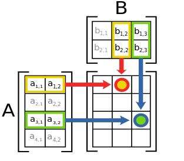
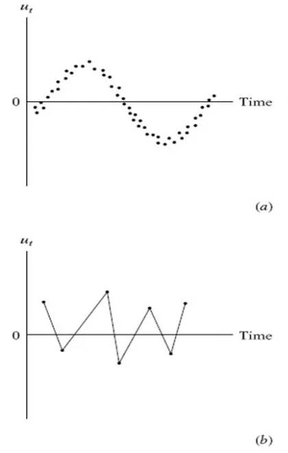
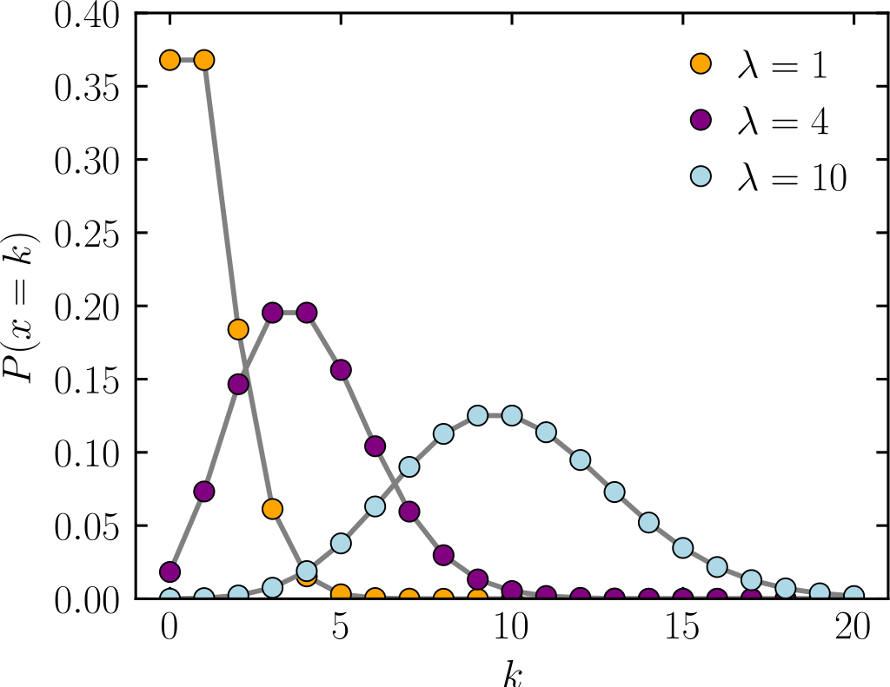

--- 
title: "HDFS 523: Strategies for Data Analysis in Developmental Research"
author: "Zachary F. Fisher"
date: "`r Sys.Date()`"
site: bookdown::bookdown_site
documentclass: book
bibliography: [book.bib, packages.bib]
description: |
  Course notes for HDFS 523
link-citations: yes
github-repo: zackfisher/HDFS523
cover-image: images/image1.png
favicon: null
always_allow_html: true
---

# About This Book

```{r, echo = F}
button_css <-  "position: relative; 
                top: -25px; 
                left: 85%;   
                color: white;
                font-weight: bold;
                background: #4B9CD3;
                border: 1px #3079ED solid;
                box-shadow: inset 0 1px 0 #80B0FB"
```


This book provides the course notes for HDFS 523. It is currently under development, so any feedback is appreciated (e.g., during class,  via email, or the edit link in the header). This first chapter is just about how to use the book -- the course content starts in Chapter \@ref(chapter-2).   

## Why this book? 

There are a few goals of moving from "textbook + slides + exercises" to an ebook. For now, the main goal is to update and integrate code contents from the course into one consistent format, rather than having multiple files to sort through on Canvas.


## Code Folding

```{r codefolder, echo=FALSE, results='asis'}
codefolder::bookdown(init = "hide", 
                     style = button_css)
```


The book combines lecture slides and R coding examples. It is often convenient to hide code when introducing new material. This is accomplished using code folding. An example of code folding is given on this page. Below, a histogram integrated into the text. By clicking on the button called "Show Code" on the top of the page, the R code that produced the histogram will also be visible. Notice that you may need to scroll horizontally to see all of the text in the code window. Also notice that when you hover your mouse over the code window, an icon appears in the top right corner -- this lets you copy the block of code with one click. 


```{r}
# Here is some R code. You don't have to look at it when reading the book, but it is here when you need it
x <- rnorm(200)
hist(x, col = "#4B9CD3")
```


## Acknowledgements

Many people have contributed to the course materials for HDFS 523. Most importantly, the original R markdown files for the course were developed by Nilam Ram and Zita Oravecz.

<!--chapter:end:index.Rmd-->

# Data Cleaning {#chapter-2}

```{r, echo = F}
button <-  "position: relative; 
            top: -25px; 
            left: 85%;   
            color: white;
            font-weight: bold;
            background: #4B9CD3;
            border: 1px #3079ED solid;
            box-shadow: inset 0 1px 0 #80B0FB"
```

```{r, echo=FALSE, results='asis'}
codefolder::bookdown(init = "show", style = button)
```

In Chapter 2 we will work through some basic data cleaning operations useful in longitudinal data analysis. The basic idea is provide a set of scripts to use for exploring new repeated measures data sets.

## Example Data 

For Chapter 2 we will make use of the longitudinal Wechsler Intelligence Scale for Children [WISC; Wechsler, -@wechsler1949] dataset described by @osborne1972. These data have been detailed extensively in a number of papers [@mcardle1987; @mcardle1988; @mcardle1990; @mcardle1994] and are used here with with permission. 

The WISC data contains repeated measures data from 204 children between the ages of 6 and 11 years old (during grades 6, 7, 9 and 11). Thee repeated measures include component scores for the verbal tests and performance subtests at all four occasions, along with verbal subtest scores for the information, comprehension, similarities, and vocabulary domains at the first and last measurement occasion. The demographics variables mother’s education (continuous in years) and mother graduated high school (dichotomous) are also included.

## Reading in Repeated Measures Data

We can read in the WISC data directly from the [QuantDev](https://quantdev.ssri.psu.edu/) website.

```{r}
filepath <- "https://quantdev.ssri.psu.edu/sites/qdev/files/wisc3raw.csv"
wisc3raw <- read.csv(file=url(filepath), header=TRUE)
```

Additional details on importing different data types into R can be found here: http://www.statmethods.net/input/importingdata.html.

## Familiarize Yourself with the Data

Let's take an initial look at the structure of our data object using `str()`

```{r}
str(wisc3raw)
```

From the output, we can also see that the data frame consists of 204 observations (rows) and 20 variables (columns). Each variable’s name and data type is also listed. Methods like the ones above can be an effective way to initially familiarize yourself with the main features of a dataset. 


## Look for Duplicated IDs

It is always worth looking for non-unique ID numbers when  ID labels are included in a dataset. Here we have an `id` variable indicating the subject number. Since our data is in a long format (more on that later) duplicate IDs may indicate a potential problem with the data source or clues on how the data is structured. 

```{r}
any(duplicated(wisc3raw$id))
```

## Using `table()` to Spot Irregularities

When a variable takes on a limited range of values it is often useful to screen for irregularities or invalid values. This is common across all variable types and can occur for character strings, numeric, integer and factor types. For example, we would expect the `grad` variable to only take the values of zero or one. We can use the `table()` function to quickly confirm this. 

By default `table()` simply omits any values coded as `NA`. To include a count of the `NA` values use the `useNA` argument of `table()` as follows:

```{r}
table(wisc3raw$grad, useNA = "always")
```

## Missing Data 

Dealing with missing data in a consistent manner is one of the most important aspects of data cleaning. When data are imported into R it is common to discover missing values are coded according to a variety of conventions. 

Often a first step in handling missing data involves recoding missing values as `NA`. Writing bespoke code to handle the different types of missing data one might encounter is tedious and unnecessary. 

`naniar` [@naniar] is a useful package with many convenience functions for managing missing data in R. Here we demonstrate some of this functionality.

### Generating Example Data

Since the WISC data does not contain missing values it is helpful to generate a synthetic dataset containing some commonly encountered missing data codes. 

```{r}
set.seed(123)
wisc_miss <- wisc3raw
wisc_miss$verb1[sample(nrow(wisc_miss),100)] <- -99
wisc_miss$comp1[sample(nrow(wisc_miss),75)] <- "N/A"
wisc_miss$info1[sample(nrow(wisc_miss),50)] <- "NA"
```


### Recoding Values with `NA`

Now that we have a dataset with missing values we can use `naniar` to recode these values to `NA`.


```{r}
na_strings <- c("NA", "N/A", -99)
  
wisc_miss <- naniar::replace_with_na_all(
  wisc_miss, condition = ~.x %in% na_strings
)
```

See the [`naniar` vignette on recoding NA values](https://cran.r-project.org/web/packages/naniar/vignettes/replace-with-na.html) for more detailed information on the package functionality.

### Missing Data Visualization

Once we have recoded our data in a consistent manner we can use visualizations to explore the missing data. The `vis_miss()` function from `naniar` is a good starting point for visualizing the amount of missing data in our dataset. The plots shows the missing values in black and non-missing values in gray. In addition, percentages of missing data in both the dataset and individual variables are provided.

```{r}
naniar::vis_miss(wisc_miss)
```

Many missing data visualizations are described in the [`naniar` vignette on missing data visualization](https://cran.r-project.org/web/packages/naniar/vignettes/naniar-visualisation.html) including plots for exploring missing data mechanisms. 

## Exporting Data

Depending on work-flow, you may need to export your dataset for use in another statistical software program. The `write.csv()` function is a convenient method for outputting comma delimited files.

```{r}
write.csv(wisc3raw, file = "wisc3raw.csv", row.names = FALSE, na = "-99")
```

Note that by default the `write.csv()` function will include an extra column of row numbers and will notate missing data with an `NA`.  More information on exporting data is available at http://www.statmethods.net/input/exportingdata.html.


## Reshaping Repeated Measures Data 

Behavioral science tends to use relational data structures - in basic form, spreadsheets. Typically, the data are stored  in a data frame (a "fancy" matrix) with multiple rows and columns. Two common schemata used to accommodate repeated measures data are *wide format* and *long format*. Different analysis and plotting functions require different kinds of data input. Thus, it is imperative that one can convert the data back and forth between wide and long formats. 

There are lots of ways to do this. We illustrate one way.

*Sidebar*: The `dput()` function provides a convenient method to get the variable names (or any R object) into a format that can be read back into R. For example, this can be helpful when working with a long vector of strings.

```{r}
dput(colnames(wisc3raw))
```

First, let's subset our data to only include the variables we need for this analysis.

```{r}
var_names_sub <- c(
  "id", "verb1", "verb2", "verb4", "verb6",
  "perfo1", "perfo2", "perfo4", "perfo6",
  "momed", "grad"
)

wiscraw <- wisc3raw[,var_names_sub]
head(wiscraw)
```


### Reshape Wide to Long

One way to go *from wide to long* is using the `reshape()` function from base R. 

Notice, the `varying` argument contains the repeated measures columns we want to stack and the `timevar` is a new variable containing the grade level information previosuly appended at the end of the colnames listed in `varying`.

```{r}
# reshape data from wide to long
wisclong <- reshape(
  data = wiscraw,
  varying = c("verb1", "verb2", "verb4","verb6", "perfo1","perfo2","perfo4","perfo6"),
  timevar = c("grade"), 
  idvar = c("id"),
  direction = "long", 
  sep = ""
)

# reorder by id and day 
wisclong <- wisclong[ order(wisclong$id, wisclong$grade), ]

head(wisclong, 8)
```  

Again, notice how `reshape` automatically split verb1, verb2, etc. into a string name and a grade variable. 

### Reshape Long to Wide

Now we go *from long to wide*, again using the `reshape()` function. The `v.names` argument specifies the variables to be expanded column wise based on the repeated measure specified in `timevar`.

```{r}
#reshaping long to wide
wiscwide <- reshape(
  data = wisclong, 
  timevar = c("grade"), 
  idvar = c("id"),
  v.names = c("verb","perfo"),
  direction = "wide", 
  sep = ""
)

# reordering columns 
wiscwide <- wiscwide[, c(
  "id", "verb1", "verb2", "verb4", "verb6",
  "perfo1", "perfo2", "perfo4", "perfo6",
  "momed","grad" 
)]

head(wiscwide)
```                    

Using functions included in base R can be useful in a number of situations. One example is package development where one may wants to limit dependencies. 

That said, many people find `reshape` to be unnecessarily complicated. A similar, and potentially more convenient, set of functions have been developed for reshaping data in the `tidyr` [@tidyr] package. For those interested take a look at the `pivot_longer()` and `pivot_wider()` functions. 

For examples using `tidyr` to reshape data see the [tidyr vignette on pivoting](https://cran.r-project.org/web/packages/tidyr/vignettes/pivot.html).

<!--chapter:end:02_basic_data_cleaning.Rmd-->

# Describing Longitudinal Data {#chapter-3}

```{r, echo = F}
button <-  "position: relative; 
            top: -25px; 
            left: 85%;   
            color: white;
            font-weight: bold;
            background: #4B9CD3;
            border: 1px #3079ED solid;
            box-shadow: inset 0 1px 0 #80B0FB"
```

```{r, echo=FALSE, results='asis'}
codefolder::bookdown(init = "show", style = button)
```

In Chapter 3 we will look at some option for describing and visualizing longitudinal data. 

## Example Data

Again we will make use of the WISC data described in Chapter 2. The following commands recreate the wide and long data we will use throughout this chapter.

```{r}
filepath <- "https://quantdev.ssri.psu.edu/sites/qdev/files/wisc3raw.csv"

wisc3raw <- read.csv(file=url(filepath),header=TRUE)

var_names_sub <- c(
  "id", "verb1", "verb2", "verb4", "verb6",
  "perfo1", "perfo2", "perfo4", "perfo6",
  "momed", "grad"
)

wiscraw <- wisc3raw[,var_names_sub]

# reshaping wide to long
wisclong <- reshape(
  data = wiscraw,
  varying = c("verb1", "verb2", "verb4","verb6", "perfo1","perfo2","perfo4","perfo6"),
  timevar = c("grade"), 
  idvar = c("id"),
  direction = "long", 
  sep = ""
)

# reorder by id and day 
wisclong <- wisclong[ order(wisclong$id, wisclong$grade), ]

#reshaping long to wide
wiscwide <- reshape(
  data = wisclong, 
  timevar = c("grade"), 
  idvar = c("id"),
  v.names = c("verb","perfo"),
  direction = "wide", 
  sep = ""
)

# reordering columns 
wiscwide <- wiscwide[, c(
  "id", "verb1", "verb2", "verb4", "verb6",
  "perfo1", "perfo2", "perfo4", "perfo6",
  "momed","grad" 
)]
```

## Describing Means and Variances

Once the wide and long data sets are in place, we can begin describing and plotting the data. Descriptive statistics and visualization are one of the most important aspects of data analysis. 

Descriptives and plots will be produced from wide data and long data to show the information that can be gleaned from each construction. Having both in place facilitates learning about the data. Continually keep in mind what portions of the data-box are being described (e.g., persons, variables, occasions). 

We can do a quick look at descriptives using the `describe()` function from the `psych` [@psych] package. Note the `n` in both outputs.

```{r}
psych::describe(wiscwide)
```

```{r}
psych::describe(wisclong)
```

### Verbal Ability (All Persons and Occasions)

Let's focus on the repeated measures of verbal ability. This step is useful to get a general view of what verbal ability scores look like across persons and occasions, but note that we are *ignoring Time*. In doing so we are not considering how the repeated measures are nested within individuals.

```{r}
psych::describe(wisclong$verb)
```


In addition to the descriptive statistics we can look at a boxplot of verbal ability scores across persons and occasions. Here we will start to use the `ggplot2` [@ggplot2] package.

```{r}
library("ggplot2")
ggplot(data = wisclong, aes(x=verb, y=..density..)) +
  geom_histogram(binwidth=2.5, fill = "white", color = "black") + 
  geom_density(color = "red") +
  ggtitle("Verbal Ability Score (across persons and occasions)") +
  xlab("Verbal Ability (Grade 1 to 6)") +
  ylab("Density") +
  theme_bw() +
  theme(
    panel.grid.major = element_blank(),
    panel.grid.minor = element_blank()
  )
```

### Verbal Ability (Across Time)

Note that our variable is actually "multivariate" because we have repeated measures. We should really consider the time-dependence when we are looking at descriptive statistics and plots. 

Let's now look at **verbal ability scores across time collapsed across individuals**. This can be done using either the `describe()` function and the wide data or the `describeBy()` function and the long data. 

Let's look at descriptives using the wide data.

```{r}
psych::describe(wiscwide[,c("verb1","verb2","verb4","verb6")])
```

Identical results can be obtained using the long data.

```{r}
psych::describeBy(wisclong[,c("verb")], group = wisclong$grade)
```

We can visualize the distribution of verbal scores across grades in a number of different ways. Here we have a histogram.

```{r}
ggplot(data=wisclong, aes(x=verb)) +
  geom_histogram(binwidth=5, pad = TRUE, fill="white", color="black") + 
  facet_grid(grade ~ .) + 
  ggtitle("Verbal Ability Score (across grades 1, 2, 4, 6)") +
  xlab("Verbal Ability Score") +
  ylab("Density") +
  theme_bw() +
  theme(
    panel.grid.major = element_blank(),
    panel.grid.minor = element_blank(),
    strip.background = element_blank()
  )
```

We can also create notched boxplots of the within-grade distributions (across individuals). 

From [Wikipedia](https://en.wikipedia.org/wiki/Box_plot): *Notched box plots apply a notch or narrowing of the box around the median. Notches are useful in offering a rough guide of the significance of the difference of medians; if the notches of two boxes do not overlap, this can provide evidence of a statistically significant difference between the medians.*

Adding the mean value to the plot gives us additonal information about central tendency and skew of the distribution.

```{r}
#boxplot by grade
ggplot(data=wisclong, aes(x=factor(grade), y=verb)) + 
  geom_boxplot(notch = TRUE) +
  stat_summary(fun="mean", geom="point", shape=23, size=3, fill="white") +
  ggtitle("Verbal Ability Score (across grades 1, 2, 4, 6)") +
  ylab("Verbal Ability Score") +
  xlab("Grade") +
  theme_bw() +
  theme(
    panel.grid.major = element_blank(),
    panel.grid.minor = element_blank(),
    strip.background = element_blank()
  )
```

Finally, we can view overlapping densities of the within-grade distributions of verbal ability scores.

```{r}
ggplot(data=wisclong, aes(x=verb)) + 
  geom_density(aes(group=factor(grade), colour=factor(grade), fill=factor(grade)), alpha=0.3) +
  guides(colour="none",  fill=guide_legend(title="Grade")) +
  ggtitle("Verbal Ability Score (across grades 1, 2, 4, 6)") +
  ylab("Density") +
  xlab("Verbal Ability Score") +
  theme_bw() +
  theme(
    panel.grid.major = element_blank(),
    panel.grid.minor = element_blank(),
    strip.background = element_blank()
  )
```

Notice in these plots how much "change" there is at the sample level across grades. Is that expected? 

## Describing Covariances

In the previous section we looked at the means and variances. Because these are repeated measures, we can also look at covariances and correlations over time. A simple covariance and correlation matrix of the verbal scores across grades can be produced using the `cov()` and `cor()` function.

```{r}
cov(wiscwide[,c("verb1","verb2","verb4","verb6")], use="complete.obs")
cor(wiscwide[,c("verb1","verb2","verb4","verb6")], use="complete.obs")
```

A plot corresponding to the correlation matrix can be obtained in a number of different ways. First, using the `pairs()` function from base R.

```{r}
pairs(wiscwide[,c("verb1","verb2","verb4","verb6")])
```

There is also a `pairs.panel()` function in the `psych` package. Here we see a LOESS smoothed fit line in red.

```{r}
psych::pairs.panels(wiscwide[,c("verb1","verb2","verb4","verb6")])
```

Finally, the`scatterplotMatrix()` from the `car` [@car] package can be used to create scatterplot matrices with confidence bands around the line of best fit.

```{r}
car::scatterplotMatrix(~ verb1 + verb2 + verb4 + verb6, data=wiscwide)
```

Each of these functions can be customized with additional features. Those interested in specifics should consult the help documentation for each function (e.g. `?car::scatterplotMatrix`). It is also worth noting the default behavior of these functions is to provide automatic, data-based ranges for each pair of variables separately.

## Individual-Level Descriptives

Note that our interest is often in *individual* development, rather than sample development. We need to consider how each individual is changing over time. Thus, we are interested in verbal ability across Time for each individual person. Visualization is typically our best tool for synthesizing the large amounts of information in individual-level data.

```{r}
ggplot(data = wisclong, aes(x = grade, y = verb, group = id)) +
  geom_point() + 
  geom_line() +
  scale_x_continuous(breaks=seq(1,6,by=1)) +
  ylim(0,80) +
  ggtitle("Verbal Ability Score (across grades 1, 2, 4, 6)") +
  xlab("Grade") +
  ylab("Verbal Ability Score") +
  theme_bw() +
  theme(
    panel.grid.major = element_blank(),
    panel.grid.minor = element_blank(),
    strip.background = element_blank()
  )
```

Sometimes the "blob" gets too dense. This can be fixed by selecting a subset of persons to visualize.

```{r}
ggplot(subset(wisclong, id < 30), aes(x = grade, y = verb, group = id)) +
  geom_point() + 
  geom_line() +
  scale_x_continuous(breaks=seq(1,6,by=1)) +
  ylim(0,80) +
  ggtitle("Verbal Ability Score (across grades 1, 2, 4, 6)") +
  xlab("Grade") +
  ylab("Verbal Ability Score") +
  theme_bw() +
  theme(
    panel.grid.major = element_blank(),
    panel.grid.minor = element_blank(),
    strip.background = element_blank()
  )
```
       
We can add some color to our plot using the `color` argument and treating `id` as a factor.

```{r}
ggplot(subset(wisclong, id < 30), aes(x = grade, y = verb, group = id, color = factor(id))) +
  geom_point() + 
  geom_line() +
  scale_x_continuous(breaks=seq(1,6,by=1)) +
  ylim(0,80) +
  ggtitle("Verbal Ability Score (across grades 1, 2, 4, 6)") +
  xlab("Grade") +
  ylab("Verbal Ability Score") +
  theme_bw() +
  theme(
    panel.grid.major = element_blank(),
    panel.grid.minor = element_blank(),
    strip.background = element_blank(),
    legend.position = "none"
  )
```

We can also get a gradient of colors by treating`id` as continuous.

```{r}
ggplot(subset(wisclong, id < 30), aes(x = grade, y = verb, group = id, color = id)) +
  geom_point() + 
  geom_line() +
  scale_x_continuous(breaks=seq(1,6,by=1)) +
  ylim(0,80) +
  ggtitle("Verbal Ability Score (across grades 1, 2, 4, 6)") +
  xlab("Grade") +
  ylab("Verbal Ability Score") +
  theme_bw() +
  theme(
    panel.grid.major = element_blank(),
    panel.grid.minor = element_blank(),
    strip.background = element_blank(),
    legend.position = "none"
  )
```

It is also sometimes useful to look at the collection of individual-level plots. 

```{r}
ggplot(subset(wisclong, id <= 20), aes(x = grade, y = verb)) +
  geom_point() + 
  geom_line() +
  scale_x_continuous(breaks=seq(1,6,by=1)) +
  ylim(0,80) +
  ggtitle("Verbal Ability Score (across grades 1, 2, 4, 6)") +
  xlab("Grade") +
  ylab("Verbal Ability Score") +
  theme_bw() +
  facet_wrap( ~ id) +
  theme(
    panel.grid.major = element_blank(),
    panel.grid.minor = element_blank(),
    strip.background = element_blank(),
    legend.position = "none"
  )
```

Some other aesthetics to get to the formal APA style.

```{r}
#ggplot version .. see also http://ggplot.yhathq.com/docs/index.html
ggplot(subset(wisclong, id <= 20), aes(x = grade, y = verb, group = id)) +
  geom_point() + 
  geom_line() +
  xlab("Grade") + 
  ylab("WISC Verbal Score") + 
  ylim(0,100) +
  scale_x_continuous(breaks=seq(1,6,by=1)) +
  ggtitle("Intraindividual Change in Verbal Ability") +
  theme_classic() + 
  #increase font size of axis and point labels
  theme(axis.title = element_text(size = rel(1.5)),
        axis.text = element_text(size = rel(1.2)),
        legend.position = "none")
```

Saving the plot file. See also [outputting plots to a file](http://www.cookbook-r.com/Graphs/Output_to_a_file/).

```{r, evaluate=FALSE}
ggsave(filename = "wiscverbal.png", width = 5, height = 5, dpi=300)
```

Now we have a good set of strategies to apply when looking at new longitudinal data.  

## References

<!--chapter:end:03_describing_longitudinal_data.Rmd-->

# Matrix Algebra {#chapter-4}

```{r, echo = F}
button <-  "position: relative; 
            top: -25px; 
            left: 85%;   
            color: white;
            font-weight: bold;
            background: #4B9CD3;
            border: 1px #3079ED solid;
            box-shadow: inset 0 1px 0 #80B0FB"
```

```{r, echo=FALSE, results='asis'}
codefolder::bookdown(init = "show", style = button)
```

In Chapter 4 we will briefly review some basic algebra results useful for this course. Those needing a reliable reference for basic results in matrix algebra should consult the *The Matrix Cookbook* at https://www.math.uwaterloo.ca/~hwolkowi/matrixcookbook.pdf.

## Types of matrices

Remember that matrices are defined by rows (the first dimension) and columns (the second dimension):

$$
\underset{m \times n}{\mathbf{A}} = \begin{bmatrix}
   a_{11} & a_{12} & a_{13} \\
   a_{21} & a_{22} & a_{23} \\
   a_{31} & a_{32} & a_{33} \\
   a_{41} & a_{42} & a_{43}
 \end{bmatrix}
$$

You can refer to a specific element in matrix using a subscript of the row and column index (e.g. $a_{31}$). For our purposes there are a few *special* matrices worth mentioning, 

### Square

A square matrix has the same number of rows and columns. Covariance and correlation matrices are square.

$$
\underset{n \times n}{\mathbf{A}} = \begin{bmatrix}
   a_{11} & a_{12} & a_{13} & a_{14} \\
   a_{21} & a_{22} & a_{23} & a_{24} \\
   a_{31} & a_{32} & a_{33} & a_{34} \\
   a_{41} & a_{42} & a_{43} & a_{44}
 \end{bmatrix}
$$


### Symmetric

A symmetric matrix is a square matrix that equals its transpose. This means that corresponding entries on either side of the main diagonal are equal. 


$$
\begin{align}
\underset{n \times n}{\mathbf{A}} &= \begin{bmatrix}
   a & ab & ac & ad \\
   ab & b & bc & bd \\
   ac & bc & c & cd \\
   ad & bd & cd & d
 \end{bmatrix} \\
 \cr
 \mathbf{A} &= \mathbf{A}'
\end{align}
$$

**Matrix Transpose**

The transpose of a matrix is an operator which flips a matrix over its diagonal. That is, it switches the row and column indices of the matrix $A$ by producing another matrix, often denoted by $A'$ (or $A^{T}$).

**Graphical Depiction of a Matrix Transpose**


### Diagonal

A diagonal matrix is a special case of a square symmetric matrix in which there are values along the diagonal, but zeros elsewhere:

$$
\begin{align}
\underset{n \times n}{\mathbf{A}} &= \begin{bmatrix}
   a & 0 & 0 & 0 \\
   0 & b & 0 & 0 \\
   0 & 0 & c & 0 \\
   0 & 0 & 0 & d
 \end{bmatrix} \\
 \cr
 \mathbf{A} &= \mathbf{A}'
\end{align}
$$


### Identity

An identity matrix is a special case of a diagonal matrix in which the elements of the diagonal are all 1:

$$
\underset{n \times n}{\mathbf{I}} = \begin{bmatrix}
   1 & 0 & 0 & 0 \\
   0 & 1 & 0 & 0 \\
   0 & 0 & 1 & 0 \\
   0 & 0 & 0 & 1
\end{bmatrix}
$$

Any matrix multiplied by an identity matrix is unchanged. 

## Operations on Matrices

### Matrix Transpose

As stated earlier the transpose of a matrix is an operator which flips a matrix over its diagonal. That is, it switches the row and column indices of the matrix $A$ by producing another matrix, often denoted by $A'$ (or $A^{T}$). Some useful properties of the matrix transpose include:

$$
(\mathbf{A + B})' = \mathbf{A' + B'}\\
(c\mathbf{A'}) = c(\mathbf{A'}) = (\mathbf{A'})c \\
(\mathbf{A'B}) = \mathbf{B'A}\\ 
(\mathbf{AB})' = \mathbf{B'A'}\\
(\mathbf{A'})' = \mathbf{A}
$$
**Graphical Depiction of a Matrix Transpose**


### Matrix Trace

The *trace* of a square matrix is the sum of elements along the diagonal. The trace is only defined for a square matrix. For an $n \times n$ matrix the trace is defined as follows:

$$ tr(\mathbf{A}) = \sum_{i=1}^{n}{a_{ii}} = a_{11} + a_{22} + ... + a_{nn} $$
**Graphical Depiction of a Matrix Trace**


Some useful properties of the matrix trace include:

$$
tr(\mathbf{A + B}) = tr(\mathbf{A}) + tr(\mathbf{B})\\
tr(c\mathbf{A}) = c(tr(\mathbf{A})) \\
tr(\mathbf{A}) = tr(\mathbf{A'})\\ 
tr(\mathbf{AB}) = tr(\mathbf{BA})\\
tr(\mathbf{ABC}) = tr(\mathbf{CAB})=tr(\mathbf{BCA})
$$

### Addition

For addition, matrices must be of the same order. Addition of two matrices is accomplished by adding corresponding elements, $c_{ij}=a_{ij}+b_{ij}$

$$
\mathbf{A} = \begin{bmatrix} 
10 & 5 \\
9 & 1
\end{bmatrix}
, \enspace
\mathbf{B} = \begin{bmatrix} 
2 & 1 \\
20 & 0
\end{bmatrix}, \enspace
\textrm{then }
\mathbf{A}+\mathbf{B}=
\begin{bmatrix} 
12 & 6 \\
29 & 1
\end{bmatrix}
$$
Matrix addition is *commutative* (gives the same result whatever the order of the quantities involved),

$$
\mathbf{A + B} = \mathbf{B + A}
$$
and *associative* (gives the same result whatever grouping their is, as long as order remains the same),

$$
\mathbf{A + (B + C)} = \mathbf{(A + B) + C} 
$$
and 

$$
\mathbf{A + (-B)} = \mathbf{(A - B)}.
$$

### Subtraction 

Like addition, subtraction requires matrices of the same order. Elements in the difference matrix are given by the algebraic difference between corresponding elements in matrices being subtracted:

$$
\mathbf{A} = \begin{bmatrix} 
10 & 5 \\
9 & 1
\end{bmatrix}
, \enspace
\mathbf{B} = \begin{bmatrix} 
2 & 1 \\
20 & 0
\end{bmatrix}, \enspace
\textrm{then }
\mathbf{A}-\mathbf{B}=
\begin{bmatrix} 
8 & 4 \\
-11 & 1
\end{bmatrix}
$$


### Matrix Multiplication

Three useful *rules* to keep in mind regarding matrix multiplication:

1. Only matrices of the form $(m \times n) * (n \times p)$ are conformable for multiplication. The number of columns in the premultiplier must equal the number of rows in the post multiplier.

2. The product matrix will have the following order: $\mathbf{A}_{m\times n} \mathbf{B}_{n\times p} = \mathbf{C}_{m \times p}$.

**Graphical Depiction of Rules 1 and 2**


3. The element $c_{ij}$ in the product matrix is the result of multiplying row $i$ of the premultiplier matrix, and row $j$ of the post multiplier matrix (e.g. ($c_{ij}=a_{i1}b_{1j} + a_{i2}b_{2j} + a_{i3}b_{3j}$)).

**Graphical Depiction of Rule 3**



Matrix multiplication is associative (i.e. rearranging the parentheses in an expression will not change the result). That is,

$$
\mathbf{(AB)C} = \mathbf{A(BC)}
$$
and is distributive with respect to addition,
$$
\mathbf{A(B+C)} = \mathbf{AB + AC} \\
\mathbf{(B+C)A} = \mathbf{BA + CA} \\
$$
If $c$ is a scalar, then

$$
c(\mathbf{AB})=c(\mathbf{A})\mathbf{B}=\mathbf{A}(c\mathbf{B})=(\mathbf{AB})c
$$
or equivalently,

$$
\mathbf{A} = \begin{bmatrix} 
10 & 5 \\
9 & 1
\end{bmatrix}, \enspace
k=2, \enspace
k\mathbf{A} = \begin{bmatrix} 
20 & 10 \\
18 & 2
\end{bmatrix}.
$$


In general, matrices that can be multiplied are called 'compatible' or 'comformable.' Matrices in which the *inner dimensions* (i.e., columns of $\mathbf{A}$, rows of $\mathbf{B}$) do not match are called 'incompatible' or 'non-conformable.' These cannot be multiplied.

### Matrix Division

Division is not defined for matrix operations, but may be accomplished by multiplication by the inverse matrix. In algebra, the reciprocal of a scalar is, by definition, the scalar raised to the minus one power (e.g. $5^{-1} = 1/5$), and equations may be solved by multiplication by reciprocals. 

For example:

$$
5^{-1} = 1/5\\
5x=35\\
5^{-1}(5x)=5^{-1}(35)\\
x = 7
$$
Now consider the following equation where the vector $\mathbf{x}$ is unknown,

$$
\mathbf{A}_{p \times p} \mathbf{x}_{p \times 1} = \mathbf{b}_{p \times 1}
$$
Each element in the column vector $\mathbf{x}$ is unknown and the solution involves solving a set of simultaneous equations for the unknown element of $\mathbf{x}$,

$$
a_{11}x_{1} + a_{12}x_{2} + \dots + a_{1p}x_{p} = b1 \\
a_{21}x_{1} + a_{22}x_{2} + \dots + a_{2p}x_{p} = b2 \\
\vdots \\
a_{p1}x_{1} + a_{p2}x_{2} + \dots + a_{pp}x_{p} = bp
$$

A solution analogous to the scalar equations above would give the following solution for the elements of the vector $\mathbf{x}$:

$$
\mathbf{A}_{p \times p} \mathbf{x}_{p \times 1} = \mathbf{b}_{p \times 1} \\
\mathbf{A}^{-1}_{p \times p}\mathbf{A}_{p \times p} \mathbf{x}_{p \times 1} = \mathbf{A}^{-1}_{p \times p}\mathbf{b}_{p \times 1} \\
\mathbf{I}_{p \times p}\mathbf{x}_{p \times 1} = \mathbf{A}^{-1}_{p \times p}\mathbf{b}_{p \times 1} \\
\mathbf{x}_{p \times 1} = \mathbf{A}^{-1}_{p \times p}\mathbf{b}_{p \times 1}
$$

The inverse of a matrix must satisfy the following properties:

$$
\mathbf{AA^{-1}} = \mathbf{A^{-1}A} = \mathbf{I}
$$
where $I$ is the identity matrix with 1's along the diagonal and 0's elsewhere.


<!--chapter:end:04_matrix_algebra.Rmd-->

# Ordinary Least Squares {#chapter-5}

```{r, echo = F}
button <-  "position: relative; 
            top: -25px; 
            left: 85%;   
            color: white;
            font-weight: bold;
            background: #4B9CD3;
            border: 1px #3079ED solid;
            box-shadow: inset 0 1px 0 #80B0FB"
```

```{r, echo=FALSE, results='asis'}
codefolder::bookdown(init = "show", style = button)
```

In Chapter 5 we will briefly review the assumptions and properties of Ordinary Least Squares (OLS) regression, a cornerstone method that supports many of the other methods we will consider. We will present the regression model in both scalar and matrix forms to facilitate the material to follow.

## Linear Regression Model

Generally, the regression model is written as 

$$ y_{i} = \beta_0 + \beta_1x_{1i} + \beta_2x_{2i} + ... + \beta_qx_{qi} + \epsilon_{i} $$

where 

- $y_{i}$ is the value of the outcome variable for individual $i$
- $\beta_0$ is an *intercept parameter*, the expected value of $y_i$ when the predictor variables are all $0$
- $\beta_q$ is a regression parameter indicating the relation between $x_{qi}$ and the outcome variable, $y_i$ 
- $\epsilon_{i}$ are *errors or disturbances*

## Ordinary Least Squares (OLS)

The Ordinary Least Squares (OLS) is one of the most common estimators of the linear regression model. What assumptions do we make with OLS? Why should we care? 

How well me meet the assumptions of OLS determines (1) the accuracy of OLS coefficients, and (2) the accuracy of our inferences and substantive hypothesis tests.

## Assumptions of OLS

The assumptions of OLS are as follows: 

1. $\mathbb{E}(\epsilon_{i}) = 0$
2. $\mathbb{E}(\epsilon_{i}^2) = \sigma^2$ for all $i$ (homoscedasticity)
3. $\mathbb{E}(\epsilon_{i}\epsilon_{j}) = 0$ for all $i \neq j$
4. No perfect collinearity among $x$ variables
5. $\mathbb{C}(\epsilon_{i},x_{qi}) = 0$ for all $i$ and $k$

Let's discuss each assumption in more detail.

### Assumption 1. $\mathbb{E}(\epsilon_{i}) = 0$

Note that $\mathbb{E}()$ is the expectation operator. The expected value is an "average" of whatever is inside the parentheses. This assumption states that, on average, the error for the $ith$ observation is zero. Here "for all $i$" means the same is true for all cases. 

### Assumption 2. Homoscedasticity

In statistics, a vector of random variables is heteroscedastic if the variability of the random disturbance is different across elements of the vector, here our $\mathbf{X}$s. The errors or disturbances in our model are homoskedastic if the variance of $\epsilon _{i}$ is a constant (e.g. $\sigma ^{2}$), otherwise, they are heteroskedastic.

**Graphical Depiction of Homoskedasticity and Heteroskedasticity**


### 3. $\mathbb{E}(\epsilon_{i}\epsilon_{j}) = 0$

Assumption 3 is sometimes referred to as the *autocorrelation assumption*. This assumption states that the error terms of different observations should not be correlated with each other. For example, when we have time series data and use lagged variables we may want to examine residuals for the possibility of autocorrelation. 

**Graphical Depiction of Positive and Negative Autocorrelation**



### 4. No Perfect Collinearity 

Perfect collinearity occurs when one variable is a perfect linear function of any other explanatory variable. If perfect collinearity is found among the $\mathbf{X}$s then $\mathbf{(X'X)}$ has no inverse and OLS estimation fails. Perfect collinearity is unlikely except for programming mistakes such as dummy coding all the values in a nominal variable. 

### 5. $\mathbb{C}(\epsilon_{i},x_{ki}) = 0$

Note that $\mathbb{C}()$ is the covariance operator. Assumption five states that that the error of our equation is uncorrelated with all the $\mathbf{X}$s. This is often referred to as an *endogeneity assumption*. 

This can be a confusing assumption because by definition the residuals $\hat{e_i}$ are uncorrelated with the $\mathbf{X}$s. Here, however, we are concerned with the true errors $\epsilon_i$. Unfortunately, there are a variety of conditions that lead to $\mathbb{C}(\epsilon_{i},x_{qi}) \neq 0$ in applied contexts. 

**Graphical Depiction of Sources of Endogeneity**


If we meet these assumptions what large sample properties can we expect?

## Properties of the OLS Estimator

If assumptions (1) to (5) hold, then the OLS estimator $\boldsymbol{\hat{\beta}}$ is:

1. A consistent estimator of $\boldsymbol{{\beta}}$
2. Asymptotically normally distributed
3. Having a variance of $\mathbb{V}(\boldsymbol{\hat{\beta}}) = \sigma^2(\mathbf{X}'\mathbf{X})^{-1}$

*Notice that we did not assume normality of $\epsilon_{i,y_{i}$ or $x_{i}$.* 

Let's discuss each of these properties in a little bit more detail.

### 1. Consistentcy of $\boldsymbol{{\beta}}$

$\boldsymbol{\hat{\beta}}$ is the OLS estimator of $\boldsymbol{{\beta}}$. A consistent estimator is one for which, as the sample size ($n$) increases, the estimate converges in probability to the value that the estimator is designed to estimate. This is often stated as $plim(\boldsymbol{\hat{\beta}})=\boldsymbol{{\beta}}$. Stated differently, as the sample size grows, the OLS coefficients converge to the true coefficients.

### 2. Asymptotic Normality

Asymptotic normality is another property of the OLS estimator when all assumptions are met. “Asymptotic” refers to how an estimator behaves as the sample size tends to infinity. “Normality” refers to the normal distribution, so an estimator that is asymptotically normal will have an approximately normal distribution as the sample size gets larger.

### Variance of $\hat{\beta}$

Having a variance of $\mathbb{V}(\boldsymbol{\hat{\beta}}) = \sigma^2(\mathbf{X}'\mathbf{X})^{-1}$ is another property of the OLS estimator when the previously stated assumptions are met. This means, for example, we can estimate the standard errors from the main diagonal of $\sigma^2(\mathbf{X}'\mathbf{X})^{-1}$ and perform significance testing based on this variance.

## Failure to Meet Assumptions

It is worth thinking about the consequences of not meeting these assumptions.

### Failure of Assumption 1. 

Assumption 1 states $\mathbb{E}(\epsilon_{i}) = 0$. This assumption states that, on average, the error for the $ith$ observation is zero. If instead, $\mathbb{E}(\epsilon_{i}) = c$ and $c \neq 0$, and all other assumptions hold, then only the intercept term is biased. Other coefficients OK.

### Failure of Assumption 2 or 3. 

Assumptions 2 and 3 are the *homoskedasticity* and *no autocorrelation* assumption, respectively.  If we violate (2) or (3), but all other assumptions hold, (1) variance of $\hat{\beta}$ is no longer dependable, (2) SEs possibly inaccurate, and (3) significance tests are possibly inaccurate. However, importantly, $\hat{\beta}$ is still an unbiased and consistent estimator.

### Failure of Assumption 5. 

Assumption (5) states that that the error of our equation is uncorrelated with all the $\mathbf{X}$s. If this assumption fails, while others hold, OLS is no longer a consistent estimator. 

## Regression and Matrix Notation 

Now that we have reviewed the assumptions of OLS, let's return to the linear regression model and translate it into a matrix form. 

### An Intercept-Only Model

First, let's take a simpler form of the model, an intercept-only model where
$$ y_i =  \beta_0 1_{i} + \epsilon_i.$$ Note that we have made the "silent" 1 explicit. This will become important later (e.g., when fitting growth models). It is worthwhile to look at regression model without predictors to understand what it can tell us about the nature of the intercept (or constant).

So here we have no predictors, what is $\beta_0$? 

Here, $\beta_0$ is the mean of the response variable, and we can show this with some algebra,

$$\mathbb{E}(y_i)=\mathbb{E}(\beta_0 1_{i} + \epsilon_i)=\beta_0 1_{i} +\mathbb{E}( \epsilon_i)=\beta_0$$
where $\mathbb{E}( \epsilon_i)=0$ (Assumption 1).

### Intercept-Only Model in Matrix Form

Translating into matrix form, $y_i$ can be written as an $N$ x 1 matrix (a column vector). More specifically, for $i = 1$ to $N$ individuals, 
$$ y_i = \left[ \begin{array}{c}
y_1 \\
y_2 \\
\vdots \\
y_N \end{array} \right] = \boldsymbol{Y}$$.

(Remember, matrices are often designated as bold capital letters)

Doing the same for all the other parts of the model, we get  

$$ \left[ \begin{array}{c}
y_1 \\
y_2 \\
\vdots \\
y_N \end{array} \right]  = 
\left[ \begin{array}{c}
1 \\
1 \\
\vdots \\
1 \end{array} \right] [\beta_0] + 
\left[ \begin{array}{c}
\epsilon_1 \\
\epsilon_2 \\
\vdots \\
\epsilon_N \end{array} \right]$$

Note that we have taken care that each matrix is of an order that will allow for matrix multiplication.

### Simple Regression in Matrix Form

Now, let's expand our regression model by adding a predictor $x_{1i}$. Our model becomes  

$$ y_i = \beta_0 + \beta_1x_{1i}  + \epsilon_i $$ 

Written out explicitly in matrix form, the model is  
$$ \left[ \begin{array}{c}
y_1 \\
y_2 \\
\vdots \\
y_N \end{array} \right]  = 
\left[ \begin{array}{cc}
1, x_{11}\\
1, x_{12}\\
\vdots \\
1, x_{1N}\end{array} \right]
\left[ \begin{array}{c}\beta_0\\ \beta_1\end{array}\right] + 
\left[ \begin{array}{c}
\epsilon_1 \\
\epsilon_2 \\
\vdots \\
\epsilon_N \end{array} \right]$$

### Multiple Regression in Matrix Form

Finally, extending the model to the general case with $q$ predictor variables, we have 
$$ y_i = \beta_0 + \beta_1x_{1i} + \beta_2x_{2i} + ... + \beta_qx_{qi} + \epsilon_i $$

which is written out in matrix form as 


$$ \underbrace{\left[ \begin{array}{c}
y_1 \\
y_2 \\
\vdots \\
y_N \end{array} \right]}_{N \times 1}  = 
\underbrace{\left[ \begin{array}{cccc}
1, x_{11}, \ldots, x_{q1}\\
1, x_{12}, \ldots, x_{q2}\\
\vdots \\
1, x_{1N}, \ldots, x_{qN}\end{array} \right]}_{N \times (q + 1)}
\underbrace{\left[ \begin{array}{c}\beta_0\\ \beta_1\\ \vdots\\ \beta_q\end{array}\right]}_{(q+1) \times 1} + 
\underbrace{\left[ \begin{array}{c}
\epsilon_1 \\
\epsilon_2 \\
\vdots \\
\epsilon_N \end{array} \right]}_{N \times 1}$$

Where we have the following elements:

$$ \boldsymbol{Y} = \left[ \begin{array}{c}
y_1 \\
y_2 \\
\vdots \\
y_N \end{array} \right] ;\boldsymbol{X} = \left[ \begin{array}{cccc}
1, x_{11}, \ldots, x_{q1}\\
1, x_{12}, \ldots, x_{q2}\\
\vdots \\
1, x_{1N}, \ldots, x_{qN}\end{array} \right]; \boldsymbol{\beta} = \left[ \begin{array}{c}\beta_0\\ \beta_1\\ \vdots\\ \beta_q\end{array}\right]; \boldsymbol{\epsilon} = \left[ \begin{array}{c}
\epsilon_1 \\
\epsilon_2 \\
\vdots \\
\epsilon_N \end{array} \right] $$

Observe the order of the matrices/vectors. On the right hand side you are matrix multiplying a $N \times (q+1)$ matrix with a $(q+1) \times 1$ vector. This yields an $N \times 1$ vector, to which another $N \times 1$ vector $\boldsymbol{\epsilon}$ is added, and this is equal to our outcome vector  $\boldsymbol{Y}$ which is also $N \times 1$. 

When we implement this model in R, it will be important to know the portions of the model that are in our data frame, $y_i$ and ${x_{1}, ..., x_{q}}$, and to have them structured properly. This will become clear in the examples below. 

Now that we have the model written out explicitly as matrices, we can easily simplify the notation.

In compact matrix notation, the regression model then can be written as 

$$ \boldsymbol{Y} = \boldsymbol{X}\boldsymbol{\beta} + \boldsymbol{\epsilon} $$

## Solving the Regression Equation

In practice, we would like to know the contents of (i.e., solve for) $\boldsymbol{\beta}$. 

Assuming the model is correct, the expected value of $\boldsymbol{\epsilon}$ is 0, therefore, 
$$ \boldsymbol{Y} = \boldsymbol{X}\boldsymbol{\beta}$$
Then we just need to solve for $\boldsymbol{\beta}$. We can think back about some of the matrix operations we discussed earlier.


### Matrix Multiplication and Transpose

Our goal is to isolate $\boldsymbol{\beta}$. One initial idea might be to multiple each side of the equation by $\mathbf{X}^{-1}$ in an attempt to remove
$\mathbf{X}$ from the right hand side, and isolate $\boldsymbol{\beta}$. Why won't this work?

Instead, let's pre-multiply each side of the equation by $\boldsymbol{X'}$. This would give us

$$ \boldsymbol{X'}\boldsymbol{Y} = \boldsymbol{X'}\boldsymbol{X}\boldsymbol{\beta} $$

This gets us a quantity, $\left(\boldsymbol{X'}\boldsymbol{X}\right)$, a square matrix containing information about the relations among the $\mathbf{x}$s.

### Matrix Inverse

Now, since $\boldsymbol{X'}\boldsymbol{X}$ is a square matrix and presumabely has an inverse (e.g. no perfect collinearity), we can premultiply both sides by $\left(\boldsymbol{X'}\boldsymbol{X}\right)^{-1}$, to obtain

$$ \left(\boldsymbol{X'}\boldsymbol{X}\right)^{-1} \left( \boldsymbol{X'}\boldsymbol{Y}\right) = \left(\boldsymbol{X'}\boldsymbol{X}\right)^{-1} (\boldsymbol{X'}\boldsymbol{X}) \boldsymbol{\beta} $$
Remembering our assumptions that a matrix multiplied by its inverse equals the identity matrix, $(\boldsymbol{X'}\boldsymbol{X})^{-1} (\boldsymbol{X'}\boldsymbol{X})=\mathbf{I}$ the equation simplifies to 

$$ \left(\boldsymbol{X'}\boldsymbol{X}\right)^{-1}\left(\boldsymbol{X'}\boldsymbol{Y}\right) = \boldsymbol{I}\boldsymbol{\beta} $$

or more succinctly

$$ \left(\boldsymbol{X'}\boldsymbol{X}\right)^{-1}\left(\boldsymbol{X'}\boldsymbol{Y}\right) = \boldsymbol{\beta} $$
We've now isolated the unknowns, $\boldsymbol{\beta}$ onto one side of the equation and figured out how to use matrix algebra to obtain the regression coefficients. Quite literally, this algebra is what allows for estimation of the parameters when fitting a regression model to data.

We will now work through some practical examples - staying aware that this kind of matrix algebra is being done in the background. 


## The Linear Probability Model

While we are discussing the assumptions of OLS it is worth pausing to consider a model for dichotomous outcomes: the *linear probability model* (LPM).

In the LPM we don't do anything fancy with a binary outcome variable. Instead, we simply apply OLS as we would with a continuous out come variable. Since we aren't considering the normality of our outcome you might be curious how our assumptions would hold. 

Remembering the assumptions of OLS: 

1. $\mathbb{E}(\epsilon_{i}) = 0$
2. $\mathbb{E}(\epsilon_{i}^2) = \sigma^2$ for all $i$ (homoscedasticity)
3. $\mathbb{E}(\epsilon_{i}\epsilon_{j}) = 0$ for all $i \neq j$
4. No perfect collinearity among $x$ variables
5. $\mathbb{C}(\epsilon_{i},x_{qi}) = 0$ for all $i$ and $k$

**Which assumptions are needed for consistency and asymptotic unbiasedness?**

4. No perfect collinearity among $x$ variables
5. Errors uncorrelated with all $x$ variables.

In regard to (4) having a dependent variable valued at $0,1$ does not cause any problems. In regard to (5), again no, nothing about a dichotomous outcome violates this assumption.

Therefore, in this model $\mathbf{\hat\beta}$ is still consistent and asymptotically unbiased.

**What about the remaining assumptions?**

2. Homoscedasticity

Here, *a dichotomous outcome does inherently violate the assumption of homoskedasticity.*

Why is this case? It can be shown that $\mathbb{V}(\epsilon_{i})$ now directly depends on the value of $x$ that is taken. If the $ith$ person has one set of values for the $x$ variables, and another individual $j$ has another set, the estimates of $\mathbb{V}(\epsilon_{i})$ and $\mathbb{V}(\epsilon_{j})$ will differ. This can be seem by looking at the variacne of a Bernoulli random variable.

This means estimate of variance of $\mathbf{\hat\beta}$ is no longer reliable, SEs and significance tests possibly inaccurate. However, this could be addressed using robust standard errors.

It is common to look at plots of predicted values vs residuals to diagnose heteroskedasticity. Generally one would like to see a random blob of points without any discernible pattern. Here is an example of what that plot might look like for an LPM model. Each line represents a different outcome, $y=0$, or $y=1$.


### Advantages of the LPM

1. Simplicity.
2. Regression coefficients give impact of $x$ on $P(y_{i}=1|x)$.
3. Effect same regardless of value of $x$ or values of other $x$s.
4. Can extend with traditional methods easily (interactions, quadratic terms).

### Disadvantages of the LPM

1. Functional form unlikely accurate at extreme lows & highs
2. Binary dependent variable creates heteroscedasticity
3. Some regression diagnostics assume homoscedastic error
4. Predicted probabilities not restricted to 0 to 1 range


<!--chapter:end:05_ols.Rmd-->

# Linear Regression {#chapter-6}

```{r, echo = F}
button <-  "position: relative; 
            top: -25px; 
            left: 85%;   
            color: white;
            font-weight: bold;
            background: #4B9CD3;
            border: 1px #3079ED solid;
            box-shadow: inset 0 1px 0 #80B0FB"
```

```{r, echo=FALSE, results='asis'}
codefolder::bookdown(init = "show", style = button)
```

In Chapter 6 we will demonstrate how to estimate the linear regression model in R with an eye towards the longitudinal modeling to follow.

## Example Data

Chapter 6 make use of the same WISC data used in Chapter 3. Here we again read in, subset, and provide descriptives for the WISC data. We will also add a simulated variable `childgrad` indicating whether the student graduated highschool.

```{r}
filepath <- "https://quantdev.ssri.psu.edu/sites/qdev/files/wisc3raw.csv"

wisc3raw <- read.csv(file=url(filepath),header=TRUE)

var_names_sub <- c(
  "id", "verb1", "verb2", "verb4", "verb6",
  "perfo1", "perfo2", "perfo4", "perfo6",
  "momed", "grad"
)

wiscsub <- wisc3raw[,var_names_sub]

set.seed(1234)
wiscsub$childgrad <- sample(c(0,1), replace=TRUE, size=nrow(wiscsub))

psych::describe(wiscsub)
```

## Intercept-Only Model

For our first example, we focus on verbal ability at Grade 2 as an outcome (`verb2` in the data frame `wiscsub`). Examining the distribution for 'verb2'.

```{r}
library("ggplot2")

psych::describe(wiscsub$verb2)

ggplot(data=wiscsub, aes(x=verb2)) + 
  geom_histogram(binwidth=2.5, fill="white", color="black", boundary=0) +
  xlab("Verbal Ability Grade 2") + ylab("Count") +
  xlim(0,50) +
  theme_classic()
```

### Intercept-Only Equation

The simplest model is an intercept only model. In this case, we would fit the model

$$ verb_{2i} = b_0 + \epsilon_{i}$$
 
Written out explicitly with the "silent" 1 in it, we get 
$$ verb_{2i} = b_01_i + \epsilon_{i}$$
This is helpful for explicit translation into the R code, specifically the `formula` within the `lm()` function. 

### Intercept-Only Model in R

We fit the model using the following code. Note that the code has the '1' predictor variable stated explicitly.

```{r}
model1 <- lm(formula = verb2 ~ 1,
              data = wiscsub,
              na.action = na.exclude)
summary(model1)
```

Note that we used `na.exclude` instead of `na.omit` (default); practically speaking `na.omit` deletes missing data entries while `na.exclude` just excludes from the analysis.Therefore with `na.exclude`, in the residuals and fitted values, `NA` will show up where there were missing values.

The output indicates that $b_0$ = 25.4153, and its standard error = 0.4275. 

The intercept reflects the expected value of the outcome variable when all of the predictor variables (i.e. $\left\{ x_{1i}, ..., x_{qi}\right\}$) = 0. So, in the absence of any additional information other than the descriptive statistics of $verb_{2i}$, what is our best guess for a person's $verb_{2i}$ score? It is the mean of $verb_{2i}$. The regression above confirms this notion; regressing the outcome on a vector of 1s allows us to 'recover' the mean.


### Intercept as Mean of Outcome

Notice we can confirm this finding using matrix algebra, as well.

$$
\mathbb{E}(verb_{2i}) = \mathbb{E}(b_01_i + \epsilon_{i}) 
$$

From the properties of expectation, we have $\mathbb{E}(X+Y)=\mathbb{E}(X) + \mathbb{E}(Y)$.

$$
\mathbb{E}(verb_{2i}) = \mathbb{E}(b_01_i) + \mathbb{E}(\epsilon_{i}) 
$$

Another property of expectation relates to taking the expectation of a constant, $\mathbb{E}(c)=c$, thus $\mathbb{E}(b_01_i)=b_0$, implying

$$
\mathbb{E}(verb_{2i}) = b_01_i + \mathbb{E}(\epsilon_{i}). 
$$
Remembering Assumption 1, $\mathbb{E}(\epsilon_{i})=0$, we have

$$
\mathbb{E}(verb_{2i}) = b_0
$$
We can confirm this by looking at Verbal Scores at Wave 2.

```{r}
mean(wiscsub$verb2)
```


### Intercept-Only Model $R^2$

Yes - we recovered the *mean*, but we did not attempt to explain any of the *variance*. Let's take a look at the variance explained for Model 1. 

```{r}
summary(model1)$r.squared
```


It thus makes sense that we get 0 as the R-square. From the properties of variance, we know that $\mathbb{V}(c)=0$. There is no variability due to the regression model because there are no predictors, only a constant.

## Simple Linear Regression

Let's build up the model further. For example, we could attempt to explain some of the *between-person variance* in the Grade 2 verbal score from the Grade 1 verbal scores. But, before we do, let's examine the distribution of the *between-person differences* in the Grade 1 verbal scores.

```{r}
ggplot(wiscsub, aes(x=verb1)) + 
  geom_histogram(binwidth=2.5, fill="white", color="black", boundary=0) +
  xlab("Verbal Ability Grade 1") + 
  ylab("Count") +
  xlim(0,50) +
  theme_classic()
```
And the relation between the Grade 2 and Grade 1 verbal ability scores.
```{r}
ggplot(wiscsub, aes(x=verb1, y = verb2)) + 
  geom_point() +
  stat_ellipse(color="blue", alpha=.7) +
  xlab("Verbal Ability Grade 1") + 
  ylab("Verbal Ability Grade 2") +
  ylim(0,45) + 
  xlim(0,45) +
  theme_classic()
```

### Regression Equation and Model Fitting

Our regression model becomes 
$$ verb_{2i} = b_01_i + b_1verb_{1i} + \epsilon_{i}$$
```{r}
model2 <- lm(verb2 ~ 1 + verb1,
              data = wiscsub,
              na.action = na.exclude)
summary(model2)
```


### Path Diagram

We might also be interested in a graphical depiction of our model. This can be accomplished with the `semPaths` package.

```{r}
semPlot::semPaths(model2, what = "paths")
```

### Interpreting Model Parameters

How do we interpret the parameters here? 

*The intercept, $b_0$, is the expected value for the outcome variable when all of the predictor variables equal zero.* So, we would expect a child to have a Grade 2 verbal score of 10.62965 *if* they have a Grade 1 verbal score of 0.

*The slope, $b_1$ is the expected difference in the outcome variable for each 1-unit difference in the predictor variable*. So, *across children*, for each 1-point difference in a child's Grade 1 verbal score, we would expect a 0.75 point difference in the Grade 2 verbal score. 

### Plotting Regression Line

We can plot the relation between 'verb1' and 'verb2', and include the predicted line from the analysis.
```{r}
ggplot(data=wiscsub, aes(x=verb1,y=verb2)) +
  geom_point(size = 2, shape=19) +
  geom_smooth(method=lm,se=TRUE,fullrange=TRUE,colour="red", size=2) +
  labs(x= "Verbal Ability Grade 1", y= "Verbal Ability Grade 2") +
  xlim(0,50) +
  ylim(0,50) +
  theme_bw() +
  theme(
    plot.background = element_blank(),
    panel.grid.major = element_blank(),
    panel.grid.minor = element_blank(),
    panel.border = element_blank()
  ) +
  #draws x and y axis line
  theme(axis.line = element_line(color = 'black')) +
  #set size of axis labels and titles
  theme(axis.text = element_text(size=12),
        axis.title = element_text(size=14))
```


## Mean Centering Predictors

In this case, and in many other cases, the intercept does not have a 'useful' interpretation for the empirical example. This is because no students had a Grade 1 verbal score equal to 0. 

Therefore, if we want to make the intercept more meaningful, we need to make a Grade 1 verbal score with a more meaningful 0 point. Typically we center the *predictor* variables in regression analysis. 

For example, we create a centered variable, $x^{*}_{1i}$ by subtracting the sample mean, $\bar{x_1}$ from each observation,  
$$ x^{*}_{1i} = x_{1i} - \bar{x_1} $$
Our model becomes  
$$ y_i = b_0(1_i) + b_1(x^{*}_{1i}) + \epsilon_i $$
We can sample-mean center $verb_{1i}$ in R as follows
```{r}
#calculate the mean centered variable
wiscsub$verb1_star <- wiscsub$verb1 - mean(wiscsub$verb1, na.rm = TRUE)
```

Then we can fit a new model using $verb^{*}_{1i}$, such that 

$$ verb_{2i} = b_0(1_i) + b_1(verb^{*}_{1i}) + \epsilon_i $$

```{r}
model3 <- lm(verb2 ~ 1 + verb1_star,
              data = wiscsub,
              na.action = na.exclude)
summary(model3)
```

**Note**: Mean centering should be used to aid interpretation. Historically, it has been suggested that mean centering will reduce multicollinearity, however this is not the case. See  for more information.


### Interpreting Model Parameters

Note that the estimate for the slope $b_1$ stays the same, but the estimate for the intercept is different. This is because the variable 'verb1_star' equals 0 when a child has an average 1st grade verbal score. Therefore the expected value for the 2nd grade verbal score, for *a child with an average 1st grade verbal score*, is 25.41534. 

### Plotting Regression Line

```{r}
ggplot(data=wiscsub, aes(x=verb1_star,y=verb2)) +
  geom_point(size = 2, shape=19) +
  geom_smooth(method=lm,se=TRUE,fullrange=TRUE,colour="red", size=2) +
  labs(x= "Sample-Centered Verbal Ability Grade 1", y= "Verbal Ability Grade 2") +
  xlim(-20,20) +
  ylim(0,50) +
  #theme with white background
  theme_bw() +
  #eliminate background, gridlines, and chart border
  theme(
    plot.background = element_blank()
    ,panel.grid.major = element_blank()
    ,panel.grid.minor = element_blank()
    ,panel.border = element_blank()
  ) +
  #draws x and y axis line
  theme(axis.line = element_line(color = 'black')) +
  #set size of axis labels and titles
  theme(axis.text = element_text(size=12),
        axis.title = element_text(size=14))
```

Note the change of scale on the x-axis.

##  Multiple Linear Regression

Now, let's include a second predictor. We have information on the number of years of education for the children's mothers, variable `momed`. The values in `momed` indicate the number of years of education each mother completed. First, let's take a look at the distribution of this new predictor variable.

```{r}
psych::describe(wiscsub$momed)

ggplot(data=wiscsub, aes(x=momed)) + 
  geom_histogram(binwidth=2.5, fill="white", color="black") +
  xlim(0,20) +
  xlab("Number of Years of Mother's Education") + 
  ylab("Count") +
  theme_classic()
```
And the relation between Grade 2 verbal scores and momed.
```{r}
ggplot(data=wiscsub, aes(x=momed, y = verb2)) + 
  geom_point() +
  xlim(0,20) + 
  ylim(0,50) +
  xlab("Mother's Education (Years)") + ylab("Verbal Ability Grade 2") +
  theme_classic()
```

### Regression Equation

Our model now becomes 

$$ verb_{2i} = b_01_{i} + b_1verb^{*}_{1i} + b_2momed^{*}_{i} + \epsilon_{i}$$

where $verb^{*}_{1i}$ is the sample-centered version of $verb_{1i}$, and $momed^{*}_{i}$ is the sample-centered version of $momed_{i}$. 

The slope, $b_2$ is the expected difference in grade 2 verbal score for each 1 year difference in mother's education. 

We can also center the `momed` variable.

```{r}
# Calculate mean-centered version of mother's education variable
wiscsub$momed_star <- wiscsub$momed - mean(wiscsub$momed)
```

### Fit Model in R

```{r}
model4 <- lm(verb2 ~ 1 + verb1_star + momed_star,
              data = wiscsub,
              na.action = na.exclude)
summary(model4)
```
Now we have an intercept and two slopes. 


### Path Diagram


```{r}
semPlot::semPaths(model4, what = "paths")
```


#### Interpreting Model Parameters

$b_0$ is the expected value of the outcome variable when all other variables are 0. Therefore, in this case, $b_0$ is the expected Grade 2 verbal score for a child with an average Grade 1 verbal score (i.e. $verb^{*}_{1i}$ = 0) *and* whose mother had an average education (i.e. $momed^{*}_{i}$ = 0, $\bar{momed_{i}}$ = 10.81 years of education. 

$b_1$ is the expected difference in the outcome for a 1-unit difference in $x_{1i}$. In this example (i.e. 'model4'), $b_1$ is the expected difference in Grade 2 verbal score (outcome variable, $y_i$ = $verb_{2i}$) for a 1 point difference in the Grade 1 verbal score ($x_{1i}$ = $verb^{*}_{1i}$), holding constant the level of mother's education.

$b_2$ is the expected difference in the outcome for a 1-unit difference in $x_{2i}$. For this example (i.e. 'model4'), $b_2$ is the expected difference in Grade 2 verbal score (outcome variable, $y_i$ = $verb_{2i}$) for each year difference in mother's education ($x_{2i}$ = $momed^{*}_i$), holding constant in Grade 1 verbal score.

### A Note on Interpretation

The distinguishing feature for interpretation in linear models without interactions or higher-order terms is that **the effect of a given change in an independent variable is the same regardless of the value of that variable (at the start of its change) and regardless of the level of the other variables in the model.**

Interpretation only needs to specify which variable is changing, by how much, and that other variables are being held constant.

In regard to our last example, years of mother's education does impact the relationship between Grade 1 and 2 verbal scores. Likewise, the effect of mother's education on Grade 1 verbal scores does not depend on Grade 1 verbal scores. Said in a different way, no matter what a child's Grade 1 verbal score was, the effect of mother's education on Grade 2 verbal scores is the same.

Consider another model with categorical and continuous predictors, `grad` and `verb1_star`, respectively. 


```{r}
library("ggiraphExtra")
model4b <- lm(verb2 ~ 1 + verb1_star + grad,
              data = wiscsub,
              na.action = na.exclude)
ggPredict(model4b,se=TRUE,interactive=FALSE)
```

Notice in the plot, whether a student's mother graduated HS does not impact the relationship between Grade 1 and 2 verbal scores. Differences in Grade 1 and 2 verbal scores are not dependent on whether or not the mother graduated HS. 

**Most importantly, using the coefficients themselves we can easily interpret the model parameters.** 

## Categorical Variable Interaction

Ok, let's move on to the topic of an *interaction* which uses the product of two predictor variables as a new predictor.

Working up a slightly different example with the 'grad' variable (whether mom graduated high school), 

$$ verb_{2i} = b_01_i + b_1verb^{*}_{1i} + b_2grad_{i} + b_3(verb^{*}_{1i}grad_{i}) + \epsilon_{i}$$

Where $verb^{*}_{1i}$ is the mean-centered version of $verb_{1i}$, and $grad_i$ is a dummy coded variable that equals 0 if the child's mother *did not* graduate high school, and equals 1 if the child's mother *did* graduate high school.

We did not sample-mean center $grad_i$ in this example because a value of 0 already has substantive meaning for the current example (i.e. when $grad_i$ equals 0, the mother *did not* graduate high school).

### Interaction as Moderation

Often, we describe phenomena in terms of *moderation*; or that the relation between two variables (i.e. $y_i$ and $x_{1i}$) is *moderated* by a third variable (i.e. $x_{2i}$). For example, the relation between Grade 1 and Grade 2 verbal scores may be *moderated* by mother's graduation status. More specifically, the relation between 1st and 2nd grade verbal score may be different for children whose mothers' did not or did graduate from high school.

The inclusion of product terms (i.e. interactions) allows for a direct investigation of a *moderation* hypothesis.

#### Choosing a Moderator

When we use a product term, we should define one of the variables as the moderator and one of the variables as the predictor of interest. Let's call $verb^{*}_{1i}$ the predictor of interest, and $grad_{i}$ the moderator. 

### Moderation by Categorical Variable

When the moderator is a dummy variable then the form of the moderation becomes fairly simple; we will have one equation for $grad_{i} = 0$, and a second equation for $grad_i = 1$. 

#### Rewriting Equation

To illustrate the notion of two equations, let's rewrite the regression equation  

$$ verb_{2i} = b_01_i + b_1verb^{*}_{1i} + b_2grad_{i} + b_3(verb^{*}_{1i}grad_{i}) + \epsilon_{i}$$

as two separate regression equations, one for mothers who graduated from highschool and one for mothers that did not. We can accomplish this by plugging in $0$ and $1$ into the regression equation and rearranging some of the terms. Doing so we get 

**Equation for Students whose Mother Graduated Highschool**

$$ verb_{2i} = (b_0 + b_2) + (b_1 +  b_3)verb^{*}_{1i} + \epsilon_{i}$$

**Equation for Students whose Mother Did Not Graduate from Highschool**

$$ verb_{2i} = b_0 + b_1verb^{*}_{1i} + \epsilon_{i}$$

### Interpretation

Without an interaction, our linear regression model assumes that the only difference between the regression line for each group (graduate HS vs not) is the intercept. That is, it assumes that the relationship between verbal scores at Grades 1 and 2 is the same for both groups. 

*Children Whose Mother's Did Not Graduate HS*

The expected Grade 2 verbal score for a child whose mother did not graduate high school *and* who had an average Grade 1 verbal score is $b_0$. Also, for a child whose mother did not graduate high school, $b_1$ is the expected difference in their Grade 2 verbal score for a one-point difference in their Grade 1 verbal score.

*Children Whose Mother's Did Not Graduate HS*

The parameter estimates $b_0$ and $b_1$ maintain their interpretation from before. But now each of them is *moderated* (i.e. shifted or altered) by $b_2$ or $b_3$. 


Specifically, the expected Grade 2 verbal score for a child whose mother did graduate high school *and* who earned an average Grade 1 verbal score is $b_0 + b_2$. 

And, for a child whose mother did graduate high school, $b_1 + b_3$ is the expected difference in their Grade 2 verbal score for a one-point change in their Grade 1 verbal score.

### Fit Regression Model in R

OK - let's fit the model! Note that within this model we use the code `I(verb1_star * grad)`. This produces the interaction term within the model. The wrapper function `I()` indicates to R to perform this data computation as-is, otherwise we would need to perform this computation (i.e. the multiplication of `verb1_star` by `grad`) outside of the function `lm()`. 

```{r}
model5 <- lm(verb2 ~ 1 + verb1_star + grad + I(verb1_star*grad),
              data = wiscsub,
              na.action = na.exclude)
summary(model5)
```


### Path Diagram

```{r}
semPlot::semPaths(model5, what = "paths")
```

The parameter estimates from this model indicate that, for children whose mother did not graduate high school, the expected Grade 2 verbal score for a child that earned an average 1st grade verbal score equals 25.2663 ($b_0$). 

Also, for children whose mother did not graduate high school, a 1-point difference in their Grade 1 verbal score is expected to correspond with a 0.7861 ($b_1$) point difference in the Grade 2 verbal score.

Moreover, the parameter estimates indicate that, for children whose mother did graduate high school, the expected Grade 2 verbal score for a child that earned an average Grade 1 verbal score is 25.2663 + 1.4632 = 26.7295 ($b_0 + b_2$). 

Also, for children whose mother graduated high school, a 1-point difference in their Grade 1 verbal score is expected to correspond with a ($b_1 + b_3$) = 0.7861 - 0.2430 = 0.5431 point difference in the Grade 2 verbal score.

Even though the interaction is not significant, we can plot it for illustrating the moderation effect: 

```{r}
#plot of moderation
ggplot(data=wiscsub, 
       aes(y=verb2,x=verb1_star, color = factor(grad))) +
  geom_jitter() +
  stat_smooth(method='lm', se=TRUE, fullrange=TRUE) +
  xlab("1st Grade Verbal Score") + 
  ylab("2nd Grade Verbal Score") + 
  guides(color=guide_legend(title="HS Grad")) +
  theme_bw() 
```


The example from 'model5' contained an interaction using a dummy variable (i.e., $grad_i$). Interactions may also occur between two continuous variables (i.e., $verb^{*}_{1i}$ and $momed^{*}_{i}$). We will not cover here, but note that it is still very useful to consider and communicate those interactions as *moderation*. There are many resources on interactions of two (or more) continuous variables.

<!--chapter:end:06_linear_regression_in_r.Rmd-->

# Logistic Regression {#chapter-7}

```{r, echo = F}
button <-  "position: relative; 
            top: -25px; 
            left: 85%;   
            color: white;
            font-weight: bold;
            background: #4B9CD3;
            border: 1px #3079ED solid;
            box-shadow: inset 0 1px 0 #80B0FB"
```

```{r, echo=FALSE, results='asis'}
codefolder::bookdown(init = "show", style = button)
```

<!-- comment -->
  
In Chapter 7 we will introduce the logistic regression model through the lens of generalized linear models (GLMs). The GLM is an essential tool for modeling discretely distributed dependent variables. 

## Categorical Data in the Social Sciences

Linear regression is a workhorse procedure of modern statistics. Our introduction to regression in this class was framed around the idea of a continuous dependent (outcome) variable. However, categorical data is extremely common in many health, behavioral and social science applications.

### Examples of Categorical Data

- Binary Variables have two categories and are often used to indicate that an event has occurred or a characteristic is present. Are you sick? Did you vote in the last election? Are you married? 

- Ordinal variables have categories that can be ranked. Surveys often ask respondents to indicate their agreement to a statement, how frequently then engage in a behavior, or even educational attainment. 

- Nominal variables occur when there are multiple outcomes that cannot be ordered. For example, left or right handedness or occupation. 

- Censored variables occur when the value of a variable is unknown over some range of the variable. For example, measuring hourly wages might be restricted on the lower end by minimum wage laws. 

- Counts indicate the number of times that some event has occurred. How many drinks last week? How many people living in a house? How many years of education? *Censored and count variables are often lumped in with more traditional categorical variables under the umbrella of limited dependent variables.* 

## Introduction to GLMs

Earlier we noted linear regression is typically applied to continuous variables. The ubiquity of categorical data leads us to a modeling framework better suited to handling a wide range of categorical outcomes: the Generalized Linear Model (GLM). 

In the GLM, the response variable $y_{i}$ is assumed to follow an exponential distribution with mean $\mu_{i}$, which itself is a nonlinear function of $x^{'}_{i}\beta$. We can think about $\mu$ as the mean of a conditional response distribution at a given point in the covariate space.

There are three important components to the GLM:

1. *A random component*: The random component of the GLM contains the response variable $\mathbf{Y}$ and its probability distribution (e.g. the binomial distribution of $\mathbf{Y}$ in the binary regression model). 
2. *A Linear Predictor*: The linear predictor typically takes the form of $\mathbf{X}\boldsymbol{\beta}$ where $\mathbf{X}$ is an $n \times q$ matrix of observations and $\boldsymbol{\beta}$ is an $q \ times 1$ column vector.
3. *Link Function*: The link function, typically specified as $g()$, is used to relate each component of $\mathbb{E}(\mathbf{Y})$ to the linear predictor, $g[\mathbb{E}(\mathbf{Y})]=\mathbf{X}\boldsymbol{\beta}$.


### Linear Regression as GLM

Linear regression can be formulated in the GLM framework as follows:

$$
\mu_{i} = \beta_{0} + \beta_{1}x_{1i}
$$

1. *A random component*: We can make specify $\mathbf{Y} \sim \mathcal{N}(\mu, \sigma^2)$.
2. *A Linear Predictor*: $\mathbf{X}$ are the continuous or discrete explanatory variables. The way we think about the structural component here doesn't really differ from how we think about it with standard linear models; in fact, that's one of the nice advantages of the GLM.
3. *Link Function*: For linear regression we use the *identity link* (e.g. $\eta=g[\mathbb{E}(\mathbf{Y})]=\mathbb{E}(\mathbf{Y})$).


### Logistic Regression as GLM

Let's also take a look at binary logistic regression formulated as GLM.

$$
\mathrm{logit}(\pi_i) = log(\frac{\pi_{i}}{1-\pi_i})=\beta_{0} + \beta_{1}x_{1i}
$$

1. *A random component*: The distribution of $\mathbf{Y}$ is assumed to be binomial with success probability $\mathbb{E}(\mathbf{Y})=\pi$. 
2. *A Linear Predictor*: $\mathbf{X}$ are the continuous or discrete explanatory variables.
3. *Link Function*: For logistic regression we use the *log-odds (or logit) link* (e.g. $\eta=g(\pi)=log(\frac{\pi_{i}}{1-\pi_i})$), where $\eta$ is the transformed outcome.

### Poisson Regression as GLM

Poisson regression can also be formulated as a GLM:

$$
\mathrm{log}(\lambda_i) = \beta_{0} + \beta_{1}x_{1i}
$$

1. *A random component*: The distribution of $\mathbf{Y}$ is assumed to be Poisson with mean $\lambda$ $\mathbb{E}(\mathbf{Y})=\pi$. 
2. *A Linear Predictor*: $\mathbf{X}$ are the continuous or discrete explanatory variables.
3. *Link Function*: For Poisson regression the *log link* is used.

### Additional Remarks


When the outcome data $\mathbf{Y}$ are not normally distributed, we can always do transformation to change its scale. These are typically done via *link functions* denoted as  $g(\cdot)$ - so we get  $g(\mathbf{Y})$. If we denote the transformed outcome as $\boldsymbol{\eta}$, then we can denote it as:

$$g(\mathbf{Y})=\boldsymbol{\eta}$$

From a conceptual point of view, the link function $g(\cdot)$ *transforms* $\mathbf{Y}$ into a normal outcome. Note that we are simplifying notation somewhat: while we are modeling some expectation of $\mathbf{Y}$, not exactly $\mathbf{Y}$, we will keep on using $\mathbf{Y}$. This is to say the link is applied to the parameter governing the response distribution, not the actual response data. We use *link functions* to formalize that the conditional expectation for $\mathbf{Y}$ (conditional because it is the expected value of $Y$ depending on the level of the predictors and the chosen link). 

Each link function also has an inverse, $h(\cdot)=g^{-1}(\cdot)$, which allows us to define 

$$\mathbf{y}=g^{-1}(\boldsymbol{\eta})=h(\boldsymbol{\eta})$$

The inverse of a link function back-converts the linear combination of predictors into the original outcome.


## Binary Logistic Regression

### Overcoming LPM

To avoid the problems of the LPM we’d like a model where

$$P(\text{Event Occurs}|x_{1},\dots,x_{q})$$

is forced to be within the range of $0$ to $1$. One way to do this is to transform the probability above into the odds metric,

$$
\mathrm{Odds}(\mathbf{Y})= 
\frac{P(\text{Outcome = 1}|x_{1},\dots,x_{q})}{P(\text{Outcome = 0}|x_{1},\dots,x_{q})} =
\frac{P(\text{Outcome = 1}|x_{1},\dots,x_{q})}{P(1- \text{Outcome = 1}|x_{1},\dots,x_{q})} 
$$


which has a range of $0$ to $\infty$. So, we are halfway there. Indeed, by taking the log of the odds (or logit) we extend the support of $\mathbf{Y}$ to have a range of  $-\infty$ to $\infty$. This maps probability ranging between $0$ and $1$ to log odds ranging from negative infinity to positive infinity.

This is one example of why the logit link is used for logistic regression. Nowe we can seamlessly model the probability of an event occurring, giving the explanatory variables, $x_{1},\dots,x_{q}$.

We denote this probability as $\pi(x_{1},\dots,x_{q})$ , or equivalently, $P(\text{Event Occurs}|x_{1},\dots,x_{q})$.

Often times you will simply see $\pi$ for convenience, but it is important to remember this probability is conditional on the explanatory variables in the model.

### Model

The binary logistic regression model is expressed as 

$$
log(\frac{\pi_{i}}{1-\pi_i})=\beta_{0} + \beta_{1}x_{1i}.
$$

Where $\left(\frac{(\pi_{i})}{1-(\pi_{i})}\right)$ is the odds of an event occurring and $log$ is the natural logarithm. Therefore, the parameter estimates from a generalized linear regression using the logistic link function are scaled in *log-odds* or *logit* units.  

We can also rewrite the model above, solving for $\pi_{i}$, as

$$
\pi_{i}=\frac{\mathrm{exp}(\beta_{1}x_{1i})}{1+\mathrm{exp}(\beta_{1}x_{1i})}
$$

This is also called the inverse function for the logit link function, or the *logistic* link,
$h(\cdot) = \frac{e^{(\cdot)}}{1+e^{(\cdot)}}$. In practice, this transformation is what is used for solving the regression equation, and it is called logistic regression:  

## Example Data

Chapter 7 

In Chapter 7 we use data from Dunn, Aknin, and Norton (2007), who examined the relationship between spending habits and happiness using OLS regression.  To capture spending habits self-reported monthly spending was categorized as being either personal or prosocial, and then summed to create a category-specific total. Measures of happiness were obtained using a 5-item ordinal scale. 

The dependent variable in this analysis (GeneralHappiness) was self-reported general happiness. Participants rated their general happiness by answering the question "Do you feel happy, in general?” by selecting from five possible response options (no, rarely, sometimes, most of the time, and yes), which were then scored from 1-5. Here, higher numbers were indicative of greater happiness. For the purpose of our analysis we will dichotomize GeneralHappiness depending on whether a person was not happy vs happy.

The sample was selected to be a nationally representative sample of 632 Americans (287 males and 345 females). Participants responded as part of a larger, online survey, in return for points that could be redeemed for prizes (Dunn, 2008). No further details on sampling were available. 

### Variables
- **Happy**: Dichotomous variable indicating whether the subject responded "yes" when asked if they felt happy, in general.
- **PersonalSpending**: Self-reported dollars spent per month on (a) bills and expenses, and (b) gifts for themselves.
- **ProsocialSpending**: Self-reported dollars spent per month on (a) gifts for others, and (b) donations to charity.
- **PersonalIncome**: Participants selected their personal income category from 6 options: less than $20,000, $20,000-$35,000, $35001-$50,000, $50,001-$65000, $65,001-$80,000, $80,001+. 

```{r}
library("ggplot2")
dunn2008 <- read.csv("data/DUNN2008.csv")
dunn2008$Happy <- ifelse(dunn2008$GeneralHappiness == "yes", 1, 0)
dunn2008$PersonalSpending  <- dunn2008$PersonalSpending/100
dunn2008$ProsocialSpending <- dunn2008$ProsocialSpending/100
dunn2008$PersonalSpending_star <- as.numeric(scale(dunn2008$PersonalSpending, scale = FALSE))
dunn2008$ProsocialSpending_star <- as.numeric(scale(dunn2008$ProsocialSpending, scale = FALSE))
dunn2008$Income <- dplyr::recode(dunn2008$PersonalIncome, 
                            "20001-35000" = "20-35K", 
                            "35001-50000" = "35-50K", 
                            "50001-65000" = "50-65K", 
                            "65001-80000" = "65-80K", 
                            "80001andup" = "> 80K", 
                            "less20000" = "< 20K")
inc_lev_order <- c("< 20K","20-35K", "35-50K","50-65K","65-80K","> 80K")
dunn2008$Income <- factor(dunn2008$Income, levels=inc_lev_order)
```

## Intercept-Only Model

In logistic regression, we are interested in how various predictors are related to the probability of a specific outcome $P(Y_i = 1) = \pi_i$. In this example we are interested in the probability an individual reports being happy, in a general sense. 

Making use of the logit link function, the general equation for logistic regression is  
$$\mathrm{logit}(\pi_i) = \beta_{0} + \beta_{1}x_1 + ... + \beta_{q}x_q$$

Which after back transformation gives us ...
$$ P(Y_i = 1) = \pi_i = \frac{e^{\beta_{0} + \beta_{1}x_1 + ... + \beta_{q}x_q}}{1+e^{\beta_{0} + \beta_{1}x_1 + ... + \beta_{q}x_q}} =
\frac{\mathrm{exp}(\beta_{0} + \beta_{1}x_1 + ... + \beta_{q}x_q)}{1+\mathrm{exp}(\beta_{0} + \beta_{1}x_1 + ... + \beta_{q}x_q)}
$$

### Intercept-Only Model in R

In our example the variable `Happy` indicates whether a subject reporting being happy. Let's start with the simplest model for predicting `Happy`, the intercept-only model. More specifically, we have $ logit(\pi_i) = b_0(1_i)$where $\pi_i = P(grad_i = 1)$. 


We can use the `glm()` function to fit the model to the data

```{r}
model9 <- glm(Happy ~ 1, 
              family = "binomial", 
              data = dunn2008, 
              na.action = na.exclude)
summary(model9)
```

Without wanting to get to detailed we don't need to specify the `logit` link here because it is the canonical link function for the binomial distribution. This essentially means there is a direct correspondence between the predicted mean and the distribution's canonical location parameter. 

### Interpretation

#### Intercept Parameter

In the intercept-only model, the intercept, $b_0$, reflects 

1. The expected log-odds ($-0.69077$) of an individual reporting they were happy. 

2. The odds of someone reporting being happy $\mathrm{exp}(b_0)=0.5$.

```{r}
exp(-0.69077)
```

3. The expected probability ($0.33$) of the a subject reported being happy in general.

$$ P(Happy_i = 1) = \pi_i = \frac{e^{b_0}}{1+e^{b_0}} $$
or, equivalently, in R

```{r}
exp(-0.69077)/(1 + exp(-0.69077))
```
We can also confirm that the backward transformed parameter from this intercept-only logistic regression matches the expectation we get from the descriptives of the raw data.

```{r}
mean(dunn2008$Happy)
```

*Note*: If $\beta_j > 0$ then $\mathrm{exp}(b_j) > 1$, indicating a positive relationship between $X_{j}$ and the probability of the event occurring. If $\beta_j < 0$, the opposite relationship holds.


## Single Predictor Model

OK, let's include a predictor in our logistic regression model. Let's start with `PersonalSpending` such that 

$$ logit(\pi_i) = b_0 + b_1PersonalSpending^{*}_{1i} + \epsilon_i $$ 
where $\pi_i = P(Happy_i = 1)$. Here, $PersonalSpending^{*}$ is the mean-centered amount of money one spends on themselves in a month (in units of $100$ dollars).

Let's fit the model in R.

```{r}
model10 <- glm(Happy ~ 1 + PersonalSpending_star, 
              family = "binomial", 
              data = dunn2008, 
              na.action = na.exclude)
summary(model10)
```


### Overdispersion

A quick digression. In the binary logistic regression model *overdispersion* occurs when the observed variance is larger than what the binomial distribution would predict. For example, if $Y \sim \mathrm{Binomial}(n_{i},\pi_{i})$, the mean is $\u_{i}=n_{i}\pi_{i}$ and the variance is $n_{i}\pi_{i}(1-\pi_{i})$. Since both of these moments rely on $\pi_{i}$, it can be overly restrictive, and if overdispersion is present inferences can become distorted. We will talk about this more later. 

### Coefficients

Again, There are essentially three ways to interpret coefficients from a logistic regression model:

1. The log-odds (or logit)
2. The Odds
3. Probabilities

#### Log-Odds

The parameter estimate $b_0$ reflects the expected log-odds ($-0.69$) of being happy for an individual with an average amount of personal spending. 

The estimate for $b_1$ indicates the expected difference of the log-odds of being happy for a $100$ dollar difference in personal spending. Therefore, we expect a $-0.001$ difference in the log-odds of being happy for a $100$ dollar difference in personal spending.

#### Odds 

Parameter estimates from a logistic regression are often reported in terms of *odds* rather than *log-odds*. To obtain parameters in odds units, we simply exponentiate the coefficients. Note that this is just one of the steps of the inverse link function (which would take us all the way to probability units). 

```{r}
exp(cbind(OR = coef(model10), confint(model10)))
```

In other words, the odds of being happy when personal spending is at average levels is  $exp(-0.690890) = 0.5$.

In regard to the slope coefficient, for a $100$ dollar difference in monthly personal spending, we expect to see about $.1\%$ decrease in the odds of being happy.  This decrease does not depend on the value that personap spending is held at. Note this is not significant and we would not report this interpretation in practice. Essentially, if the odds ratio is equal to one, the predictor did not have an impact on the outcome.


#### Probability

Remember, probabilities range from $[0,1]$, whereas log-odds (the output from the raw logistic regression equation) can range from $(-\infty,\infty)$, and odds and odds ratios can range from $(0,\infty)$. Due to the bounded range of probabilities, probabilities are non-linear, but log-odds can be linear. 

For example, as personal spending goes up by constant increments, the probability of happiness will increase (decrease) by varying amounts, but the log-odds will increase (decrease) by a constant amount, and the odds will increase (decrease) by a constant multiplicative factor. 


For this reason it is not so simple to interpret probabilities in logistic regression from the coefficient directly. Often it is much simpler to plot the probabilities across a range of the predictor variables.
```{r}
ggplot(data=dunn2008,
       aes(x=PersonalSpending_star,y=Happy)) +
 geom_point(alpha = .08, size = 10) +
 xlab("Personal Spending") +
 ylab("Happy") +
 theme_bw() +
 stat_smooth(method = 'glm', method.args = list(family = "binomial"), se = TRUE)
```

Notice how the density of the observations is visualized by manipulating the transparency (alpha) level of the data points. The predicted curve based on our model has of course a non-linear shape (however, if we were to plot the relationship between the variables with using the logit link, it would be a straight line). 

## Marginal Effects

So far we have considered two possibilities for interpreting logistic regression results:

- Interpreting the log-odds directly
- Transforming the log-odds into odds
- A probability metric (for a single explanatory variable)

However, as we include more covariates in our model, interpretation becomes more difficult. We can only think about "holding other variable constant" in the log-odds and odds scale. For nonlinear model **marginal effects** provide us with an intuitive and easy to interpret method for understanding and communicating results.

### A Definition of Marginal Effects 

**Marginal effects are partial derivatives of the regression equation with respect to each variable in the model for each unit in the data.**

Put differently, the marginal effect measures the association between a change in an explanatory variable and a change in the response. The marginal effect is the slope of the prediction function, measured at a specific value of the explanatory variable.

In linear models the effect of a given change in an independent variable is the same regardless of (1) the value of that variable at the start of its change, and (2) the level of the other variables in the model.


In nonlinear models the effect of a given change in an independent variable (1) depends on the values of other variables in the model, and (2) is no longer equal to the parameter itself.

Consider a linear and nonlinear model for happiness as a function of personal spending and a dummy variable indicating whether someone is rich.


### A Few Observations

**For the linear model**:
- Whether one is rich or poor does no impact the relationship between happiness and personal spending.
- Differences in happiness levels between rich and poor are not dependent on the amount of money one spends.

**From the nonlinear model**:
- Whether one is rich or poor does impact the relationship between happiness and personal spending.
- Differences in happiness levels between rich and poor are dependent on the amount of money one spends.

#### Another Nonlinear Example

A helpful example is provided in the [marginaleffects vignette](https://vincentarelbundock.github.io/marginaleffects/articles/mfx.html). 

Consider a simple quadratic 

$$
y = -x^2 \\
$$

with partial derivative of $y$ with respect to $x$

$$
\frac{\partial y}{\partial x} = -2x.
$$


### Types of Marginal Effects

There are generally three types of *marginal effects* people consider:

- Marginal Effects at the Means (MEM)
- Average Marginal Effects (AME)
- Marginal Effects at Representative Values (MEM)

We will focus on marginal effects at representative values as this is the most powerful option.

### Example Model

Let's fit a more complicated model. To look at marginal effects we will use the `marginaleffects` package.

```{r}
library("marginaleffects")
model11 <- glm(Happy ~ 1 + PersonalSpending + ProsocialSpending + Income, 
              family = "binomial", 
              data = dunn2008, 
              na.action = na.exclude)
summary(model11)
```

### Marginal Effects at Representative Values (MER)

For example, let's look at the impact of `Income` on the probability of being happy.

```{r}
marginaleffects::plot_cap(model11, condition = c("Income"), conf.int = TRUE)
```

What if we were interested in the relationship between `Income` and `PersonalSpending` on the probability of being happy.

```{r}
marginaleffects::plot_cap(model11, condition = c("PersonalSpending","Income"))
```

What if we were interested in the relationship between `Income` and `ProsocialSpending` on the probability of being happy.

```{r}
marginaleffects::plot_cap(model11, condition = c("ProsocialSpending","Income"))
```

In nonlinear, the marginal effect of one variable is conditional on the value of the other variable. This function draws a plot of the marginal effect of the effect variable for different values of the condition variable.

Let's look at the effect of `PersonalSpending` on the relationship between `ProsocialSpending` and `Happy`.

```{r}
marginaleffects::plot_cme(model11, effect = "ProsocialSpending", condition = "PersonalSpending")
```

In addition, we can look at the effect of `PersonalSpending` on the relationship between `PersonalSpending` and `Happy`.

```{r}
marginaleffects::plot_cme(model11, effect = "PersonalSpending", condition = "ProsocialSpending")
```

<!--chapter:end:07_logistic.Rmd-->

# Poisson Regression {#chapter-8}

```{r, echo = F}
button <-  "position: relative; 
            top: -25px; 
            left: 85%;   
            color: white;
            font-weight: bold;
            background: #4B9CD3;
            border: 1px #3079ED solid;
            box-shadow: inset 0 1px 0 #80B0FB"
```

```{r, echo=FALSE, results='asis'}
codefolder::bookdown(init = "show", style = button)
```
<!-- comment -->
  
In Chapter 8 we will round out our discussion of the GLM with Poisson regression. Poisson regression is a useful modeling approach for handling count dependent variables. One important consideration when fitting Poisson regression models is*overdispersion*. We will look at how one might assess overdispersion in Poisson rregression and suggest some alternative procedures. As wuth logistic regression we will look to marginal effects and visualization as an aid to help us interpret results from these nonlinear models.


## Poisson Regression 

To review, there are three important components to the GLM:

1. *A random component*: The random component of the GLM contains the response variable $\mathbf{Y}$ and its probability distribution (e.g. the binomial distribution of $\mathbf{Y}$ in the binary regression model). 
2. *A Linear Predictor*: The linear predictor typically takes the form of $\mathbf{X}\boldsymbol{\beta}$ where $\mathbf{X}$ is an $n \times q$ matrix of observations and $\boldsymbol{\beta}$ is an $q \ times 1$ column vector.
3. *Link Function*: The link function, typically specified as $g()$, is used to relate each component of $\mathbb{E}(\mathbf{Y})$ to the linear predictor, $g[\mathbb{E}(\mathbf{Y})]=\mathbf{X}\boldsymbol{\beta}$.

### Poisson Regression as GLM

Poisson regression can also be formulated as a GLM:

$$
\mathrm{log}(\mu) = \beta_{0} + \beta_{1}x_{1}
$$
or equivalently,

$$
\mu = \mathrm{exp}(\beta_{0} + \beta_{1}x_{1}) = \mathrm{exp}(\beta_{0})\mathrm{exp}(\beta_{1}x_{1}).
$$

1. *A random component*: The distribution of $\mathbf{Y}$ is assumed to be Poisson, $Y_{i} \sim \mathrm{Poisson}(\mu_{i})$. 
2. *A Linear Predictor*: The systematic component takes the form of $\mathbf{X}\boldsymbol{\beta}$.
3. *Link Function*: For Poisson regression the *log link* is used.


## Poisson Distribution

To gain some intuition about the Poisson regression model consider the Poisson distribution


$$
P(\mathrm{y}|\mu) = \frac{e^{-\mu}\mu^{\mathrm{y}}}{\mathrm{y}!}
$$
where 

- $y$ is a random count variable
- $\mu$ is the expected number of times an event ocurrs
- $y! = y \times (y-1) \times ... \times 1$ is the factorical operator

The Poisson distribution relies on a single parameter, $\mu$. Importantly, $\mu$ represents both the mean and the variance of the Poisson distribution (e.g. when $\mu$ is large both the mean and variance are large).




**What Does This Mean In Practice**:

- As $\mu$ grows the center of the distribution shifts to right
- Departure of real count data from predictions from Poisson distribution
    - Variance frequently greater than mean (overdisperion)
    - Frequency of 0 counts exceed number predicted by Poisson
  

## Notes on Interpretation

Consider a one-predictor Poisson regression,

$$
\mathrm{log}(\mu_{i}) = \beta_{0} + \beta_{1}x_{1i}\\
$$
where
$$
\mu = \mathrm{exp}(\beta_{0} + \beta_{1}x_{1}) 
$$

Interpretation of the Poisson regression coefficients is similar to logistic regression. For example,

- $\mathrm{exp}(\beta_{0})$ is the effect on the mean of $Y$ when $\mathbf{x}=0$
- $\mathrm{exp}(\beta_{1})$ is the multiplicative effect on the mean of $Y$ for each 1-unit difference in $\mathbf{x_{1}}$

We can also talk about these regression coefficients in terms of percent change as follow,

- If $\beta_{1}$ is negative:
    - All else being equal, we might expect to see a $(1-\mathrm{exp}(\beta_{1})) \times 100$ percent decrease in the expected count of $Y$, with each additional unit increase in $x_{1}$, holding constant all other variables in the model.
- If $\beta_{1}$ is positive:
    - All else being equal, we might expect to see a $(\mathrm{exp}(\beta_{1})-1) \times 100$ percent increase in the expected count of $Y$, with each additional unit increase in $x_{1}$, holding constant all other variables in the model.


The following relationships are helpful to keep in mind,

- If $\beta_{1}=0$ then $\mathrm{exp}(\beta_{1}) = 1$ and the expected count, $\mu=\mathbb{E}(Y)=\mathrm{exp}(\beta_{1})$, and $Y$ and $x_{1}$ are unrelated. 
- If $\beta_{1}>0$ then $\mathrm{exp}(\beta_{1}) > 1$ and the expected count, $\mu=\mathbb{E}(Y)$ is $\mathrm{exp}(\beta_{1})$ times larger then when $x_{1}=0$. 
- If $\beta_{1}<0$ then $\mathrm{exp}(\beta_{1}) < 1$ and the expected count, $\mu=\mathbb{E}(Y)$ is $\mathrm{exp}(\beta_{1})$ times smaller then when $x_{1}=0$. 

**Note** that the parameter estimates will then describe the outcome variable in terms of *log* units. If we prefer to describe the phenomena in terms of the original *count* units we will need to use the inverse link function. 

## Example Data

Increasingly researchers are taking a life-course perspective to understanding how different life stages shape a variety of later in life outcomes.  In this case study, @ferraro2016 examine the relationship between physical health in adulthood and multiple domains of childhood disadvantage using a count regression model.  Data are drawn from the National Survey of Midlife Development in the United States (MIDUS). MIDUS contains a battery of retrospective questions concerning childhood disadvantage, as well as extensive measures of adult risks and resources. Although the authors use data from both waves of MIDUS in the paper, here we focus only on their first model of adult health outcomes, which takes into account both childhood disadvantage and the mediating effects of later life resources and risk behaviors. 

### Dependent variable

The dependent variable for this analysis is health problems at Wave 1 (`morbidityw1`).  Here, adult health problems are measured by the self-reported occurrence of 31 diseases or health conditions. For 29 of these items respondents were asked “In the past 12 month have you experienced or been treated for any of the following?” For the remaining 2, cancer and heart disease, respondents were asked if they had ever been diagnosed with the disease.  Finally, `morbidityw1` is the sum of these 31 items, where each is coded 1 for yes, and 0 for no. 

### Explanatory Variables

#### Early Life Disadvantage

*ses*: Childhood SES is a sum score based on standardized measures of (1) the education for the head of household, (2) financial strain and (3) receipt of welfare. 
*family*:	Family composition is a sum score based on (1) the presence of a male in the household, (2) parental divorce, and (3) death of parent prior to age 16,
*abuse_rare*:	Physical or Emotional Child abuse by parents is categorized by frequency of abuse.  abuse_rare indicates respondent rarely experience one or both types of abuse. The reference category is never having experienced emotional or physical abuse. 
*abuse_frequency1*:	abuse_frequency1 indicates respondents  frequently (sometimes or often) experienced one type of abuse during childhood. The reference category is never having experienced emotional or physical abuse.
*abuse_frequency2*:	abuse_frequency2 indicates respondents frequently experienced both types of abuse during childhood. The reference category is never having experienced emotional or physical abuse.
*health*:	Adolescent health problems are measured by self-rated physical and mental health at age 16. 

#### Adult Characteristics

*age*:	Age at time of Wave 1 interview.
*nonwhite*:	Race (white or nonwhite).
*female*:	Gender (female or male).
*educate*:	Number of years of completed education.
*catincome*:	Household income adjusted by household size and recoded into five percentile categories (< 21st *percentile, 21st to 40th percentile41st to 60th percentile, 61st to 80th percentile, and > 80th percentile.).
*a1sj6*: 	Financial strain during adulthood; responses range from 1 (no difficulty paying monthly bills) to 3 (very difficult to pay monthly bills). 
*smoke_dose*: 	Lifetime smoking is calculated from information reported by respondents: age when started smoking, year stopped (for former smokers), and average number of cigarettes smoked daily. Using a yearly metric, lifetime smoking is the product of years smoked and annual number of cigarettes, divided by 10,000 (see Footnote 11, p. 130). 
*heavydr2*: 	The measurement of heavy drinking is sex differentiated and tapped respondents’ period of greatest lifetime consumption: five or more drinks per day for men and four or more drinks for women.
*obese*: 	Obesity, dummy variable coded 1 if body mass index [kg/m2] > 30.
*fampos*: 	Family support as measured by four items reflecting the presence of positive relationship characteristics.
*friendpos*: 	Friend support as measured by four items reflecting the presence of positive relationship characteristics.
*famneg*:	Family strain as measured by four items reflecting the presence of difficult relationship characteristics.
*friendneg*: 	Friend strain as measured by four items reflecting the presence of difficult relationship characteristics.
*integration*: 	Social integration as measured by three 7-item Likert–type questions. 
*ever_divor*: 	Ever divorced, a dummy variable coded 1 if the respondent reported having been divorced.
*controlw1*:	Average score for a 12-item index of the respondent’s feelings of personal control.


```{r}
ferraro2016 <- read.csv("data/ferraro2016.csv")
ferraro2016$income_star <- as.numeric(scale(ferraro2016$catincome, scale = FALSE))
```

## Single Predictor Model

Let's fit a single predictor Poisson regression model for morbidity at Wave 1 using income bracket as our predictor. For now let's treat income bracket as a continuous predictor. 

```{r}
model1 <- glm(
  formula = morbidityw1 ~ 1 + income_star, 
  family = poisson(link=log), 
  data = ferraro2016,
  na.action = na.exclude
)
summary(model1)
```

### Overdispersion

We can think about the deviance as a measure of how well the model fits the data. If the model fits well, the observed values $Y_{i}$ will be close to their predicted means $\mu_{i}$, causing the deviance to be small. If this value greatly exceeds one it may be indicative of overdispersion. 

The rationale for this heuristic is based on the fact that the residual deviance is $\chi^2_k$ distributed with mean equal to the degrees of freedom. Instead of using this rule of thumb it is just as simple to formulate a goodness-of-fit test for our model as follows

```{r}
1 - pchisq(summary(model1)$deviance, summary(model1)$df.residual )
```

The GOF test indicates that the Poisson model fits does not fit the data $(p > 0.05)$. This suggests there may be a problem with overdispersion. *Overdispersion indicates there is greater variability in the data than would be expected based on the model.* Overdispersion is often encountered when fitting simple Poisson regression models. The Poisson distribution has one free parameter and does not allow for the variance to be adjusted independently of the mean. If overdispersion is present the resultant model may yield biased parameter estimates and underestimated standard errors, possibly leading to invalid conclusions. 

### Interpretation

#### Intercept 

This is the Poisson regression estimate when all variables in the model are evaluated at zero. For our model, we have centered the income variable. This means for an individual with an average income level the log of the expected count for health problems is $1.007$ units. 

We can also exponentiate the intercept, $exp(1.007) = 2.7$ indicating that at Wave 1 follow-up, an individual with an average income level is expected to have approximately $2.7$ health problems 

#### Slope 

Within our single predictor model, $b_1$ is the difference in *log* number of health problems for a 1-level difference in income bracket. Therefore, we expect a $-0.03$ difference in the log-count of health problems for a 1-level difference in income brackets. Or, all else being equal, we might expect to see a $3\%$ percent decrease in the number of health problems with each additional unit-change in income level.

This relation may be difficult to conceptualize because the outcome variable is in terms of logarithm units, so a plot may be a more intuitive display of the results.

Let's turn to the `marginaleffects` [@bundock] package to look at the marginal effects of income on health. 

```{r}
marginaleffects::plot_cap(model1, condition = c("income_star"), conf.int = TRUE)
```

## Multiple Predictor Model

Let’s add another variable into the model. Specifically, the variable `abuse_rare`, which equals $1$ if the child was rarely abused during early development, and $0$ if the child experienced abuse. 

```{r}
ferraro2016$abuse_rare <- factor(ferraro2016$abuse_rare)
model2 <- glm(
  formula = morbidityw1 ~ 1 + abuse_rare + income_star + abuse_rare:income_star, 
  family = poisson(link=log), 
  data = ferraro2016,
  na.action = na.exclude
)
summary(model2)
```

As the model becomes more complicated it can be helpful to write out the equation,

$$ 
\mathrm{log}(morbidity_i) = b_0 + b_1(abuse\_rare_{i})+ b_2(income^{*}_{1i})+ b_3(income^{*}_{1i})(abuse\_rare_{i}) $$


Coefficients $b_0$ and $b_2$ describe the relation between $income^{*}_{1i}$ and $morbidity_i$ for those who experienced childhood abuse $(abuse\_rare_{i}=0)$.


While coefficients $b_0 + b_1$ and $b_2 + b_3$ describe the relation for those who rarely experienced childhood abuse $(abuse\_rare_{i}=1)$. Note that neither $b_3$ is not significantly different from zero, so we would not interpret the interaction between income and abuse directly.  

Let's again turn to the `marginaleffects` [@bundock] package to look at the marginal effects of income and childhood abuse on health. 

```{r}
marginaleffects::plot_cap(model2, condition = c("income_star","abuse_rare"), conf.int = TRUE)
```


## Revisisting Overdispersion

Let's run our model fit test based on the deviance for `model2`.

```{r}
1 - pchisq(summary(model2)$deviance, summary(model2)$df.residual )
```

Again, we reject the hypothesis of a close fit between model and data. To gain a little more insight we can plot estimates of the variance against the expected value, alongside a line with an intercept of zero and a slope of 1. 

We expect the data points to fall somewhat evenly along that line. Here, it appears our variance is consistently larger than our mean, indicating the possibility of overdispersion.

```{r}
plot(
  log(fitted(model2)),
  log((ferraro2016$morbidityw1-fitted(model2))^2),
  xlab=expression(hat(mu)),
  ylab=expression((y-hat(mu))^2),
  pch=20,col="blue"
)
abline(0,1) ## 'varianc = mean' line
```

Two ways we might handle this overdispersion are **(1)** estimate the overdispersion parameter directly within the model, or **(2)** use a negative binomial model.


### Quassi-Poisson Family

If we want to test and adjust for overdispersion we can add a scale parameter with the `family=quasipoisson` option. The estimated scale parameter will be labeled as `Overdispersion parameter` in the output.

```{r}
model3 <- glm(
  formula = morbidityw1 ~ 1 + abuse_rare + income_star + abuse_rare:income_star, 
  family = quasipoisson(link=log), 
  data = ferraro2016,
  na.action = na.exclude
)
summary(model3)
```

The new standard errors (in comparison to the model without the overdispersion parameter), are larger, Thus, the Wald statistics will be smaller and less likely to be significant.

### Negative Binomial Regression

We can also fit a negative binomial model, in which allows dispersion or variance in the outcome. The negative binomial distribution has one parameter more than the Poisson regression. This parameters adjusts the variance independently from the mean. In fact, the Poisson distribution is a special case of the negative binomial distribution.

Importantly, the Poisson and Negative Binomial have the same mean structure, so we can interpret coefficients in the same way. However, we will need to use the `MASS` package [@venables] to fit the Negative Binomial regression.

```{r}
model4 <- MASS::glm.nb(
  formula = morbidityw1 ~ 1 + abuse_rare + income_star + abuse_rare:income_star, 
  data = ferraro2016,
  na.action = na.exclude
)
summary(model4)
```

We notice the smaller dispersion parameter, approximately $1.53$, providing some support the negative binomial is a better fit for our data. 

We can also test the hypothesis of overdispersion formally using a likelihood ratio test. The difference between the two models is captured by estimating a dispersion parameter that is held constant in a Poisson model. Thus, the Poisson model is actually nested in the negative binomial model. We can then use a likelihood ratio test to compare the two and test this model assumption. 


```{r}
pchisq(2 * (logLik(model4) - logLik(model2)), df = 1, lower.tail = FALSE)
```

In this example the associated chi-squared value estimated from $2*(logLik(\mathrm{negative \:binomial}) – logLik(\mathrm{poisson}))$ is $1968.679$ with one degree of freedom. This strongly suggests the negative binomial model, estimating the dispersion parameter, is more appropriate than the Poisson model.

<!--chapter:end:08_poisson.Rmd-->

